# Advanced Learning Algorithms - Neural Network Intro

## Neural network intuition

Neural networks started in the 50s but failed to gain traction

It was use in the 80s and early 90s to do simple hand digit recognition for the post office and then fell out of favor in the late 90s due to hardware restrictions

It resurged in 2005 thanks to deep learning. It started its applications in speech recognition thanks to people like Jeff Hinton and then moved into images in 2012 and is now used a lot in NLP.

Basically, a neural network will try to simulate a biological brain whereas the computer neural network is a series of neurons which take numbers as inputs and output more numbers

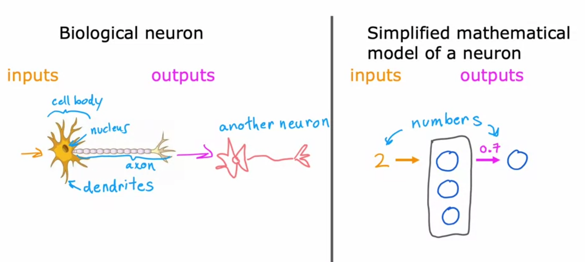

Bigger Neural Networks will have more success with higher amounts of data

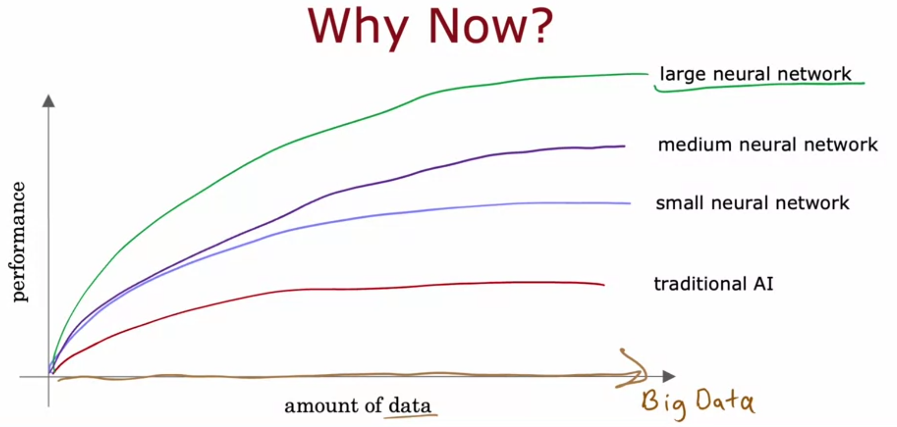

In Neural Networks, we want to start using the term **activation function**, which has roots in neuroscience, to give to the functionality of an actual neuron. This could be running a sigmoid function for logistic regression.

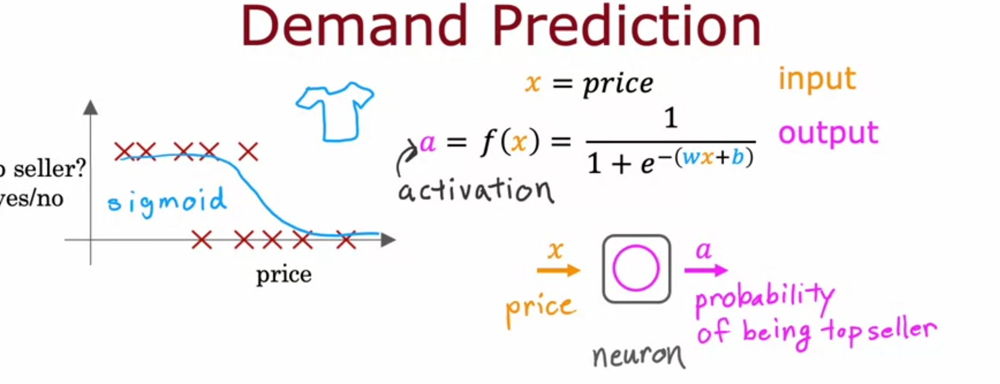

In the following screenshot, you see that we have an **input layer** which take a number of features as $\vec{x}$ (in this case 4). This inputs can be used to influence any number of intermidiate layers called **hidden layers**. In our example of predicting demand for a t shirt, our hidden layer is a vector of three neurons, also referred to as **activations** (again with roots in neuroscience) (affordability, awareness, and perceived quality) which are used to generate an **output layer** with the final output. In our example, this final output the probability of the t shirt being a top seller.

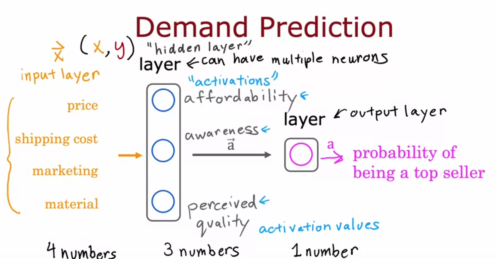

One way to think of activations that may help is that they are engineered features which the algorithm will learn to compute.

Sometimes a neural network will multiple hidden layers can be referred as a **multilayer perceptron**

A neural network essentially learns the features to pay to pay attention to at each layer. In the following example for facial recognition, the algorithm leans to build 

* the first hidden layer as looking at lines of the face
* the second hidden layer as recognizing parts of the face such as eyes, nose, mouth
* the third hidden layer as comparing that face to similar looking faces in its database

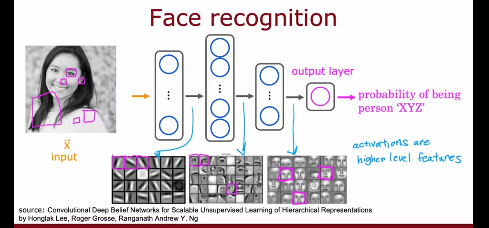

the output layer will take the output of the final layer before it and output a probability that that person is so and so

## Neural network model

**activation values** are the output of just one neuron from one hidden layer. Each activation value might be given by logistic regression with the familiar sigmoid function. Each activation value is then added to a vector which is fed into hidden layer 2 of the neural network. 

In this example, we are denoting all variables of the activation value and outputing vector with the superscript layer number in brackets. we are also use subscripts to denote the neuron that we're using. so $\vec{a}^{[1]}$ refers to the output vector of layer 1

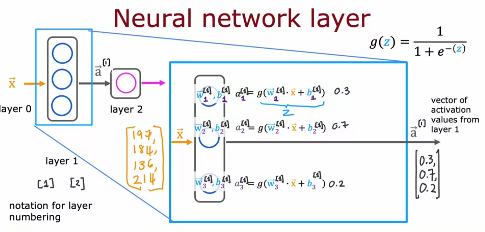

In layer 2, notice that we're also running the familiar sigmoid function for linear regression. However, we only have one neuron in this layer so we are outputting a scalar rather than a vector.

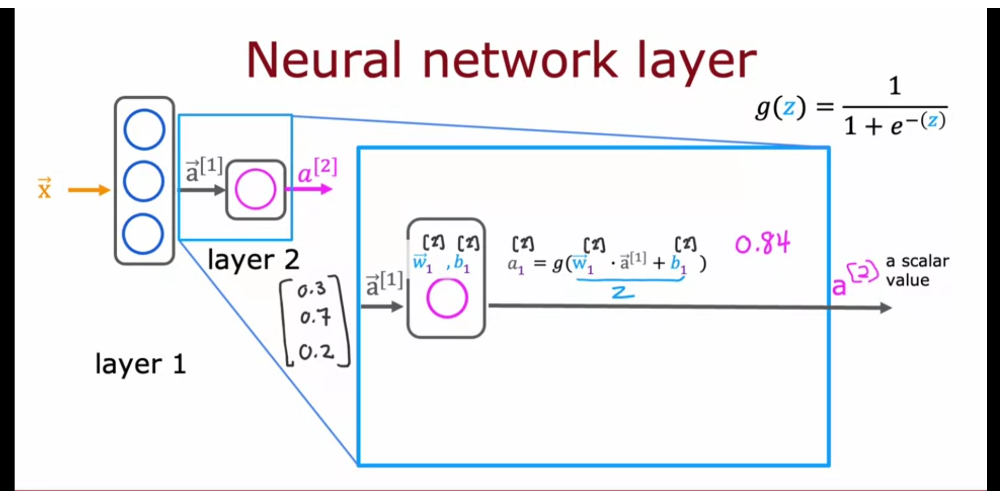

Notice in the above screenshot that the vector $\vec{a}^{[2]}$ is used in the computation for layer 3

Optionally in this example, you could do something like assign a threshold for a binary classification.

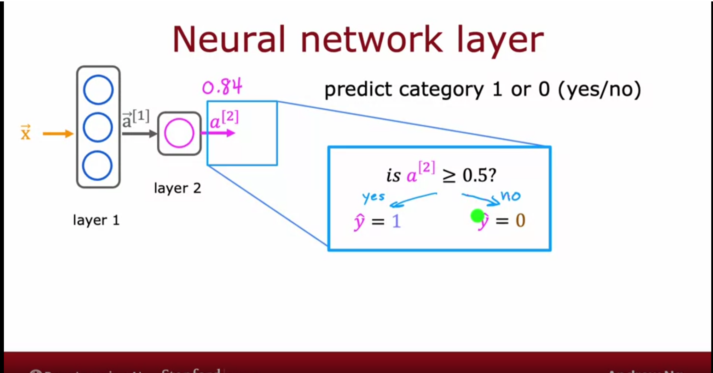

In the follow screenshot, this would be referred to as a neural network with 4 layers, 3 hidden layers and the output layer. the input layer which is just $\vec{x}$ is not counted among these. 

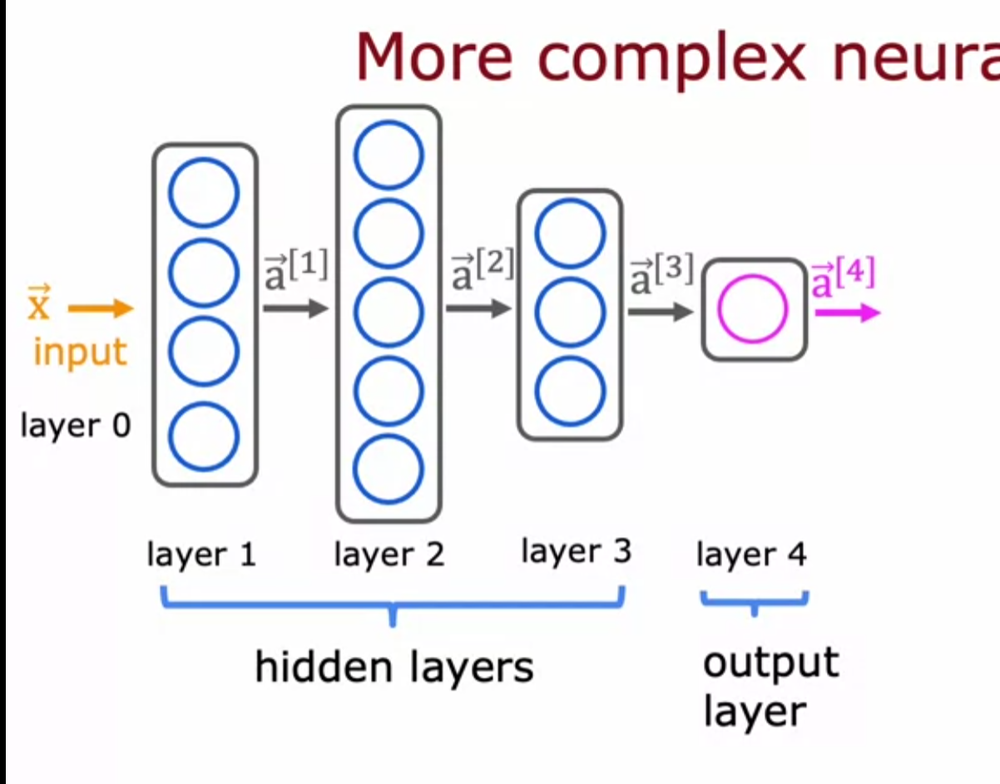

The general form of the sigmoid activation function for a neuron is

## $a_j^{[l]} \cdot \vec{a}^{[l-1]}+b_j^{[l]}$ where l is the layer of the neural network and j is neuron within the layer and keep in mind that $\vec{a}^{[0]}=\vec{x}$

This gives us the mathematical understanding for a neural network

When we move left to right in a neural network in order to make inferences. This is referred to as **forward propagation**. A commonality in forward propagation is that the number of units or activation values tend to decrease with each new layer. This is in contrast to back propogation which is used for helping the neural network learn. More on back propogation later.

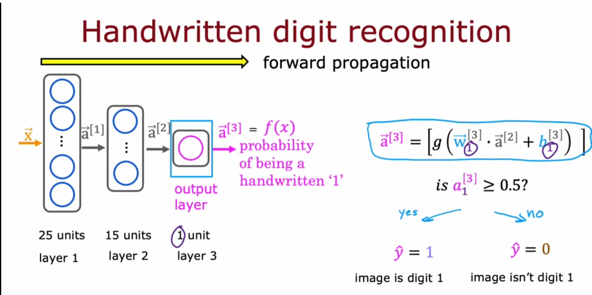

### Neurons and Layers

Tensorflow is a machine learning package developed by Google. In 2019, Google released tensorflow 2.0 which integrated Keras.

```python
import numpy as np
import matplotlib.pyplot as plt
import tensorflow as tf
from tensorflow.keras.layers import Dense, Input
from tensorflow.keras import Sequential
from tensorflow.keras.losses import MeanSquaredError, BinaryCrossentropy
from tensorflow.keras.activations import sigmoid
```

We can create a layer to use the linear regression function, $f_{\vec{w},x}(\vec{x})=\vec{w} \cdot \vec{x} + b$

```python
linear_layer = tf.keras.layers.Dense(units=1, activation = 'linear', )
```

With this, we can take some of our training data which must be a 2d vector. This is because we've defined the layer as dense. The **Dense Layer** is used because each dense layer as associated weights and a bias term. The dense layer is also fully connected, meaning that each neuron in the layer receives input from every neuron in the previous layer.  **Tensors** can be thought of as arrays

```python
a1 = linear_layer(np.array([[1.0]]))
print(a1)
```

In this case, the tensor is an array with 1 number

```
tf.Tensor([[300.]], shape=(1, 1), dtype=float32)
```

We can also set manual weights to the tensor

```python
set_w = np.array([[200]])
set_b = np.array([100])

# set_weights takes a list of numpy arrays
linear_layer.set_weights([set_w, set_b])
print(linear_layer.get_weights())
```

```
[array([[200.]], dtype=float32), array([100.], dtype=float32)]
```

We can also demonstrate creating a model with a layer using the sigmoid activation function. The sequential model is a common model type in Keras to use for a plain stack of layers. If you need more complicated functionality like layer sharing or multiple inputs/outputs, then a sequential model is not one to choose.

```python
model = Sequential(
    [
        tf.keras.layers.Dense(1, input_dim=1,  activation = 'sigmoid', name='L1')
    ]
)
```

The 1 refers to the dimensionality of the output. In this case, we need to receive only one output.

The `input_dim` (Input Dimensionality) param specifies the number of input features to the layer.


```python
model.summary()
```

```
Model: "sequential_1"
_________________________________________________________________
 Layer (type)                Output Shape              Param #   
=================================================================
 L1 (Dense)                  (None, 1)                 2         
                                                                 
=================================================================
Total params: 2
Trainable params: 2
Non-trainable params: 0
```

In the above, the number of params 2 confused me a little. It's calculated as follows

## $\text{features} * \text{neurons} + \text{biases}$

So in our case, we have 1 feature specified by `input_dim`, 1 neuron specified in the dense layer, and each neuron has 1 bias param.

We can now use the Keras predict function on our model to get a value. Remember that we've set our model to a single neuron using a sigmoid as an activation function.

```python
a1 = model.predict([[0]])
print(a1)
```

```
[[0.5]]
```

The reason that the output is .5 is because we've given no weights and biases so the model initializes to set these to 0. This means that the sigmoid becomes

## $\frac{1}{1+e^{-(\vec{w} \cdot \vec{x} + b)}}$ = $\frac{1}{1+e^{-(0 \cdot 0 + 0)}}$ = $\frac{1}{1+e^{0}}$ = $\frac{1}{1+1}$ = 0.5

If we instead set the bias term to -1

```python
logistic_layer = model.get_layer('L1')
set_w = np.array([[2]])
set_b = np.array([-1])
# set_weights takes a list of numpy arraysca
logistic_layer.set_weights([set_w, set_b])
print(logistic_layer.get_weights())
a1 = model.predict([[0]])
print(a1)
```

```
[[0.27]]
```

## $\frac{1}{1+e^{-(\vec{w} \cdot \vec{x} + b)}}$ = $\frac{1}{1+e^{-(2 \cdot 0 - 1)}}$ = $\frac{1}{1+e^{1}}$ = $\frac{1}{1+2.7}$ $\approx$ 0.27

## TensorFlow Implementation

In this example to demonstrate tensorflow code, we'll use the following. $\vec{x}$ will be our input vector into a three layer neural network. Layer 1 will have 25 neurons, layer 2 15 and layer 3 just 1 neuron. Each layer would be a dense layer in tensor flow which we can define with the following code

```python
layer_1 = Dense(units=25, activation='sigmoid')
layer_2 = Dense(units=15, activation='sigmoid')
layer_3 = Dense(units=1, activation='sigmoid')
```

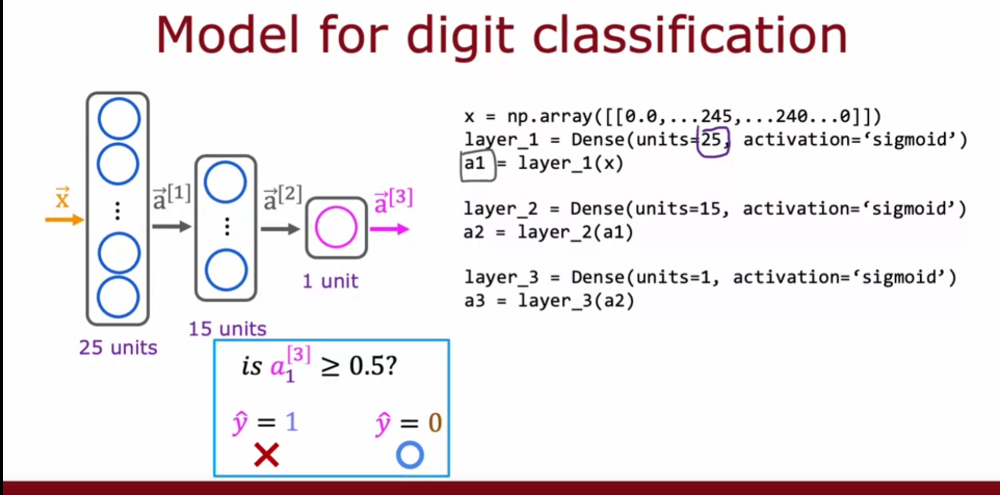

If we now revisit the following code, notice that we need to pass a matrix into tensorflow and not just a vector as we can with numpy. This is because tensorflow is designed to be more computationally efficient to work on matrices

```python
a1 = linear_layer(np.array([[1.0]]))
```

You can also convert this tensorflow tensor back to a numpy vector with the following

```python
a1.numpy()
```

Learning this naturally brings up the question "What is a tensor?" Previously we've said that we can think of tensor as an array. A **tensor** is a mathematical object that is 0-dimensional (scalar), 1-dimensional (vector), or N-dimensional (matrix). So a 2-dimensional tensor is a matrix.

Overall, the tensorflow library makes building neural networks more trivial than using numpy to build things more from scratch but it's important to understand the mathematics behind tensorflow and how to do regression analysis in numpy.

Another concept offered by Keras/Tensorflow is **normalization**.  This is a preprocessing layer that will find the mean and variance of the given data. This is similar to the feature normalization that we've done previously in numpy. The aim is to put the values into an accceptable range by dividing by the mean.

In the data below, X is representing data for roasting coffee beans. Notice that we're scaling the data to demo what the real data will look like and then we want to normalize it using Keras to be in a smaller range.

```python
import numpy as np
import tensorflow as tf
# This generates 400 random numbers between 0 and 1, and reshapes them into a 2D array X with 200 rows and 2 columns.
# first column is temp and second is duration
rng = np.random.default_rng(2)
X = rng.random(400).reshape(-1,2) 
# scale the temperature to be between 150 and 300
X[:,0] = X[:,0] * (285-150) + 150
# scale the duration to be between 11 and 16
X[:,1] = X[:,1] * 4 + 11.5
print(f"Temperature Max, Min pre normalization: {np.max(X[:,0]):0.2f}, {np.min(X[:,0]):0.2f}")
print(f"Duration    Max, Min pre normalization: {np.max(X[:,1]):0.2f}, {np.min(X[:,1]):0.2f}")
norm_l = tf.keras.layers.Normalization(axis=-1)
norm_l.adapt(X)  # learns mean, variance
Xn = norm_l(X)
print(f"Temperature Max, Min post normalization: {np.max(Xn[:,0]):0.2f}, {np.min(Xn[:,0]):0.2f}")
print(f"Duration    Max, Min post normalization: {np.max(Xn[:,1]):0.2f}, {np.min(Xn[:,1]):0.2f}")
```

```
Temperature Max, Min pre normalization: 284.99, 151.32
Duration    Max, Min pre normalization: 15.45, 11.51
Temperature Max, Min post normalization: 1.66, -1.69
Duration    Max, Min post normalization: 1.79, -1.70
```

We want to use the **tile** function in numpy to increase the dataset. Tile will simply just copy whatever already exists in the dataset for the specified number of times. The point of using tile is that by increasing the datasets, we'll reduce the overall number of training epochs that our model will need to go through to get to the optimal solution.

```python
Xt = np.tile(Xn,(1000,1))
Yt= np.tile(Y,(1000,1))   
print(Xt.shape, Yt.shape)
```

```
(200000, 2) (200000, 1)
```

We will now make a sequential model with the input layer and then two hidden layers

```python
tf.random.set_seed(1234)  # applied to achieve consistent results
model = Sequential(
    [
        tf.keras.Input(shape=(2,), batch_size=32),
        Dense(3, activation='sigmoid', name = 'layer1'),
        Dense(1, activation='sigmoid', name = 'layer2')
     ]
)
```

`tf.keras.Input(shape=(2,)),` is used here because it tells the model what shape to expect for the input. This allows Tensorflow to size the weights and bias params at this point.

Now let's look at the model summary

```python
model.summary()
```

```
Model: "sequential"
_________________________________________________________________
 Layer (type)                Output Shape              Param #   
=================================================================
 layer1 (Dense)              (32, 3)                   9         
                                                                 
 layer2 (Dense)              (32, 1)                   4         
                                                                 
=================================================================
Total params: 13
Trainable params: 13
Non-trainable params: 0
_________________________________________________________________
```

This one's a little tricky. The way we get to 9 parameters for the first dense layer is because we have 2 input features coming from the input layer, 3 neurons which were specified above, and then 1 bias term for each neuron. This means that

## $\text{features} * \text{neurons} + \text{biases} = 2 * 3 + 3 = 9$

For the second layer, we have 3 input features from the previous dense layer, 1 neuron, and 1 bias term for that one neuron.

## $\text{features} * \text{neurons} + \text{biases} = 3 * 1 + 1 = 4$

Tuple for the output shape is (batch_size, neurons)

Now we'll look at the weights that our model produces

```python
W1, b1 = model.get_layer("layer1").get_weights()
W2, b2 = model.get_layer("layer2").get_weights()
print(f"W1{W1.shape}:\n", W1, f"\nb1{b1.shape}:", b1)
print(f"W2{W2.shape}:\n", W2, f"\nb2{b2.shape}:", b2)
```

```
W1(2, 3):
 [[ 0.08 -0.3   0.18]
 [-0.56 -0.15  0.89]] 
b1(3,): [0. 0. 0.]
W2(3, 1):
 [[-0.43]
 [-0.88]
 [ 0.36]] 
b2(1,): [0.]
```

Notice in layer1, we have 2x3 whereas for layer2, we have a 3x1. The bias terms reduce the rows to 1 so b1 is 1x3 and b2 is 1x1. Remember that these are randomly generated numbers.

We'll explore the following code in more depth at a later date but just understand the `compile` and `fit` are two functions that need to be run to train the data.

```python
model.compile(
    loss = tf.keras.losses.BinaryCrossentropy(),
    optimizer = tf.keras.optimizers.Adam(learning_rate=0.01),
)

model.fit(
    Xt,Yt,            
    epochs=10,
)
```

```
Epoch 1/10
6250/6250 [==============================] - 5s 804us/step - loss: 0.1782
Epoch 2/10
6250/6250 [==============================] - 5s 819us/step - loss: 0.1165
Epoch 3/10
6250/6250 [==============================] - 5s 832us/step - loss: 0.0426
Epoch 4/10
6250/6250 [==============================] - 5s 839us/step - loss: 0.0160
Epoch 5/10
6250/6250 [==============================] - 5s 831us/step - loss: 0.0104
Epoch 6/10
6250/6250 [==============================] - 5s 826us/step - loss: 0.0073
Epoch 7/10
6250/6250 [==============================] - 5s 813us/step - loss: 0.0052
Epoch 8/10
6250/6250 [==============================] - 5s 827us/step - loss: 0.0037
Epoch 9/10
6250/6250 [==============================] - 5s 824us/step - loss: 0.0027
Epoch 10/10
6250/6250 [==============================] - 5s 826us/step - loss: 0.0020
```

If we now print the weights, we notice that they're a lot different after training

```python
W1, b1 = model.get_layer("layer1").get_weights()
W2, b2 = model.get_layer("layer2").get_weights()
print("W1:\n", W1, "\nb1:", b1)
print("W2:\n", W2, "\nb2:", b2)
```

```
W1:
 [[ -0.21  16.48 -12.21]
 [ -9.5   13.67  -0.28]] 
b1: [-11.73   2.31 -13.14]
W2:
 [[-76.22]
 [-66.  ]
 [-80.35]] 
b2: [45.52]
```

Now that the new weights are set, we can make some new predictions using data for temperatures as well as duration. Our rule for the prediction is that a probability over .5 is 1 and below .5 is zero.

```python
X_test = np.array([
    [200,13.9],  # positive example
    [200,17]])   # negative example
X_testn = norm_l(X_test)
predictions = model.predict(X_testn)
print("predictions = \n", predictions)

# use yhat as a tensor to store the binary classifications, 1 for yes andd 0 for no
yhat = np.zeros_like(predictions)
for i in range(len(predictions)):
    if predictions[i] >= 0.5:
        yhat[i] = 1
    else:
        yhat[i] = 0
print(f"decisions = \n{yhat}")
```

```
predictions = 
 [[9.63e-01]
 [3.03e-08]]
decisions = 
[[1.]
 [0.]]
```

## Neural network implementation in python

In this section, let's move back from using tensorflow a little bit and focus on use just numpy

Let's go back to the coffee roasting example where we have the input layer, 1 hidden layer, and 1 out put layer. The following screenshot if an example of how we might compute that in python. The idea is that we would run the sigmoid for each neuron in the hidden layer and store that as a numpy array and then pass that numpy array to the output layer which just has the single neuron. That single neuron will then compute the total output for the neural network.

```python
a1 = np.array([a1_1, a1_2, a1_3])
```

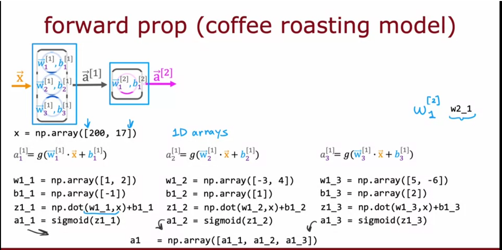

Now we'll take some steps to simplify this and make it more scalable. Rather than compute all of the neurons for all of the layers individually, we can build a function to build a dense layer. This dense layer will just loop through however many neurons that we have and apply the sigmoid to each. Now that we have a function to build each dense layer, we can make another function that will string together however many dense layers that we specify.

First let's define the sigmoid function, our aim is do this without using tensorflow which is a useful exercise to be able to see how this is working under the hood.

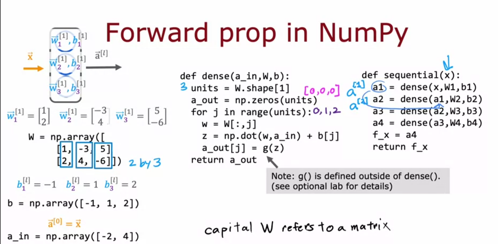

Note that a convention from linear algebra is that a capital letter will refer to a matrix while a lower case letter will refer to a vector or scalar.


```python
import numpy as np

def sigmoid(z):
    """
    Compute the sigmoid of z

    Parameters
    ----------
    z : array_like
        A scalar or numpy array of any size.

    Returns
    -------
     g : array_like
         sigmoid(z)
    """
    z = np.clip( z, -500, 500 )           # protect against overflow
    g = 1.0/(1.0+np.exp(-z))

    return g
```

Now we can define the function for computing a dense layer.

```python
def my_dense(a_in, W, b):
    """
    Computes dense layer
    Args:
      a_in (ndarray (n, )) : Data, 1 example 
      W    (ndarray (n,j)) : Weight matrix, n features per unit, j units
      b    (ndarray (j, )) : bias vector, j units  
    Returns
      a_out (ndarray (j,))  : j units|
    """
    # the number of neurons is the set of weights
    units = W.shape[1]
    # initialize a numpy array to be all zeros and the same size as the number of neurons
    a_out = np.zeros(units)
    for j in range(units):
        # select the set of weights
        # note the : is python shorthand for select all so we're selecting all weights associated with the jth column  
        w = W[:,j]                                    
        z = np.dot(w, a_in) + b[j]         
        a_out[j] = sigmoid(z)               
    return(a_out)
```

Now we can build on this layer building functionality to make a function for our sequential model. Our model, as you can see by the parameter list is hardcoded to only take two training examples.

```python
def my_sequential(x, W1, b1, W2, b2):
    a1 = my_dense(x,  W1, b1)
    a2 = my_dense(a1, W2, b2)
    return(a2)
```

For our last function, we'll have the functionality make a prediction. 

```python
def my_predict(X, W1, b1, W2, b2):
    m = X.shape[0]
    p = np.zeros((m,1))
    for i in range(m):
        p[i,0] = my_sequential(X[i], W1, b1, W2, b2)
    return(p)
```

For demonstration purposes, we'll using weights and bias that we've used previously.

```python
W1_tmp = np.array( [[-8.93,  0.29, 12.9 ], [-0.1,  -7.32, 10.81]] )
b1_tmp = np.array( [-9.82, -9.28,  0.96] )
W2_tmp = np.array( [[-31.18], [-27.59], [-32.56]] )
b2_tmp = np.array( [15.41] )
```

Ok, finally we'll use the training data from previously, normalize it, and use it to make a prediction

```python
X_tst = np.array([
    [200,13.9],  # postive example
    [200,17]])   # negative example
X_tstn = norm_l(X_tst)  # remember to normalize
predictions = my_predict(X_tstn, W1_tmp, b1_tmp, W2_tmp, b2_tmp)
print(predictions)
```

```
[[9.72e-01]
 [3.29e-08]]
```

## Vectorization

Before we chat about the concept of vectorization for neural networks, let's first do a quick review of **matrix multiplication** from linear algebra. We'll just created two equal length matrices.

### Problem Description: Matrix Multiplication

In this problem, we are given two matrices $ A $ and $ W $. The task is to compute the product of these matrices, resulting in a new matrix $ Z $.

#### Given:
- Matrix $ A $ is a $ 2 \times 2 $ matrix:
  $
  A = \begin{pmatrix} 
  1 & -1 \\
  2 & -2 
  \end{pmatrix}
  $
  
- Matrix $ W $ is a $ 2 \times 2 $ matrix:
  $
  W = \begin{pmatrix} 
  3 & 5 \\
  4 & 6 
  \end{pmatrix}
  $

#### Objective:
To compute the matrix product $ Z = A^T W $, where $ A^T $ is the transpose of matrix $ A $.

#### Steps:
1. **Transpose Matrix $ A $**: 
   The transpose of matrix $ A $, denoted $ A^T $, is obtained by swapping its rows and columns:
   $
   A^T = \begin{pmatrix} 
   1 & 2 \\
   -1 & -2 
   \end{pmatrix}
   $

2. **Matrix Multiplication**:
   To find matrix $ Z $, multiply each row of $ A^T $ by each column of $ W $, and sum the products to form the corresponding element in $ Z $.

   $
   Z = A^T W = \begin{pmatrix} 
   1 & 2 \\
   -1 & -2 
   \end{pmatrix} 
   \begin{pmatrix} 
   3 & 5 \\
   4 & 6 
   \end{pmatrix}
   $

   This results in:
   $
   Z = \begin{pmatrix} 
   (1 \times 3) + (2 \times 4) & (1 \times 5) + (2 \times 6) \\
   (-1 \times 3) + (-2 \times 4) & (-1 \times 5) + (-2 \times 6) 
   \end{pmatrix}
   $

3. **Compute the Elements**:
   - $ Z_{11} = 1 \times 3 + 2 \times 4 = 3 + 8 = 11 $
   - $ Z_{12} = 1 \times 5 + 2 \times 6 = 5 + 12 = 17 $
   - $ Z_{21} = -1 \times 3 + -2 \times 4 = -3 - 8 = -11 $
   - $ Z_{22} = -1 \times 5 + -2 \times 6 = -5 - 12 = -17 $

   Thus, the resulting matrix $ Z $ is:
   $
   Z = \begin{pmatrix} 
   11 & 17 \\
   -11 & -17 
   \end{pmatrix}
   $

Now that example also assumes two equal length matrices. What if we have differently sized matrices?

If the matrices are different shape, we use the number of rows of the first matrix and the number of columns of the 2nd matrix to get the dimensions of the resultant matrix

Given matrices $ A $ and $ W $:

$
A = \begin{bmatrix} 
1 & -1 & 0.1 \\
2 & -2 & 0.2 
\end{bmatrix},
\quad A^T = \begin{bmatrix} 
1 & 2 \\
-1 & -2 \\
0.1 & 0.2 
\end{bmatrix},
\quad W = \begin{bmatrix} 
3 & 5 & 7 & 9 \\
4 & 6 & 8 & 0 
\end{bmatrix}
$

The matrix multiplication $ Z = A^T W $ will result in a $ 3 \times 4 $ matrix. One requirement is that the number of columns of the first matrix and the number of rows of the second matrix must be equal or else you can't do matrix multiplication. This requirement is built on the idea that we're using the dot product when we're doing matrix multiplication and a requirement of the dot product is that the vectors have to be of equal length.

The element $ Z_{11} $ is computed as:

1. **Element $ Z_{11} $**:
   $
   Z_{11} = \vec{a}_1^T \vec{w}_1 = (1 \times 3) + (2 \times 4) = 3 + 8 = 11
   $

2. **Element $ Z_{12} $**:
   $
   Z_{12} = \vec{a}_1^T \vec{w}_2 = (1 \times 5) + (2 \times 6) = 5 + 12 = 17
   $

3. **Element $ Z_{13} $**:
   $
   Z_{13} = \vec{a}_1^T \vec{w}_3 = (1 \times 7) + (2 \times 8) = 7 + 16 = 23
   $

4. **Element $ Z_{14} $**:
   $
   Z_{14} = \vec{a}_1^T \vec{w}_4 = (1 \times 9) + (2 \times 0) = 9 + 0 = 9
   $

5. **Element $ Z_{21} $**:
   $
   Z_{21} = \vec{a}_2^T \vec{w}_1 = (-1 \times 3) + (-2 \times 4) = -3 - 8 = -11
   $

6. **Element $ Z_{22} $**:
   $
   Z_{22} = \vec{a}_2^T \vec{w}_2 = (-1 \times 5) + (-2 \times 6) = -5 - 12 = -17
   $

7. **Element $ Z_{23} $**:
   $
   Z_{23} = \vec{a}_2^T \vec{w}_3 = (-1 \times 7) + (-2 \times 8) = -7 - 16 = -23
   $

8. **Element $ Z_{24} $**:
   $
   Z_{24} = \vec{a}_2^T \vec{w}_4 = (-1 \times 9) + (-2 \times 0) = -9 + 0 = -9
   $

9. **Element $ Z_{31} $**:
   $
   Z_{31} = \vec{a}_3^T \vec{w}_1 = (0.1 \times 3) + (0.2 \times 4) = 0.3 + 0.8 = 1.1
   $

10. **Element $ Z_{32} $**:
    $
    Z_{32} = \vec{a}_3^T \vec{w}_2 = (0.1 \times 5) + (0.2 \times 6) = 0.5 + 1.2 = 1.7
    $

11. **Element $ Z_{33} $**:
    $
    Z_{33} = \vec{a}_3^T \vec{w}_3 = (0.1 \times 7) + (0.2 \times 8) = 0.7 + 1.6 = 2.3
    $

12. **Element $ Z_{34} $**:
    $
    Z_{34} = \vec{a}_3^T \vec{w}_4 = (0.1 \times 9) + (0.2 \times 0) = 0.9 + 0 = 0.9
    $

### Final Matrix $ Z $:

$
Z = \begin{bmatrix} 
11 & 17 & 23 & 9 \\
-11 & -17 & -23 & -9 \\
1.1 & 1.7 & 2.3 & 0.9 
\end{bmatrix}
$


Now that we've done just a few brief problems to go over matrix multiplication, let's just get into some code.


**Vectorization** is an idea that CPUs and GPUs (mostly GPUs) are very well optimized to handle matrix multiplication and we can take advantage of this idea by converting the weights of a model from a vector to a matrix. This is similar to the idea of what tensorflow actually does.

```python
def dense(A_in, W, B):
    # matmul can sometimes be written in code as Z = A_in @ W
    # remember that matmul is doing the matrix multiplication that we saw previously
    Z = np.matmul(A_in, W) + B
    A_out = sigmoid(Z)
    return A_out
```

Now that we've defined the dense layer using the matmul function, the rest is pretty much the same. We'll create a sequential model with three layers.

```python
def my_sequential_v(X, W, B):
    A1 = dense(X, W, B)
    return(A1)
```

We'll now run our data through

```python
X = np.array([[200, 17]])
W = np.array([[1, -3, 5], 
              [-2, 4, -6]])
B = np.array([[-1, 1, 2]])

Prediction = my_sequential_v(X, W, B)
```

For those wondering (I know I was), the `matmul` function is still using the dot product from linear algebra and not the cross product. This is because the dot product when performed on two equal length matrices will still result in a matrix of the same size.

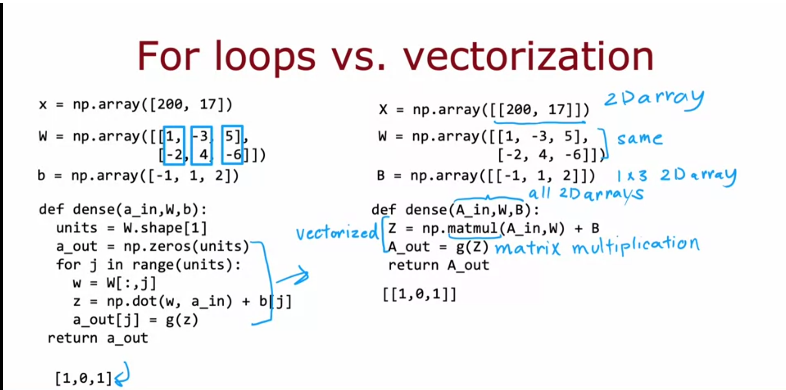

