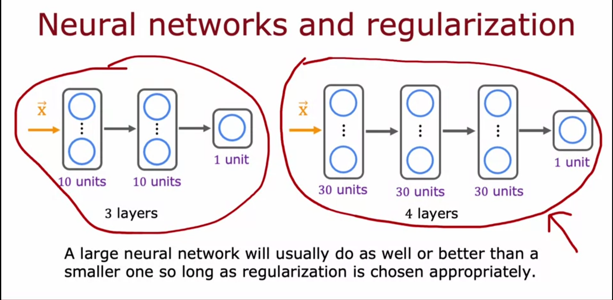
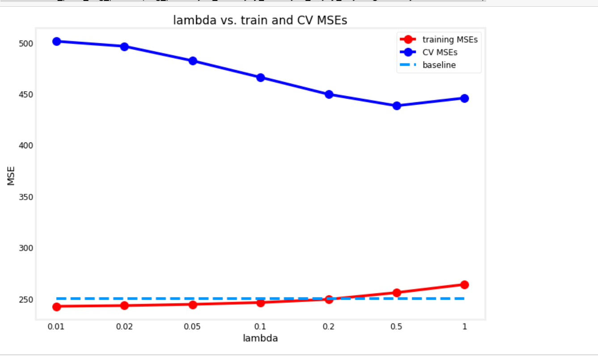
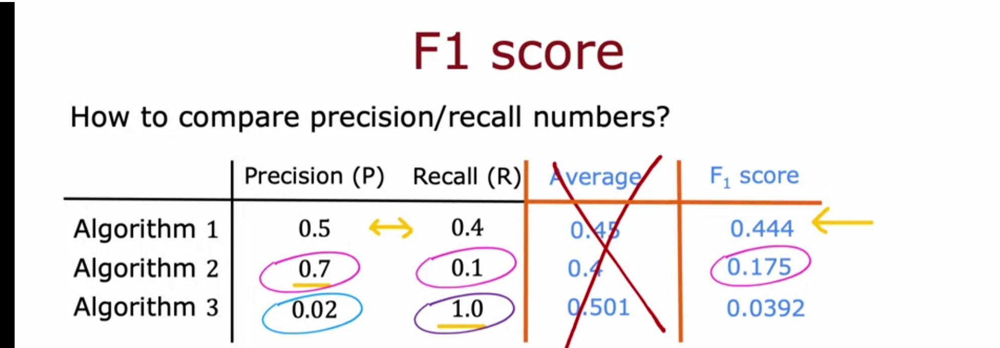

# Advice For Machine Learning

## Advice for applying machine learning

If a machine learning model is making unacceptably large errors. There could be several things you could try:

* Get more traing examples
* Try a smaller set of features
    * The amount of features that you have could make the model prone to overfitting
* Try getting additional features
    * Try engineering new features
* Try using polynomial regression
    * Try squaring terms or using non-linear operations

Sometimes teams will spend months trying something like getting more training data when they didn't need to do that. But how do you know what to correctly try next?

This section talks about how we can use diagnostic tools on models to see what's the best use of time so that you're not wasting months.

Typically, the first step in diagnosing is that we split our dataset into both a test set and training set. By doing so, we can now using the training set to train our model and then the test set can be used to evaluate how well our model would perform on a new set of data.


So if now revisit the cost function for regularized linear regression

## $J(\vec{w},b) = \frac{1}{2m} \sum_{i=1}^{m} (f_{w,b}(\vec{x}^{(i)}) - y^{(i)})^{2}+ \frac{\lambda}{2m}\sum_{j=1}^{n}w_j^2$

We will rewrite this as

## $J(\vec{w},b) = \frac{1}{2m_{train}} \sum_{i=1}^{m_{train}} (f_{w,b}(\vec{x}^{(i)}) - y^{(i)})^{2}+ \frac{\lambda}{2m_{train}}\sum_{j=1}^{n}w_j^2$

And then to compute the test error, we will use

## $J_{test}(\vec{w},b) = \frac{1}{2m_{test}} \sum_{i=1}^{m_{test}} (f_{w,b}(\vec{x_{test}}^{(i)}) - y_{test}^{(i)})^{2}$

Notice that with the test error, we're leaving out the regularized param term. We'll also use the training error in the same way.

## $J_{train}(\vec{w},b) = \frac{1}{2m_{train}} \sum_{i=1}^{m_{train}} (f_{w,b}(\vec{x_{train}}^{(i)}) - y_{train}^{(i)})^{2}$

Again we'll leave out the regularized term

So applying this logic, we may see that the error for the training set is very low while the error for the test set is very high. This may lead us to the conclusion that more training examples will probably not help.

We can also apply this training/testing split will logistic regression.

## $J(\vec{w},b) = -\frac{1}{m_{train}}\sum_{i=1}^{m_{train}}(y^{(i)}(\log{(f_{\vec{w},b}(\vec{x}))} +(1-y^{(i)})\log{(1-f_{\vec{w},b}(\vec{x}^{(i)}))})) + \frac{\lambda}{2m_{train}}\sum_{j=1}^n w_j^2$ 

So the cost for the test set would be

## $J_{test}(\vec{w},b) = -\frac{1}{m_{test}}\sum_{i=1}^{m_{test}}(y_{test}^{(i)}(\log{(f_{\vec{w},b}(\vec{x}_{test}^{(i)}))} +(1-y_{test}^{(i)})\log{(1-f_{\vec{w},b}(\vec{x}^{(i)}_{test}))}))$ 

And the cost for the training set would be

## $J_{train}(\vec{w},b) = -\frac{1}{m_{train}}\sum_{i=1}^{m_{train}}(y_{train}^{(i)}(\log{(f_{\vec{w},b}(\vec{x}_{train}^{(i)}))} +(1-y_{train}^{(i)})\log{(1-f_{\vec{w},b}(\vec{x}^{(i)}_{train}))}))$ 

Again notice that the regularized parameter term is left out of both of these.


Another evaluation that may be used is to check the fraction of data that is misclassified from the model for both the test data and training data.


Building on this previous knowledge, we may also choose to divide our data into a third subset called the **cross-validation set**. The cross-validation set can be used to evaluate the performance if you choose to use a slightly different model. For example, if you're estimationg housing prices, you may choose a linear regression 

## $f_{\vec{w},b}(\vec{x}) = w_{1}x^{(i)} + b$

but also want to evaluate using different degrees of polynomials. 2nd degree is shown below

## $f_{\vec{w},b}(\vec{x}) = w_{1}x^{(i)} + w_{2}x^{2}+ b$

What we could do is to further subdivide our dataset into this new cross validation set which will use to evaluate both the linear equation and polynomail equation to see which will give us the smaller error.


The idea behind this is that we can look at which model gives us the lowest cross validation error. You will also then use the test set on whichever model performs the best on the cross validation set and this should give you some idea of which model to choose.

So if you're not sure which model should be used for a given dataset. Why not just use them all and then evaluation the cost function for a cross validation set?

Now let's take a look at some code to demonstrate these new concepts. In the following example, our data is a group of 50 comma seperated values looking like the following. Only a handful of data is printed

```
1.651000000000000227e+03,4.326452172406379759e+02
1.691816326530612287e+03,4.549355296196551421e+02
1.732632653061224573e+03,4.715252475759918411e+02
1.773448979591836860e+03,4.825063887519466448e+02
1.814265306122449374e+03,4.683578863371971579e+02
1.855081632653061433e+03,4.821525306782943971e+02
1.895897959183673720e+03,5.400217555097202649e+02
1.936714285714286007e+03,5.345842671578692489e+02
```

```python
# for array computations and loading data
import numpy as np

# for building linear regression models and preparing data
from sklearn.linear_model import LinearRegression
from sklearn.preprocessing import StandardScaler, PolynomialFeatures
from sklearn.model_selection import train_test_split
from sklearn.metrics import mean_squared_error

# for building and training neural networks
import tensorflow as tf

# Load the dataset from the text file
data = np.loadtxt('./data/data_w3_ex1.csv', delimiter=',')

# Split the inputs and outputs into separate arrays
x = data[:,0]
y = data[:,1]

# Convert 1-D arrays into 2-D because the commands later will require it
x = np.expand_dims(x, axis=1)
y = np.expand_dims(y, axis=1)

# Get 60% of the dataset as the training set. Put the remaining 40% in temporary variables: x_ and y_.
x_train, x_, y_train, y_ = train_test_split(x, y, test_size=0.40, random_state=1)

# Split the 40% subset above into two: one half for cross validation and the other for the test set
x_cv, x_test, y_cv, y_test = train_test_split(x_, y_, test_size=0.50, random_state=1)

# Delete temporary variables
del x_, y_

print(f"the shape of the training set (input) is: {x_train.shape}")
print(f"the shape of the training set (target) is: {y_train.shape}\n")
print(f"the shape of the cross validation set (input) is: {x_cv.shape}")
print(f"the shape of the cross validation set (target) is: {y_cv.shape}\n")
print(f"the shape of the test set (input) is: {x_test.shape}")
print(f"the shape of the test set (target) is: {y_test.shape}")
```

So we've used sci-kit to split the data. Let's look at the shape of each set

```
the shape of the training set (input) is: (30, 1)
the shape of the training set (target) is: (30, 1)

the shape of the cross validation set (input) is: (10, 1)
the shape of the cross validation set (target) is: (10, 1)

the shape of the test set (input) is: (10, 1)
the shape of the test set (target) is: (10, 1)
```

The [StandardScaler class](https://scikit-learn.org/stable/modules/generated/sklearn.preprocessing.StandardScaler.html) in Scikit-learn is used here to get the mean and the standard deviation of the set which can then be used to transform the data using the z-score normalization formula

## $x_n = \frac{x_n - \mu_n}{\sigma_n}$

where $\mu$ is the mean for that feature and $\sigma$ is the standard deviation for that figure

```python
scaler_linear = StandardScaler()

# Compute the mean and standard deviation of the training set then transform it
X_train_scaled = scaler_linear.fit_transform(x_train)

print(f"Computed mean of the training set: {scaler_linear.mean_.squeeze():.2f}")
print(f"Computed standard deviation of the training set: {scaler_linear.scale_.squeeze():.2f}")
```

```
Computed mean of the training set: 2504.06
Computed standard deviation of the training set: 574.85
```

Transforming the data from


to


Now we'll train the model using Scikit-learn's [LinearRegression class](https://scikit-learn.org/stable/modules/generated/sklearn.linear_model.LinearRegression.html)

```python
linear_model = LinearRegression()

# Train the model
linear_model.fit(X_train_scaled, y_train )
```

Now we also want to instantiate a polynomial regression using Scikit-learns's [PolynomialFeatures class](https://scikit-learn.org/stable/modules/generated/sklearn.preprocessing.PolynomialFeatures.html) to transform out x_train data. Note that this just adds the squared terms to the data set and doesn't replace it

```python
# Instantiate the class to make polynomial features
poly = PolynomialFeatures(degree=2, include_bias=False)

# Compute the number of features and transform the training set
X_train_mapped = poly.fit_transform(x_train)

# Preview the first 5 elements of the new training set. Left column is `x` and right column is `x^2`
print(X_train_mapped[:5])
```

```
[[3.32e+03 1.11e+07]
 [2.34e+03 5.50e+06]
 [3.49e+03 1.22e+07]
 [2.63e+03 6.92e+06]
 [2.59e+03 6.71e+06]]
```

Notice that we've added a polynomial feature before we've regularized the data using StandardScalar. So now let's scale the data as we have before.

```python
# Instantiate the class
scaler_poly = StandardScaler()

# Compute the mean and standard deviation of the training set then transform it
X_train_mapped_scaled = scaler_poly.fit_transform(X_train_mapped)

# Preview the first 5 elements of the scaled training set.
print(X_train_mapped_scaled[:5])
```

```
[[ 1.43  1.47]
 [-0.28 -0.36]
 [ 1.71  1.84]
 [ 0.22  0.11]
 [ 0.15  0.04]]
```

Now we'll evaluate the polynomial model for both the training set and cross validation set.

```python
# Initialize the class
model = LinearRegression()

# Train the model
model.fit(X_train_mapped_scaled, y_train )

# Compute the training MSE
yhat = model.predict(X_train_mapped_scaled)
print(f"Training MSE: {mean_squared_error(y_train, yhat) / 2}")

# Add the polynomial features to the cross validation set
X_cv_mapped = poly.transform(x_cv)

# Scale the cross validation set using the mean and standard deviation of the training set
X_cv_mapped_scaled = scaler_poly.transform(X_cv_mapped)

# Compute the cross validation MSE
yhat = model.predict(X_cv_mapped_scaled)
print(f"Cross validation MSE: {mean_squared_error(y_cv, yhat) / 2}")
```

```
Training MSE: 49.11160933402521
Cross validation MSE: 87.69841211111924
```

Notice that the mean squared is better for the 2nd degree polynomial on both the training set and the cross validation set than regular linear regression.

In fact, we can create a loop to evaluate the performance up to a degress 10 polynomial and plot what this looks like

```python
import matplotlib.pyplot as plt

def plot_train_cv_mses(degrees, train_mses, cv_mses, title):
    degrees = range(1,11)
    plt.plot(degrees, train_mses, marker='o', c='r', label='training MSEs'); 
    plt.plot(degrees, cv_mses, marker='o', c='b', label='CV MSEs'); 
    plt.title(title)
    plt.xlabel("degree"); 
    plt.ylabel("MSE"); 
    plt.legend()
    plt.show()

# Initialize lists to save the errors, models, and feature transforms
train_mses = []
cv_mses = []
models = []
polys = []
scalers = []

# Loop over 10 times. Each adding one more degree of polynomial higher than the last.
for degree in range(1,11):
    
    # Add polynomial features to the training set
    poly = PolynomialFeatures(degree, include_bias=False)
    X_train_mapped = poly.fit_transform(x_train)
    polys.append(poly)
    
    # Scale the training set
    scaler_poly = StandardScaler()
    X_train_mapped_scaled = scaler_poly.fit_transform(X_train_mapped)
    scalers.append(scaler_poly)
    
    # Create and train the model
    model = LinearRegression()
    model.fit(X_train_mapped_scaled, y_train )
    models.append(model)
    
    # Compute the training MSE
    yhat = model.predict(X_train_mapped_scaled)
    train_mse = mean_squared_error(y_train, yhat) / 2
    train_mses.append(train_mse)
    
    # Add polynomial features and scale the cross validation set
    X_cv_mapped = poly.transform(x_cv)
    X_cv_mapped_scaled = scaler_poly.transform(X_cv_mapped)
    
    # Compute the cross validation MSE
    yhat = model.predict(X_cv_mapped_scaled)
    cv_mse = mean_squared_error(y_cv, yhat) / 2
    cv_mses.append(cv_mse)
    
# Plot the results
degrees=range(1,11)
plot_train_cv_mses(degrees, train_mses, cv_mses, title="degree of polynomial vs. train and CV MSEs")
```


Notice in the screenshot above that that there is a sharp drop in mean squared error from degree 1 to degree 2 and then at degree 4 is where the mean squared error is lowest for both training data and cross validation data. We can use argmin to select this degree

```python
# Get the model with the lowest CV MSE (add 1 because list indices start at 0)
# This also corresponds to the degree of the polynomial added
degree = np.argmin(cv_mses) + 1
print(f"Lowest CV MSE is found in the model with degree={degree}")
```

```
Lowest CV MSE is found in the model with degree=4
```

Up until now, we've only worked with the training and cross validation data. Now that we've selected the best degree, we'll use this model on the test data.

```python
# Add polynomial features to the test set
X_test_mapped = polys[degree-1].transform(x_test)

# Scale the test set
X_test_mapped_scaled = scalers[degree-1].transform(X_test_mapped)

# Compute the test MSE
yhat = models[degree-1].predict(X_test_mapped_scaled)
test_mse = mean_squared_error(y_test, yhat) / 2

print(f"Training MSE: {train_mses[degree-1]:.2f}")
print(f"Cross Validation MSE: {cv_mses[degree-1]:.2f}")
print(f"Test MSE: {test_mse:.2f}")
```

```
Training MSE: 47.15
Cross Validation MSE: 79.43
Test MSE: 104.63
```

### Doing the same for logistic regression

In the example for logistic regression, our data now looks like the following for 200 examples

```
1.000000000000000000e+03,1.457286432160803997e+03,0.000000000000000000e+00
1.045226130653266409e+03,1.005025125628140813e+03,0.000000000000000000e+00
1.090452261306532591e+03,8.542713567839196003e+02,0.000000000000000000e+00
```


```python
# Load the dataset from a text file
data = np.loadtxt('./data/data_w3_ex2.csv', delimiter=',')

# Split the inputs and outputs into separate arrays
x_bc = data[:,:-1]
y_bc = data[:,-1]

# Convert y into 2-D because the commands later will require it (x is already 2-D)
y_bc = np.expand_dims(y_bc, axis=1)

from sklearn.model_selection import train_test_split

# Get 60% of the dataset as the training set. Put the remaining 40% in temporary variables.
x_bc_train, x_, y_bc_train, y_ = train_test_split(x_bc, y_bc, test_size=0.40, random_state=1)

# Split the 40% subset above into two: one half for cross validation and the other for the test set
x_bc_cv, x_bc_test, y_bc_cv, y_bc_test = train_test_split(x_, y_, test_size=0.50, random_state=1)

# Delete temporary variables
del x_, y_

print(f"the shape of the training set (input) is: {x_bc_train.shape}")
print(f"the shape of the training set (target) is: {y_bc_train.shape}\n")
print(f"the shape of the cross validation set (input) is: {x_bc_cv.shape}")
print(f"the shape of the cross validation set (target) is: {y_bc_cv.shape}\n")
print(f"the shape of the test set (input) is: {x_bc_test.shape}")
print(f"the shape of the test set (target) is: {y_bc_test.shape}")

# Scale the features

# Initialize the class
scaler_linear = StandardScaler()

# Compute the mean and standard deviation of the training set then transform it
x_bc_train_scaled = scaler_linear.fit_transform(x_bc_train)
x_bc_cv_scaled = scaler_linear.transform(x_bc_cv)
x_bc_test_scaled = scaler_linear.transform(x_bc_test)
```

So we've split the data again into training, cross validation, and test sets. We've also scaled the features

```
the shape of the training set (input) is: (120, 2)
the shape of the training set (target) is: (120, 1)

the shape of the cross validation set (input) is: (40, 2)
the shape of the cross validation set (target) is: (40, 1)

the shape of the test set (input) is: (40, 2)
the shape of the test set (target) is: (40, 1)
```

Now we'll create some build neural network models and analyze the errors. We'll analyze errors by comparing the predictions with the **ground truth labels**

```python
def build_models():
    tf.random.set_seed(20)
    model_1 = Sequential(
        [
            Dense(25, activation = 'relu'),
            Dense(15, activation = 'relu'),
            Dense(1, activation = 'linear')
        ],
        name='model_1'
    )
    model_2 = Sequential(
        [
            Dense(20, activation = 'relu'),
            Dense(12, activation = 'relu'),
            Dense(12, activation = 'relu'),
            Dense(20, activation = 'relu'),
            Dense(1, activation = 'linear')
        ],
        name='model_2'
    )
    model_3 = Sequential(
        [
            Dense(32, activation = 'relu'),
            Dense(16, activation = 'relu'),
            Dense(8, activation = 'relu'),
            Dense(4, activation = 'relu'),
            Dense(12, activation = 'relu'),
            Dense(1, activation = 'linear')
        ],
        name='model_3'
    )
    return [model_1, model_2, model_3]

# Initialize lists that will contain the errors for each model
nn_train_error = []
nn_cv_error = []

# Build the models
models_bc = utils.build_models()

# Loop over each model
for model in models_bc:
    
    # Setup the loss and optimizer
    model.compile(
    loss=tf.keras.losses.BinaryCrossentropy(from_logits=True),
    optimizer=tf.keras.optimizers.Adam(learning_rate=0.01),
    )

    print(f"Training {model.name}...")

    # Train the model
    model.fit(
        x_bc_train_scaled, y_bc_train,
        epochs=200,
        verbose=0
    )
    
    print("Done!\n")
    
    # Set the threshold for classification
    threshold = 0.5
    
    # Record the fraction of misclassified examples for the training set
    yhat = model.predict(x_bc_train_scaled)
    yhat = tf.math.sigmoid(yhat)
    yhat = np.where(yhat >= threshold, 1, 0)
    train_error = np.mean(yhat != y_bc_train)
    nn_train_error.append(train_error)

    # Record the fraction of misclassified examples for the cross validation set
    yhat = model.predict(x_bc_cv_scaled)
    yhat = tf.math.sigmoid(yhat)
    yhat = np.where(yhat >= threshold, 1, 0)
    cv_error = np.mean(yhat != y_bc_cv)
    nn_cv_error.append(cv_error)

# Print the result
for model_num in range(len(nn_train_error)):
    print(
        f"Model {model_num+1}: Training Set Classification Error: {nn_train_error[model_num]:.5f}, " +
        f"CV Set Classification Error: {nn_cv_error[model_num]:.5f}"
        )
```

```
Training model_1...
Done!

Training model_2...
Done!

Training model_3...
Done!

Model 1: Training Set Classification Error: 0.05833, CV Set Classification Error: 0.17500
Model 2: Training Set Classification Error: 0.06667, CV Set Classification Error: 0.15000
Model 3: Training Set Classification Error: 0.05000, CV Set Classification Error: 0.15000
```

In the above code, we choose model 3 because it has the lowest error for both training and cross validation

```python
# Select the model with the lowest error
model_num = 3

# Compute the test error
yhat = models_bc[model_num-1].predict(x_bc_test_scaled)
yhat = tf.math.sigmoid(yhat)
yhat = np.where(yhat >= threshold, 1, 0)
nn_test_error = np.mean(yhat != y_bc_test)

print(f"Selected Model: {model_num}")
print(f"Training Set Classification Error: {nn_train_error[model_num-1]:.4f}")
print(f"CV Set Classification Error: {nn_cv_error[model_num-1]:.4f}")
print(f"Test Set Classification Error: {nn_test_error:.4f}")
```

```
Selected Model: 3
Training Set Classification Error: 0.0500
CV Set Classification Error: 0.1500
Test Set Classification Error: 0.1750
```

## Bias and Variance

**high bias** usually occurs when a model has underfit the data meaning that the loss function is usually very high and the model predictions are very far off from both the training data and cross validation set (if used). This underfitting is usually a signal that the model will also perform poorly on the training set. This can happen if our model is too simple, if we regularize our features too aggressively, we don't give the model enough relevant features, etc. Mathematically, this can be viewed as $J_{train}$ and $J_{cv}$ both being high.

**high variance** is a symptom of overfitting so the loss on the training data may be very low but the loss on a cross validation set will be a lot larger than the loss for training. Mathematically, $J_{cv} >> J_train$. Another indicator is that the model will be overly sensitive to fluctuations in training data because it has overfit so heavily.

The below screenshot gives an overview of what the graphs might look like.


As a note, it is also possible to have both high bias and high variance but this is rare as seen in the graph below with a very funky function.


With this in mind, it's usually a good strategy to check if both $J_{train}$ and $J_{cv}$ are small to see that your model is working well.

In real world applications, it's usually a good idea to try to establish a baseline to see if your problem is actually high bias or high variance. For example, in the following screenshot of speech recognition software, we've found that training error seems high at 10.8% but when we compare that a human task of analyzing audio clips will also have an error at 10.6%, we can conclude that our training error is not actually very high. 


Speaking on regularization, let's revisit that term to see how it can affect bias and variance.

## $J(\vec{w},b) = \frac{1}{2m} \sum_{i=1}^{m} (f_{w,b}(\vec{x}^{(i)}) - y^{(i)})^{2}+ \frac{\lambda}{2m}\sum_{j=1}^{n}w_j^2$

As lambda increases, the model becomes simpler, which typically increases the training loss but can improve generalization. With no regularization (lambda = 0), the model is more likely to overfit the training data.

As shown in the screenshot below, it turns out that we can actually plot the losses for both our training and cross validation sets as lambda changes.


We see that the loss for training is low with low or no regularization and the loss for the cross validation is high leading to the high bias that we've described earlier. And when lambda is very large, the loss for both training and cross validation are high leading to high variance giving the cross validation the parabolic look. This indicates that we want lambda to be somewhere in the middle.

### How do the number of training examples fit in

It may be surprising at first that the loss for the training set will actually become higher with more training examples. This is because when you have only one or two training example, it's easy for the model to fit the curve but as the number of examples becomes larger, the model has a slightly more difficult time.


Another note in the above screenshot is that the cross validation will invariablely be higher than the training error. This is because with few training examples, the model will have difficulty capturing the underlying patterns but will capture these patterns better as the number of training examples increases. The cross validation error is always higher because the model's goal is to minimize the training error.

We'll also notice that these errors tend to flatten out after awhile. We can conclude that at some point, throwing more data at a model with high bias where both the training and cross validation errors are high will not help.


Conversely, if your model suffers from high variance where the training error is low but the cross validation error is high getting more data can actually help. In the following screenshot, we'll note that the loss on the training set is actually lower than our baseline (human level performance in this case). This is a key indication that our model is overfitting the data and won't generalize well.

Notice that we're also using a 4th order polynomial. A high degree polynomial may also be a curve that is more likely to overfit.


### What to try next

Let's revisit what we can try to if we diagnose our model either having high bias or high variance. 

High Variance
* Add more training data
* Increase lambda (regularization)
* Smaller sets of features

High Bias
* Try using polynomials
* Decrease llambda (regularization)
* Include more features

You can summerize this and say that typical high bias will be helped by making the model more complex and less regularized whereas simplying the model and increasing regulariazation will help with high variance. This summary can be indicated by the below.


You can partly extrapolate these ideas to neural networks too. Neural networks typically have more of an issue with high bias rather than high variance. In fact, a larger neural network is typically also better (or at least the same) than a smaller network (provide regularization isn't too wild). 



It is also worth noting that neural networks are typically very computational.

By the way, We've mention regularization in neural networks. This is how you would do this in tensorflow. You would add a param to each layer called `kernal_regularizer`. L2 here is a term known as **weight decay** or ridge regularization** and is given by

$$
\frac{\lambda}{2m} * \sum (w^2)
$$

```python
layer_1 = Dense(units=25, activation="relu", kernel_regularizer=L2(0.01))
layer_2 = Dense(units=15, activation="relu", kernel_regularizer=L2(0.01))
layer_3 = Dense(units=1, activation="sigmoid", kernel_regularizer=L2(0.01))

model = Sequential([layer_1, layer_2, layer_3])
```

### Some code

Let's try plotting some data. First we'll take a look at using polynomials as we've done previously

```python
import matplotlib.pyplot as plt
# for building linear regression models
from sklearn.linear_model import LinearRegression, Ridge

# import lab utility functions in utils.py
import utils
def train_plot_poly(model, x_train, y_train, x_cv, y_cv, max_degree=10, baseline=None):
    
    train_mses = []
    cv_mses = []
    models = []
    scalers = []
    degrees = range(1,max_degree+1)

    # Loop over 10 times. Each adding one more degree of polynomial higher than the last.
    for degree in degrees:

        # Add polynomial features to the training set
        poly = PolynomialFeatures(degree, include_bias=False)
        X_train_mapped = poly.fit_transform(x_train)

        # Scale the training set
        scaler_poly = StandardScaler()
        X_train_mapped_scaled = scaler_poly.fit_transform(X_train_mapped)
        scalers.append(scaler_poly)

        # Create and train the model
        model.fit(X_train_mapped_scaled, y_train )
        models.append(model)

        # Compute the training MSE
        yhat = model.predict(X_train_mapped_scaled)
        train_mse = mean_squared_error(y_train, yhat) / 2
        train_mses.append(train_mse)

        # Add polynomial features and scale the cross-validation set
        poly = PolynomialFeatures(degree, include_bias=False)
        X_cv_mapped = poly.fit_transform(x_cv)
        X_cv_mapped_scaled = scaler_poly.transform(X_cv_mapped)

        # Compute the cross-validation MSE
        yhat = model.predict(X_cv_mapped_scaled)
        cv_mse = mean_squared_error(y_cv, yhat) / 2
        cv_mses.append(cv_mse)

    # Plot the results
    plt.plot(degrees, train_mses, marker='o', c='r', label='training MSEs'); 
    plt.plot(degrees, cv_mses, marker='o', c='b', label='CV MSEs'); 
    plt.plot(degrees, np.repeat(baseline, len(degrees)), linestyle='--', label='baseline')
    plt.title("degree of polynomial vs. train and CV MSEs")
    plt.xticks(degrees)
    plt.xlabel("degree"); 
    plt.ylabel("MSE"); 
    plt.legend()
    plt.show()

# Split the dataset into train, cv, and test
x_train, y_train, x_cv, y_cv, x_test, y_test = utils.prepare_dataset('data/c2w3_lab2_data1.csv')

print(f"the shape of the training set (input) is: {x_train.shape}")
print(f"the shape of the training set (target) is: {y_train.shape}\n")
print(f"the shape of the cross validation set (input) is: {x_cv.shape}")
print(f"the shape of the cross validation set (target) is: {y_cv.shape}\n")

# Preview the first 5 rows
print(f"first 5 rows of the training inputs (1 feature):\n {x_train[:5]}\n")

# Instantiate the regression model class
model = LinearRegression()

# Train and plot polynomial regression models
utils.train_plot_poly(model, x_train, y_train, x_cv, y_cv, max_degree=10, baseline=400)
```

```
the shape of the training set (input) is: (60, 1)
the shape of the training set (target) is: (60,)

the shape of the cross validation set (input) is: (20, 1)
the shape of the cross validation set (target) is: (20,)

first 5 rows of the training inputs (1 feature):
 [[3757.57575758]
 [2878.78787879]
 [3545.45454545]
 [1575.75757576]
 [1666.66666667]]
```


Notice from the plot that the training error will actually be reduced as the order of the polynomial goes up. Let's assume that we've contacted an expert to get a baseline. Also notice that the cross validation error is still very high. 

So let's try to add additional features. In the following code, notice that we'll have two features.

```python
x_train, y_train, x_cv, y_cv, x_test, y_test = utils.prepare_dataset('data/c2w3_lab2_data2.csv')

print(f"the shape of the training set (input) is: {x_train.shape}")
print(f"the shape of the training set (target) is: {y_train.shape}\n")
print(f"the shape of the cross validation set (input) is: {x_cv.shape}")
print(f"the shape of the cross validation set (target) is: {y_cv.shape}\n")

# Preview the first 5 rows
print(f"first 5 rows of the training inputs (2 features):\n {x_train[:5]}\n")
# Instantiate the model class
model = LinearRegression()

# Train and plot polynomial regression models. Dataset used has two features.
utils.train_plot_poly(model, x_train, y_train, x_cv, y_cv, max_degree=6, baseline=250)
```

```
the shape of the training set (input) is: (60, 2)
the shape of the training set (target) is: (60,)

the shape of the cross validation set (input) is: (20, 2)
the shape of the cross validation set (target) is: (20,)

first 5 rows of the training inputs (2 features):
 [[3.75757576e+03 5.49494949e+00]
 [2.87878788e+03 6.70707071e+00]
 [3.54545455e+03 3.71717172e+00]
 [1.57575758e+03 5.97979798e+00]
 [1.66666667e+03 1.61616162e+00]]
```


The training error is now close to the baseline but the cross validation is increasing as we add degree

Now let's try with different values for regularization.

```python
def train_plot_reg_params(reg_params, x_train, y_train, x_cv, y_cv, degree= 1, baseline=None):
    
    train_mses = []
    cv_mses = []
    models = []
    scalers = []

    # Loop over 10 times. Each adding one more degree of polynomial higher than the last.
    for reg_param in reg_params:

        # Add polynomial features to the training set
        poly = PolynomialFeatures(degree, include_bias=False)
        X_train_mapped = poly.fit_transform(x_train)

        # Scale the training set
        scaler_poly = StandardScaler()
        X_train_mapped_scaled = scaler_poly.fit_transform(X_train_mapped)
        scalers.append(scaler_poly)

        # Create and train the model
        model = Ridge(alpha=reg_param)
        model.fit(X_train_mapped_scaled, y_train)
        models.append(model)

        # Compute the training MSE
        yhat = model.predict(X_train_mapped_scaled)
        train_mse = mean_squared_error(y_train, yhat) / 2
        train_mses.append(train_mse)

        # Add polynomial features and scale the cross-validation set
        poly = PolynomialFeatures(degree, include_bias=False)
        X_cv_mapped = poly.fit_transform(x_cv)
        X_cv_mapped_scaled = scaler_poly.transform(X_cv_mapped)

        # Compute the cross-validation MSE
        yhat = model.predict(X_cv_mapped_scaled)
        cv_mse = mean_squared_error(y_cv, yhat) / 2
        cv_mses.append(cv_mse)

    # Plot the results
    reg_params = [str(x) for x in reg_params]
    plt.plot(reg_params, train_mses, marker='o', c='r', label='training MSEs'); 
    plt.plot(reg_params, cv_mses, marker='o', c='b', label='CV MSEs'); 
    plt.plot(reg_params, np.repeat(baseline, len(reg_params)), linestyle='--', label='baseline')
    plt.title("lambda vs. train and CV MSEs")
    plt.xlabel("lambda"); 
    plt.ylabel("MSE"); 
    plt.legend()
    plt.show()

# Define lambdas to plot
reg_params = [10, 5, 2, 1, 0.5, 0.2, 0.1]

# Define degree of polynomial and train for each value of lambda
utils.train_plot_reg_params(reg_params, x_train, y_train, x_cv, y_cv, degree= 4, baseline=250)
```


As you can see, the errors are actually both getting better as the learning rate decreases. However, cross validation error is parabolic so it is on the way back up.

If we instead try to increase lambda, this causes the training to increase to slightly higher than baseline which is ok because we also see the cross validation error come down.

```python
# Define lambdas to plot
reg_params = [0.01, 0.02, 0.05, 0.1, 0.2, 0.5, 1]

# Define degree of polynomial and train for each value of lambda
utils.train_plot_reg_params(reg_params, x_train, y_train, x_cv, y_cv, degree= 4, baseline=250)
```



## Machine Learning Development Process

Putting all these ideas together, you'll find that machine learning often follows a lifecycle

1. Choose a model architecture and the data.
2. Train the model
3. Assess the accuracy of your model to see if you need to edit the architecture.


In the following screenshot, we choose an architecture for a spam classifier. We choose words as features and have a corresponding vector that has the vector component as either 1 or 0 depending on if it appears in the email.


In the spam classifier and in many other classifiers, it might be usefult to do an **error analysis** in order to try to see the processes that are being used when classifying data a certain way. This might give you insight into what processes to focus more of your time and attention on. For example, the screenshot tells us that many of the classifications of spam come from pharmacy related emails and attempts to steal passwords. With this information, we can tune the algorithm to pay more attention to emails where it detects password theft and where the content is focused on pharma.


**Data Augmentation** can be performed which is a process of distorting the train example so that it recognizes it better. Data augmentation can apply to text, image recognition (add contrast or rotating images), audio (adding background noise)


In contrast to data augmentation, it's also possible to have **synthetic data** where you're making completely new training examples. In the OCR image below, we are using fonts.


### Transfer Learning

Using an idea called **transfer learning**, it's possible to use neural networks to have an algorithm perform better on another model where you aren't able to get enough data. Transfer learning, as seen in the image below, is when a neural network has already been trained, either by you or someone else, to work on a much larger dataset and then you take that neural network and replace the output layer to instead work with your dataset. So you can think of transfer learning as reusing a model for a different task.


So to summerize, the steps that you would do for transfer learning are:

1. Download neural network parameters pretrained on a large dataset **with the same input type** (if you're traing for image recognition, use a dataset trained on image recognition)
2. Further train or **fine-tune** the network on your own data.

### Deployment

So returning back to the machine learning life cycle, an even higher level overview from choosing a project to deploying it is:

1. Scope project - this is where you choose what you want to work on. For example, I want to work on using speech recognition to do a web search
2. Collect data - first you define the data that you'll need and then to collect it from various sources. Once you descide if you need text or images, you may need to do web scraping or collect from APIs to train the model that you want.
3. Train model - this is the iterative loop that we described earlier where you choose an architecture and use diagnostics to make the model better.
4. Deploy in production - this is where you actually maintain your system in production and find out if you have to go back to training at all.

For the deployment step, you'll typically want to have it deployed to some server whether aws or on prem and use the techniques more in the realm of software engineering for things like scaling, logging, and system monitoring.

## Skewed Datasets

To evaluate the performance of a classifier, we typically use a **confusion matrix** where we can define true positives, false positives, true negatives, and false negatives. This is a comparison of the predicted value vs the actual value. We're also able to compute the metrics **precision** and **recall** of the algorithm to evaluate performance quickly. These two values are the following formulas:

### Precision

Precision measures the accuracy of positive predictions. It answers the question: "Of all the instances the model predicted as positive, how many were actually positive?"

$$
\text{Precision} = \frac{\text{True positives}}{\text{predicted positive}} = \frac{\text{True positives}}{\text{True pos} + \text{False pos}}
$$

### Recall

Recall measures the completeness of positive predictions. It answers the question: "Of all the actual positive instances, how many did the model correctly identify?"

$$
\text{Recall} = \frac{\text{True positives}}{\text{actual positive}} = \frac{\text{True positives}}{\text{True pos} + \text{False neg}}
$$

| | Actual Class 1 | Actual Class 0 |
|----------------|----------------|----------------|
| **Predicted Class 1** | True positive<br>15 | False positive<br>5 |
| **Predicted Class 0** | False negative<br>10 | True negative<br>70 |

For the above confusion matrix, the calculations would be 

$$
\text{Precision} = \frac{\text{True positives}}{\text{predicted positive}} = \frac{\text{True positives}}{\text{True pos} + \text{False pos}} = \frac{15}{15 + 5} = 0.75
$$

And

$$
\text{Recall} = \frac{\text{True positives}}{\text{actual positive}} = \frac{\text{True positives}}{\text{True pos} + \text{False neg}} = \frac{15}{15 + 10} = 0.6
$$

Typically with a very high threshold you get high precision and with a low threshold, you get high recall. The optimal threshold to to balance these two numbers.


A good third metrix to use to find the best threshold would be the **F1 Score**. This is given by the following formula where P and R and precision and recall respectively.

$$
F_1 \text{ score} = \frac{1}{\frac{1}{2}(\frac{1}{P} + \frac{1}{R})}
$$

The following screenshot will show an example of getting the F1 score to tell us that algorthim 1 is the best one.

