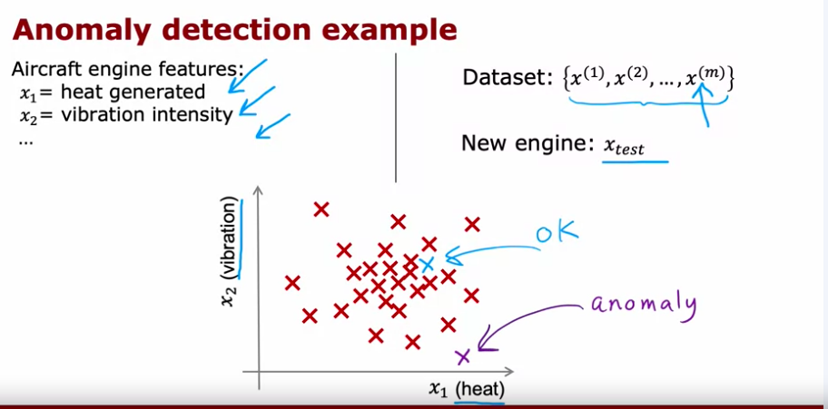

A second type of unsupervised learning is anomaly detection where we find data points that are outside of the data that we've found earlier.

In the above screenshot, our datapoint $x\sub{test} looks like it has a high specific heat and low vibration intensity. Given that the plotted datapoint looks very different than many other datapoints, this would lead us to conclude that we would want to have further testing before installing that engine in an aircraft.

One algorithm for detecting anomalous behavior is called **Density Estimation** where we assign a probability to all points in a dataset of being anomalous. All of the points are plotted on a scatter plot and then further datapoints can be assigned a probability of where they would appear on that scatter plot. If the datapoint would land more toward the center of the scatter plot, it would be assigned a high probability and therefore has a higher chance of being ok. In contrast, a datapoint plot further outside would be assigned a low probability and is therefore more likely to be an anomaly. We make the classification by using a number, $\epsilon$, to represent the threshold of what determines ok vs anomaly.

A common use case for density estimation specifically is in fraud detection. You may have features like how often the user logs in or how many transactions the user makes and model that on a scatter plot to assign a probability. This probability can then be used with a threshold that you assign to determine is the activity should be flagged as anomalous or not. If something is flagged as anomalous, it can be an indicator that maybe the security team should take a further look at this account to determine if the behavior is fradulant or just a false alarm.

## Gaussian (normal) distribution

The Guassian, normal, and bell shaped curve all refer to the same thing. The distribution says that for any number, the probability is determined by a Guassian with mean $\mu$ and variance $\sigma^2$. $\sigma$ is a standard deviation. The distribution has the property that approximately 68% of data falls within one standard deviation of the mean, 95% within two standard deviations, and 99.7% within three standard deviations. Another property is that it's centered at $\mu%. The mathematical form of this formula is

$$
p(x) = \frac{1}{\sqrt{2\pi}\sigma} * e^\frac{-(x-\mu)^2}{2\sigma^2}
$$

The following screenshot will show you how changing values for $\mu$ and $\sigma$ will change how the distribution looks. For example, increasing the variance will widen the distribution while changing the mean only changes where the distribution is centered.

This formula can give you great intuition for building a Guassian distribution for a single number $x$ but for an anomaly detection algorithm, we'll have $n$ features.

## Anomaly Detection Algorithm step by step

Having this background, we can now approach the steps that we want to use to build an anomaly detection algorithm. 

1. Choose $n$ features of $m$ training examples that you think are indicative of anomalous examples.
2. Fit params $\mu_1,...,\mu_n$ and $\sigma_1^2,..., \sigma_n^2
These are given by

$$
\mu_j = \frac{1}{m} \sum_{i=1}^{m} x_j^(i)
$$

and

$$
\sigma_j^2 = \frac{1}{m} \sum_{i=1}^{m} (x_j^(i)-\mu_j)^2
$$

where j is just the index of the feature.

3. Now for any new data that comes in, we can do the following. This is because we know that we'll need to multiply all of the probabilities together

$$
p(x) = \prod_{j=1}^n \frac{1}{\sqrt{2\pi}\sigma_j} * e^\frac{-(x_j-\mu_j)^2}{2\sigma|j^2}
$$

4. We know from before that we want to check if this $p(x) < \epsilon$

One intuition from this is that if we just have one feature that's an outlier, that probability will be very small. And because we're multiplying everything together, if even one probability is small, the entire product will be small.

## An example

Let's get an idea of what this might look like. In the following screenshot, we're ploting %x_1$ and $x_2$. We notice that $x_1$ has a much more varied distribution.

We can also take an arbitrary threshold and compute two test examples. We can see in the 2nd example that we will have a much lower probability and therefore will be a lot less than our threshold and will be flagged as anomalous.

## Choosing Epsilon

One question that might come up is to ask how we choose epsilon, the threshold. One way that we can do this is if we have labeled data already that we can refer to, we can use binary classification and choose the value of epsilon from the cross validation set. 

## When to use anomaly detection

Typically you want to use anomaly detection to help detect future anomalies that the system hasn't seen before. For example, fraud is changing all of the time therefore anomaly detection is the better algorithm. Conversely, spam hasn't changed in years so supervised learning might be better for that.

