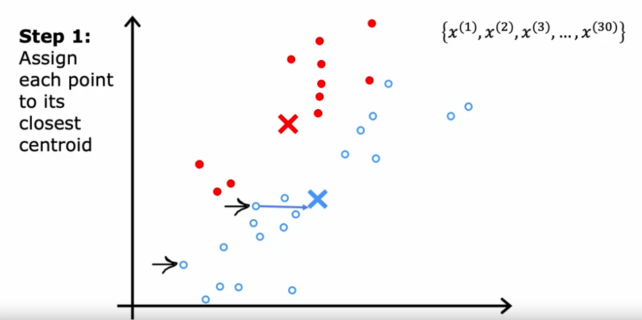
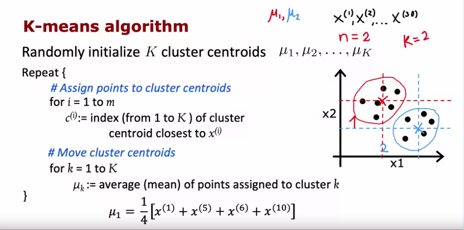
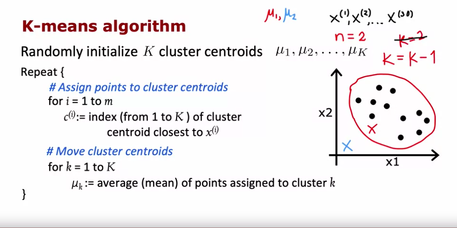

# Clustering

 the whole thing for unsupervised learning is that the data is not labeled at all so it becomes up to the algorithm to figure out common patterns that I can use to group the data. The simplest technique in unsupervised learning is clustering and this can be used in applications varying from market segmentation that is figuring out for example why people are choosing to take a certain online course to DNA analysis. 

## K Means Clustering

The most popular clustering technique used is the K means clustering algorithm.

The following are examples steps that we might take for a K means algorithm where K=2

1. pick two centroids and then every Datapoint will be near one of those two centroids 
2. The second step is that we will take an average of the data points assigned to each side and use those values to re-compute where the centroid will be. More on how we do this later 
3. We can now move back to assigning the data points from step one now that the centroids have been mpved 
4. We've repeat step to by taking the average of the data points in recomputing the centroids.
5. We iteratively do step one and step two until our data points will no longer change when we have recomputed the centroids. In practice we will say that the centroids have converged

The generalized steps are as follows

1. We randomly initialize K cluster centroids. Each centroid is denoted $\mu_1$ to $\mu_K$. The values of $\mu$ will be vectors of the same dimensionality as the training examples.
2. This is where we begin the iterative process:
    1. For i to m training examples. Calulate the distance of each data point to the centroid to find the closest centroid. Mathematically, this is $min_k \lvert \lvert x^(i) - \mu_k \rvert \rvert^2$ 
    2. Recompute the cluster centroids by taking the average of all data points assigned to that centroid. Mathematically if there are four data points that were assigned to a specific centroid, we would do $\mu_k=\frac{1}{4}(x^{(1)}+x^{(4)}+x^{(9)}+x^{(10)})$

There is a rare corner case to watch out for where one of the clusters can have no data points assigned to it which means that we are unable to compute anything any new centroid because it would result in an undefined fraction, In that case we would just eliminate the cluster centroid 

One other handy notation that we might use is 

## $$\mu_{c^{(i)}}$$

 where $c^{(i)}$ is the index of the cluster for that specific training example so

## $$\mu_{c^{(10)}}$$

refers to the cluster centroid assigned to the 10th training example.


 having now defined this we can now say that the **cost function** (also refferred to as the **distortion function**) can be defined as

## $$J(c^{(1)}, ..., c^{(m)}, \mu_1, ..., \mu_K) = \frac{1}{m} \sum_{i=1}^m \|x^{(i)} - \mu_{c(i)}\|^2$$

where $c^{(i)}$ is the index of the cluster for that specific training example and m is the number of training examples.

As with previous cost functions that we've looked at, the goal of the cost function is to become smaller with every iteration and because of the nature of K means it is guaranteed to either become smaller or stay the same. So if the cost function ever increases between iterations, it means that there's a bug in the code. 

If the cost function ever stays the same between iterations that means that the centroids have converged. 

## Choosing the values of the centroids

The question arises of what values to choose for the centroids. One idea you might use is just to choose random values, that is random examples, for each centroid and then compute the cost function. Do this 100 times and choose which ever centroids will give you the lowest cost function. 

## Choosing K

Our last question when using key means is what value to choose 4K that is the number of lobsters that we will be using.

Because we now have the cost function, we Might be tempted to just use the value of K that will minimize the cost function the most. However, the nature of K means is that the cost function is guarenteed to decrease when we increase the value for K.

Therefore one way to choose is to find a value for K with the sharpest drop in the cost function. This is refferred to as the **elbow method** becaause when you graph this, as seen in the screenshot below, it looks like an elbow.


Another way to choose the value for K would be just try to use  the values that make the most intuitive sense. Formally we can say that you choose a value that will serve a purpose downstream in your process. For example, if you're using K means for t shirt sizes, you may intuitively think that 3 or 5 would make sense because these are the number of sizes that would be the most convenient for shipping purposes. Small, medium, and large are common sizes for t shirts so K=3 might make more sense. K=2 wouldn't make as much sense because stores don't sell just a medium and large.


Keep in mind that this approach does require domain knowledge. In the example for t shirts, we've demonstrated how consumer expectations and market norms influence the value of K.

## Using K means for image compression

As an exercise, we'll use K means to implement an image compression model

```py
import numpy as np
import matplotlib.pyplot as plt

%matplotlib inline

def find_closest_centroids(X, centroids):
    """
    Computes the centroid memberships for every example
    
    Args:
        X (ndarray): (m, n) Input values      
        centroids (ndarray): (K, n) centroids
    
    Returns:
        idx (array_like): (m,) closest centroids
    
    """

    # Set K
    m = X.shape[0]
    K = centroids.shape[0]

    # You need to return the following variables correctly
    idx = np.zeros(X.shape[0], dtype=int)
    
    ### START CODE HERE ###
    for i in range(m):  # for each example
        min_distance = float('inf')  # initialize with a very large number
        for k in range(K):  # for each centroid
            # Calculate distance between the example and the centroid
            distance = np.sum((X[i] - centroids[k]) ** 2)
            
            # If this distance is less than the minimum so far
            if distance < min_distance:
                min_distance = distance
                # we assign the scalar centroid number since we don't need the distance
                idx[i] = k  
        
        
            
            
        
     ### END CODE HERE ###
    
    return idx

def compute_centroids(X, idx, K):
    """
    Returns the new centroids by computing the means of the 
    data points assigned to each centroid.
    
    Args:
        X (ndarray):   (m, n) Data points
        idx (ndarray): (m,) Array containing index of closest centroid for each 
                       example in X. Concretely, idx[i] contains the index of 
                       the centroid closest to example i
        K (int):       number of centroids
    
    Returns:
        centroids (ndarray): (K, n) New centroids computed
    """
    
    # Useful variables
    m, n = X.shape
    
    # You need to return the following variables correctly
    centroids = np.zeros((K, n))
    
    ### START CODE HERE ###
    for k in range(K):
        # get all points in X with an index in idx matchink the value of k
        points = X[idx == k]
        centroids[k] = np.mean(points, axis=0)
    
        
        
    ### END CODE HERE ## 
    
    return centroids
```

Now we put together the above two functions with an overarching function that will run K means

```py
def run_kMeans(X, initial_centroids, max_iters=10, plot_progress=False):
    """
    Runs the K-Means algorithm on data matrix X, where each row of X
    is a single example
    """
    
    # Initialize values
    m, n = X.shape
    K = initial_centroids.shape[0]
    centroids = initial_centroids
    previous_centroids = centroids    
    idx = np.zeros(m)
    plt.figure(figsize=(8, 6))

    # Run K-Means
    for i in range(max_iters):
        
        #Output progress
        print("K-Means iteration %d/%d" % (i, max_iters-1))
        
        # For each example in X, assign it to the closest centroid
        idx = find_closest_centroids(X, centroids)
        
        # Optionally plot progress
        if plot_progress:
            plot_progress_kMeans(X, centroids, previous_centroids, idx, K, i)
            previous_centroids = centroids
            
        # Given the memberships, compute new centroids
        centroids = compute_centroids(X, idx, K)
    plt.show() 
    return centroids, idx
```

We'll now run the data.

```py
# Load an example dataset
X = load_data()

# Set initial centroids
initial_centroids = np.array([[3,3],[6,2],[8,5]])

# Number of iterations
max_iters = 10

# Run K-Means
centroids, idx = run_kMeans(X, initial_centroids, max_iters, plot_progress=True)
```

Now let's take a look at how we implement the initialization for the K means. As you can see, we're just taking random example from the training set and using those as our centroids.

```py
def kMeans_init_centroids(X, K):
    """
    This function initializes K centroids that are to be 
    used in K-Means on the dataset X
    
    Args:
        X (ndarray): Data points 
        K (int):     number of centroids/clusters
    
    Returns:
        centroids (ndarray): Initialized centroids
    """
    
    # Randomly reorder the indices of examples
    randidx = np.random.permutation(X.shape[0])
    
    # Take the first K examples as centroids
    centroids = X[randidx[:K]]
    
    return centroids
```

## Image compression

We'll load a 128x128 image of a bird and reduce it to 16 colors.

```py
# Load an image of a bird
original_img = plt.imread('bird_small.png')
```

Here we'll be able to see that the image is just a matrix of vectors with 3 components. The first two componexts are position while the last is the intensity of a color (green, red, blue).

```py
print("Shape of original_img is:", original_img.shape)
```

```
(128,128,3)
```

Now we'll init K means as we have before

```py
K = 16
max_iters = 10

# Using the function you have implemented above. 
initial_centroids = kMeans_init_centroids(X_img, K)

# Run K-Means - this can take a couple of minutes depending on K and max_iters
centroids, idx = run_kMeans(X_img, initial_centroids, max_iters)
```

if we were to plot this in 3d with the centroids, we would get 


