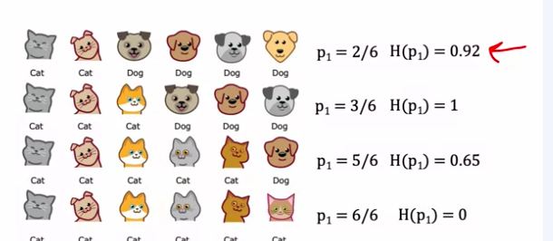
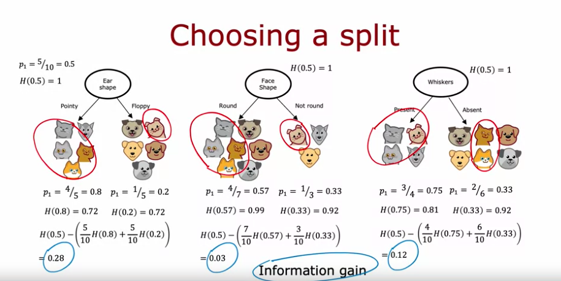

In the following screenshot, a decision tree is shown to descide if a an image is a picture of a cat. This is a high level overview but shows how the tree works 

0. The algorithm runs through a binary classification to see how each feature performs to descide which feature to use where in the tree.
1. Identify the first feature (ear shape in this example) as the **root node** and see it's binary classification (pointy or floppy).
2. If the feature is a certain way (pointy in this case), then we look at one feature (face shape). If the first feature is another way (floppy) then we look at another feature (whisker)
3. After looking at the second and third features, we can make a decision on what are referred to as the **leaf nodes** because they have no children nodes and give the final classification.

Part of the descion tree learning algorithm is that there can be multiple trees as shown in the figure below and the job of the alorithm is to figure out which tree works best.

A couple questions arise that are involved in the learning process.

1. How do you choose the features and their locations in the tree?

This is calculated by the algorithm as the feature **maximizing purity**. What this means is that the goal is to create subsets of examples that are as close as possible to being all of one class. In the figure below, we see that the ear shape feature resulted in a binary classification against the ground truth (correct classifications) of 4/5. This is the biggest fraction of all the other features. Therefore ear shape is chosen to be the root node.

2. When do you stop splitting?

Typically, you know when to stop when 100% has been classified into one class. The tree will stop splitting at this node and it will become known as a leaf node.

Unfortunately this doesn't always work out this way so we need another stop condition which is limiting the depth of the tree. Another stop condition would be if the purity improvements from an additional node are below a certain threshold. Similarily, if the additional node doesn't involve new examples being classified or not enough to meet a threshold, this may also be a stop condition. 