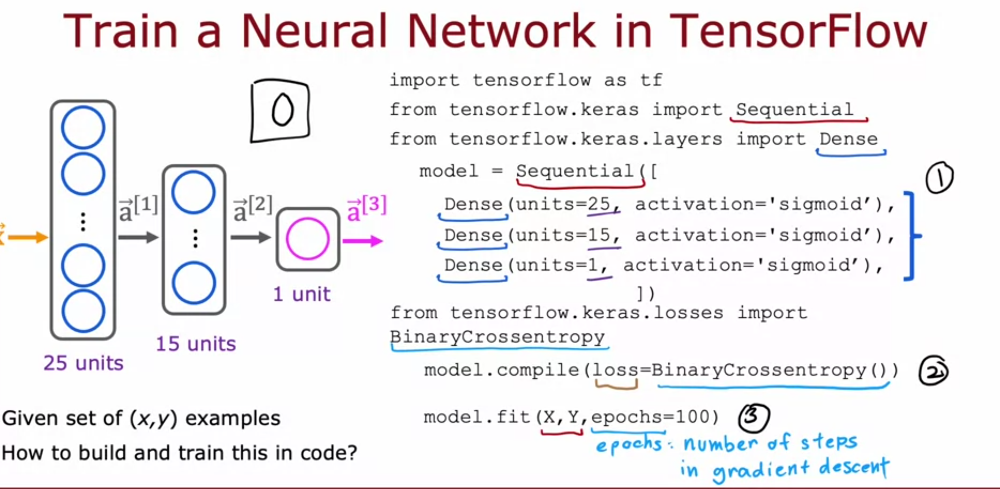

1. Build a model to train 
2. Compile the model, this involves specifying a loss function
3. Fit the model to the data. This involves the model layout that you specified in step 1 along with its activation function as well as the loss function that you specified in step 2. 

Step 3 also involves you specifying epochs. Epochs is just the number of steps in gradient descent that the model will use to arrive at a best fit.

So if we look at what we've learned previously, we can find that these will map to the above three steps that we've specified for tensorflow.

1. Building the model in tensorflow using this code

```python
model = Sequential(
    [
        tf.keras.Input(shape=(2,), batch_size=32),
        Dense(3, activation='sigmoid', name = 'layer1'),
        Dense(1, activation='sigmoid', name = 'layer2')
     ]
)
```

Would be the equivalent of just using the dot product and sigmoid in numpy

```python
def sigmoid(x):
    return 1 / (1 + np.exp(-x))

def forward_pass(X, W1, b1, W2, b2):
    # Layer 1 (Dense layer with sigmoid activation)
    Z1 = np.dot(W1, X) + b1  # Z = W*X + b
    A1 = sigmoid(Z1)  # Activation function
    
    # Layer 2 (Output layer with sigmoid activation)
    Z2 = np.dot(W2, A1) + b2
    A2 = sigmoid(Z2)  # Activation function
    
    return A2  # This is the output of the forward pass
```

2. Compiling the model and specificying a loss function in tensorflow

```python
model.compile(loss=BinaryCrossEntropy())
```

Would be the equivalent of something like the following where we use logarithms along with the dot products to calculate the loss

```python
def compute_cost_logistic(X, y, w, b):
    """
    Computes cost

    Args:
      X (ndarray (m,n)): Data, m examples with n features
      y (ndarray (m,)) : target values
      w (ndarray (n,)) : model parameters  
      b (scalar)       : model parameter
      
    Returns:
      cost (scalar): cost
    """

    m = X.shape[0]
    cost = 0.0
    for i in range(m):
        z_i = np.dot(X[i],w) + b
        f_wb_i = sigmoid(z_i)
        cost +=  -y[i]*np.log(f_wb_i) - (1-y[i])*np.log(1-f_wb_i)
             
    cost = cost / m
    return cost
```

What's confusing is that this function is called **binary cross entropy** in tensorflow. This is because the name cross entropy has its roots in statistics. Binary is just used to emphasize that this is for a binary classification task.

Notice that up until now, we've just specified functions and haven't run any code.

3. Model fit in tensorflow is just a one liner like the compilation step previously.

```python
model.fit(X,y,epochs=100)
```

That one liner might be something like the following in plain numpy

```python
def gradient_descent(X, y, w_in, b_in, alpha, num_iters): 
    """
    Performs batch gradient descent
    
    Args:
      X (ndarray (m,n)   : Data, m examples with n features
      y (ndarray (m,))   : target values
      w_in (ndarray (n,)): Initial values of model parameters  
      b_in (scalar)      : Initial values of model parameter
      alpha (float)      : Learning rate
      num_iters (scalar) : number of iterations to run gradient descent
      
    Returns:
      w (ndarray (n,))   : Updated values of parameters
      b (scalar)         : Updated value of parameter 
    """
    # An array to store cost J and w's at each iteration primarily for graphing later
    J_history = []
    w = copy.deepcopy(w_in)  #avoid modifying global w within function
    b = b_in
    
    for i in range(num_iters):
        # Calculate the gradient and update the parameters
        dj_db, dj_dw = compute_gradient_logistic(X, y, w, b)   

        # Update Parameters using w, b, alpha and gradient
        w = w - alpha * dj_dw               
        b = b - alpha * dj_db               
      
        # Save cost J at each iteration
        if i<100000:      # prevent resource exhaustion 
            J_history.append( compute_cost_logistic(X, y, w, b) )

        # Print cost every at intervals 10 times or as many iterations if < 10
        if i% math.ceil(num_iters / 10) == 0:
            print(f"Iteration {i:4d}: Cost {J_history[-1]}   ")
        
    return w, b, J_history         #return final w,b and J history for graphing

w_tmp  = np.zeros_like(X_train[0])
b_tmp  = 0.
alph = 0.9
iters = 10000

w_out, b_out, _ = gradient_descent(X_train, y_train, w_tmp, b_tmp, alph, iters) 
print(f"\nupdated parameters: w:{w_out}, b:{b_out}")
```

```
Iteration    0: Cost 0.6509898706978229   
Iteration 1000: Cost 0.01898509708803807   
Iteration 2000: Cost 0.009462945855308616   
Iteration 3000: Cost 0.006299017770009604   
Iteration 4000: Cost 0.004720359852320092   
Iteration 5000: Cost 0.003774414835001944   
Iteration 6000: Cost 0.0031443437189356085   
Iteration 7000: Cost 0.0026945747305561125   
Iteration 8000: Cost 0.0023574030434657897   
Iteration 9000: Cost 0.0020952495092537446   

updated parameters: w:[8.21 8.01], b:-22.305241709195236
```

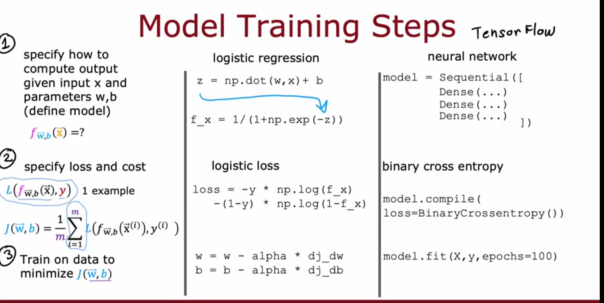

One useful note is that tensorflow uses an idea similar to gradient descent but it's referred to as **back propogation**

## Activation Functions

Sigmoid is good for giving us a binary classification as it's between 0 and 1 but there is another activation function that we can use if we want to have multiple classifications. For example, in our t-shirt example shown below we may have a binary classification of are they aware or are they not. We might want to have classications for different levels of awareness such as not aware, somewhat aware, aware, very aware, or viral. For this, we often use a different activation function called **Rectified Linear Unit (ReLU)**. ReLU is a simple function where the output is 0 if the input is negative or a linear regression if the input is greater than or equal to zero. This means that we get an off switch if the input is zero.

$$
g(z) = max(0,z)  
$$

where

$$
z=\vec{w} \cdot \vec{x} + b
$$

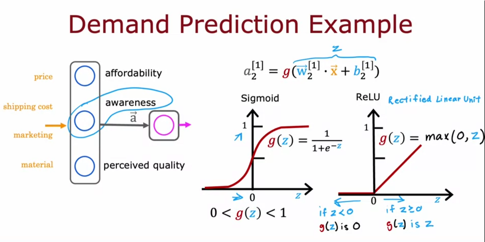

There is also the **linear activation function** which is just

$$
g(z) = z
$$

where

$$
z=\vec{w} \cdot \vec{x} + b
$$

The linear activation function you can think of as the default in that people will often say that they're not using an activation function when they are just using the linear activation function.

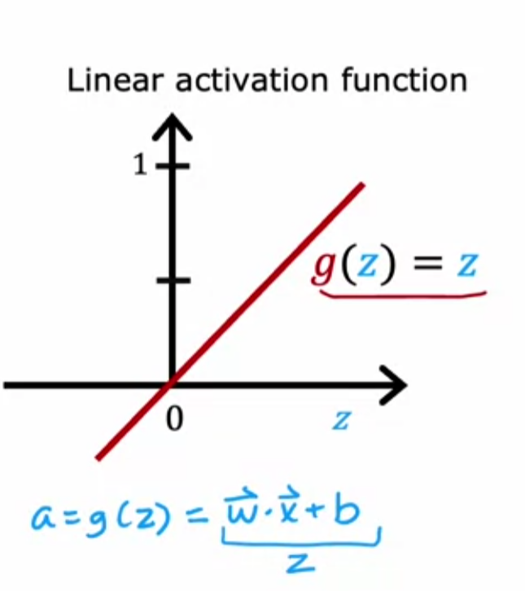

### Choosing an activation function

We've seen that in tensorflow, we can define different activation functions for different layers. This is useful because the optimal choice for an activation function may depend on which layer you're computing.

#### Output layer

It's clear to see that sigmoid is a good choice for binary classification problems. Depending on what you're doing, it may be better to use another activation function. If you're trying to predict the stock market where the numbers will be positive or negative, the linear activation function is a good model to get a best fit line. If you're looking at the price of a house, ReLU might be more useful than linear activation because house prices can never be negative anyway.

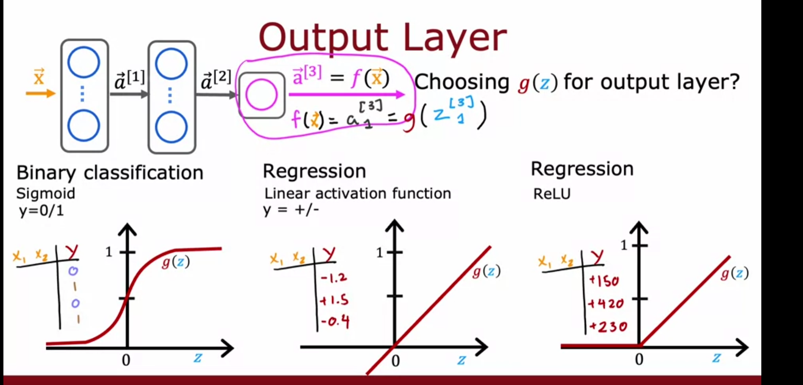

#### Hidden layers

The hidden layers these day almost ubiquitously choose to use ReLU. This is for two reasons.

* ReLU is faster to compute because it's just zero in the negative case
* Because ReLU only computes for positive values, ReLU only have one coverging flat point where sigmoid has two (one for 0 and one for 1). This means the gradient descent will have an easier time finding convergence with ReLU.

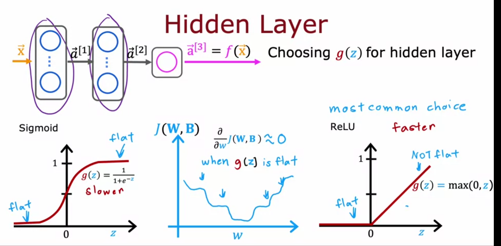

Naturally, the question arises of why we even need an activation function. Remember how I mentioned that a linear activation function can be thought of as the default? This means that if we don't specify any other activation functions, all layers will just use the linear activation function. Furthermore, there's a concept in linear algebra that a linear function times another linear function is just a linear function. So the question then will become, why don't we just use a linear regression model instead of a neural network.

### Multiclass Classification

The idea is that we want a classification where our decision boundary divides a little more and instead on binary where where just have $P(1|\vec{x})$, we may have

* $P(1|\vec{x})$
* $P(2|\vec{x})$
* $P(3|\vec{x})$
* $P(4|\vec{x})$

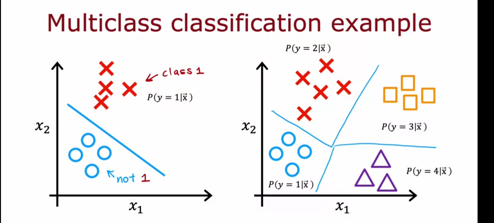

To be able to expand logistic regression to encompass these values, we will introduce using the **softmax regression function**. The steps for calculating the softmax are as follows. We'll continue our above example of having four possible output

1. Compute the dot product between x and the weights for all four outcomes.

$z_1 = \vec{w}_1 \cdot \vec{x} + b_1$

$z_2 = \vec{w}_2 \cdot \vec{x} + b_2$

$z_3 = \vec{w}_3 \cdot \vec{x} + b_3$

$z_4 = \vec{w}_4 \cdot \vec{x} + b_4$

2. Now we can use softmax regression to get the values for all of these which will always add to 1

## $a_1 = \frac{e^{z_1}}{e^{z_1} + e^{z_2} + e^{z_3} + e^{z_4}} = P(y = 1 \mid \vec{x}) = 0.30$

## $a_2 = \frac{e^{z_2}}{e^{z_1} + e^{z_2} + e^{z_3} + e^{z_4}} = P(y = 2 \mid \vec{x}) = 0.20$

## $a_3 = \frac{e^{z_3}}{e^{z_1} + e^{z_2} + e^{z_3} + e^{z_4}} = P(y = 3 \mid \vec{x}) = 0.15$

## $a_4 = \frac{e^{z_4}}{e^{z_1} + e^{z_2} + e^{z_3} + e^{z_4}} = P(y = 4 \mid \vec{x}) = 0.35$

This leads us to the general form for the softmax regression. This consists of the first equation for the logit part and the second for the softmax activation.

**Logit** 

## $z_j = \vec{w}_j \cdot \vec{x} + b_j \quad j = 1, \dots, N$

**Softmax**

## $a_j = \frac{e^{z_j}}{\sum_{k=1}^{N} e^{z_k}} = P(y = j \mid \vec{x})$

One important takeaway is that if we use a softmax regression model on only two possible outcomes, we arrive at the same answer as using the sigmoid. This means that logistic regression is really just a special case of softmax regression.

Switching over to the loss and cost function, this becomes a piecewise function now where we're taking -log for every a value that we compute using softmax regression

$$
loss(a_1, \dots, a_N, y) = 
\begin{cases} 
    -\log a_1 & \text{if } y = 1 \\
    -\log a_2 & \text{if } y = 2 \\
    \vdots & \\
    -\log a_N & \text{if } y = N
\end{cases}
$$

For a multiclass model, we want the output layer to have as many neurons as there are classifications. For example, if we are writing hand digit recognition software and we have 10 classifications that is, an image can be the digits 0-9, we will have 10 neurons in the output layer (sometimes referred to as the **softmax layer**). 

The z values are computed the same as the other layers, the only differences are that we're using the softmax activation function and using the loss function specified above. 

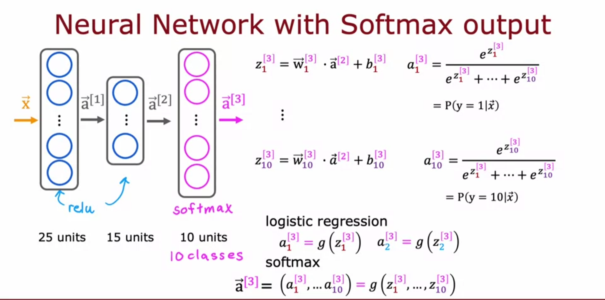

The loss function can be referred to as the **SparseCategoritcalCrossentropy** in tensorflow on the compilation step. This just means that the values can only be however many units that we've specified. So if our output layer has 10 units, this means that output values can only be those 10 values.

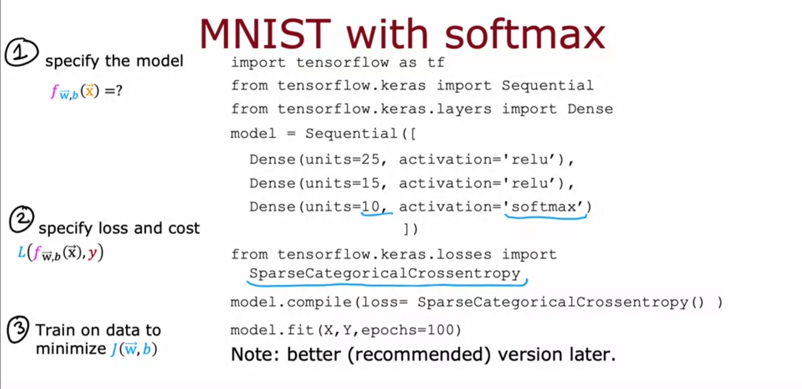

Below is an example of an implementation in numpy. Here we've assuming that we've already calculated $\vec{w} \cdot \vec{x} + b$ and z is a 1 dimension array.

```python
def my_softmax(z):  
    """ Softmax converts a vector of values to a probability distribution.
    Args:
      z (ndarray (N,))  : input data, N features
    Returns:
      a (ndarray (N,))  : softmax of z
    """   
    a = np.zeros_like(z)
    n = len(z)
    for j in range(0,n):
        denominator = 0
        for k in range(0,n):
            denominator += np.exp(z[k])
        a[j] = np.exp(z[j])/denominator
    return a
```

Below is an example of tensorflow code where we have 4 classiciations.

```python
model = Sequential(
    [ 
        Dense(25, activation = 'relu'),
        Dense(15, activation = 'relu'),
        Dense(4, activation = 'softmax') 
    ]
)
model.compile(
    loss=tf.keras.losses.SparseCategoricalCrossentropy(),
    optimizer=tf.keras.optimizers.Adam(0.001), # We'll decifer optimizers more in the future
)

model.fit(
    X_train,y_train,
    epochs=10
)
```

```
Epoch 1/10
63/63 [==============================] - 0s 968us/step - loss: 1.1582
Epoch 2/10
63/63 [==============================] - 0s 1ms/step - loss: 0.5591
Epoch 3/10
63/63 [==============================] - 0s 1ms/step - loss: 0.2867
Epoch 4/10
63/63 [==============================] - 0s 1ms/step - loss: 0.1497
Epoch 5/10
63/63 [==============================] - 0s 929us/step - loss: 0.0951
Epoch 6/10
63/63 [==============================] - 0s 1ms/step - loss: 0.0751
Epoch 7/10
63/63 [==============================] - 0s 1ms/step - loss: 0.0647
Epoch 8/10
63/63 [==============================] - 0s 946us/step - loss: 0.0577
Epoch 9/10
63/63 [==============================] - 0s 1ms/step - loss: 0.0523
Epoch 10/10
63/63 [==============================] - 0s 1ms/step - loss: 0.0482
```

Notice that the number appearing below epoch (63 in this case) means that is the number of training examples divided by the batch size (32 is default in tensorflow)

and printing the probabilities

```python
p_nonpreferred = model.predict(X_train)
print(p_nonpreferred [:2])
print("largest value", np.max(p_nonpreferred), "smallest value", np.min(p_nonpreferred))
```

```
[[8.75e-04 3.62e-03 9.73e-01 2.29e-02]
 [9.88e-01 1.16e-02 5.36e-04 2.69e-04]]
largest value 0.9999987 smallest value 1.3685562e-10
```

#### Numerical Accuracy

When dealing with models, numerical accuracy comes into play, specically roundoff due to how the computer stores the values. Normally, this isn't a big deal since this roundoff error won't happen until around the 15th digit but it becomes a factor in models due to how many computations that we do (though still not a very large cause for concern). An example of numerical roundoff is shown below. Notice that 

## $\frac{2}{10000}$

is slightly different than

## $(1 + \frac{1}{10000}) - (1 - \frac{1}{10000})$

Even though mathimatically these are equivalent

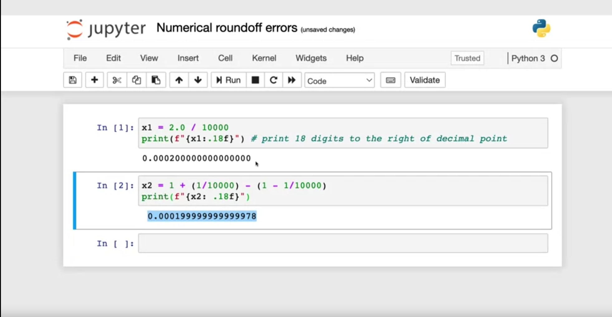

**Numerical instability** can occur in large or deep models, where the computer struggles to keep track of very large or very small numbers during floating-point operations, causing roundoff errors. To address this, scientists use a strategy where they set `from_logits=True` during the model compilation step, allowing the model to output raw scores (called logits) instead of applying a softmax activation in the output layer. Logits refer to these raw, unnormalized values from the model's final layer before an activation function like softmax is applied in the loss function.

So the compilation may become `model.compile(loss=SparseCategoricalCrossentropy(from_logits=True))`

One more note is that since we are not using the softmax as the activation of the output layer anymore, we will apply the softmax on the logits obtained from the model during the predict step.

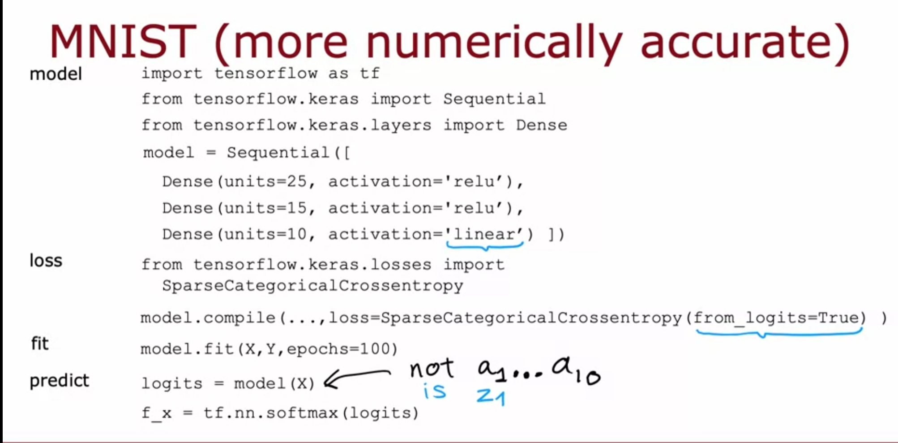

```python
preferred_model = Sequential(
    [ 
        Dense(25, activation = 'relu'),
        Dense(15, activation = 'relu'),
        Dense(4, activation = 'linear')   #<-- Note
    ]
)
preferred_model.compile(
    loss=tf.keras.losses.SparseCategoricalCrossentropy(from_logits=True),  #<-- Note
    optimizer=tf.keras.optimizers.Adam(0.001), #again we'll cover optimizers more later
)

preferred_model.fit(
    X_train,y_train,
    epochs=10
)
```

```
Epoch 1/10
63/63 [==============================] - 0s 951us/step - loss: 1.0304
Epoch 2/10
63/63 [==============================] - 0s 1ms/step - loss: 0.5007
Epoch 3/10
63/63 [==============================] - 0s 1ms/step - loss: 0.2400
Epoch 4/10
63/63 [==============================] - 0s 1ms/step - loss: 0.1245
Epoch 5/10
63/63 [==============================] - 0s 1ms/step - loss: 0.0845
Epoch 6/10
63/63 [==============================] - 0s 1ms/step - loss: 0.0669
Epoch 7/10
63/63 [==============================] - 0s 924us/step - loss: 0.0575
Epoch 8/10
63/63 [==============================] - 0s 1ms/step - loss: 0.0513
Epoch 9/10
63/63 [==============================] - 0s 911us/step - loss: 0.0469
Epoch 10/10
63/63 [==============================] - 0s 1ms/step - loss: 0.0439
```

Notice that the loss is slightly less.

```python
p_preferred = preferred_model.predict(X_train)
print(f"two example output vectors:\n {p_preferred[:2]}")
print("largest value", np.max(p_preferred), "smallest value", np.min(p_preferred))
```

```
two example output vectors:
 [[-1.8  -2.56  2.18 -2.41]
 [ 7.44  2.24 -3.21 -2.75]]
largest value 11.630287 smallest value -8.819509
```

 Also notice now that we're using a linear activation function so our output is no longer probability but is a range of numbers from positive to negative. So we now will apply the softmax function seperately.

```python
sm_preferred = tf.nn.softmax(p_preferred).numpy()
print(f"two example output vectors:\n {sm_preferred[:2]}")
print("largest value", np.max(sm_preferred), "smallest value", np.min(sm_preferred))
```

#### Multilabel classification

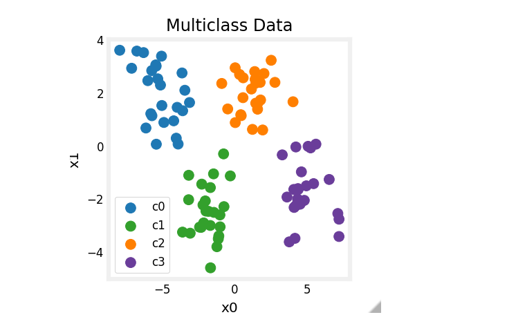

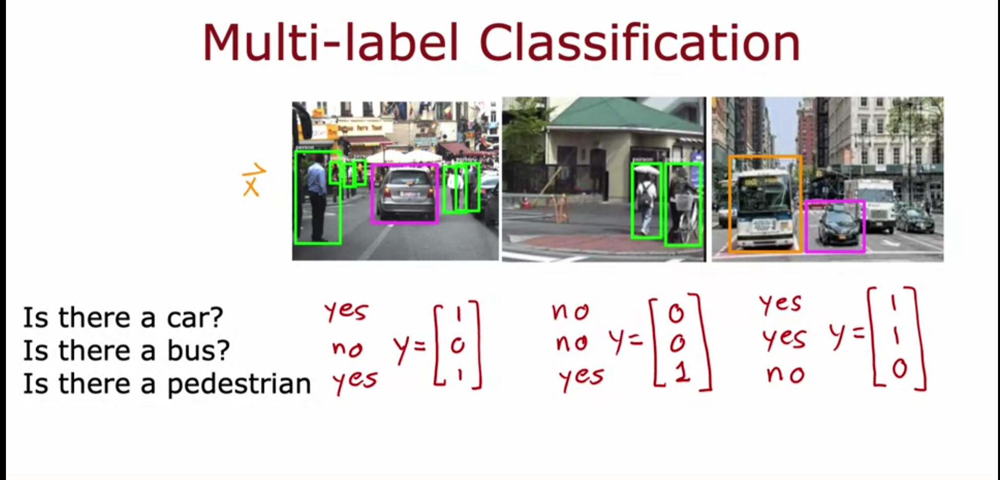

In the above image for an image classification problem, we have three labels that we want to output. Car, bus, and pedestrian. 

One approach for this type of problem is to use three seperate neural networks. An alternative approach is to have one neural network to have as many units in the output layer as there are labels that we want to classify. The difference now is that the output layer will now give us a vector rather than a number. 

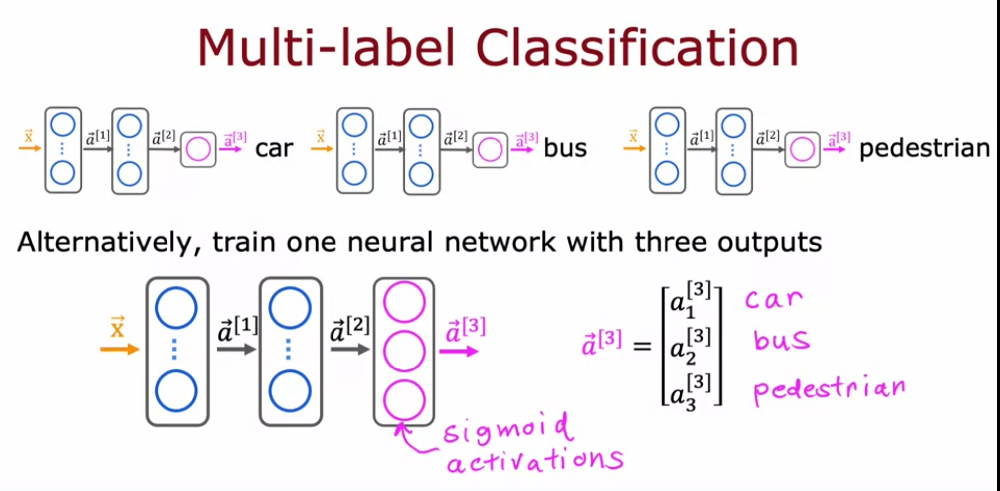

As a bonus, notice that in this particular problem that we're detecting if the object is in the picture or not. This reduces the complexity of this problem to a binary classification.

Let's return to our earlier example of the 4 classifications above. Instead, we'll apply the more numerically accurate method that we've been describing

```python
tf.random.set_seed(1234)  # applied to achieve consistent results
model = Sequential(
    [
        Dense(2, activation = 'relu',   name = "L1"),
        Dense(4, activation = 'linear', name = "L2")
    ]
)
model.compile(
    loss=tf.keras.losses.SparseCategoricalCrossentropy(from_logits=True),
    optimizer=tf.keras.optimizers.Adam(0.01),
)

model.fit(
    X_train,y_train,
    epochs=200
)
```

### Advanced Neural Network Concepts

Up until now, we've use gradient descent on our models to arrive at the global minimum. However, we would specify the learning rate at the begining and then it would be static and unchanging throughout the process. There is a way that the learning rate can adjust itself in a process called **Adaptive Moment Estimation** (often called adam). Adam keeps track of a moving average of past gradients to adjust its learning rate.

If you remember from some code snippits earlier, we used an optization parameter in our model compilation step. Though specifying Adam does require us to specify an initial learning rate, remember that it can auto adjust.

There is another advanced concept that we can take advantage of to optimize neural networks. Up until now we've been using dense layers which follow $g(a_j^{[l]} \cdot \vec{a}^{[l-1]}+b_j^{[l]})$ but there are different types of layers that we can use for different purposes and slightly better results depending on your use case.

#### Convolutional layers

**Convolutional layers** will instead have different neurons look at different parts of the data and then construct that together. The Advantage of this is that you'll need less training data. It's also faster because the neurons are only assigned to look at some of the data.

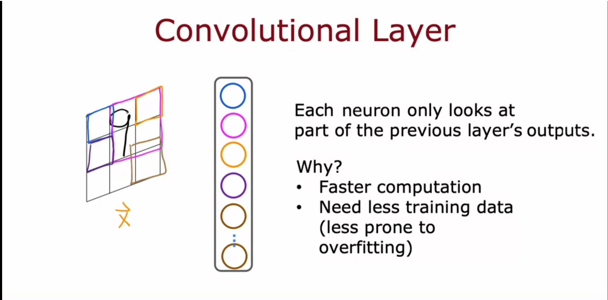

A neural network with several convolutional layers can be called a **Convolutional Neural Network** (CNN). The following screenshot is an example of a CNN being used on EKG Data to look at whether it's an indicator of heart disease. The neural network consists of two hidden layers which are both convolutional as well as the final output layer using the sigmoid activation function in order to make a binary classification for is it an indicator of heart disease or not. 

Notice that the image was first rotated 90 degrees in order to allow the 9 units of the first layer to each look at a different window or section of the data. 

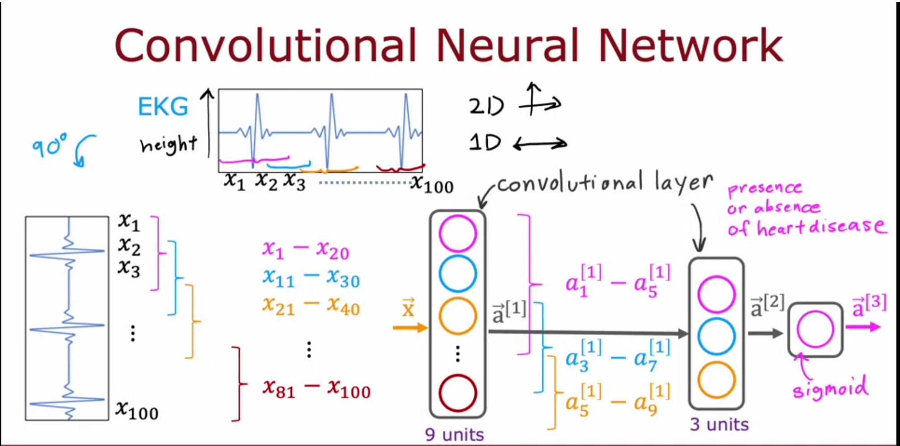

The second convolutional layer has three units that look at only a subset of the data. The first neuron may look at $a_1 - a_5$ while the second neuron looks at $a_3 - a_7$ and the third $a_5 - a_9$. Those three values are then all passed to the output layer where the model is now able to predict.

### Backpropogation

**Backproporgation** is the idea that a neural network will first make a prediction on training data, compare this with the actual computed value, and then go backwards through the layers of the neural network in reverse to adjust its weights. This is often done using gradient descent to measure the magnitude and change needed to minimize the error.

Suppose we have a neural network with just one weight, and it makes a prediction for some input data. The goal is to minimize the error between the prediction and the actual output.

1. **Initial Prediction**:  
   - Let’s say the initial weight is **2**, and the network predicts $ y_{\text{pred}} = 4 $.
   - The actual value should be $ 6 $.
   - The error is calculated using a loss function, such as mean squared error:  
     $
     \text{Error} = \frac{1}{2} \times (y_{\text{pred}} - y_{\text{true}})^2 = \frac{1}{2} \times (4 - 6)^2 = 2.
     $

2. **Backpropagation (Gradient Calculation)**:  
   - Now, we calculate the gradient of the error with respect to the weight (how much the error changes if we tweak the weight).  
   - The gradient for the weight is calculated as:  
     $
     \text{Gradient} = \frac{\partial \text{Error}}{\partial \text{Weight}} = 2 \times (y_{\text{pred}} - y_{\text{true}}) \times \text{input}.
     $
   - If the input was **1**, the gradient would be:  
     $
     \text{Gradient} = 2 \times (4 - 6) \times 1 = -4.
     $

3. **Gradient Descent (Weight Update)**:  
   - Now, gradient descent updates the weight using this formula:  
     $
     \text{New Weight} = \text{Old Weight} - \alpha \times \text{Gradient}.
     $
   - If the learning rate (alpha) is **0.1**, the new weight would be:  
     $
     \text{New Weight} = 2 - 0.1 \times (-4) = 2 + 0.4 = 2.4.
     $

4. **Repeat**:  
   - The network will repeat this process, forward passing, calculating the error, backpropagating the gradient, and adjusting the weights using gradient descent until the error is minimized.


#### Computation Graph

A **computation graph** is a way to visualize and break down the operations happening inside a neural network during forward and backward passes. It shows how the error flows backward through the network to update the weights.

A computation graph is a directed graph where:
- **Nodes** represent variables (like inputs, weights, outputs) or operations (like addition, multiplication).
- **Edges** represent the flow of data or the result of operations.

The computation graph helps us understand how backpropagation works by showing how the gradients of each operation are calculated and passed back to update the weights.

#### Forward Pass (Creating the Computation Graph):

1. **Input**: The input $ x = 1 $.

2. **Weight**: The weight $ w = 2 $.

3. **Predicted Output**: The network computes the prediction $ y_{\text{pred}} $ as:
   $
   y_{\text{pred}} = w \times x = 2 \times 1 = 4.
   $
   This multiplication can be thought of as a node in the computation graph.

4. **Error Calculation**: The error (or loss) is calculated using the loss function (mean squared error):
   $
   \text{Error} = \frac{1}{2} \times (y_{\text{pred}} - y_{\text{true}})^2 = \frac{1}{2} \times (4 - 6)^2 = 2.
   $
   Each operation in this calculation—subtraction, squaring, and multiplication by $ \frac{1}{2} $—can be visualized as separate nodes in the computation graph.

At the end of the forward pass, the computation graph for the prediction and error calculation looks like this:

- **Input**: $ x = 1 $
- **Weight**: $ w = 2 $

- **Step 1**: Multiply the input and weight:
    $
    \text{Predicted Output (} y_{\text{pred}} \text{)} = w \times x = 2 \times 1 = 4
    $

- **Step 2**: Calculate the difference between the predicted output and the true value:
    $
    \text{Difference} = y_{\text{pred}} - y_{\text{true}} = 4 - 6 = -2
    $

- **Step 3**: Square the difference:
    $
    \text{Squared Error} = (-2)^2 = 4
    $

- **Step 4**: Multiply the squared error by $ \frac{1}{2} $ to get the final error:
    $
    \text{Final Error} = \frac{1}{2} \times 4 = 2
    $

#### Backward Pass (Using the Computation Graph for Backpropagation):

In backpropagation, we compute the gradients by following the computation graph in reverse.

1. **Gradient of Error w.r.t. Output**: The first step is to compute the gradient of the error with respect to the predicted output $ y_{\text{pred}} $. This is the chain rule applied to the squared error:
   $
   \frac{\partial \text{Error}}{\partial y_{\text{pred}}} = 2 \times (y_{\text{pred}} - y_{\text{true}}) = 2 \times (4 - 6) = -4.
   $
   This gradient is passed backward through the graph.

2. **Gradient of Output w.r.t. Weight**: Next, we compute the gradient of the predicted output with respect to the weight $ w $. Since $ y_{\text{pred}} = w \times x $, the gradient is:
   $
   \frac{\partial y_{\text{pred}}}{\partial w} = x = 1.
   $

3. **Gradient of Error w.r.t. Weight**: Using the chain rule, the total gradient of the error with respect to the weight is:
   $
   \frac{\partial \text{Error}}{\partial w} = \frac{\partial \text{Error}}{\partial y_{\text{pred}}} \times \frac{\partial y_{\text{pred}}}{\partial w} = -4 \times 1 = -4.
   $
   This gives us the direction in which we need to update the weight.

4. **Weight Update**: Finally, we update the weight using gradient descent:
   $
   w_{\text{new}} = w_{\text{old}} - \alpha \times \frac{\partial \text{Error}}{\partial w} = 2 - 0.1 \times (-4) = 2 + 0.4 = 2.4.
   $

#### Advantages of a computation graph

The main advantage of a computation graph is that backpropogation can use this to not have to manually derive gradients and it can rely on past computations.

Though this graph is often used conceptual behind the scenes in a machine learning framework like tensorflow or pytorch, those same frameworks will often allow a visual representation.

#### Backpropogation and derivatives in code

There's a very handy library called sympy that can calculate derivatives that we'll use to illustrate backprop.

```python
from sympy import symbols, diff

J, w = symbols('J, w')

# setup w squared and find the derivative
J=w**2
dJ_dw = diff(J,w)
dJ_dw
```

$\text{2w}$

Note that sympy generates a latex formatted string.

We can now substitute in values using the `subs` function

```python
dJ_dw.subs([(w,3)])    # derivative at the point w = 3
```
 6

Now let's combine this with numpy and matplotlib to build a computation graph.

```python
import numpy as np
import matplotlib.pyplot as plt
```
