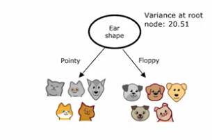
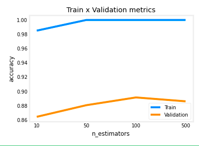

The calculation for **entopy** as a measure of purity is given by the following

$$
H(p_1) = -p_1 \log_2(p_1) - p_0 \log_2(p_0)
$$

where $p_0 = 1 - p_1$ and $p_1$ is the fraction of one class appearing in a test set as in the following screenshot. Notice the logarithm is base 2 whereas logarithms written without a base are base $e$ by default.


You'll find this function to plot this graph


A question would arrise on the choice of feature to split on. Thischoice is fueld but whatever will reduce entopy or impurity the most. Thhis reduction is known as **information gain**. 

However, the ultimate choice for the split is whatever reduces entropy the most so its calculated by the entopy before the split minus the information gain.


Taking the example in the above screenshot of the features to split on to detect cats

Ear shape
$$
p_1 = \frac{4}{5} = 0.8 \quad p_1 = \frac{1}{5} = 0.2 \quad
$$
$$
H(0.8) = 0.72 \quad H(0.2) = 0.72 \quad
$$
$$
H(0.5) - \left(\frac{5}{10}H(0.8) + \frac{5}{10}H(0.2)\right) = 0.28
$$


Face shape

$$
p_1 = \frac{4}{7} = 0.57 \quad p_1 = \frac{1}{3} = 0.33 \quad
$$
$$
H(0.57) = 0.99 \quad H(0.33) = 0.92 \quad
$$
$$
H(0.5) - \left(\frac{7}{10}H(0.57) + \frac{3}{10}H(0.33)\right) = 0.03
$$

Whiskers

$$
p_1 = \frac{3}{4} = 0.75 \quad p_1 = \frac{2}{6} = 0.33
$$
$$
H(0.75) = 0.81 \quad H(0.33) = 0.92
$$
$$
H(0.5) - \left(\frac{4}{10}H(0.75) + \frac{6}{10}H(0.33)\right) = 0.12
$$

In all three examples the entropy before the split is one so we take one minus whatever the information gain is to determine which to split on in this case the information gain of .28 brings the entropy down the least so we can conclude that we split on face shape.

Here we come to the general definition for information gain to determine the next split in a decision tree

$$
= H(p_1^{\text{root}}) - \left(w^{\text{left}} H(p_1^{\text{left}}) + w^{\text{right}} H(p_1^{\text{right}})\right)
$$

Where $w_{left}$ is the amount of examples that are classified into the left side branch and $w_{right}$ is the number of examples that are classified into the right subbranch

So in summary the following are the steps that you want to take when deciding on feature to split in a decision tree.

- Start with all examples at the root node
- Calculate information gain for all possible features, and pick the one with the highest information gain
    - This will result in you choosing one feature above the rest
- Split dataset according to selected feature, and create left and right branches of the tree
- Keep repeating splitting process until stopping criteria is met:
    - When a node is 100% one class
    - When splitting a node will result in the tree exceeding a maximum depth
    - Information gain from additional splits is less than threshold
    - When number of examples in a node is below a threshold

Open till now we've been dealing only with features such as ear shape which can only have one of two values either floppy or pointy. In this example we want to use a feature which can take on more than one Feliu round pointy or oval to do this we used a technique called **one hot encoding**

| Pointy ears | Floppy ears | Oval ears | Face shape | Whiskers | Cat |
|-------------|-------------|-----------|------------|----------|-----|
| 1           | 0           | 0         | Round      | Present  | 1   |
| 0           | 0           | 1         | Not round  | Present  | 1   |
| 0           | 0           | 1         | Round      | Absent   | 0   |
| 1           | 0           | 0         | Not round  | Present  | 0   |
| 0           | 0           | 1         | Round      | Present  | 1   |
| 1           | 0           | 0         | Round      | Absent   | 1   |
| 0           | 1           | 0         | Not round  | Absent   | 0   |
| 0           | 0           | 1         | Round      | Absent   | 1   |
| 0           | 1           | 0         | Round      | Absent   | 0   |
| 0           | 1           | 0         | Round      | Absent   | 0   |

Noticed that in the table above each of the One hot encoded features can only have a one in one place in the table

In general the definition of **one hot encoding** is that if a categorical feature can take on k values then we will translate that into k binary features

In the screenshot below we want to introduce a new feature which will be a continuous feature in this case with the use the weight of the animal. The X axis will be the weight of the animal while the Y axis will be whether they are a cat or not a cat. From there we will try to set arbitrary threshold which will determine the splits that we can use to be used in our information gain calculation.


In the following equation to calculate weight equals 8, we see that two examples were classified on the left of the threshold and eight examples were classified on the right we also see that two out of two of the examples on the left were cats whereas three out of eight examples were classified as cats on the right.

$$
H(0.5) - \left(\frac{2}{10}H\left(\frac{2}{2}\right) + \frac{8}{10}H\left(\frac{3}{8}\right)\right) = 0.24
$$

Similar equations are shown below for weight equals nine and weight equals 13

$$
H(0.5) - \left(\frac{4}{10}H\left(\frac{4}{4}\right) + \frac{6}{10}H\left(\frac{1}{6}\right)\right) = 0.61
$$

$$
H(0.5) - \left(\frac{7}{10}H\left(\frac{5}{7}\right) + \frac{3}{10}H\left(\frac{0}{3}\right)\right) = 0.40
$$

As you can see out of these three possible thresholds that we've chosen the biggest information gain has come from the weight equals nine. So the continuous feature can now be turned into a binary feature by saying if the weight is less than or equal to 9 pounds or not.

### Regression Trees

Open till now we've been working with decision trees which are good for classification that is in the examples above saying if it's a cat or not a cat. But what happens if we want to get a number? For this we will use a **regression tree**. A regression tree is the more general form of a decision tree where we're trying to predict a number rather than perform a classification.

For our example let's take the three features we had before ear shape face shape and whiskers and use that to try to predict a weight instead. Will use the training data below as example.

| Ear shape | Face shape | Whiskers | Weight (lbs.) |
|-----------|------------|----------|---------------|
| Pointy    | Round      | Present  | 7.2           |
| Floppy    | Not round  | Present  | 8.8           |
| Floppy    | Round      | Absent   | 15            |
| Pointy    | Not round  | Present  | 9.2           |
| Oval      | Round      | Present  | 8.4           |
| Pointy    | Round      | Absent   | 7.6           |
| Floppy    | Not round  | Absent   | 11            |
| Pointy    | Round      | Absent   | 10.2          |
| Floppy    | Round      | Absent   | 18            |
| Floppy    | Round      | Absent   | 20            |

As in our previous examples of decision trees we want to choose the feature that will give us the biggest **reduction in variance** rather than the biggest reduction in information gain. 

So let's take one feature to start with in this case ear shape and get the weight of all the animals that will be in the left subbranch and all the animals that will be in the right subbranch.



$$
\begin{align*}
&\text{Weights: } 7.2, 9.2, 8.4, 7.6, 10.2 \quad \text{Weights: } 8.8, 15, 11, 18, 20 \\[6pt]
\end{align*}
$$

Next, we will calculate the variance for all of those weights. 

$$
\begin{align*}
&\text{Variance: } 1.47 \quad \text{Variance: } 21.87 \\[6pt]
\end{align*}
$$

Next will use just about the same equation for calculating information gain on the river use the variance of the sub branch in place of the entropy for the sub branch.

$$
\begin{align*}
&w^{\text{left}} = \frac{5}{10} \quad w^{\text{right}} = \frac{5}{10} \\[6pt]
\left(\frac{5}{10} \cdot 1.47 + \frac{5}{10} \cdot 21.87\right) \\[6pt]
\end{align*}
$$

Finally we will take the variance from before the split. In this case the split is our root node so we have the base data set as the variance before the split. We will take the variance before the split and subtract the reduction in varience calculated from the split.

$$
\begin{align*}
&\text{Weights: } 7.2, 9.2, 8.4, 7.6, 10.2 \quad \text{Weights: } 8.8, 15, 11, 18, 20 \\[6pt]
&\text{Variance: } 1.47 \quad \text{Variance: } 21.87 \\[6pt]
&w^{\text{left}} = \frac{5}{10} \quad w^{\text{right}} = \frac{5}{10} \\[6pt]
&20.51 - \left(\frac{5}{10} \cdot 1.47 + \frac{5}{10} \cdot 21.87\right) \\[6pt]
&= 8.84
\end{align*}
$$

The screenshot below also shows the variance calculator for the other two features.


So from the calculation for reduction in variance for all three features we see that ear shape gives us the biggest reduction in variance.

### Putting it into code

Let's use our example of from the four of classifying cats.

Each feature in our trainees hat will be one hot encoded. Therefore,

`X_train`: for each example, contains 3 features:

      - Ear Shape (1 if pointy, 0 otherwise)
      - Face Shape (1 if round, 0 otherwise)
      - Whiskers (1 if present, 0 otherwise)

`y_train`: whether the animal is a cat

      - 1 if the animal is a cat
      - 0 otherwise

```py
import pandas as pd
import numpy as np
import matplotlib.pyplot as plt

def entropy(p):
    # calculate entropy of given fraction
    # remember that entropy is a bell like curve
    if p == 0 or p == 1:
        return 0
    else:
        return -p * np.log2(p) - (1- p)*np.log2(1 - p)

X_train = np.array([[1, 1, 1],
[0, 0, 1],
 [0, 1, 0],
 [1, 0, 1],
 [1, 1, 1],
 [1, 1, 0],
 [0, 0, 0],
 [1, 1, 0],
 [0, 1, 0],
 [0, 1, 0]])

y_train = np.array([1, 1, 0, 0, 1, 1, 0, 1, 0, 0])
```

Remembering that the graph for Our entropy equation is a ballet curve we know that entropy of zero or one is going to be zero whereas .5 Is going to be the peak entropy of one.

```py
print(entropy(.5))
```

```
1
```

Now will introduce a function that can split the original data set given the feature as one of the arguments

```py
def split_indices(X, index_feature):
    """Given a dataset and a index feature, return two lists for the two split nodes, the left node has the animals that have 
    that feature = 1 and the right node those that have the feature = 0 
    index feature = 0 => ear shape
    index feature = 1 => face shape
    index feature = 2 => whiskers
    """
    left_indices = []
    right_indices = []
    for i,x in enumerate(X):
        if x[index_feature] == 1:
            left_indices.append(i)
        else:
            right_indices.append(i)
    return left_indices, right_indices
```

```py
print(f'ear: {split_indices(X_train, 0)}')
print(f'face: {split_indices(X_train, 1)}')
print(f'whiskers: {split_indices(X_train, 2)}')
print(f'This isnt a feeature: {split_indices(X_train, 3)}')
```

```
ear: ([0, 3, 4, 5, 7], [1, 2, 6, 8, 9])
face: ([0, 2, 4, 5, 7, 8, 9], [1, 3, 6])
whiskers: ([0, 1, 3, 4], [2, 5, 6, 7, 8, 9])
---------------------------------------------------------------------------
IndexError                                Traceback (most recent call last)
<ipython-input-13-9276032604e7> in <module>
      2 print(f'face: {split_indices(X_train, 1)}')
      3 print(f'whiskers: {split_indices(X_train, 2)}')
----> 4 print(f'This isnt a feeature: {split_indices(X_train, 3)}')

<ipython-input-9-4ca7cd542a57> in split_indices(X, index_feature)
      9     right_indices = []
     10     for i,x in enumerate(X):
---> 11         if x[index_feature] == 1:
     12             left_indices.append(i)
     13         else:

IndexError: index 3 is out of bounds for axis 0 with size 3
```

Each value in these numpy erase refers to an index of the cat therefore these results are the same as what we've gone earlier when we were conceptualizing this. 


```py
def weighted_entropy(X,y,left_indices,right_indices):
    """
    This function takes the splitted dataset, the indices we chose to split and returns the weighted entropy.
    """
    w_left = len(left_indices)/len(X)
    w_right = len(right_indices)/len(X)
    p_left = sum(y[left_indices])/len(left_indices)
    p_right = sum(y[right_indices])/len(right_indices)
    
    weighted_entropy = w_left * entropy(p_left) + w_right * entropy(p_right)

    print(f'w_left: {w_left} times H({p_left}) + w_right: {w_right} times H({p_right})')
    return weighted_entropy
```

```py
left_indices, right_indices = split_indices(X_train, 0)
print(f'ear: {weighted_entropy(X_train, y_train, left_indices, right_indices)}')

left_indices, right_indices = split_indices(X_train, 1)
print(f'face: {weighted_entropy(X_train, y_train, left_indices, right_indices)}')

left_indices, right_indices = split_indices(X_train, 2)
print(f'whiskers: {weighted_entropy(X_train, y_train, left_indices, right_indices)}')
```

```
w_left: 0.5 times H(0.8) + w_right: 0.5 times H(0.2)
ear: 0.7219280948873623
w_left: 0.7 times H(0.5714285714285714) + w_right: 0.3 times H(0.3333333333333333)
face: 0.965148445440323
w_left: 0.4 times H(0.75) + w_right: 0.6 times H(0.3333333333333333)
whiskers: 0.8754887502163469
```

We will introduce a final function which will calculate the information game for each feature. Remember that for this function we will subtract the wedded entropy that we calculated for each feature from the entropy of The data before the split. In this case our original data set had five that were cats in five that were not cats which means that we have 10 total examples. So we are subtracting from an entropy of .5 for each feature which is going to be 1

```py
def information_gain(X, y, left_indices, right_indices):
    """
    Here, X has the elements in the node and y is theirs respectives classes
    """
    p_node = sum(y)/len(y)
    print(f'p_node: {p_node}')
    h_node = entropy(p_node)
    w_entropy = weighted_entropy(X,y,left_indices,right_indices)
    return h_node - w_entropy
```

```py
for i, feature_name in enumerate(['Ear Shape', 'Face Shape', 'Whiskers']):
    left_indices, right_indices = split_indices(X_train, i)
    i_gain = information_gain(X_train, y_train, left_indices, right_indices)
    print(f"Feature: {feature_name}, information gain if we split the root node using this feature: {i_gain:.2f}")
```

```
p_node: 0.5
w_left: 0.5 times H(0.8) + w_right: 0.5 times H(0.2)
Feature: Ear Shape, information gain if we split the root node using this feature: 0.28
p_node: 0.5
w_left: 0.7 times H(0.5714285714285714) + w_right: 0.3 times H(0.3333333333333333)
Feature: Face Shape, information gain if we split the root node using this feature: 0.03
p_node: 0.5
w_left: 0.4 times H(0.75) + w_right: 0.6 times H(0.3333333333333333)
Feature: Whiskers, information gain if we split the root node using this feature: 0.12
```

These results conclude for us that ear shape is the best feature to choose to do a split on because this gives us the largest information gain.

### Tree Ensembles

One disadvantage of using a single decision tree is that it can be highly sensitive to adding or subtracting a single test case. Therefore to counter there is a technique in which we use a series of decision trees called a **tree ensemble** using different split in use that to vote on what will be the best tree.

In the following screenshot we see that splitting on the features of whisker and face shape as the root nodes respectively have led to the correct production of cat whereas ear shape has led to an incorrect production now.


**Random forest** is an ensemble machine learning technique that combines multiple decision trees to create a more robust and accurate model. It operates by constructing numerous decision trees during training, each built on a bootstrap sample of the original dataset and considering a random subset of features at each split. This randomness in both data sampling and feature selection introduces diversity among the trees. When making predictions, the random forest aggregates the outputs of all its trees, using majority voting for classification tasks or averaging for regression problems. This approach mitigates overfitting, handles high-dimensional data effectively, and often yields superior performance compared to single decision trees. The algorithm's strength lies in its ability to capture complex patterns and interactions in the data while reducing the impact of noise and outliers through its ensemble nature.

The idea of a boosted decision tree is that for each iteration of creating new trees in the ensemble we will focus specifically on areas where the data is still miss classified as in the screenshot below, We said that three of the samples were still miss classified by the training algorithm. Think of this like when you're learning to play the piano and you have a five minute piece that you're working on rather than practicing the five minute piece every single time you would instead choose to focus on the areas that you struggle with most and this will be a much faster way to figure out how to play correctly.  

For implementing boosted decision trees many practitioners in the field will use a library called the XG boost


The question naturally arises of when used used to a decision tree algorithm or transferable and when you should use neural networks.

#### Decision Trees and Tree ensembles

- Works well on tabular (structured) data
- Not recommended for unstructured data (images, audio, text)
- Fast
- Small decision trees may be human interpretable

#### Neural Networks

- Works well on all types of data, including tabular (structured) and unstructured data
- May be slower than a decision tree
- Works with transfer learning
- When building a system of multiple models working together, it might be easier to string together multiple neural networks

### Putting it into code

```py
import numpy as np
import pandas as pd
from sklearn.tree import DecisionTreeClassifier
from sklearn.ensemble import RandomForestClassifier
from sklearn.model_selection import train_test_split
from sklearn.metrics import accuracy_score
from xgboost import XGBClassifier
import matplotlib.pyplot as plt
plt.style.use('./deeplearning.mplstyle')

RANDOM_STATE = 55 ## We will pass it to every sklearn call so we ensure reproducibility

df = pd.read_csv("heart.csv")
```

The following is a sample of our dataset from kaggle. 

| ID | Age | Sex | ChestPainType | RestingBP | Cholesterol | FastingBS | RestingECG | MaxHR | ExerciseAngina | Oldpeak | ST_Slope | HeartDisease |
|----|-----|-----|---------------|-----------|-------------|-----------|------------|-------|----------------|---------|----------|--------------|
| 0  | 40  | M   | ATA           | 140       | 289         | 0         | Normal     | 172   | N              | 0.0     | Up       | 0            |
| 1  | 49  | F   | NAP           | 160       | 180         | 0         | Normal     | 156   | N              | 1.0     | Flat     | 1            |
| 2  | 37  | M   | ATA           | 130       | 283         | 0         | ST         | 98    | N              | 0.0     | Up       | 0            |
| 3  | 48  | F   | ASY           | 138       | 214         | 0         | Normal     | 108   | Y              | 1.5     | Flat     | 1            |
| 4  | 54  | M   | NAP           | 150       | 195         | 0         | Normal     | 122   | N              | 0.0     | Up       | 0            |

using the following information for our dataset

* Age: age of the patient [years]
* Sex: sex of the patient [M: Male, F: Female]
* ChestPainType: chest pain type [TA: Typical Angina, ATA: Atypical Angina, NAP: Non-Anginal Pain, ASY: Asymptomatic]
* RestingBP: resting blood pressure [mm Hg]
* Cholesterol: serum cholesterol [mm/dl]
* FastingBS: fasting blood sugar [1: if FastingBS > 120 mg/dl, 0: otherwise]
* RestingECG: resting electrocardiogram results [Normal: Normal, ST: having ST-T wave abnormality (T wave inversions and/or ST elevation or depression of > 0.05 mV), LVH: showing probable or definite left ventricular hypertrophy by Estes' criteria]
* MaxHR: maximum heart rate achieved [Numeric value between 60 and 202]
* ExerciseAngina: exercise-induced angina [Y: Yes, N: No]
* Oldpeak: oldpeak = ST [Numeric value measured in depression]
* ST_Slope: the slope of the peak exercise ST segment [Up: upsloping, Flat: flat, Down: downsloping]
* HeartDisease: output class [1: heart disease, 0: Normal]

Endless data set we have five features that are categorical features whether they be binary such as sex can be male or female or categorical such as chest pain type So we will need to one hot encode them.

```py
cat_variables = ['Sex',
'ChestPainType',
'RestingECG',
'ExerciseAngina',
'ST_Slope'
]
```

Pandas does have a function to do this. It takes the following three params. 

* data: DataFrame to be used
* prefix: A list with prefixes, so we know which value we are dealing with
* columns: the list of columns that will be one-hot encoded. 'prefix' and 'columns' must have the same length.

```py
# This will replace the columns with the one-hot encoded ones and keep the columns outside 'columns' argument as it is.
df = pd.get_dummies(data = df,
                         prefix = cat_variables,
                         columns = cat_variables)
```

| ID | Age | RestingBP | Cholesterol | FastingBS | MaxHR | Oldpeak | HeartDisease | Sex_F | Sex_M | ChestPainType_ASY | ... | ChestPainType_NAP | ChestPainType_TA | RestingECG_LVH | RestingECG_Normal | RestingECG_ST | ExerciseAngina_N | ExerciseAngina_Y | ST_Slope_Down | ST_Slope_Flat | ST_Slope_Up |
|----|-----|-----------|-------------|-----------|-------|---------|--------------|-------|-------|-------------------|-----|-------------------|-------------------|----------------|-------------------|---------------|------------------|------------------|---------------|----------------|-------------|
| 0  | 40  | 140       | 289         | 0         | 172   | 0.0     | 0            | 0     | 1     | 0                 | ... | 0                 | 0                 | 0              | 1                 | 0             | 1                | 0                | 0             | 0              | 1           |
| 1  | 49  | 160       | 180         | 0         | 156   | 1.0     | 1            | 1     | 0     | 0                 | ... | 1                 | 0                 | 0              | 1                 | 0             | 1                | 0                | 0             | 1              | 0           |
| 2  | 37  | 130       | 283         | 0         | 98    | 0.0     | 0            | 0     | 1     | 0                 | ... | 0                 | 0                 | 0              | 0                 | 1             | 1                | 0                | 0             | 0              | 1           |
| 3  | 48  | 138       | 214         | 0         | 108   | 1.5     | 1            | 1     | 0     | 1                 | ... | 0                 | 0                 | 0              | 1                 | 0             | 0                | 1                | 0             | 1              | 0           |
| 4  | 54  | 150       | 195         | 0         | 122   | 0.0     | 0            | 0     | 1     | 0                 | ... | 1                 | 0                 | 0              | 1                 | 0             | 1                | 0                | 0             | 0              | 1           |

Now we'll use the `train_test_split` function from ski-kit learn to create a split Into a testing and training set

```py
features = [x for x in df.columns if x not in 'HeartDisease'] ## Removing our target variable
X_train, X_val, y_train, y_val = train_test_split(df[features], df['HeartDisease'], train_size = 0.8, random_state = RANDOM_STATE)
```

We will now use scikit-learn's implementation if a decision tree this requires us to pass in as hyper parameters a number that will be using for minimum sample splits and a max depth

```py
min_samples_split_list = [2,10, 30, 50, 100, 200, 300, 700] ## If the number is an integer, then it is the actual quantity of samples,
max_depth_list = [1,2, 3, 4, 8, 16, 32, 64, None] # None means that there is no depth limit.

accuracy_list_train = []
accuracy_list_val = []
for min_samples_split in min_samples_split_list:
    # You can fit the model at the same time you define it, because the fit function returns the fitted estimator.
    model = DecisionTreeClassifier(min_samples_split = min_samples_split,
                                   random_state = RANDOM_STATE).fit(X_train,y_train) 
    predictions_train = model.predict(X_train) ## The predicted values for the train dataset
    predictions_val = model.predict(X_val) ## The predicted values for the test dataset
    accuracy_train = accuracy_score(predictions_train,y_train)
    accuracy_val = accuracy_score(predictions_val,y_val)
    accuracy_list_train.append(accuracy_train)
    accuracy_list_val.append(accuracy_val)

plt.title('Train x Validation metrics')
plt.xlabel('min_samples_split')
plt.ylabel('accuracy')
plt.xticks(ticks = range(len(min_samples_split_list )),labels=min_samples_split_list)
plt.plot(accuracy_list_train)
plt.plot(accuracy_list_val)
plt.legend(['Train','Validation'])
```


The above graph uses men's sample split and we noticed that if we increase that it decreases the risk of over fitting now let's do that same graph for max depth.

```py
accuracy_list_train = []
accuracy_list_val = []
for max_depth in max_depth_list:
    # You can fit the model at the same time you define it, because the fit function returns the fitted estimator.
    model = DecisionTreeClassifier(max_depth = max_depth,
                                   random_state = RANDOM_STATE).fit(X_train,y_train) 
    predictions_train = model.predict(X_train) ## The predicted values for the train dataset
    predictions_val = model.predict(X_val) ## The predicted values for the test dataset
    accuracy_train = accuracy_score(predictions_train,y_train)
    accuracy_val = accuracy_score(predictions_val,y_val)
    accuracy_list_train.append(accuracy_train)
    accuracy_list_val.append(accuracy_val)

plt.title('Train x Validation metrics')
plt.xlabel('max_depth')
plt.ylabel('accuracy')
plt.xticks(ticks = range(len(max_depth_list )),labels=max_depth_list)
plt.plot(accuracy_list_train)
plt.plot(accuracy_list_val)
plt.legend(['Train','Validation'])
```


We see in general that max depth can help reduce overfitting 

* Reducing max_depth from 8 to 4 increases validation accuracy closer to training accuracy, while significantly reducing training accuracy.
* The validation accuracy reaches the highest at tree_depth=4.
* When the max_depth is smaller than 3, both training and validation accuracy decreases. The tree cannot make enough splits to distinguish positives from negatives (the model is underfitting the training set).
* When the max_depth is too high ( >= 5), validation accuracy decreases while training accuracy increases, indicating that the model is overfitting to the training set.

From these graphs, we notice that max_depth = 4 and min_samples_split = 50 will be the ideal hyperparameters.

```py
decision_tree_model = DecisionTreeClassifier(min_samples_split = 50,
                                             max_depth = 4,
                                             random_state = RANDOM_STATE).fit(X_train,y_train)
print(f"Metrics train:\n\tAccuracy score: {accuracy_score(decision_tree_model.predict(X_train),y_train):.4f}")
print(f"Metrics validation:\n\tAccuracy score: {accuracy_score(decision_tree_model.predict(X_val),y_val):.4f}")
```

```
Metrics train:
	Accuracy score: 0.8665
Metrics validation:
	Accuracy score: 0.8696
```

The score is here or not great but there doesn't seem to be a sign of overfitting either

Now will move onto using a random forest implementation this will take the same hyper parameters that a normal decision tree does because a random forest application is just an ensemble of decision trees. There is one additional hyperparameter that we can pass to random forest which indicates the number of trees that we want to use which is defaulted at 100 this parameter is called `n_estimators`

Remember that for a random forest application we generally choose a subset of all available features to use for each decision tree. In our case, $\sqrt{n}$ where $n$ is the total number of features.

Here we will repeat our list from before to get an accurate comparison

```py
min_samples_split_list = [2,10, 30, 50, 100, 200, 300, 700]
max_depth_list = [2, 4, 8, 16, 32, 64, None]
n_estimators_list = [10,50,100,500]
```

```py
accuracy_list_train = []
accuracy_list_val = []
for min_samples_split in min_samples_split_list:
    # You can fit the model at the same time you define it, because the fit function returns the fitted estimator.
    model = RandomForestClassifier(min_samples_split = min_samples_split,
                                   random_state = RANDOM_STATE).fit(X_train,y_train) 
    predictions_train = model.predict(X_train) ## The predicted values for the train dataset
    predictions_val = model.predict(X_val) ## The predicted values for the test dataset
    accuracy_train = accuracy_score(predictions_train,y_train)
    accuracy_val = accuracy_score(predictions_val,y_val)
    accuracy_list_train.append(accuracy_train)
    accuracy_list_val.append(accuracy_val)

plt.title('Train x Validation metrics')
plt.xlabel('min_samples_split')
plt.ylabel('accuracy')
plt.xticks(ticks = range(len(min_samples_split_list )),labels=min_samples_split_list) 
plt.plot(accuracy_list_train)
plt.plot(accuracy_list_val)
plt.legend(['Train','Validation'])
```


Notice that, even though the validation accuracy reaches is the same both at min_samples_split = 2 and min_samples_split = 10, in the latter the difference in training and validation set reduces, showing less overfitting.

```py
accuracy_list_train = []
accuracy_list_val = []
for max_depth in max_depth_list:
    # You can fit the model at the same time you define it, because the fit function returns the fitted estimator.
    model = RandomForestClassifier(max_depth = max_depth,
                                   random_state = RANDOM_STATE).fit(X_train,y_train) 
    predictions_train = model.predict(X_train) ## The predicted values for the train dataset
    predictions_val = model.predict(X_val) ## The predicted values for the test dataset
    accuracy_train = accuracy_score(predictions_train,y_train)
    accuracy_val = accuracy_score(predictions_val,y_val)
    accuracy_list_train.append(accuracy_train)
    accuracy_list_val.append(accuracy_val)

plt.title('Train x Validation metrics')
plt.xlabel('max_depth')
plt.ylabel('accuracy')
plt.xticks(ticks = range(len(max_depth_list )),labels=max_depth_list)
plt.plot(accuracy_list_train)
plt.plot(accuracy_list_val)
plt.legend(['Train','Validation'])
```


```py
accuracy_list_train = []
accuracy_list_val = []
for n_estimators in n_estimators_list:
    # You can fit the model at the same time you define it, because the fit function returns the fitted estimator.
    model = RandomForestClassifier(n_estimators = n_estimators,
                                   random_state = RANDOM_STATE).fit(X_train,y_train) 
    predictions_train = model.predict(X_train) ## The predicted values for the train dataset
    predictions_val = model.predict(X_val) ## The predicted values for the test dataset
    accuracy_train = accuracy_score(predictions_train,y_train)
    accuracy_val = accuracy_score(predictions_val,y_val)
    accuracy_list_train.append(accuracy_train)
    accuracy_list_val.append(accuracy_val)

plt.title('Train x Validation metrics')
plt.xlabel('n_estimators')
plt.ylabel('accuracy')
plt.xticks(ticks = range(len(n_estimators_list )),labels=n_estimators_list)
plt.plot(accuracy_list_train)
plt.plot(accuracy_list_val)
plt.legend(['Train','Validation'])
```



Let's then fit a random forest with the following parameters:

max_depth: 16 Because this appears to be were both training and validation accuracy level off.

min_samples_split: 10 because even though the validation accuracy reaches is the same both at min_samples_split = 2 and min_samples_split = 10, in the latter the difference in training and validation set reduces, showing less overfitting.

n_estimators: 100 Because this seems to be the peak of the validation accuracy as well as where the training accuracy levels off.

```py
random_forest_model = RandomForestClassifier(n_estimators = 100,
                                             max_depth = 16, 
                                             min_samples_split = 10).fit(X_train,y_train)
print(f"Metrics train:\n\tAccuracy score: {accuracy_score(random_forest_model.predict(X_train),y_train):.4f}\nMetrics test:\n\tAccuracy score: {accuracy_score(random_forest_model.predict(X_val),y_val):.4f}")
```

```
Metrics train:
	Accuracy score: 0.9305
Metrics test:
	Accuracy score: 0.8967
```

 accuracy appears to be good while still not showing signs of overfitting.

Next we will take a look at XG boost which is like a random forest except for the several trees being uncorrelated to one another are now done in order and that is to reduce the error

The model has one additional hyper parameter which is the learning rate

The perimeter early stopping rounds in the fit method are used to say this is how many rounds we will go after we've detected the best performance that we have so for example if the best performance has been detected at round 10 and we have early stopping rounds set to 5, it will stop after round 15 because it hasn't detected anything better since round 10

```py
n = int(len(X_train)*0.8) ## Let's use 80% to train and 20% to eval
X_train_fit, X_train_eval, y_train_fit, y_train_eval = X_train[:n], X_train[n:], y_train[:n], y_train[n:]

xgb_model = XGBClassifier(n_estimators = 500, learning_rate = 0.1,verbosity = 1, random_state = RANDOM_STATE)
xgb_model.fit(X_train_fit,y_train_fit, eval_set = [(X_train_eval,y_train_eval)], early_stopping_rounds = 10)
```

```
[0]	validation_0-logloss:0.64479
[1]	validation_0-logloss:0.60569
[2]	validation_0-logloss:0.57481
[3]	validation_0-logloss:0.54947
[4]	validation_0-logloss:0.52973
[5]	validation_0-logloss:0.51331
[6]	validation_0-logloss:0.49823
[7]	validation_0-logloss:0.48855
[8]	validation_0-logloss:0.47888
[9]	validation_0-logloss:0.47068
[10]	validation_0-logloss:0.46507
[11]	validation_0-logloss:0.45832
[12]	validation_0-logloss:0.45557
[13]	validation_0-logloss:0.45030
[14]	validation_0-logloss:0.44653
[15]	validation_0-logloss:0.44213
[16]	validation_0-logloss:0.43948
[17]	validation_0-logloss:0.44088
[18]	validation_0-logloss:0.44358
[19]	validation_0-logloss:0.44493
[20]	validation_0-logloss:0.44294
[21]	validation_0-logloss:0.44486
[22]	validation_0-logloss:0.44586
[23]	validation_0-logloss:0.44680
[24]	validation_0-logloss:0.44925
[25]	validation_0-logloss:0.45383
```

The algorithm locks for the best iteration which has the least loss in it. The least loss occurs around round 16 and because early stopping rent is set to 10 the algorithm runs for 26 iterations total. If we had detected a new best performance at round 23 then the total number of iterations would be 33.

```py
xgb_model.best_iteration
```

```
16
```

```py       
print(f"Metrics train:\n\tAccuracy score: {accuracy_score(xgb_model.predict(X_train),y_train):.4f}\nMetrics test:\n\tAccuracy score: {accuracy_score(xgb_model.predict(X_val),y_val):.4f}")
```

```
Metrics train:
	Accuracy score: 0.9251
Metrics test:
	Accuracy score: 0.8641
```