# Supervised Learning

Examples of supervised machine learning would be taking an input such as email and expecting an output such as whether it's spam. This is an application called **spam filtering**. Other examples are found below.

| input | Output | Application |
| ----- | ------ | ------------|
| audio | transcripts | speech recognition |
| english | spanish | machine translation |
| ad | will the user click based on profile | online advertising |
| image, radar | position of other cars | self driving |
| image of item | detection of defect (0/1) | visual inspection |

One more concretely visual example would be predicting the cost of a house based on the square footage. You can use a straight line to try to fit in the data or use a slightly complex more curved line. An ML algorithm may tell you the best method to use. This is supervised ML because we gave the algorithm the correct price or labels for the data.


Contrary to what you may think, classification algorithms can actually have more than two possible categories though two is more common. What makes this very different from regression models where you're attempting to fit a line on a graph where a line can have an infinite number of values is that classification algorithms have a very small number of possible output. So in the case of a cancer diagnosis, a tumor can be benign, malignant type 1, or malignant type 2 


In Summary, the two main types of **supervised learning** are regression and classification. The difference between these two is mainly the number of outputs. Regression is predicting a large number of outputs because this is often drawing a line to a graph and a line is continuous so it can have an infinite number of outputs whereas classification is predicting categories which are generally only a small number of possible classifications. The main differentiation of supervised vs unsupervised learning is that supervised learning is fascilitated by giving the algorithm the right answer so that it can learn to identify on its own based on the inputs given. An example of supervised would be spam filtering because we give the algorithm correctly marked spam in order so that it can classify it.

During training of spam filtering, we give the algorithm a dataset of **labeled** (already correctly classified) data and from that it can learn to recognize certain **features** like specific words or the length of the email address used in order to act on new unseen data.


# Unsupervised Learning

The main difference with **Unsupervised Learning** is that we're not giving the algorithm any labeled data to train it and insteading we're leaving it up to the algorithm to be able to find patterns in the data itself. 


**Clustering** is a particular type of algorithm in unsupervised learning where the algorithm is actually clustering data together based on some patterns or similar features that it finds.


Google news is an example of a clustering algorthm because it will group together stories with similar features. In the case of Google news, it is grouping together stories based on the feature of the headline. In the below particular example, it is grouping based on the word panda being in the headline. The words twin and zoo also appear in the headlines


Another example of unsupervised learning is looking at a dna array. This heatmap shows the genetic predisposition for each gene  by person where the genes are the rows and the individuals are the columns. This is a good example because we can't really tell the algorithm anything about the data in advance and we're just giving the algorithm a set of data and asking it to find patterns on its own. In this exmple, the algorithm begins finding similar features and grouping them by type. I think an analogous example would be if your boss just gives you a big set of books and asks you to find any patterns and group them by any pattern that you wish. In that analogous example, we're clustering the data together based on the features that we find on our own.

Two other types of algorithms used widely in unsupervised learning are **anomaly detection** where the goal is to find unusual data points based on other features (this is used widely in the financial industry for fraud detection) and **Dimensionality Reduction** where the goal is to compress the data down to fewer data points. Dimensionality reduction is really more of a preprocessing step to reduce features and therefore make the next algorithm used not be as computationally expensive. For example, image recognition often has a large set of features (in the 1000s) due to the number of pixels. The goal of dimensionality reduction would be to find the most relevant set of features so that the number of features might be reduced to something like 50. 


Think of dimensionality reduction to something like studying for an exam. You might have textbooks, lecture notes, recordings, etc. You employ dimensionality reduction when you attempt to distill only the most relavent details from the text rather than memorize every single detail which is overwhelming.

## Linear Regression


Unsupervised learning with one variable is often call **Univariate Linear Regression**. Think of plotting two points and finding the slot intercept equation of the line.

You can think of linear regression as finding the slope intercept form whereas you can use $y_2 - y_1 = m(x_2 - x_1)$. In the context of machine learning, the slope intercept formula applied to linear regression is typically looked as $f_{w,b}(x) = wx+b$ where w and b are both referred to as the **weights** that you can adjust in order to better fit the model. $f_{w,b}(x)$ can sometimes be referred to as $\hat{y}$. And just a reminder that we'll often use the superscipt i to refer to the index (the specific value being plotted) so $\hat{y}^{(i)} = wx^{(i)} + b$

# Cost Function


The challenge comes into play with finding a w and b parameter that'll fit for all indices of $\hat{y}^{(i)} = wx^{(i)} + b$ . This is where we want to use a **cost function** where we can measure the distance between $\hat{y} and y$. One example of that would be to take the sum of all of the square of all of these distances, $J(w,b) = \frac{\sum_{i=1}^{m} (f_{w,b}(x^{(i)}) - y^{(i)})^{2}}{2m}$ where m is the number of training examples, $\hat{y}^(i)$ or $f_{w,b}(x^{(i)}$ is the value of the line that we're proposing, and $y^{(i)}$ is the actual value. This function specifically is referred to as the **squared error cost function**


Our goal is that we want $J(w,b)$ to be as small as possible so we want to find the best possible values of w and b to accomplish this. Mathematically, we write this as $\min_{w,b} J(w,b)$. A strategy for this is that we can look at only one of these parameters at a time. So if look at only w, our cost function will become $J(w) = \frac{\sum_{i=1}^{m} (f_{w}(x^{(i)}) - y^{(i)})^{2}}{2m}$ where $f_w(x) = wx$ which means that the line is just now passing through the origin since there is no y intercept.


Intutively, the idea is that the cost function will be the distance between the estimated w value and the actual y value. So a line y=x where it goes through every data point perectly will have a cost function of 0. So, let's use w=1 in the following table.

| $f_w(x)^{(i)}$ | $y^{(i)} |
|----------|----------|
| 1 | 1
| 2 | 2
| 3 | 3

$J(w) = \frac{\sum_{i=1}^{m} (f_{w}(x^{(i)}) - y^{(i)})^{2}}{2m}$ = $J(w) = \frac{(1-1)^2 + (2-2)^2 + (3-3)^2}{2m}$ = $0$


Now, let's look at that same example but use w=0.5

| $f_w(x)^{(i)}$ | $y^{(i)} |
|----------|----------|
| 0.5 | 1
| 1 | 2
| 1.5 | 3

$J(w) = \frac{\sum_{i=1}^{m} (f_{w}(x^{(i)}) - y^{(i)})^{2}}{2m} = \frac{(.5-1)^2 + (1-2)^2 + (1.5-3)^2}{2m} = \frac{.25 + 1 + 2.25}{2m} = \frac{3.5}{2 * 3} = \frac{3.5}{6} \approx{.58}$ 


Now, let's look at that same example but use w=0

| $f_w(x)^{(i)}$ | $y^{(i)} |
|----------|----------|
| 0 | 1
| 0 | 2
| 0 | 3

$J(w) = \frac{\sum_{i=1}^{m} (f_{w}(x^{(i)}) - y^{(i)})^{2}}{2m} = \frac{(0-1)^2 + (0-2)^2 + (0-3)^2}{2m} = \frac{1 + 4 + 9}{2m} = \frac{14}{2 * 3} = \frac{14}{6} \approx{2.3}$ 


So if we plot each cost function at a different value of w, we see that w=0, we get the the smallest cost function. Notice that the cost function is usually parabolic


In order to introduce back the y intercept, b, back into this equation, what we want to is to make a **countor plot**, a graph to view three dimensional data only using three axes. To make this plot, what we'll do is to first make a 3d plot by introducing the z axis and then we'll take slices of that to be the different countours. The idea is that each value for b and w on the countour plot will be the same value for J. You want to choose the inmost countour to have the minimum value. To think of this conceptually, what we can do is think of the different countours of a mountain. The inmost countour is going to be the highest point on the mountain.


To give an example, here is how we can visualize choosing the minimum by doing a countour plot. By looking for the minimum countour, we can see that the point corresponds to w=0.13 and b corresponds to b=71. This will give us the function $f(x) = 0.13x+71$. If we plot that line now on our actual chart of price vs size of house, the line is actually a decent fit for the data with the errors between the predicted and actual values not being that bad.


Keep in find that once you find the values on the countour plot that you want to use, you can still plot these values on the price vs size chanrt to check that you are getting the expected values.


# Gradient Decent

**Gradient Descent** is used in much of machine learning but it is common in linear regression to find the local minima and has mathematical roots in vector calculus for finding minima in optimization problems. Coceptually think of this as standing on a curvey golf course and we want to find the quickest path to get to the lowest valleys. Gradient descent will find the best vector at that point to get to the next countour to eventually get to the local minima. This becomes very useful in linear regression models as the objective is to minimize the cost function, which is essentailly an optimization problem. 


Gradient Descent can be used in linear regression to find the best possible w by $w = \alpha (\frac{d}{dw}J(w,b))$ where $\alpha$ is the learning rate. We can think of the derivative term as give us the direction of the vector while the learning rate gives us the magnitude of the vector. What we want to do with gradient descent is that we want the values of w and b to converge so we take a loop of four steps:

1. $tmp_b = \alpha (\frac{\partial}{\partial b}J(w,b))$
2. $tmp_w = \alpha (\frac{\partial}{\partial w}J(w,b))$
3. $ w = tmp_w$
4. $b = tmp_b$

Notice above that we're calculating the above two partial derivates first and then setting the temp values as the new variables. A common mistake is to perform one derivative and then immediately update the variable which ends up failing when we're calculating the next derivate.


In gradient descent assuming that $\alpha$ is a positive number, if we have a negative slope every update step will increase the value of w and if slope is positive, every step will decrease slope. This is because if the deveritive is negative, the subtraction sign in the equation will turn positive and if the deveritivat is positive, we will be still subtracting.


## Chosing a learning rate

As describe in the previous section, the learning rate is the value that you multiply the derivate by. This value is an important consideration because if the value you choose is too small, the steps of the algo will be too slow and may never reach the minum or, at best, be too computationally expensive. If the value that you choose is too large, then it may overstep the local minimum and fail to every converge.


When we say that it converges to 0, we mean that the slope of the tangent line at that point is 0 which makes the derivate 0 which means $w=w$


For a fixed learning rate, the derivative will automatically get smaller and smaller at each step because the slope is getting smaller and smaller each time.


A version of the Squared Error Cost Function equation can actlly be derived from the devative gradient descent. For this reason, we can actually remove the derivates in the gradient descent and use

$w = w - \alpha \frac{1}{m}\sum_{i=1}^{m} (f_{w,b}(x^{(i)}) - y^{(i)})(x^{(i)})$

$b = b - \alpha \frac{1}{m}\sum_{i=1}^{m} (f_{w,b}(x^{(i)}) - y^{(i)})$

Notice that the equation for w is multiplied by the x term because in the original univariate linear regression, w is multipled by x. Notice also that the squared term is gone in both equations because of using the exponent rule in calculus and dividing the denominator by 2 cancels the 2 in the denominator of the coefficient.


The last part of gradient descent to cover is that depending on the starting values that you choose, you might hit a local minimum rather than the global minimum.

In code, keep in mind that we need to use initial values for w and b. These are typically chosen a (0,0).

```python
def gradient_descent(x, y, w_in, b_in, alpha, num_iters, cost_function, gradient_function): 
    """
    Performs gradient descent to fit w,b. Updates w,b by taking 
    num_iters gradient steps with learning rate alpha
    
    Args:
      x (ndarray (m,))  : Data, m examples 
      y (ndarray (m,))  : target values
      w_in,b_in (scalar): initial values of model parameters  
      alpha (float):     Learning rate
      num_iters (int):   number of iterations to run gradient descent
      cost_function:     function to call to produce cost
      gradient_function: function to call to produce gradient
      
    Returns:
      w (scalar): Updated value of parameter after running gradient descent
      b (scalar): Updated value of parameter after running gradient descent
      J_history (List): History of cost values
      p_history (list): History of parameters [w,b] 
      """
    
    # An array to store cost J and w's at each iteration primarily for graphing later
    J_history = []
    p_history = []
    b = b_in
    w = w_in
    
    for i in range(num_iters):
        # Calculate the gradient and update the parameters using gradient_function
        dj_dw, dj_db = gradient_function(x, y, w , b)     

        # Update Parameters using equation (3) above
        b = b - alpha * dj_db                            
        w = w - alpha * dj_dw                            

        # Save cost J at each iteration
        if i<100000:      # prevent resource exhaustion 
            J_history.append( cost_function(x, y, w , b))
            p_history.append([w,b])
        # Print cost every at intervals 10 times or as many iterations if < 10
        if i% math.ceil(num_iters/10) == 0:
            print(f"Iteration {i:4}: Cost {J_history[-1]:0.2e} ",
                  f"dj_dw: {dj_dw: 0.3e}, dj_db: {dj_db: 0.3e}  ",
                  f"w: {w: 0.3e}, b:{b: 0.5e}")
 
    return w, b, J_history, p_history #return w and J,w history for graphing
```

```python
# initialize parameters
w_init = 0
b_init = 0
# some gradient descent settings
iterations = 10000
tmp_alpha = 1.0e-2
# run gradient descent
w_final, b_final, J_hist, p_hist = gradient_descent(x_train ,y_train, w_init, b_init, tmp_alpha, 
                                                    iterations, compute_cost, compute_gradient)
print(f"(w,b) found by gradient descent: ({w_final:8.4f},{b_final:8.4f})")
```

```
Iteration    0: Cost 7.93e+04  dj_dw: -6.500e+02, dj_db: -4.000e+02   w:  6.500e+00, b: 4.00000e+00
Iteration 1000: Cost 3.41e+00  dj_dw: -3.712e-01, dj_db:  6.007e-01   w:  1.949e+02, b: 1.08228e+02
Iteration 2000: Cost 7.93e-01  dj_dw: -1.789e-01, dj_db:  2.895e-01   w:  1.975e+02, b: 1.03966e+02
Iteration 3000: Cost 1.84e-01  dj_dw: -8.625e-02, dj_db:  1.396e-01   w:  1.988e+02, b: 1.01912e+02
Iteration 4000: Cost 4.28e-02  dj_dw: -4.158e-02, dj_db:  6.727e-02   w:  1.994e+02, b: 1.00922e+02
Iteration 5000: Cost 9.95e-03  dj_dw: -2.004e-02, dj_db:  3.243e-02   w:  1.997e+02, b: 1.00444e+02
Iteration 6000: Cost 2.31e-03  dj_dw: -9.660e-03, dj_db:  1.563e-02   w:  1.999e+02, b: 1.00214e+02
Iteration 7000: Cost 5.37e-04  dj_dw: -4.657e-03, dj_db:  7.535e-03   w:  1.999e+02, b: 1.00103e+02
Iteration 8000: Cost 1.25e-04  dj_dw: -2.245e-03, dj_db:  3.632e-03   w:  2.000e+02, b: 1.00050e+02
Iteration 9000: Cost 2.90e-05  dj_dw: -1.082e-03, dj_db:  1.751e-03   w:  2.000e+02, b: 1.00024e+02
(w,b) found by gradient descent: (199.9929,100.0116)
```

Notice in each of the above iterations that the derivatives also get smaller. If we also plot the cost function vs the number of iterations, we also notice it decreasing.


Before we discussed that if $\alpha$ is too large, then it will continuously overshoot the local minimum. Here's an example in code.

```python
# initialize parameters
w_init = 0
b_init = 0
# set alpha to a large value
iterations = 10
tmp_alpha = 8.0e-1
# run gradient descent
w_final, b_final, J_hist, p_hist = gradient_descent(x_train ,y_train, w_init, b_init, tmp_alpha, 
                                                    iterations, compute_cost, compute_gradient)
```

```
Iteration    0: Cost 2.58e+05  dj_dw: -6.500e+02, dj_db: -4.000e+02   w:  5.200e+02, b: 3.20000e+02
Iteration    1: Cost 7.82e+05  dj_dw:  1.130e+03, dj_db:  7.000e+02   w: -3.840e+02, b:-2.40000e+02
Iteration    2: Cost 2.37e+06  dj_dw: -1.970e+03, dj_db: -1.216e+03   w:  1.192e+03, b: 7.32800e+02
Iteration    3: Cost 7.19e+06  dj_dw:  3.429e+03, dj_db:  2.121e+03   w: -1.551e+03, b:-9.63840e+02
Iteration    4: Cost 2.18e+07  dj_dw: -5.974e+03, dj_db: -3.691e+03   w:  3.228e+03, b: 1.98886e+03
Iteration    5: Cost 6.62e+07  dj_dw:  1.040e+04, dj_db:  6.431e+03   w: -5.095e+03, b:-3.15579e+03
Iteration    6: Cost 2.01e+08  dj_dw: -1.812e+04, dj_db: -1.120e+04   w:  9.402e+03, b: 5.80237e+03
Iteration    7: Cost 6.09e+08  dj_dw:  3.156e+04, dj_db:  1.950e+04   w: -1.584e+04, b:-9.80139e+03
Iteration    8: Cost 1.85e+09  dj_dw: -5.496e+04, dj_db: -3.397e+04   w:  2.813e+04, b: 1.73730e+04
Iteration    9: Cost 5.60e+09  dj_dw:  9.572e+04, dj_db:  5.916e+04   w: -4.845e+04, b:-2.99567e+04
```


# Multiple Features

Let's say that we're adding more features to our linear regression model like the number of bathrooms in the house and the number of doors. So we can think of having a table

| Square Footage | Bathrooms | Doors | Price |
|---|---|----|----|
| 1000 | 3 | 5 | 300k |
| 2000 | 6 | 9 | 500k |

So now we can put all of the features of a row into a vector like $[1000,3,5]$. We will use subscripts to denote the feature, keeping in mind that a superscript usually denotes the training example so $x_{1}^{(1)} = 1000$ (though in computer terms everything is zero indexed, linear algebra terms is one based to be more intuitive). So we can now think of our equation for linear regression for multiple features as $f_{w,b}(x) = w_{1}x_{1}+w_{2}x_{2}+w_{3}x_{3}+...+w_{n}x_{n}+b$ where n is the number of features. b, in the case of houses, would be something like the base price. As we know in math, all these parameters w can be represented as a vector $\vec{w}$ and the features x can be $\vec{x}$

Using vectors, we can simplify this notation to $f_{\vec{w},x}(\vec{x})=\vec{w} \cdot \vec{x} + b$

## Vectorization

Using the multiple linear regression equation that we derived above, we can use **vectorization** in numpy as a way to efficiently get the dot product described above. Below, we use numpy to initialize two vectors and then compute the dot product. Obviously with a software engineering background, you could also think that we could use a for loop to compute these but it's more efficient to do the dot product because we know that the vectors are the same size. The reason that this is more efficient to have numpy do this for us is because numpy is built on the concept of vectorization, which means that operations are applied to whole arrays rather than individual elements. This allows NumPy to take advantage of highly optimized C and Fortran libraries under the hood (such as BLAS and LAPACK) to perform operations in bulk. These libraries are specifically optimized for numerical operations and can perform them much faster than a Python loop.

NumPy can internally leverage multi-threading to perform operations like dot products in parallel across multiple CPU cores, significantly speeding up the computation compared to a single-threaded Python loop.

Finally, Compilers and low-level libraries used by NumPy can optimize operations such as dot products, utilizing CPU caches, SIMD (Single Instruction, Multiple Data) instructions, and other hardware-level optimizations that are not available or much harder to exploit when writing the operation manually in Python.

```python
import numpy as np

w = np.array([1.0.2.5,-3.3])
x = np.array([10.20,30])

f = np.dot(w,x) + b
```

## Lab Exampples

### Initializing arrays

Notice that in addition to just using a single value to init the shape of the vector/matrix, we can use a tuple to make a multidimensional array

```python
# NumPy routines which allocate memory and fill arrays with value
a = np.zeros(4);                print(f"np.zeros(4) :   a = {a}, a shape = {a.shape}, a data type = {a.dtype}")
a = np.zeros((4,));             print(f"np.zeros(4,) :  a = {a}, a shape = {a.shape}, a data type = {a.dtype}")
a = np.random.random_sample(4); print(f"np.random.random_sample(4): a = {a}, a shape = {a.shape}, a data type = {a.dtype}")
```

```
np.zeros(4) :   a = [0. 0. 0. 0.], a shape = (4,), a data type = float64
np.zeros(4,) :  a = [[0. 0.]
                    [0. 0.]
                    [0. 0.]
                    [0. 0.]], a shape = (4, 2), a data type = float64
np.random.random_sample(4): a = [0.53387166 0.996188   0.02131549 0.75367265], a shape = (4,), a data type = float64
```

Note that the tuple must only contain integers so `a = np.zeros((4,2.2,3));` gives a traceback. 

### Vector operations

Notice that when you add two arrays, numpy applies the operation to the elements rather than adding the elements of one list to another like base python would do

```python
a = np.array([ 1, 2, 3, 4])
b = np.array([-1,-2, 3, 4])
print(f"Binary operators work element wise: {a + b}")
```

```
Binary operators work element wise: [0 0 6 8]
```

Notice that we can't use different size vectors in this case

```python
a = np.array([ 1, 2, 3, 4,5])
b = np.array([-1,-2, 3, 4])
print(f"Binary operators work element wise: {a + b}")
```

```
ValueError                                Traceback (most recent call last)
<ipython-input-18-05b086ead996> in <module>
      1 a = np.array([ 1, 2, 3, 4,5])
      2 b = np.array([-1,-2, 3, 4])
----> 3 print(f"Binary operators work element wise: {a + b}")

ValueError: operands could not be broadcast together with shapes (5,) (4,) 
```

the concept of broadcasting means that there are circumstances where numpy can try to conform the arrays to the same size if numpy can figure out how to mold the shapes together. For example, we can do a 1 rank vector by a 4 rank vector because numpy just expands the 1 to 4

```python
a = np.array([ 1, 2, 3, 4])
b = np.array([-1])
print(f"Binary operators work element wise: {a + b}")
```

```
Binary operators work element wise: [0 1 2 3]
```

### Scalar

Similar to vectors, we can use scalars (just an integer)

```python
a = np.array([1, 2, 3, 4])

# multiply a by a scalar
b = 5 * a 
print(f"b = 5 * a : {b}")
```

```
b = 5 * a : [ 5 10 15 20]
```

Notice that this would be similar in operation to our 1 rank vector times our 4 rank vector

### Vectorization Speed

Here we have python code that compares using a for loop and using the numpy dot product. the dot product is way faster.

```python
def my_dot(a, b): 
    """
   Compute the dot product of two vectors
 
    Args:
      a (ndarray (n,)):  input vector 
      b (ndarray (n,)):  input vector with same dimension as a
    
    Returns:
      x (scalar): 
    """
    x=0
    for i in range(a.shape[0]):
        x = x + a[i] * b[i]
    return x

np.random.seed(1)
a = np.random.rand(10000000)  # very large arrays
b = np.random.rand(10000000)

tic = time.time()  # capture start time
c = np.dot(a, b)
toc = time.time()  # capture end time

print(f"np.dot(a, b) =  {c:.4f}")
print(f"Vectorized version duration: {1000*(toc-tic):.4f} ms ")

tic = time.time()  # capture start time
c = my_dot(a,b)
toc = time.time()  # capture end time

print(f"my_dot(a, b) =  {c:.4f}")
print(f"loop version duration: {1000*(toc-tic):.4f} ms ")

del(a);del(b)  #remove these big arrays from memory
```

```
np.dot(a, b) =  2501072.5817
Vectorized version duration: 166.3535 ms 
my_dot(a, b) =  2501072.5817
loop version duration: 9646.6742 ms 
```

### Matrices

Reshape is a useful operation that can reshape a numpy array. The params are dimensions of the the new shape and -1 is special value you can use in place of one dimension saying that numpy is free to determine the data structure. The second param, in this example, is telling numpy to divide by 2

```python
a = np.arange(6).reshape(-1, 2)
```

```
a.shape: (3, 2), 
a= [[0 1]
 [2 3]
 [4 5]]
```

You can use higher dimensions as long as the shape works out. You have to think how you can factor these.

```python
a = np.arange(12).reshape(-1, 2,3)
```

```
a.shape: (2, 2, 3), 
a= [[[ 0  1  2]
  [ 3  4  5]]

 [[ 6  7  8]
  [ 9 10 11]]]
```

You can either access a single element or an entire row

```python
#access an element
print(f"\na[2,0].shape:   {a[2, 0].shape}, a[2,0] = {a[2, 0]},     type(a[2,0]) = {type(a[2, 0])} Accessing an element returns a scalar\n")

#access a row
print(f"a[2].shape:   {a[2].shape}, a[2]   = {a[2]}, type(a[2])   = {type(a[2])}")
```

```
a[2,0].shape:   (), a[2,0] = 4,     type(a[2,0]) = <class 'numpy.int64'> Accessing an element returns a scalar

a[2].shape:   (2,), a[2]   = [4 5], type(a[2])   = <class 'numpy.ndarray'>
```

### Matrix Slicing

Slicing creates an array of indices using a set of three values (start:stop:step). The colon is used to mean select all rows

```python
#vector 2-D slicing operations
a = np.arange(20).reshape(-1, 10)
print(f"a = \n{a}")

#access 5 consecutive elements (start:stop:step)
print("a[0, 2:7:1] = ", a[0, 2:7:1], ",  a[0, 2:7:1].shape =", a[0, 2:7:1].shape, "a 1-D array")

#access 5 consecutive elements (start:stop:step) in two rows
print("a[:, 2:7:1] = \n", a[:, 2:7:1], ",  a[:, 2:7:1].shape =", a[:, 2:7:1].shape, "a 2-D array")

# access all elements
print("a[:,:] = \n", a[:,:], ",  a[:,:].shape =", a[:,:].shape)

# access all elements in one row (very common usage)
print("a[1,:] = ", a[1,:], ",  a[1,:].shape =", a[1,:].shape, "a 1-D array")
# same as
print("a[1]   = ", a[1],   ",  a[1].shape   =", a[1].shape, "a 1-D array")
```

```
a = 
[[ 0  1  2  3  4  5  6  7  8  9]
 [10 11 12 13 14 15 16 17 18 19]]
a[0, 2:7:1] =  [2 3 4 5 6] ,  a[0, 2:7:1].shape = (5,) a 1-D array
a[:, 2:7:1] = 
 [[ 2  3  4  5  6]
 [12 13 14 15 16]] ,  a[:, 2:7:1].shape = (2, 5) a 2-D array
a[:,:] = 
 [[ 0  1  2  3  4  5  6  7  8  9]
 [10 11 12 13 14 15 16 17 18 19]] ,  a[:,:].shape = (2, 10)
a[1,:] =  [10 11 12 13 14 15 16 17 18 19] ,  a[1,:].shape = (10,) a 1-D array
a[1]   =  [10 11 12 13 14 15 16 17 18 19] ,  a[1].shape   = (10,) a 1-D array
```

# Gradient Descent for multiple linear regression

for multiple features, we have the following equation for the first feature

## $w_1 = w_1 - \alpha \frac{1}{m}\sum_{i=1}^{m} (f_{\vec{w},b}(\vec{x}^{(i)}) - y^{(i)})(x_1^{(i)})$

all the way to the generalized equation

## $w_n = w_n - \alpha \frac{1}{m}\sum_{i=1}^{m} (f_{\vec{w},b}(\vec{x}^{(i)}) - y^{(i)})(x_n^{(i)})$

Updating the b term is similar to what it was before because we don't have to worry about the multiple features but we do want to use the vectors still

## $b = b - \alpha \frac{1}{m}\sum_{i=1}^{m} (f_{\vec{w},b}(\vec{x}^{(i)}) - y^{(i)})$ 

# Feature Scaling

The one hole with gradient scaling is that the values for the weights w and the bias b are just guesses. **Feature Scaling** is a technique for figuring out the best weights to use for an initial estimate.

If we use the example for the price of a house with two features, the size and the number of bedrooms, and take one training example where the house sold for 500k with 2000 square feet and 5 bedroom, We would get the better estimate if we use $0.1$ as the weight for the square footage and $50$ as the weight for the number of bedrooms with $50$ for the bias. the expression will become $0.1*2000+50*5+50=500$

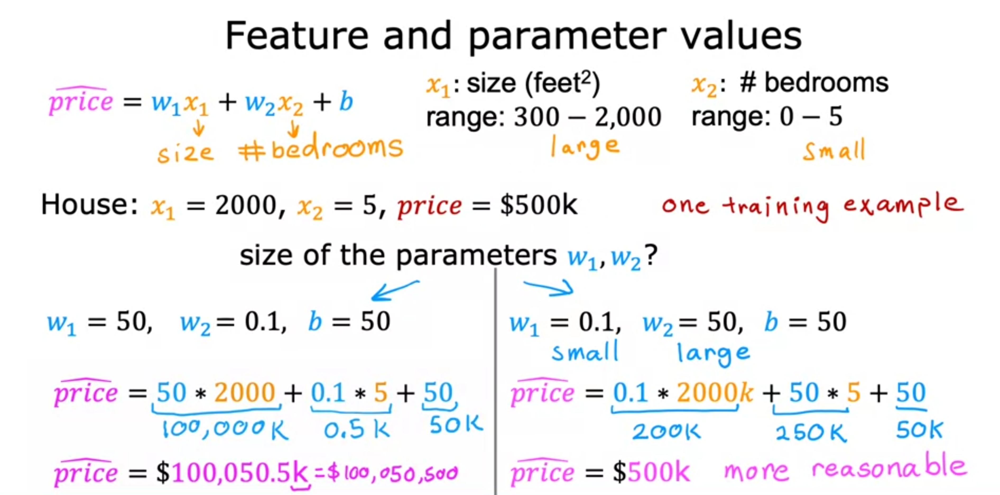

The housing example is a good example because the values are very different. Obviously, the number of bedrooms is a lot smaller than the square footage. Because of this, if we make a scatter plot, all data points will appear to be in the same small region if we just use the values. Likewise, our contour plot is going to appear in an oval shape which conceptually makes it very difficult and time consuming for gradient descent to try to find the local minimum.

If we rescale the square footage and bedroom to **both** be a number between 0 and 1, the scatter plot looks a lot more spread out and with it the contour plot of the cost function appears more circular. Conceptually, this means that gradient descent will now have an easier time finding the minimum in fewer iterations.

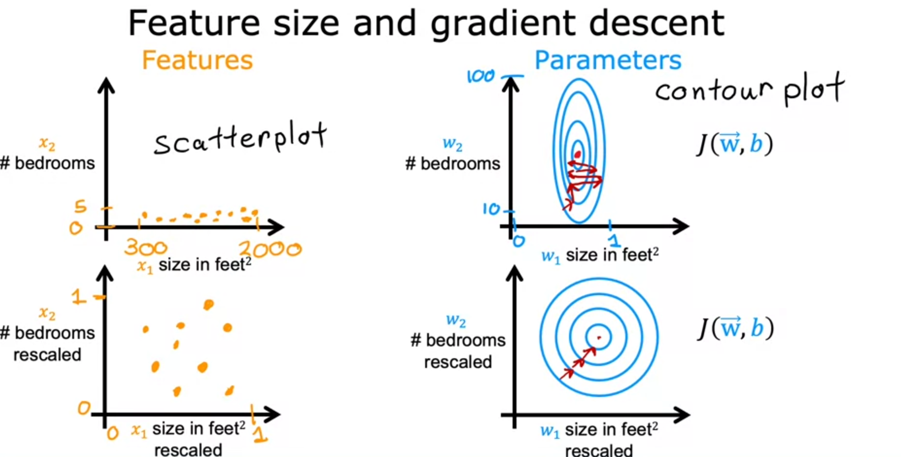

There are a couple of different methods to implement feature scaling

## Basic Scaling

The simplist method is to just divide everything by the max value for that feature. In this way we will end up with a number between 0 and 1 for everything.

### $x_n = \frac{x_n}{max_n}$ where max is the max value of the feature

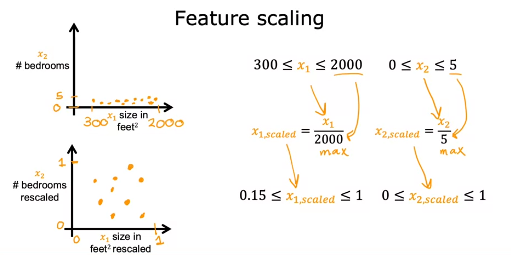

## Mean Normalization

**Mean Normalization** is where we find the mean of the data for that specific feature which we denote as $\mu$. We will then use the following equation for each feature. This may give us a scale with negative numbers.

### $x_n = \frac{x_n-\mu_n}{max_n-min_n}$ where the max and min are the max and min for the feature, x is the feature parameter and $\mu$ is the mean of the feature in the training set

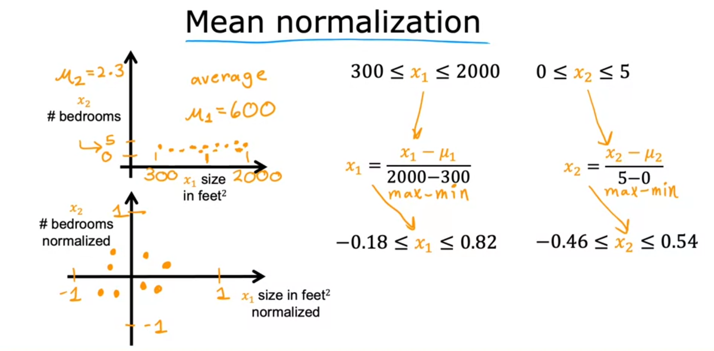

## Z-Score Normalization

**Z-Score Normalization** involves finding the standard deviation $\sigma$ as well as the mean to get these scores.

### $x_n = \frac{x_n - \mu_n}{\sigma_n}$ where $\mu$ is the mean for that feature and $\sigma$ is the standard deviation for that figure

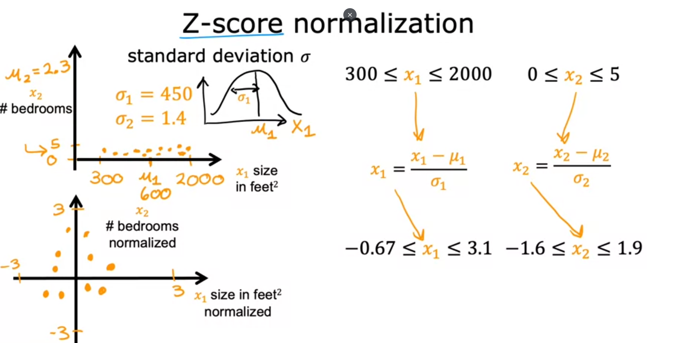

## When to scale

The general rule for feature rescaling is that ideally we want the value for the feature to be between -1 and 1. This is just a loose rule of thumb so it doesn't need to be done. It depends on the training data that you're using. Values between -3 and 3 are ok so you don't really need to rescale but if the values range from -100 to 100 (or are too small with -.00001 to .00001) then rescaling would be a good idea.

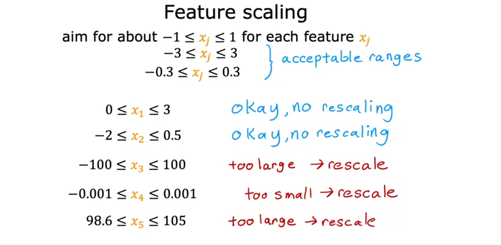

Another note is that there's no harm in rescaling no matter what you're data is. It's just not always necessary.

# Learning Curve

It's important to take note of the cost function so that you can tell if the function is decreasing with each gradient descent iteration. Ideally, it should be decreasing and never increasing. If it ever increases, this indicates a poorly chose learning rate or a bug in the code. It usually helps to plot the value of the cost function against the number of iterations so that you can visually see how the cost function is changing in iteration. This type of curve is a **learning curve**. You will also notice factors like the cost function may be converging at fewer iterations, so you will not need as many.

A test that is often used is an **automatic convergence test** where we chose a test value $\epsilon$ and then we can write a test after so many iterations to tell if the difference in the cost function is less than $\epsilon$. The idea is that if the difference is less than $\epsilon$ then the values have likely converged and we can stop iterations.

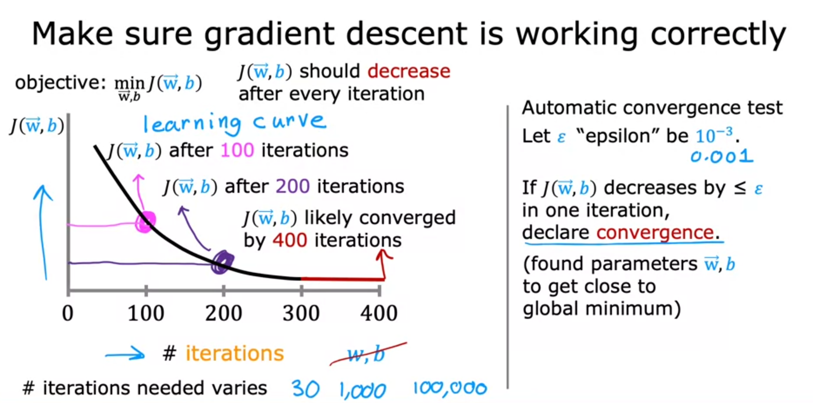

# Choosing a learning rate

Remember that we don't want to pick too large of a rate becuase gradient descent may bounce back and forth and overshoot but choosing too small of a value may mean that the value never converges. This choice of a rate will seem arbitrary.

You can keep an eye on the learning curve to ensure that the value is going in the correct direction and at an appropriate rate.

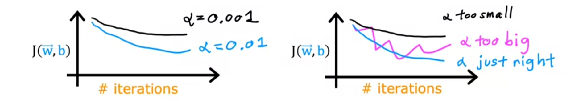

# Feature Engineering

**Feature Engineering** is creating new features, often by combining or transforming existing features to input into a model and is based on having insights into the application. For example, when calculating the price of a house, we could have two features, the width and the depth. With feature engineering, we could create a new feature, area, which we know to be the width multiplied by the depth. The reason we do this is because it will improve the accuracy of our model.

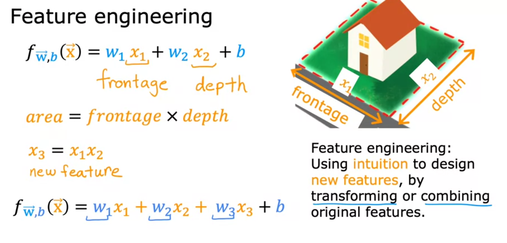

## Polynomial Regression

Thus far, we've discussed linear regression which is using a straight line to fit the dataset but depending on the data, a nonlinear equation like a quadratic, cubic, or square root curve may fit the data better. This is known as **polynomial regression** and refers to using nonlinear functions to fit the data.

The use case for polynomial regression is that sometimes, as in the case of housing prices, not everything tends to scale linearly. For example, features like square footage only scale so much.

One important note with polynomial regression is that feature scaling becomes more important than it has been previously. This is because, for example, if you're engineering a feature like $x^2$ then it will naturely have a very different scale than $x$. If $x$ was 1000-10000 then $x^2$ would be 1,000,000 - 100,000,000.

Just as numpy is a popular library for scientific computation for linear regression, scikit-learn is a popular library for nonlinear regression.

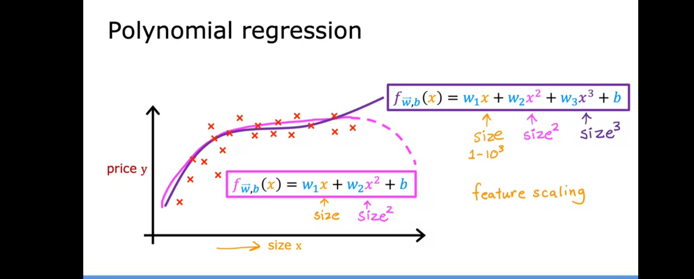

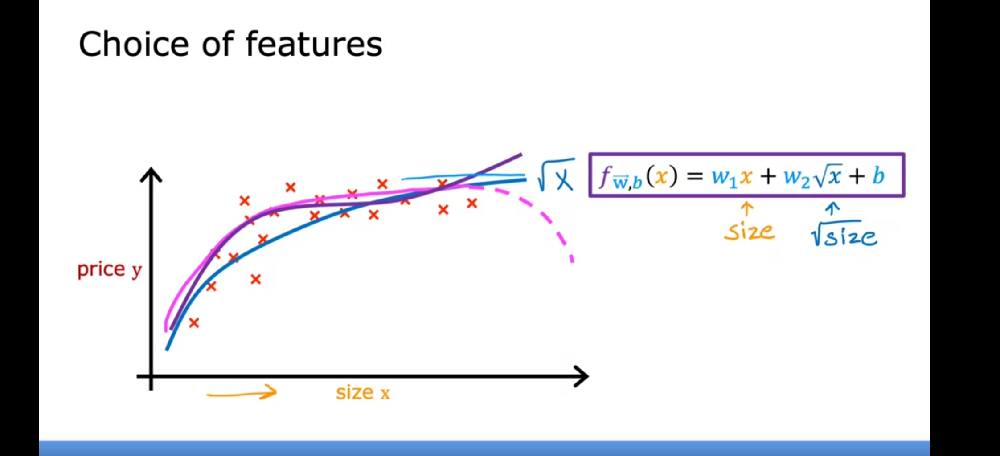

Numpy has a special method shorthand used to add a second dimension to arrays by using a **transformation** matrix. Take the following code:

```python
import numpy as np
# create target data
x = np.arange(0, 20, 1)
y = x**2

# engineer features .
X = np.c_[x, x**2, x**3]   #<-- added engineered feature
print(X)
```

The result of printing x is the following

```
[[   0    0    0]
 [   1    1    1]
 [   2    4    8]
 [   3    9   27]
 [   4   16   64]
 [   5   25  125]
 [   6   36  216]
 [   7   49  343]
 [   8   64  512]
 [   9   81  729]
 [  10  100 1000]
 [  11  121 1331]
 [  12  144 1728]
 [  13  169 2197]
 [  14  196 2744]
 [  15  225 3375]
 [  16  256 4096]
 [  17  289 4913]
 [  18  324 5832]
 [  19  361 6859]]
```

This method is useful in polynomial regression where we want to quickly engineer the features to follow more non-lineararity.

# Classification 

The type of classification algorithm where there are only two possible answers, no or yes or false/true, is called **binary classification** such as is this tumor malignant. For classification, linear regression is a historically bad algorithm because linear regression is all about finding a best fit line so if we end up adding more training examples, this will shift the best fit line so that the **descion boundary**, the point where we decide the classification, will be shifted with the additional example and no longer be suitable.

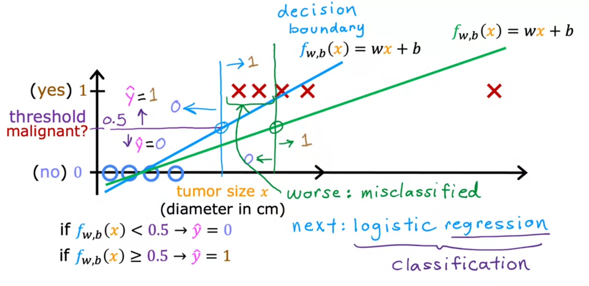

The following screenshot also shows linear regression not being the best fit for categorical data because it would lead to tumors over a certain size still being classified as malignant even though they are benign.

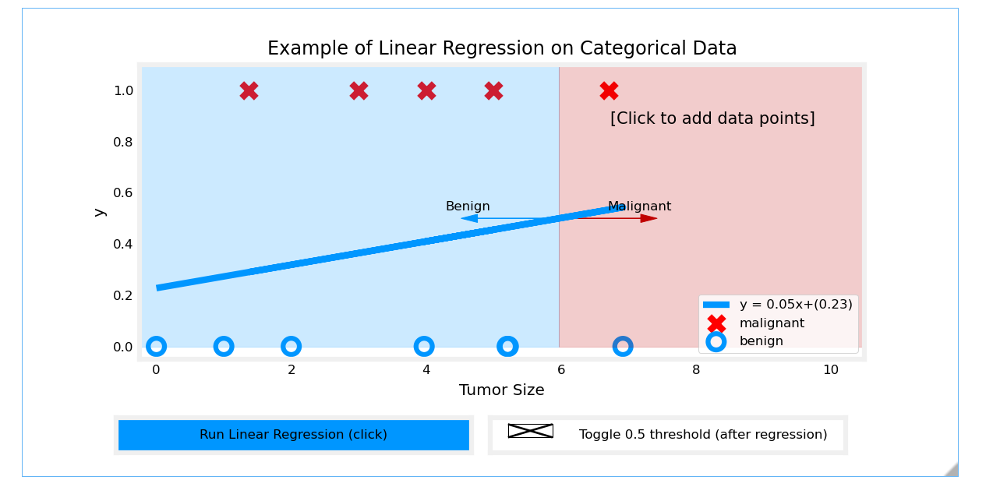

Though linear regression can sometimes classify the data well, it's not a good idea to rely on this

## Logistic Regression

A key function that we want to take advantage of in **logistic regression** is the **sigmoid function** which is defined mathematically as the following:

## $g(z) = \frac{1}{1+e^{-z}} where 0 < g(z) <1$

The nature of this function is that is z is very large(z=100), the function value will very close to 1 because the denominator will be very small + 1. Conversely, if z is very small (z=-100), then the deominator will be very large and the function value will be very close to zero. If z=0, then the demonator will be 2 and the function result will $0.5$ which is where it crosses the y axis. This gives the function the distinct S curve.

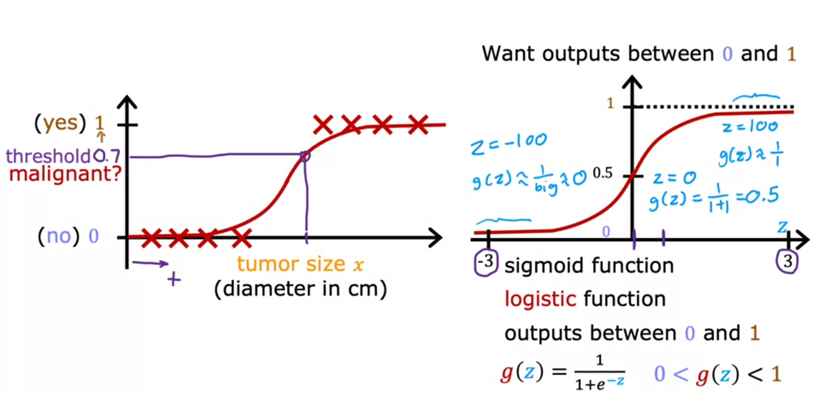

So to derive our equation for the logistic regression model, we will use the vectorized linear regression that we had before as our z value

## $z=\vec{w} \cdot \vec{x} + b$

so

## $f_{\vec{w},b}(\vec{x}) = g(\vec{w} \cdot \vec{x} + b) = \frac{1}{1+e^{-(\vec{w} \cdot \vec{x} + b)}}$

Given z, this will output a number between 0 and 1. Because of this, you can apply **conditional probability** to get

## $f_{\vec{w},b}(\vec{x}) = P(y=1|\vec{x};\vec{w},b)$

The above probability equation is saying conditional probability that the output (or target) 
y equals 1, given the input vector x and the parameters 𝑤 and b. The semicolon in the notation indicates that 𝑤 and b are the parameters of the model.

However, the probability notation is more mathematical and not shown as much in machine learning.

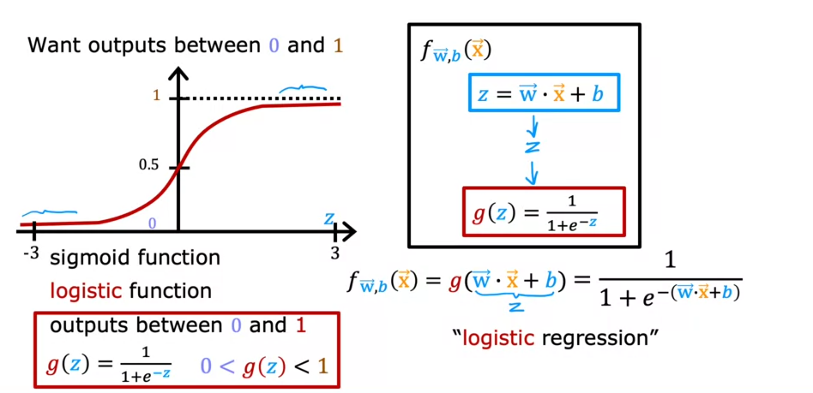

## Implement sigmoid in code

Numpy has a handy function that will return $e$ raised to some value called `exp()`

```python
import numpy as np
# Input is an array. 
input_array = np.array([1,2,3])
exp_array = np.exp(input_array)

print("Input to exp:", input_array)
print("Output of exp:", exp_array)

# Input is a single number
input_val = 1  
exp_val = np.exp(input_val)

print("Input to exp:", input_val)
print("Output of exp:", exp_val)
```

```
Input to exp: [1 2 3]
Output of exp: [ 2.72  7.39 20.09]
Input to exp: 1
Output of exp: 2.718281828459045
```

Knowing this, we can create a sigmoid function in code very easily and use matplotlib to plot it

```python
import numpy as np
import matplotlib.pyplot as plt
def sigmoid(z):
    """
    Compute the sigmoid of z

    Args:
        z (ndarray): A scalar, numpy array of any size.

    Returns:
        g (ndarray): sigmoid(z), with the same shape as z
         
    """

    g = 1/(1+np.exp(-z))
   
    return g

# Generate an array of evenly spaced values between -10 and 10
z_tmp = np.arange(-10,11)

# Use the function implemented above to get the sigmoid values
y = sigmoid(z_tmp)

# Code for pretty printing the two arrays next to each other
np.set_printoptions(precision=3) 
print("Input (z), Output (sigmoid(z))")
print(np.c_[z_tmp, y])

# Plot z vs sigmoid(z)
# subplot is used to create a grid of 1 row and 1 column of plots: 1 plot
# subplots(2,2) would create 4 total plots
fig,ax = plt.subplots(1,1,figsize=(5,3))
ax.plot(z_tmp, y, c="b")

ax.set_title("Sigmoid function")
ax.set_ylabel('sigmoid(z)')
ax.set_xlabel('z')
draw_vthresh(ax,0)

```

```
Input (z), Output (sigmoid(z))
[[-1.000e+01  4.540e-05]
 [-9.000e+00  1.234e-04]
 [-8.000e+00  3.354e-04]
 [-7.000e+00  9.111e-04]
 [-6.000e+00  2.473e-03]
 [-5.000e+00  6.693e-03]
 [-4.000e+00  1.799e-02]
 [-3.000e+00  4.743e-02]
 [-2.000e+00  1.192e-01]
 [-1.000e+00  2.689e-01]
 [ 0.000e+00  5.000e-01]
 [ 1.000e+00  7.311e-01]
 [ 2.000e+00  8.808e-01]
 [ 3.000e+00  9.526e-01]
 [ 4.000e+00  9.820e-01]
 [ 5.000e+00  9.933e-01]
 [ 6.000e+00  9.975e-01]
 [ 7.000e+00  9.991e-01]
 [ 8.000e+00  9.997e-01]
 [ 9.000e+00  9.999e-01]
 [ 1.000e+01  1.000e+00]]
```

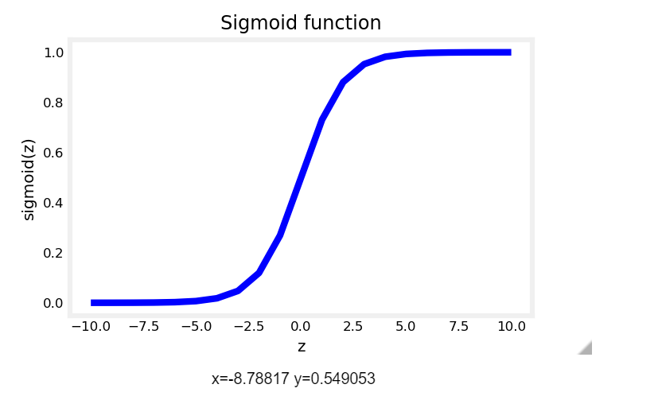

So if we apply the sigmoid function to the example of benign and malignant that we saw before, we see that it will fit the data better

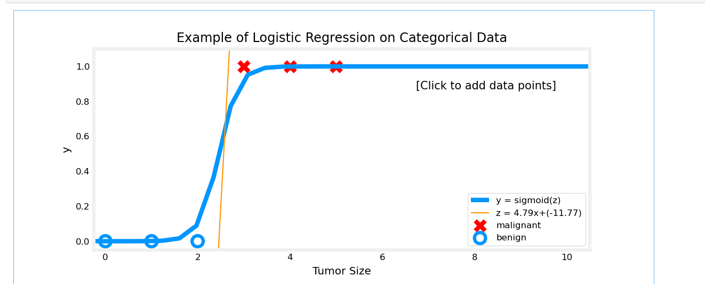

## Descion Boundary

In logistic regression, the **decision boundary** is determined by the linear equation:

## $\vec{w} \cdot \vec{x} + b = 0$

Therefore, the rules become

## if $\vec{w} \cdot \vec{x} + b >= 0$ then the model predicts y=1

## if $\vec{w} \cdot \vec{x} + b < 0$ then the model predicts y=0

The above equations imply that there is a heavy dependency on b

## if $\vec{w} \cdot \vec{x}  >= -b$ then the model predicts y=1

## if $\vec{w} \cdot \vec{x}  < -b$ then the model predicts y=0

if we take the example where our linear regression model is simply $0=-3+x_0+x_1$ then it's clear to see that $x_1=3-x_0$. If we want to plot the desicion boundary for this

```python
import numpy as np
import matplotlib.pyplot as plt
# Choose values between 0 and 6
x0 = np.arange(0,6)

x1 = 3 - x0
fig,ax = plt.subplots(1,1,figsize=(5,4))
# Plot the decision boundary
ax.plot(x0,x1, c="b")
ax.axis([0, 4, 0, 3.5])

# Fill the region below the line
ax.fill_between(x0,x1, alpha=0.2)

# Plot the original data
plot_data(X,y,ax)
ax.set_ylabel(r'$x_1$')
ax.set_xlabel(r'$x_0$')
plt.show()
```

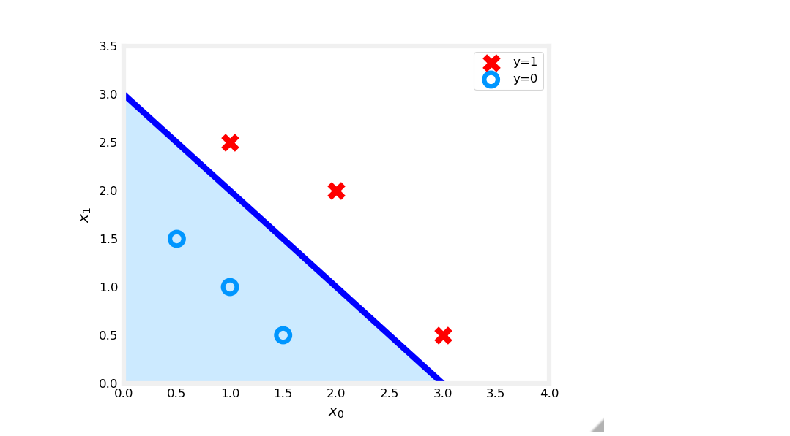

Notice that the axes used here are the feature variables, which is why 3 is shown as a slope.

## Cost (Loss) function for logistic regression

Recall that for linear regression, we were able to use the **Squared Error Cost** function. This was because in linear regression, ploting the squared error cost would reveal a convex function which made it trivial for gradient descent to find the local minimum because it was a good estimate of the global minimum. The problem with applying the Squared Error Cost to logistic regression is that we end up with a non convex function which may have several local minumum which are not the global minumum as shown in the figure below.

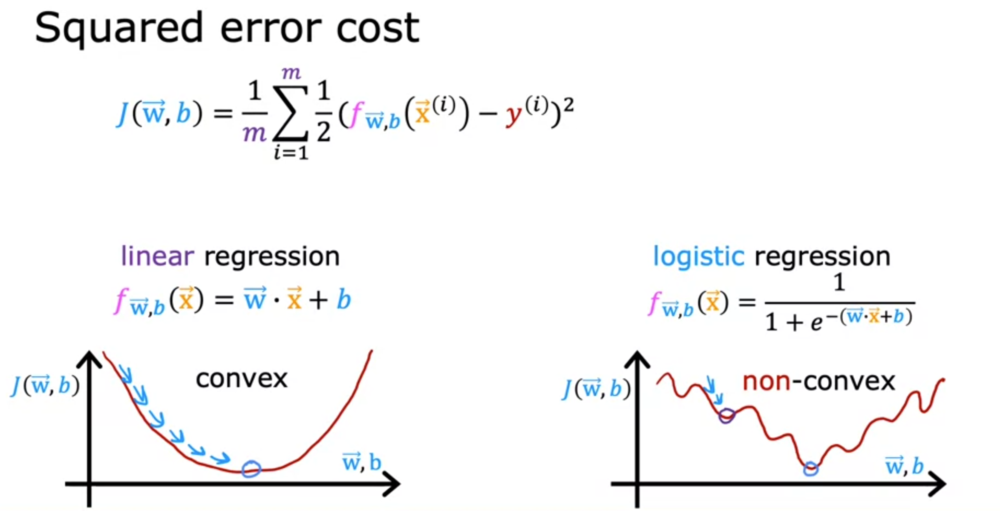

Instead, the cost function for logistic regression will use logarithmic functions. We denote the loss function as L so $L(f_{\vec{w},b}(\vec{x}), y^{(i)})$

## For y=1, $L(f_{\vec{w},b}(\vec{x}), y^{(i)}) = -\log{(f_{\vec{w},b}(\vec{x}))}$ 

## For y=0, $L(f_{\vec{w},b}(\vec{x}), y^{(i)}) = -\log{(1-f_{\vec{w},b}(\vec{x}))}$ 

These two cases are derived from the following

## $L(f_{\vec{w},b}(\vec{x}), y^{(i)}) = (-y^{(i)}\log{(f_{\vec{w},b}(\vec{x}))}) -(1-y^{(i)})\log{(1-f_{\vec{w},b}(\vec{x}^{(i)}))}$ 

but you can see that in the case where y=0, the right side of the equation cancels and in the case of y=1, the left.

The reason that we choose this particular function for loss derives from a statistical principle known as **maximum liklihood**

The reasoning behind this is that the nature of the graphs for f between 0 and 1. In the case of y=1, the Loss is lowest when $f_{\vec{w},b}(\vec{x})$ predict close to the true label $y^{(i)}$. In the case of $y=0$, the further the prediction $f_{\vec{w},b}(\vec{x})$ is from the tarrget $y^{(i)}$, the higher the loss. 

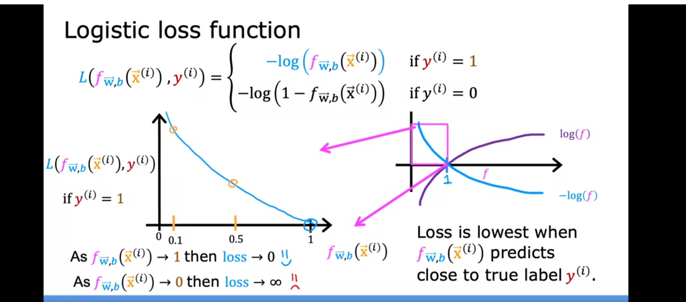

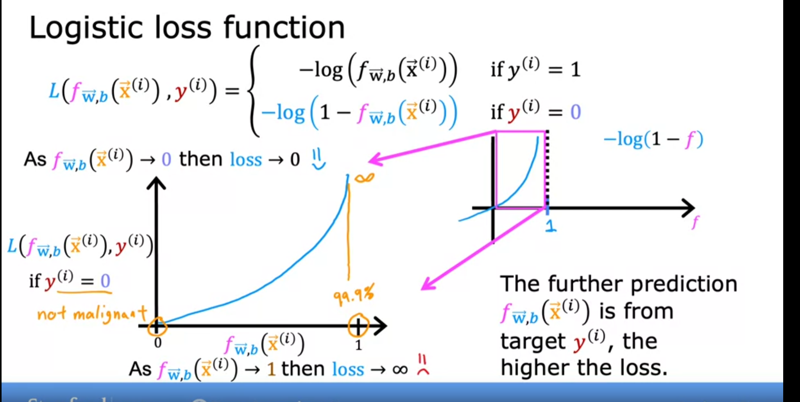

By using these logarithmic functions, we can help ensure that we get a convex function when appying this to the sigmoid function. 

In the graphs, notice that for y=1 (the positive case) and y=0 (the negative case), loss increase towards $\infty $ as the prediction differs from the target.

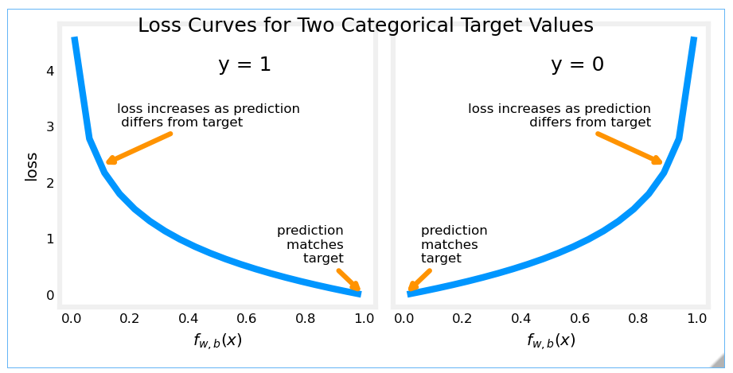

In the following three dimensional plots, you can see that plotting the logarithmic cost function suits gradient descent a lot better with finding a global minimum.

## Logistic Regression cost function in code

In the following code, X is a matrix of shape (m,n) while y is a maxtrix of shape m. For computing the logistic cost function, we take the sigmoid of the dot product of the x index with the intial w and added bias b. We then plug that sigmoid into the logistic cost function and take the summation to get the overall logistic cost and divide by m, the number of training examples.

```python
import numpy as np
import matplotlib.pyplot as plt

def sigmoid(z):
    """
    Compute the sigmoid of z

    Parameters
    ----------
    z : array_like
        A scalar or numpy array of any size.

    Returns
    -------
     g : array_like
         sigmoid(z)
    """
    z = np.clip( z, -500, 500 )           # protect against overflow
    g = 1.0/(1.0+np.exp(-z))

    return g

def compute_cost_logistic(X, y, w, b):
    """
    Computes cost

    Args:
      X (ndarray (m,n)): Data, m examples with n features
      y (ndarray (m,)) : target values
      w (ndarray (n,)) : model parameters  
      b (scalar)       : model parameter
      
    Returns:
      cost (scalar): cost
    """

    m = X.shape[0]
    cost = 0.0
    for i in range(m):
        z_i = np.dot(X[i],w) + b
        f_wb_i = sigmoid(z_i)
        cost +=  -y[i]*np.log(f_wb_i) - (1-y[i])*np.log(1-f_wb_i)
             
    cost = cost / m
    return cost

X_train = np.array([[0.5, 1.5], [1,1], [1.5, 0.5], [3, 0.5], [2, 2], [1, 2.5]])  #(m,n)
y_train = np.array([0, 0, 0, 1, 1, 1])

w_array1 = np.array([1,1])
b_1 = -3
w_array2 = np.array([1,1])
b_2 = -4

print("Cost for b = -3 : ", compute_cost_logistic(X_train, y_train, w_array1, b_1))
print("Cost for b = -4 : ", compute_cost_logistic(X_train, y_train, w_array2, b_2))
```

This gives the following output

```
Cost for b = -3 :  0.36686678640551745
Cost for b = -4 :  0.5036808636748461
```

So we can conclude that for our training set, the bias factor of -4 performs worse as the vaule for the cost function is higher.

## Gradient Descent for logistic regression

The functions for these are almost identical in the gradient descent functions for linear regression except that we are using j as a subscript to denote the feature. Also, keep in mind that the definitions of $(f_{w,b}(x^{(i)})$ is now different

## $w_j = w_j - \alpha \frac{1}{m}\sum_{i=1}^{m} (f_{w,b}(x^{(i)}) - y^{(i)})(x_j^{(i)})$

## $b = b - \alpha \frac{1}{m}\sum_{i=1}^{m} (f_{w,b}(x^{(i)}) - y^{(i)})$

It's the same concept other than that. We are using simultaneous updates each pass of these functions and our goal to have gradient descent converge to a global minimum.

Logistic Regression Cost Function in code

In the following code, we are

* calculating the error $g(\vec{w} \cdot \vec{x}^{(i)}+b)-\vec{y}^{(i)}$ for all values training example
* for each feature, multiplying the error for the index by the value of x at that feature and adding it to the gradient for w
* the calculation for the gradient for the bias term is the same as it was in linear regression as we're just adding the error term
* divide both gradients by the number of traing examples
* Finally, with the gradient descent function, we'll be multiplying the gradients by the learning rates to make updates

```python
import copy, math
import numpy as np

def sigmoid(z):
    """
    Compute the sigmoid of z

    Parameters
    ----------
    z : array_like
        A scalar or numpy array of any size.

    Returns
    -------
     g : array_like
         sigmoid(z)
    """
    z = np.clip( z, -500, 500 )           # protect against overflow
    g = 1.0/(1.0+np.exp(-z))

    return g

def compute_gradient_logistic(X, y, w, b): 
    """
    Computes the gradient for logistic regression 
 
    Args:
      X (ndarray (m,n): Data, m examples with n features
      y (ndarray (m,)): target values
      w (ndarray (n,)): model parameters  
      b (scalar)      : model parameter
    Returns
      dj_dw (ndarray (n,)): The gradient of the cost w.r.t. the parameters w. 
      dj_db (scalar)      : The gradient of the cost w.r.t. the parameter b. 
    """
    m,n = X.shape
    dj_dw = np.zeros((n,))                           #(n,)
    dj_db = 0.

    for i in range(m):
        f_wb_i = sigmoid(np.dot(X[i],w) + b)          #(n,)(n,)=scalar
        err_i  = f_wb_i  - y[i]                       #scalar
        for j in range(n):
            dj_dw[j] = dj_dw[j] + err_i * X[i,j]      #scalar
        dj_db = dj_db + err_i
    dj_dw = dj_dw/m                                   #(n,)
    dj_db = dj_db/m                                   #scalar
        
    return dj_db, dj_dw  

def gradient_descent(X, y, w_in, b_in, alpha, num_iters): 
    """
    Performs batch gradient descent
    
    Args:
      X (ndarray (m,n)   : Data, m examples with n features
      y (ndarray (m,))   : target values
      w_in (ndarray (n,)): Initial values of model parameters  
      b_in (scalar)      : Initial values of model parameter
      alpha (float)      : Learning rate
      num_iters (scalar) : number of iterations to run gradient descent
      
    Returns:
      w (ndarray (n,))   : Updated values of parameters
      b (scalar)         : Updated value of parameter 
    """
    # An array to store cost J and w's at each iteration primarily for graphing later
    J_history = []
    w = copy.deepcopy(w_in)  #avoid modifying global w within function
    b = b_in
    
    for i in range(num_iters):
        # Calculate the gradient and update the parameters
        dj_db, dj_dw = compute_gradient_logistic(X, y, w, b)   

        # Update Parameters using w, b, alpha and gradient
        w = w - alpha * dj_dw               
        b = b - alpha * dj_db               
      
        # Save cost J at each iteration
        if i<100000:      # prevent resource exhaustion 
            J_history.append( compute_cost_logistic(X, y, w, b) )

        # Print cost every at intervals 10 times or as many iterations if < 10
        if i% math.ceil(num_iters / 10) == 0:
            print(f"Iteration {i:4d}: Cost {J_history[-1]}   ")
        
    return w, b, J_history         #return final w,b and J history for graphing
```

Now let's use the following code to run gradient descent to train our data and find the best weights and bias term.

```python
w_tmp  = np.zeros_like(X_train[0])
b_tmp  = 0.
alph = 0.9
iters = 10000

w_out, b_out, _ = gradient_descent(X_train, y_train, w_tmp, b_tmp, alph, iters) 
print(f"\nupdated parameters: w:{w_out}, b:{b_out}")
```

```
Iteration    0: Cost 0.6509898706978229   
Iteration 1000: Cost 0.01898509708803807   
Iteration 2000: Cost 0.009462945855308616   
Iteration 3000: Cost 0.006299017770009604   
Iteration 4000: Cost 0.004720359852320092   
Iteration 5000: Cost 0.003774414835001944   
Iteration 6000: Cost 0.0031443437189356085   
Iteration 7000: Cost 0.0026945747305561125   
Iteration 8000: Cost 0.0023574030434657897   
Iteration 9000: Cost 0.0020952495092537446   

updated parameters: w:[8.21 8.01], b:-22.305241709195236
```

### Scikit-learn

Scikit-learn is a popular library for train models which takes away several layers of abstraction. For example, let's implement this on our data from before:

```python
import numpy as np
from sklearn.linear_model import LogisticRegression

X = np.array([[0.5, 1.5], [1,1], [1.5, 0.5], [3, 0.5], [2, 2], [1, 2.5]])
y = np.array([0, 0, 0, 1, 1, 1])

lr_model = LogisticRegression()
lr_model.fit(X, y)

y_pred = lr_model.predict(X)

print("Prediction on training set:", y_pred)
```

As you can see below, the predictions are our already trained data is 100% accurate

```
Prediction on training set: [0 0 0 1 1 1]
```

Scikit-learn actually has a scoring method to rate accuracy of predictions

```python
print("Accuracy on training set:", lr_model.score(X, y))
```

We can now now change the prediction param to predict a new set

```python
y_pred = lr_model.predict([[1.3, 1.6]])

print("Prediction on training set:", y_pred)
```

```
Prediction on training set: [0]
```