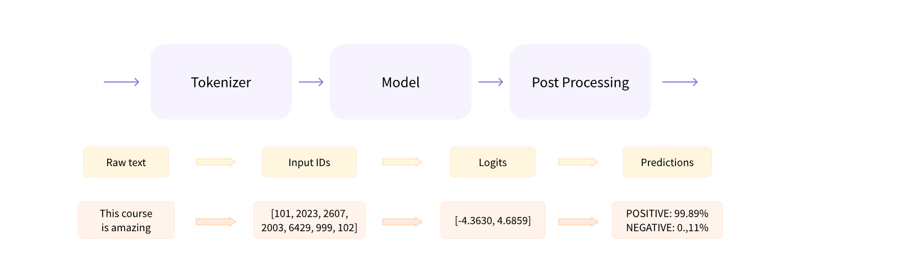
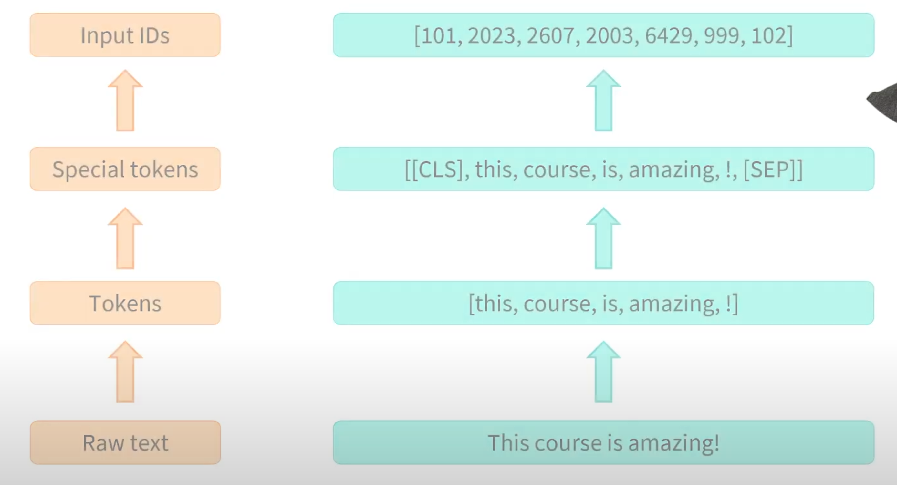
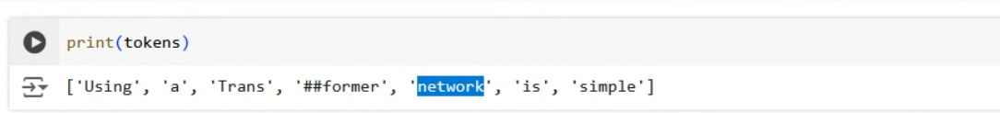
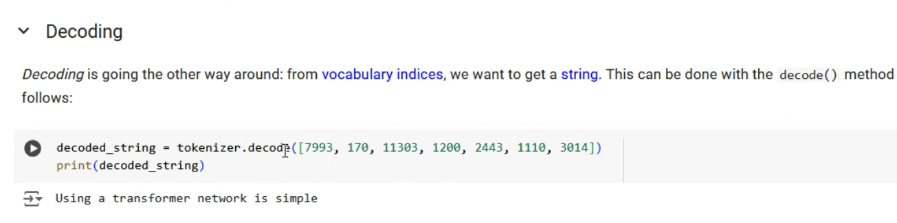

# Behind the pipeline

Let's dive into sentiment analysis



1. The words are converted to tokens where we add special hidden tokens to denote the begining and end of the sentence. 

2. Once these special tokens are added, we now convert to a tensor or a list of numbers. These are  maps from a token to an ID so in the figure below, this maps to 2023. Every model will have a different mapping but these may be based on something like scraping a dictionary in alphabetical order to get this mapping



In the following, notice that because we've passed a second sentence, we pad the second sentence so that they are the same length. The attention mask can keep track of the padding so that the transformer knows not to pay attention to those.


3. The model will convert to **logits** which is the model's raw unnormalized score before an activation function like softmax is applied. Notice in the earlier screenshot that the length of logits is only 2 because for sentiment analysis, this is typically a binary classification task where the text is either positive or negative.

3. Now we're into decode step and the model is ready to make a prediction classification as to whether the input has a positive or negative connotation. A **softmax function** is used to give the probability of these logits between 0 and 1 and the **argmax function** will choose the correct value. 

Encoder-Decoder models can also be called **Sequence to sequence models**

HuggingFace is more of a library whereas people are making and submitting pretrained models. When people download them. We're the ones that are fine tuning the models

You can think of it like you going through college to get a job as pretraining. A job will normally fine tune you for three monthes or so.

Sometimes tokenization is used to decompose rare words into smaller subwords. If tokenization does break into subwords, it'll normally put a special character like a # to denote this.



Finally, you can reverse the process to decode the tensor into the words



# Models

In Huggingface, there are both model classes and config classes

```python
from transformers import BertConfig, BertModel

# Building the config
config = BertConfig()

# Building the model from the config
model = BertModel(config)

print(config)
```

```python
BertConfig {
  [...]
  "hidden_size": 768,
  "intermediate_size": 3072,
  "max_position_embeddings": 512,
  "num_attention_heads": 12,
  "num_hidden_layers": 12,
  [...]
}
```

The model in it's current state needs to be trained and while we can do this from scratch, it's better to use the `from_pretrained()` method.

```python
from transformers import BertModel

model = BertModel.from_pretrained("bert-base-cased")
```

In the example, the model already has the weights from [bert-base-cased pretraining](https://huggingface.co/google-bert/bert-base-cased). This pretraining was done for sentiment analysis tasks.

Your `model` object can now be used directly to make inferences or it can be further fine-tuned for a new task. You'll notice that this call will create a cache of the pretrained weights in you `~/.cache/huggingface/transformers` folder so that they don't need to be redownloaded.

If you do fine-tune the model and then want to save your own training you can use

```python
model.save_pretrained("directory_on_my_computer")
```

This will save a `config.json` and `pytorch_model.bin` files

# Handling Multiple Sequences

## Models expect a batch

In the following code, print the input ids will fail because it is just one sentence

```python
import torch
from transformers import AutoTokenizer, AutoModelForSequenceClassification

checkpoint = "distilbert-base-uncased-finetuned-sst-2-english"
tokenizer = AutoTokenizer.from_pretrained(checkpoint)
model = AutoModelForSequenceClassification.from_pretrained(checkpoint)

sequence = "I've been waiting for a HuggingFace course my whole life."

tokens = tokenizer.tokenize(sequence)
ids = tokenizer.convert_tokens_to_ids(tokens)
input_ids = torch.tensor(ids)
# This line will fail.
model(input_ids)
```

The transformer architecture expects multiple sentences to be sent as a **batch**. What we can do is to add a dimension to the input ids

```python
input_ids = torch.tensor([ids])
```

Now if we reprint the output, we'll get

```
Input IDs: [[ 1045,  1005,  2310,  2042,  3403,  2005,  1037, 17662, 12172,  2607, 2026,  2878,  2166,  1012]]
Logits: [[-2.7276,  2.8789]]
```

## Padding the inputs and Attention Masks

This part was taken from the youtube video.

If we have two sentences of different sizes that we are setting up for sentiment analysis, pytorch will expect the tokenized vectors to be of the same length. So if we tokenize the following two sentences by only using a mapping to convert the characters, we'll end up with two tensors of different lengths. 

```python
from transformers import AutoTokenizer

checkpoint = "distilbert-base-uncased-finetuned-sst-2-english"
tokenizer = AutoTokenizer.from_pretrained(checkpoint)
sentences = [
    "I've been waiting for a HuggingFace course my whole life.",
    "I hate this.",
]
tokens = [tokenizer.tokenize(sentence) for sentence in sentences]
ids = [tokenizer.convert_tokens_to_ids(token) for token in tokens]
print(ids[0])
print(ids[1])
```

```
[1045, 1005, 2310, 2042, 3403, 2005, 1037, 17662, 12172, 2607, 2026, 2878, 2166, 1012]
[1045, 5223, 2023, 1012]
```

As said previously, pytorch is going to run into an issue with this 

```python
import torch

ids = [[1045, 1005, 2310, 2042, 3403, 2005, 1037, 17662, 12172, 2607, 2026, 2878, 2166, 1012],
       [1045, 5223, 2023, 1012]]

input_ids = torch.tensor(ids)
```

```
ValueError: expected sequence of length 14 at dim 1 (got 4)
```

So most of the time, we want to pad the shorter sentence with 0s to match the length of the first sentence. There is another method which you can truncate the longer sentence but this is typically only used if the model can't handle the length because there is a risk of losing information. This limit of tokens for the model is typically up to either 512 or 1024 tokens.

There are some specialized models designed to handle this problem specifically like [Longformer](https://huggingface.co/docs/transformers/model_doc/longformer)

```python
import torch

ids = [[1045, 1005, 2310, 2042, 3403, 2005, 1037, 17662, 12172, 2607, 2026, 2878, 2166, 1012],
       [1045, 5223, 2023, 1012,    0,    0,    0,     0,     0,    0,    0,    0,    0,    0]]

input_ids = torch.tensor(ids)
```

HuggingFace has a method to handle this called `pad_token_id`

```python
from transformers import AutoTokenizer

tokenizer = AutoTokenizer.from_pretrained(checkpoint)
tokenizer.pad_token_id
```

What's interesting to notice is that if we try to print the logits predictions on these sentences individually, we notice that the padded tensor has different logits than when that sentence is run individually.

```
tensor([[-2.7276,  2.8789]], grad_fn=<AddmmBackward>)
tensor([[ 3.9497, -3.1357]], grad_fn=<AddmmBackward>)
tensor([[-2.7276,  2.8789],
        [ 1.5444, -1.3998]], grad_fn=<AddmmBackward>)
```

This is because we haven't passed an **attention mask** which can be use to tell the transformer specifically to not pay attention to those padded entries

```python
all_ids = torch.tensor(
    [[1045, 1005, 2310, 2042, 3403, 2005, 1037, 17662, 12172, 2607, 2026, 2878, 2166, 1012],
     [1045, 5223, 2023, 1012,    0,    0,    0,     0,     0,    0,    0,    0,    0,    0]]
)

attention_mask = torch.tensor(
    [[1, 1, 1, 1, 1, 1, 1, 1, 1, 1, 1, 1, 1, 1],
     [1, 1, 1, 1, 0, 0, 0, 0, 0, 0, 0, 0, 0, 0]]
)
```

Now we can pass the attention mask as another parameter

```python
model = AutoModelForSequenceClassification.from_pretrained(checkpoint)
output1 = model(ids1)
output2 = model(ids2)
print(output1.logits)
print(output2.logits)

# Output:
tensor([[-2.7276,  2.8789]], grad_fn=<AddmmBackward>)
tensor([[ 3.9497, -3.1357]], grad_fn=<AddmmBackward>)

output = model(all_ids, attention_mask=attention_mask)
print(output.logits)
```

The logits here now match what we got earlier when we passed in the sentences individually.

```
tensor([[-2.7276,  2.8789],
        [ 3.9497, -3.1357]], grad_fn=<AddmmBackward>)
```

While it's important to know how this works behind the scenes, you can pass this to the tokenizer with a flag for padding and it will handle this automatically. We can print the tokenizer just to see this

```python
{
    'input_ids': 
    [[101, 1045, 1005, 2310, 2042, 3403, 2005, 1037, 17662, 12172, 2607, 2026, 2878, 2166, 1012, 102],
     [101, 1045, 5223, 2023, 1012, 102,    0,    0,     0,     0,    0,    0,    0,    0,    0,   0]],
    'attention_mask': 
    [[ 1,    1,    1,    1,    1,    1,    1,    1,     1,     1,    1,    1,    1,    1,    1,   1],
     [ 1,    1,    1,    1,    1,    1,    0,    0,     0,     0,    0,    0,    0,    0,    0,   0]]
}
```