# NLP

Some common NLP tasks would be

* Classifying whole sentences
    * determining if a sentence is gramatically correct
    * performing sentiment analysis on a whole sentence
* Classifying each word in a sentence
    * Identify named entities (nouns)
* Generating text content
    * Completing a prompt with auto generated text by filling in the blanks in a text with masked words
* Extracting an answer from a text
    * Given both a question and a context, extract the answer to the question based on the context
* Generating a new sentence from an input text
    * translating
    * summerizing

NLP can also apply to speech recognition and computer vision

Zero shot classifiers refers to classifications that don't require fine tuning the model. **Fine tuning** a model refers to the fact that the model is almost what you need and you just need to train it specifally on your data rather than traing from scratch.

Text-Generation tasks involve randomness which is why on LLMs, you usually do not see the same text genrated for the same prompt

Here's some sample code to run a text generation transformer

```python
import torch
from transformers import pipeline

device = 0 if torch.cuda.is_available() else -1
generator = pipeline("text-generation", model="distilgpt2", device=device)
result = generator(
    "How do you solve a problem like Maria",
    max_length=30,
    num_return_sequences=2,
)
print(result)
```

Here's some code to use an unmasker to fill in blanks

```python
import torch
from transformers import pipeline

device = 0 if torch.cuda.is_available() else -1
unmasker = pipeline("fill-mask", device=device)
result = unmasker("This course will teach you all about <mask> models.", top_k=2)
print(result)
```

**Names entity recognition (NER)** is the ability for the model to be able to recognize persons and places within text

```python
import torch
from transformers import pipeline

device = 0 if torch.cuda.is_available() else -1
ner = pipeline("ner", grouped_entities=True, device=device)
result = ner("My name is Sylvain and I work at Hugging Face in Brooklyn.")
print(result)
```

```
[{'entity_group': 'PER', 'score': 0.9981694, 'word': 'Sylvain', 'start': 11, 'end': 18}, {'entity_group': 'ORG', 'score': 0.97960186, 'word': 'Hugging Face', 'start': 33, 'end': 45}, {'entity_group': 'LOC', 'score': 0.9932106, 'word': 'Brooklyn', 'start': 49, 'end': 57}]
```

What's really interesting is that you can create a summary

```python
import torch
from transformers import pipeline

device = 0 if torch.cuda.is_available() else -1
summarizer = pipeline("summarization", device=device)
result = summarizer(
    """
    America has changed dramatically during recent years. Not only has the number of 
    graduates in traditional engineering disciplines such as mechanical, civil, 
    electrical, chemical, and aeronautical engineering declined, but in most of 
    the premier American universities engineering curricula now concentrate on 
    and encourage largely the study of engineering science. As a result, there 
    are declining offerings in engineering subjects dealing with infrastructure, 
    the environment, and related issues, and greater concentration on high 
    technology subjects, largely supporting increasingly complex scientific 
    developments. While the latter is important, it should not be at the expense 
    of more traditional engineering.

    Rapidly developing economies such as China and India, as well as other 
    industrial countries in Europe and Asia, continue to encourage and advance 
    the teaching of engineering. Both China and India, respectively, graduate 
    six and eight times as many traditional engineers as does the United States. 
    Other industrial countries at minimum maintain their output, while America 
    suffers an increasingly serious decline in the number of engineering graduates 
    and a lack of well-educated engineers.
"""
)
print(result)
```

```
[{'summary_text': ' America has changed dramatically during recent years . The number of engineering graduates in the U.S. has declined in traditional engineering disciplines such as mechanical, civil,    electrical, chemical, and aeronautical engineering . Rapidly developing economies such as China and India continue to encourage and advance the teaching of engineering .'}]
```

The following is a timeline of what the research has produced

June 2018: GPT, the first pretrained Transformer model, used for fine-tuning on various NLP tasks and obtained state-of-the-art results

October 2018: BERT, another large pretrained model, this one designed to produce better summaries of sentences (more on this in the next chapter!)

February 2019: GPT-2, an improved (and bigger) version of GPT that was not immediately publicly released due to ethical concerns

October 2019: DistilBERT, a distilled version of BERT that is 60% faster, 40% lighter in memory, and still retains 97% of BERT’s performance

October 2019: BART and T5, two large pretrained models using the same architecture as the original Transformer model (the first to do so)

May 2020, GPT-3, an even bigger version of GPT-2 that is able to perform well on a variety of tasks without the need for fine-tuning (called zero-shot learning)


An example of a task using predictive text is **casual language modeling** where the the output depends on past and present inputs to put together the words sequentially.

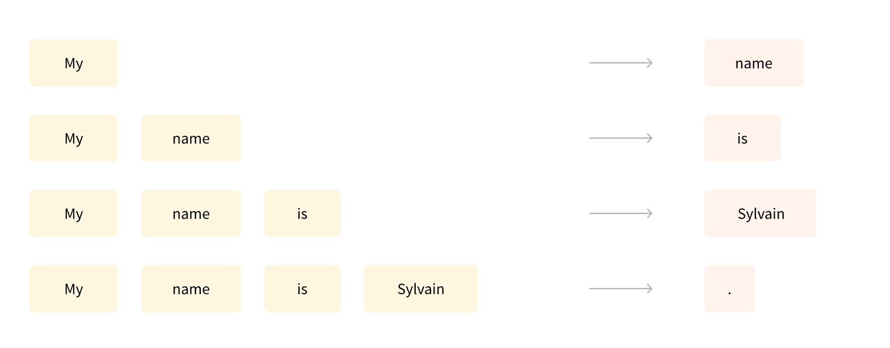

Another example is **masked language modeling** in which the model predicts a masked word in the sentence.

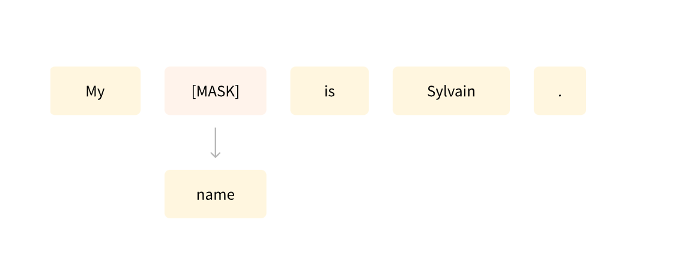

It's important when doing these big data analyses to start with small experiments and debugging that before moving on.

**hyperparameters** refer to parameters that you set before a learning process begins as oposed to model parameters which are learned from data during training. 

NLP is usually **self supervised** which means that no human interaction is necessary for the label annotations. The difference between self supervised and unsupervised is that self supervised models create pseudo labels from the raw data that it learns to solve.

**Pretraining** refers to training the model from scratch on a very large corpus of text.

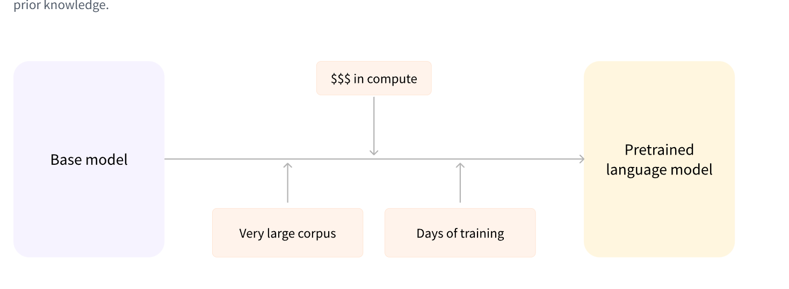

after the pretraining, we can now perform the fine tuning training. This only requires a limited amount of data because the knowledge from the pre-training is transfered hence the term **transfer learning**. 

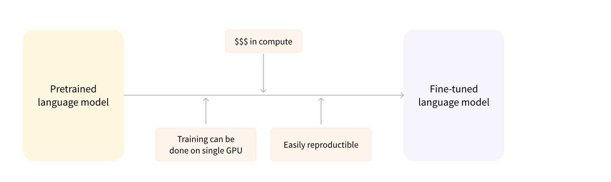

# Encoders and decoders

**Encoder-only models**: Good for tasks that require understanding of the input, such as sentence classification and named entity recognition.

**Decoder-only** models: Good for generative tasks such as text generation.

**Encoder-decoder** models or sequence-to-sequence models: Good for generative tasks that require an input, such as translation or summarization.

**Attention Layers** are used to pay attention to certain words for translation or summerization tasks.

## Encoder

Each word is converted to its own vector

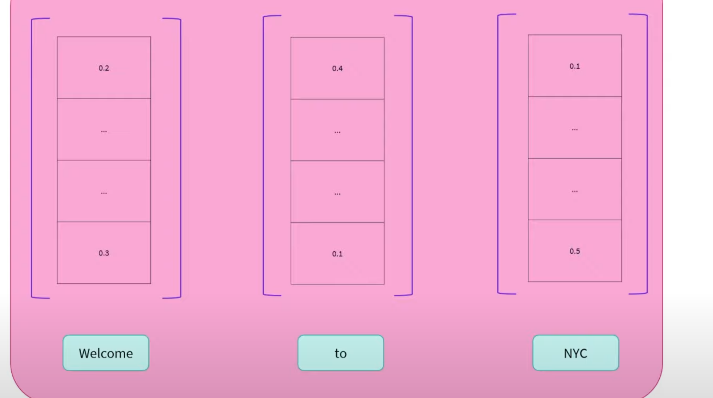

The reason each word is a vector rather than a scaler is because the other components of the vector refer to the context, that is, the words surrounding it.

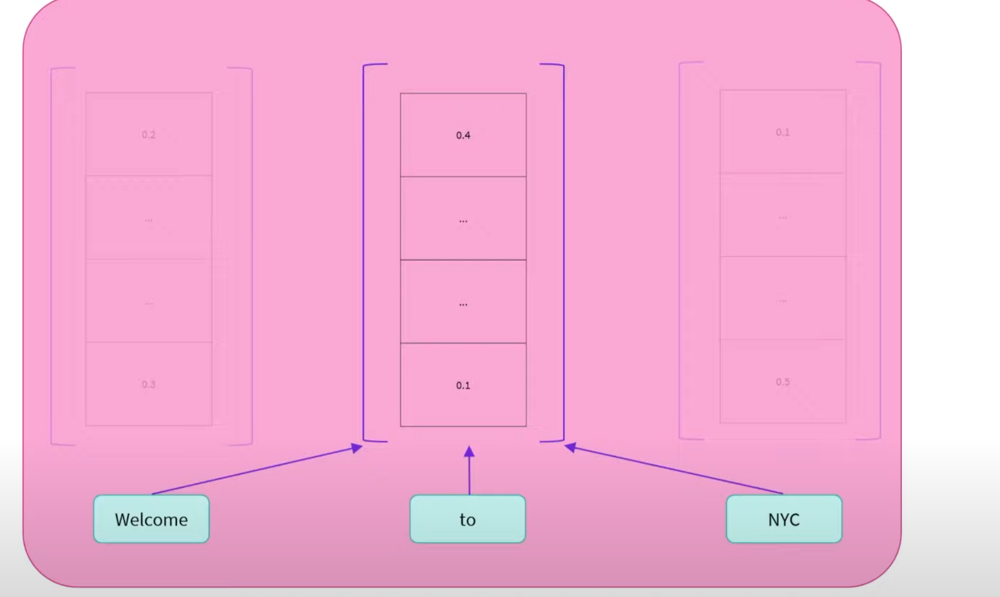

The ideas is the future neurons in a neural network will use the encoded vectors of the words to make sense of them.

Encoders are very good for finding masked words in a sentence since they can carry context. Also due to the context, it is very good with sentiment analysis.

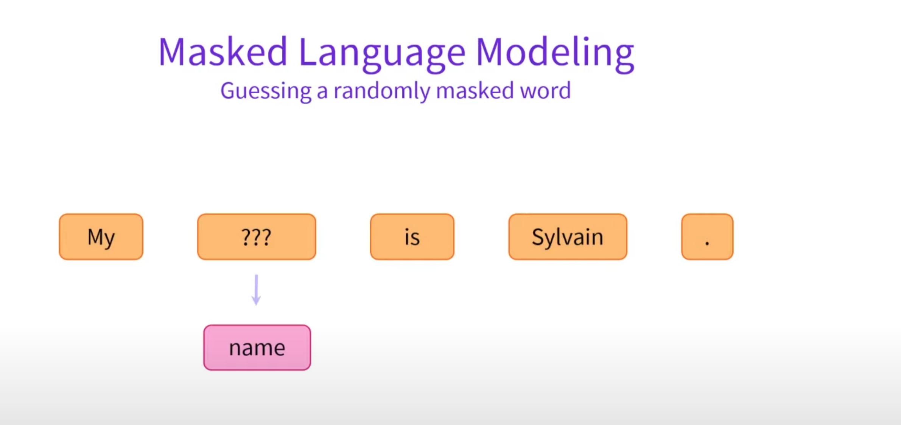

In the example above, there is little chance that the encoder would've succeeded if the word Slyvain wasn't present as that adds a heavy weigt to the context vector

## Decoders

Decoders are similar to encoders as a vector will be made for each but it's unidirectional meaning that is only has context from one direction.

For this reason, decoders are well suited for tasks like text generation where we don't need it to be bidirectly

## Encoder-decoder

This models will take the output from the encoder and feed that as the input to the decoder. That along with a start of sequence words will empower the model to guess at the word. Now that we have the output from the encoder, we don't need it anymore for the decoder to guess future words.

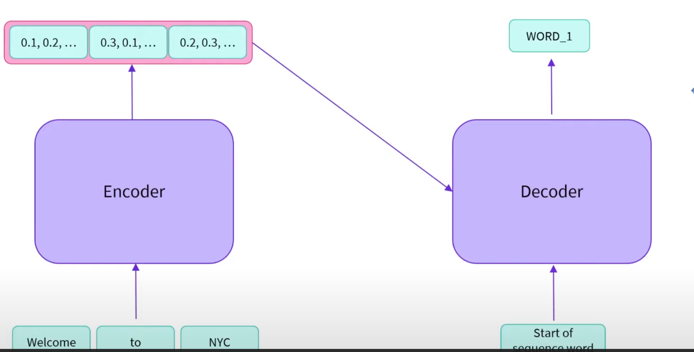

An example would be translation from English to french. The encoder can give us the vectorized version of the english sentence while the decoder will take that representation along with the start of the sequence word "Welcome" to guess at the french words. At this point, we don't need the encoder anymore and can just focus on the words that we're feeding to the decoder, the next words "to" and "NYC"

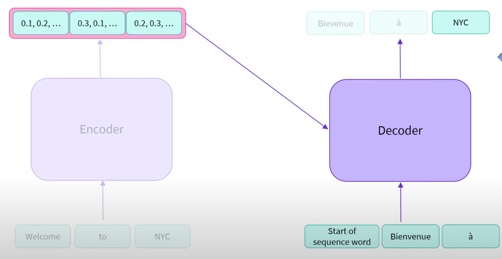

The advantage of this type of **sequence to sequence** model is in things like summerization where the encoder can handle the vector for the source text, while the decoder can focus on generating the shorter summerization.

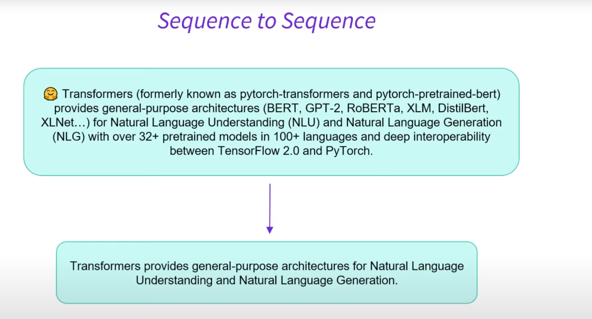

# Behind the pipeline

Let's dive into sentiment analysis

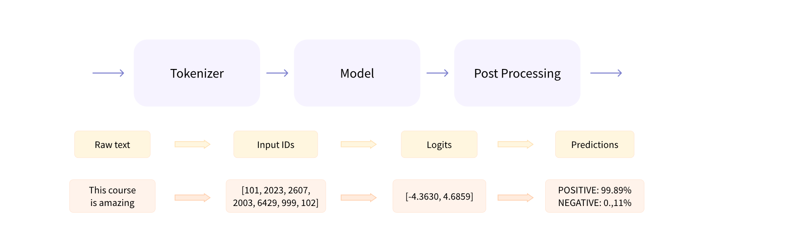

1. The words are converted to tokens where we add special hidden tokens to denote the begining and end of the sentence. Once these special tokens are added, we now convert to a tensor or a list of numbers. These are from maps from a token to an ID so like I will map to 1045. Every model will have a different mapping. During this, we often have a pretrained lexicon analysis.


In the following, notice that because we've passed a second sentence, we pad the second one so that they are the same length. The attention mask can keep track of the padding so that the transformer knows not to pay attention to those.

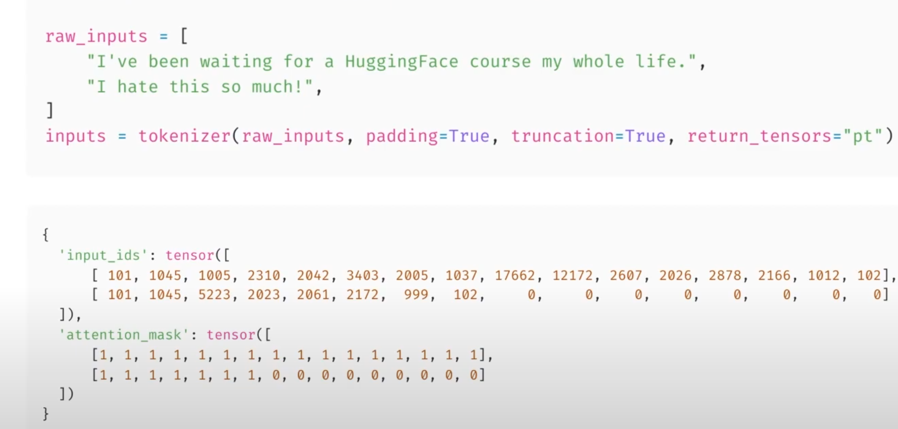

2. The model will convert to **logits** which is a high order tensor of the input representing a few attributes such as batch size (the number of items in the array) , sentence length which is the number of IDs mapped from the tokens, and hidden size which is the number of factors that the model uses to relate to other tokens. Notice that these are not probabilities yet as they do not sum to 1.  768 is common for a hidden size for a smaller model and 3072 is common for a large model.

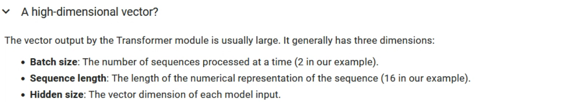

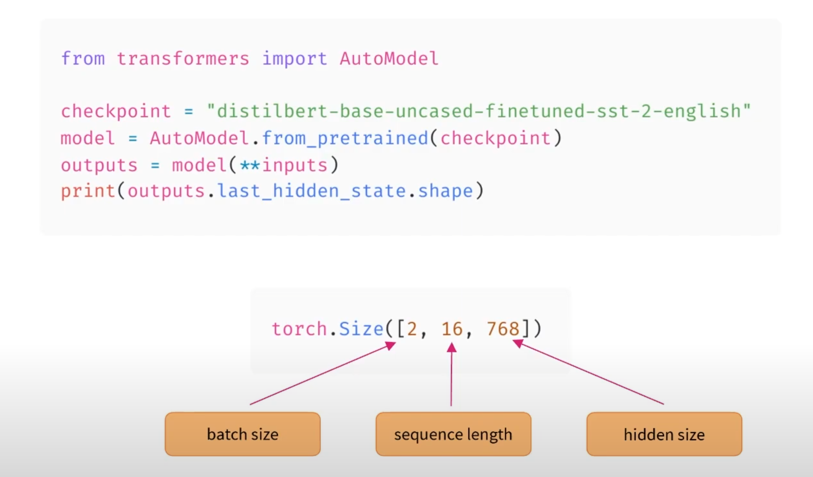

3. Now we're into decode step and the model is ready to make a prediction classification as to whether the input has a positive or negative connotation. A **softmax function** is used to give the probability of these logits between 0 and 1 and the **argmax function** will choose the correct value. 

Encoder-Decoder models can also be called **Sequence to sequence models**

HuggingFace is more of a library whereas people are making and submitting pretrained models. When people download them. We're the ones that are fine tuning the models

You can think of it like you going through college to get a job as pretraining. A job will normally fine tune you for three monthes or so.

Sometimes tokenization is used to decompose rare words into smaller subwords. If tokenization does break into subwords, it'll normally put a special character like a # to denote this.

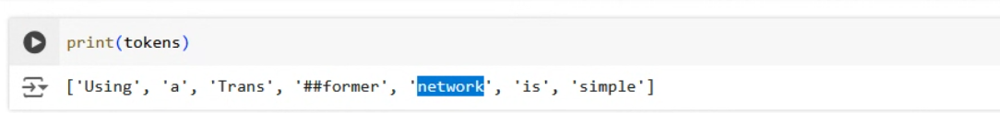

Finally, you can reverse the process to decode the tensor into the words

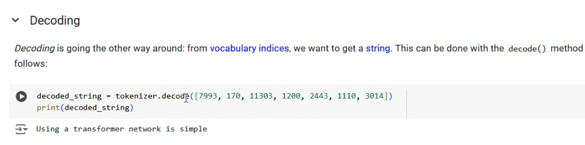