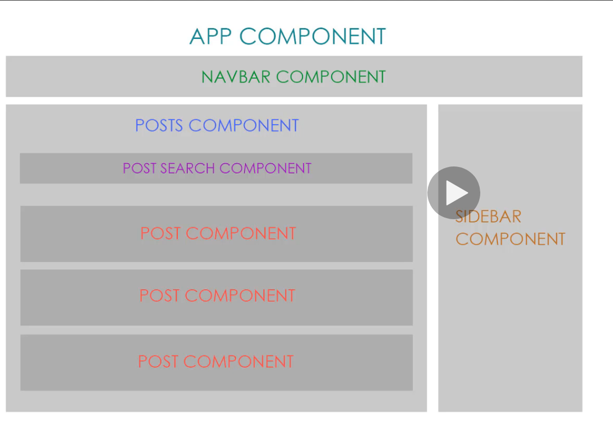

# What is Angular

* Frontend JS Framework
* Created and Maintained by Google
* Used to build powerful frontend applications
    * Through it is possible to run it on the server using something called universal, it's mostly client side
* Angular and AngularJS are not the same and has turned developers off
* Changes are planned for every six months
* There was no Angular 3
* AngularJS was released in 2010 and was meant to compete with backbone and angular
* Angular2 was released in 2015 and was a complete rewrite of Angular
    * Not much backward compatibilty
* Angular4 was released in 2017 and is backward compatible with Angular2


# Why use Angular

* Rapid development and code gen with the cli
* The code is very organized into components to help with productivity
* described as dynamic html because of things like switches and views
* designed to be cross platform so it can be view on different platforms
* a lot of core features such as routers are built into angular whereas react will force you to install it separately

# What's in the project

* The core package includes polyfills for older versions of ecmascript
* To include external js files that'll be inserted into your app, edit the scripts section of `angular.json`
    * For example, if you want to include bootstrap, it's a better idea to put it in `angular.json` rather than the index.html
* The `src/environments1` folder is where you'll want to story any env vars for production
* `app.module.ts`
    * The declarations array will hold all of the components that we create
        * The cli can handle a lot of this automatically
    * Any services that connect internally or externally will go in the providers array
* In vscode, you can actually hover over the array to see some short documentation

# typescript

* been in angular since angular2
* provides classes and static typing
    * the classes just compile to prototype type objects
* You can create a tuple
```ts
myTuple = [string, number, boolean]
```

# components

* apps are broken out into components
    * code organization
    * components can have properties and methods
    * components promote reusability



* @Component is a decorator that provides metadata about the component
    * the concept of decorator is part of typescript
```ts
@Component({
  selector: 'app-root',
  templateUrl: './app.component.html',
  styleUrls: ['./app.component.css']
})
```

# Properties and Methods

* Properties are like attribute of a component
* methods are just functions in a component
    * the constructor should be used only for dependancy Injection
    * ngOnInit is where we would put code that we want to be run at the beginning of a component lifecycle

* While using string interpolation, you can actually use a method call
```ts
Hello {{ showAge() }}
```

# Services

* Classes that can send functionality and data across multiple components
    * Helps to keep the code DRY
* need to import `@injectable` decorator
* all services will have the `providedIn: root` by default
    * You can remove the ` providedIn: root` and add it to a specific module by using the providers array of `@ngModule`
* Example of a simple service

```ts
import { Injectable } from '@angular/core';

@Injectable({
  providedIn: 'root'
})
export class Data.Service {

  getUsers(): User[]{
    return USERS;
  }
}

```

Now, inject this service into your constructor

```ts
import {DataService} from '../../services/data.service'
```

```ts
constructor(private data:DataService){

    }
```

We can now get the users like this:

```ts
ngOnInit(){
    this.users = this.data.getUsers()
}
```

* The above work with synchronis info that is hardcoded. HTTP modules are usually retrieved async so we need something that is constantly watching and updating our component. This is where observables come into the picture.

# Observables

**Observables** are like open data streams that we'll subscribe to.

# Output

Outputs are how we can get data from one component to another. We did this by instancing a new event emitter.

```ts
import { EventEmitter, Output } from '@angular/core';
```

```ts
@Output() newPost: EventEmitter<Post> = new EventEmitter();
```

If we have an observable that we're subscribing to, we can emit this new item with

```ts
this.postService.savePost({title, body} as Post).subscribe((post) => {
      this.newPost.emit(post)
    })
```

Now, on the selector for the component, we'll create an event like any other but use the property and attach this to a method that we'll create on the component where we include the selector.

```html
<app-post-form (newPost)="onNewPost($event)"></app-post-form>
```

On the component that is using the selector, you will create a method to accept that arguement 

```ts
onNewPost(post: Post){
    this.posts.unshift(post)
  }
```

# Router

Routerlink is used because it takes advantage of the SPA nature

