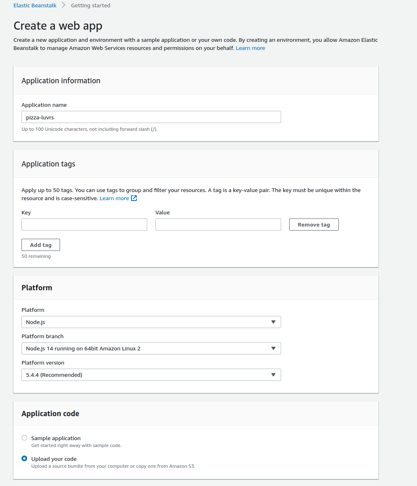
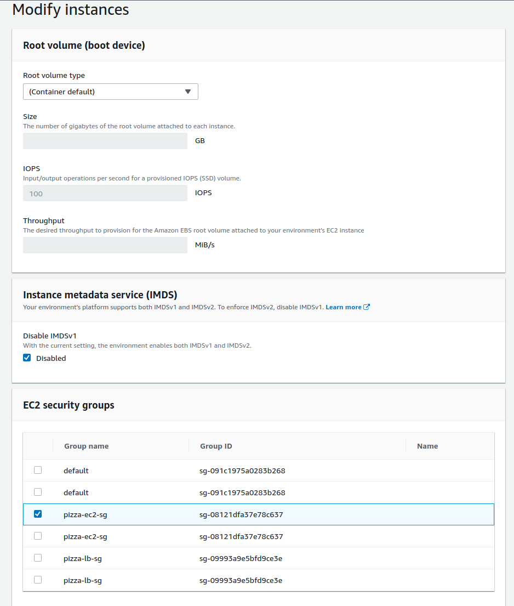

# CloudFormation

- CloudFormation Stacks are built using a CloudFormation Template which is just a JSON document
  - The resources hash defines the types that we're using in our stack
- The following is an infastructure stack
  
- CloudFormation can automatically update resources in a stack

1. On Cloudformation -> Create Stack
2. Click Upload a template (our example provided us with a template)
   
3. Cloudformation will automatically parse the template and prompt for the key parameters. In this case, we're asked for the image id (our ami) \* You can get the AMI ID from EC2 -> AMIs
   
4. Click the acknowledgement checkbox in the next screen and create the stack
   - The stack may take awhile to be created
   - On this main page, we're waiting for the main `pizza-stack` to be completed

CloudFormation will also creat its own load balancer

# Elastic Beanstalk

Beanstalk will allow you to maintain multiple environments of your app

1. In Elastic Beanstalk, select the "New Application" button and select the correct platform. In our example, we have code to upload
    \* Beanstalk expects a zip file so we'll zip it with `zip -r package.zip .`
2. Click Configure more options
3. We want to edit the network options, select the correct vpc, assign a public IP, and select both subnets
   
4. Within Instances, select your security group
   
5. Modify Security to use your EC2 Key Pair
   
6. Modify the capacity to switch to a load balancer environment
   
7. Edit the listening port to be 3000 (node) in the load balancer section
   
8. Click create app and you'll see what looks like a command prompt
   This whole process will also be creating a new entry in CloudFormation

In the IAM roles, you'll need to alsogrant rdsfullaccess dynamodbfullaccess and elasticbeanstalkwebtier policies

You'll also need to create a new inbound rule for your rds instance

Finally, restart your elastic beanstalk service

This can take a couple of minutes

The link up hear in elastic beanstalk will take u to your app

