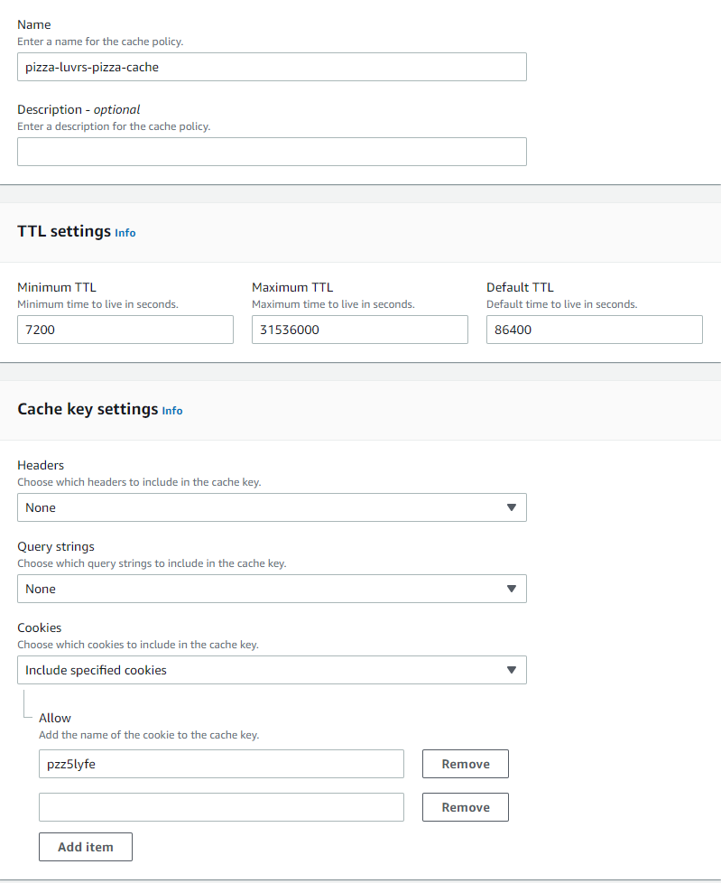
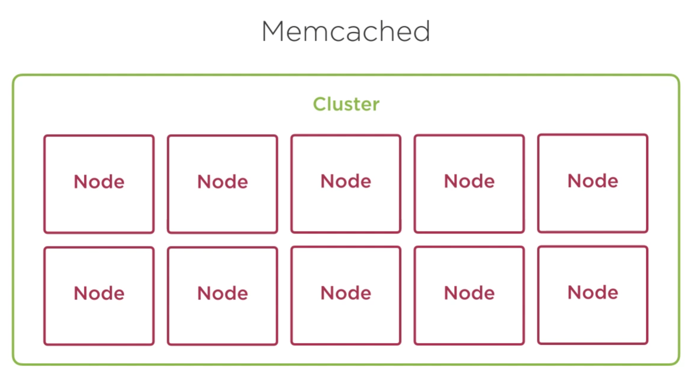
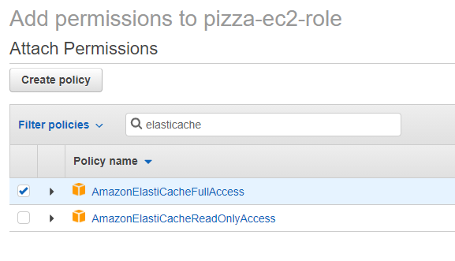

6. Create another new policy for your cache, set the TTL to 7200seconds, and include the cookie

# Elasticache

You can set an EC2 instance to use elasticache with Redis. 

1. You'll need to setup a policy to give access to elasticache 