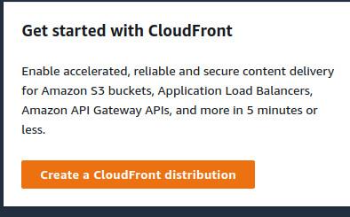
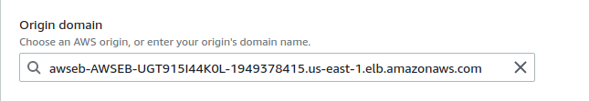
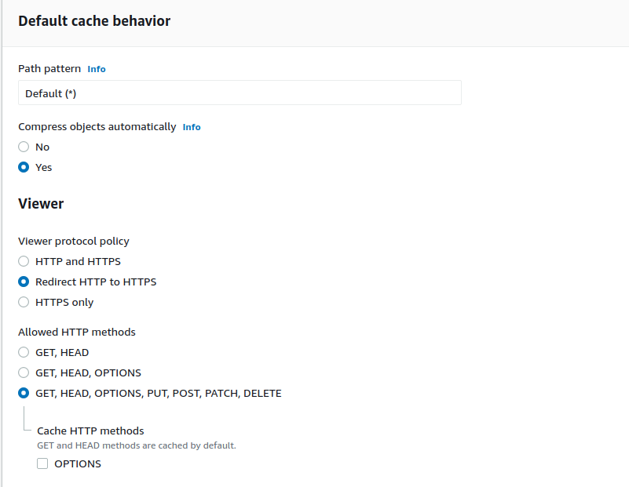
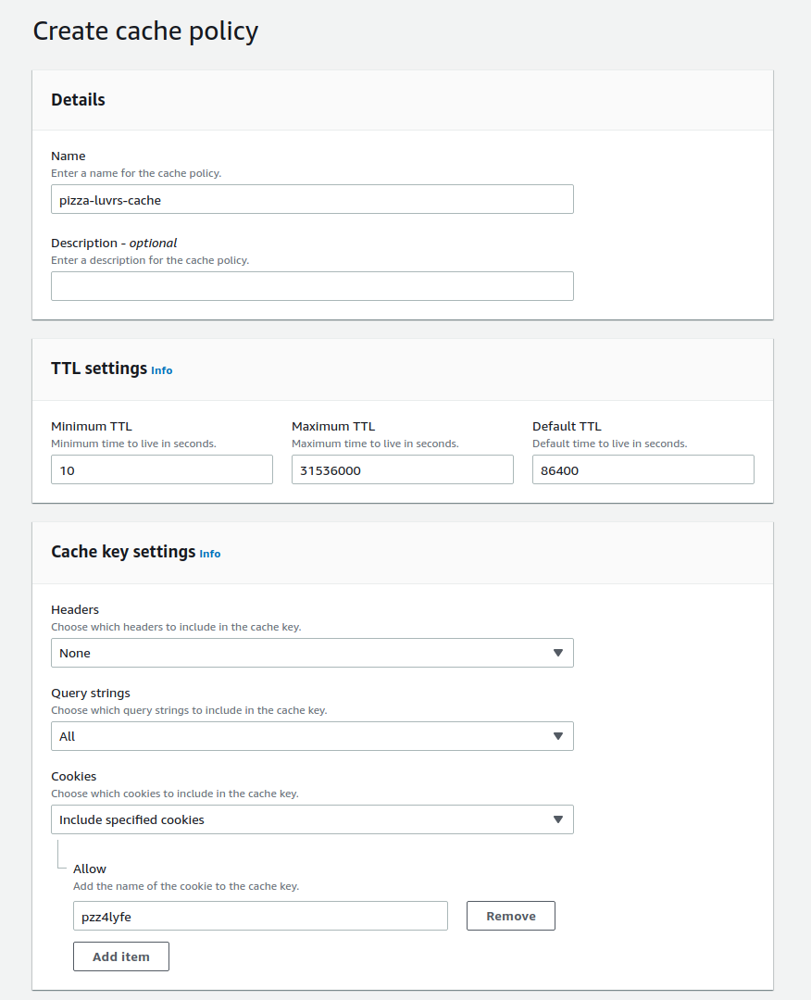
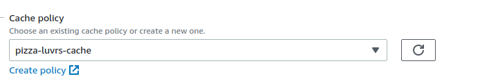
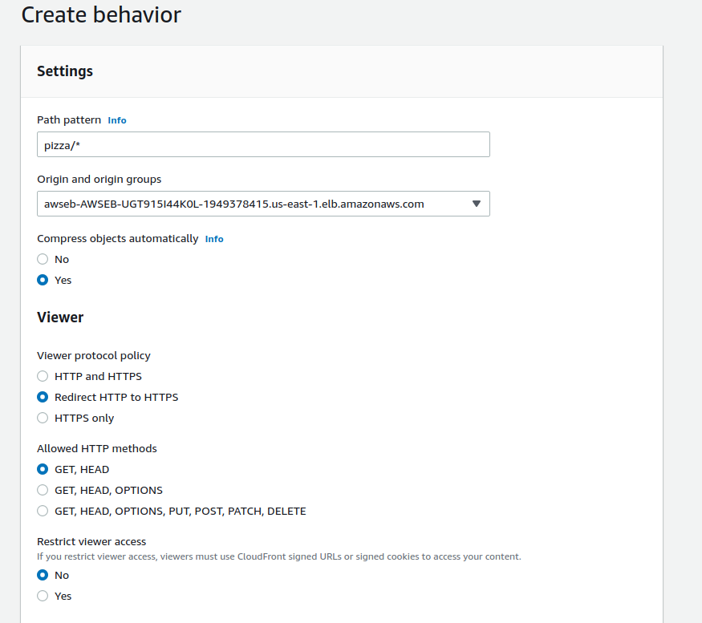

**CCloudFront** - Global CDN designed to reduce latency and reduce application load. 

Cloudfront works with your existing application so no code changes are required

1. On the cloudfront dashboard, click "create distribution" 
2. For load balencer, choose the load balencer with `AWSEB` in the title 
3. Redirect HTTP to HTTPS and allow all http methods 
4. Create a new cache policy. Set the TTL to 10 seconds and allow your application's cookies (pzz4lyfe in our example) and allow all query strings 
5. In the caching policy dropdown, be sure to refresh and select your custom Cache policy 
6. Once your distribution is created (this process should take around 10 minutes), Create a new behavior, redirect http to https, choose the load balancer, and only cache get requests 