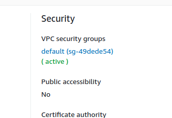

# Relational Databases

Amazon uses RDS (Relational database system) to manage relational databases

- RDS has several database options including Postgres, MSSQL, and Amazon Aurora

1. Create a database
2. Choose Postgres
3. In the connectivity section for VPC, make sure to put it into the subnet that you've setup
   
4. Once the db is created, edit the security group and add an inbound rule. When adding the inbound rule, you can select Postgres as the type and select `my ip` for the source.
   
   
5. You can now connect to this server using pgadmin
   - copy the endpoint of the database to use as the host
   - the username will still be postgres and the password will be whatever you set up

You can use sequalize to set up a postgres connection on node.js

# DynamoDB

DynamoDB is used for NOSQL databaases like MongoDB 

The **Provisioned Throughput Capacity** is an AWS term used to say how many read/write operations per second are permitted for your table

1. DynamoDB -> Create table
2. You'll be asked to give a table name and partition key. The partition key is sort of like the primary key.
   

# Deciding

NoSQL databases have great **Storage Flexibility** due to its JSON like nature while relational database have great **query flexibility** due its many constraints
