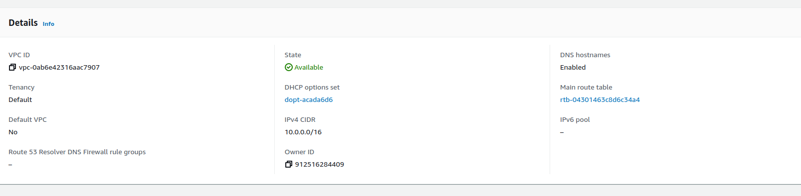
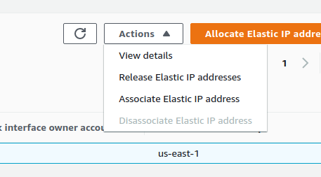
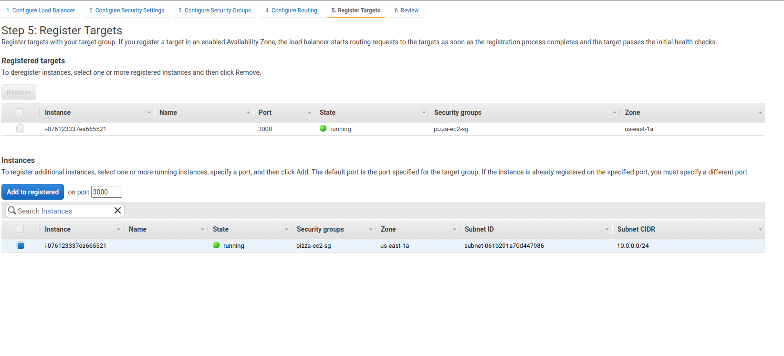

- vpc stands for virtual private cloud
- with a vpc, your resources get a private ip range 
- Throughout this course, the following screenshot shows the architecture that we'll be aiming for 
- Create a vpc. `/24` means that you'll get 10.-.0.1-10.0.0.255 
- Once you create a vpc, you'll need to add it to the routing table so that it has a connection outside. 
  - For our routing table, we need to add a route 
  - add a route for `0.0.0.0/0` (anywhere) and set the target as internet gateway (you should have only one option available with the prefix `igw`) 
- EC2 stands for elastic cloud compute
  - it's like a virtual machine in that you are dedicated your own hardware (cpu, ram, storage) and you're given an OS like Windows or Linux
    The operating system and software installed on an ec2 instance is called an \*\*AMI (Amazon Machine Image (AMI))
  * When asked to select an OS in the quick start, choose the free tier elligible one 
  * t2 micro for the instance type 
  * Choose your rpc for net for configure instance details 
  * any screen not shown is default options
  * Lastly, make a security group and choose SSH and Custom TCP rule 
  - Once you create an ec2 instance with ssh access, you'll be prompted to create a new key pair. This will allow you to create a new key pair where you can download a `.pem` file. 
    - Now that the instance is created and running (this may take awhile), you'll need to create an **Elastic IP** which is a public ip address that is created, destroyed, and assigned publically
    * Keep the default options and choose allocate 
    * With the elastic IP selected, click actions -> allocate elastic ip 
    * You should now see the elastic IP associated with your instance 
    * With the pem file and IP address, we can now ssh to the server with 
      - You may need to modify the permissions of the pem file with `chmod 400 <path>`
      - For the first time connecting, you will use `ssh -i <path> ec2-user@ip`

* Once the instance is created and provision with the necessary software (nodejs in the pizza luvrs example), we'll transfer the files using scp.

  - You should also delete the node_modules folder with `rm -rf node_modules` as they can be redownloaded by the system
  - `scp -r -i <path to pem file> <local path> ec2-user@ip:/home/ec2-user`

  * After ssh back to the ec2 instance, we can use `npm install` to install all of the node dependencies
  * After starting the application (`npm start`), we can now access the application using the public IP address with the port 3000 (remember we set port 3000 as tcp in our security group)

* Rather than provision the amazon instance each time, amazon allow you to create custom AMIs so that a new instances can easily be spun up if needed
  - On the EC2 dashboard, select your instance and go to actions -> images and templates -> create image 
  - This process may take a few minutes to complete but when you go to launch a new instance, you'll now see your image under `My AMIs` . Your image will already have nodejs as well as all of the node_modules
* a **load balancer** is a routing appliance that maintains a consistent DNS entry and balances requests to multiple instances.
  - In EC2, go to load balancers (under resources) and click Create .
  - Create an application load balancer  
  - Create a new security group for this load balancer 
  - Create a new target group that listens on port 3000. 
  - For register target, make sure to add your instance 
  - Once the load balancer is created we need to enable **instance stickiness** to ensure that when a user logs into the app on one ec2 instance, they'll be logged in for all instances
    - Go to the target groups section and enable session stickiness for your target group. 
* An **auto scaling group** expands or shrinks a pool of instances based on pre-defined rules.
  - On the EC2 dashboard, click auto scaling group on the left, name the group, and click create a template 
  - For the launch template, select the image that we created for the AMI and select t2.micro for the instance type
  - Select our ssh keys for key pair login and select our security group 
  - Enter the following user data under advanced
  ```
  #!/bin/bash
  echo "starting pizza-luvers"
  cd /home/ec2-user/pizza-luvr
  npm start
  ```
  - Back on EC2, You should be able to refresh the launch templates and see the template that we've just created 
  - Select our vpc and both subnets 
  - select our load balancer 
  - Configure the group size that will be scaled to and set average network out as the metric to track 

**NOTE** If a mistake is made while setting up EC2, simply restart the EC2 instance on the EC2 Dashboard
