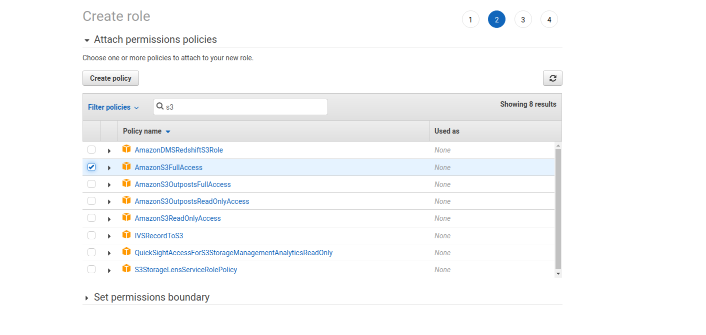

- s3 stands for simple storage service
- s3 stores objects
- objects in regions are divided further into **buckets** 
- When creating a bucket, set to public for demonstation purposes and ensure that the bucket has a unique name 

## Uploading to s3

Copy files to a remote server with the following command

```bash
aws s3 cp <local_folder> s3://<bucket>/<remote_folder> --recursive --exclude "<pattern>"
```

For example, to copy all of the js files, you would use the following command. We have no files to exclude.

```bash
aws s3 cp ./assets/js s3://pizza-luvrs-billj/js --recursive
```

If we log into aws now, we file be able to see these files 

### Cors

Enable CORS on your s3 bucket by using a JSON object 

### Creating IAM Roles

- Create a role through IAM to auth with your app 
- Create the role on EC2 and give the role full s3 access 
