- **Identity and Access Management** (IAM) is used to configure and manage users
- **Cloudwatch** is used for setting alarms and logging
  - 10 cents per alarm per month

* amazon Simple Notification Service (SNS) will allow you to subscribe to a notification service
  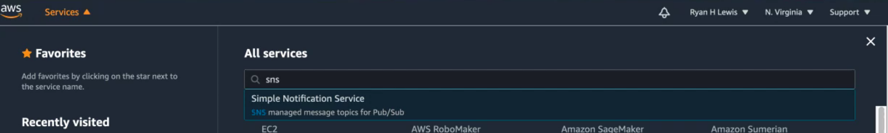

## Setup cloudwatch to watch for any unwanted billing charges

1. Create a new topic on SNS and subscribe to it with your email address. You will be emailed a confirmation link

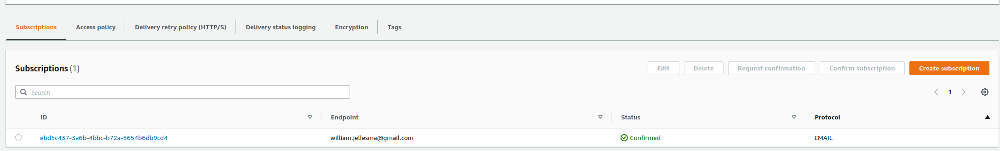

2. On the billing service, click the tab for `Billing Preferences` and make sure that `Receive Billing Alerts` is checked

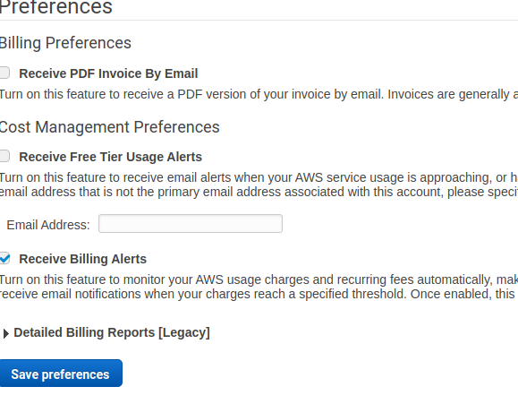

3. Create an alarm on the `All Alarms` submenu

4. When asked for a metric, select Billing -> Total Estimated Charge

5. Select your currency and then select `Select Metric`

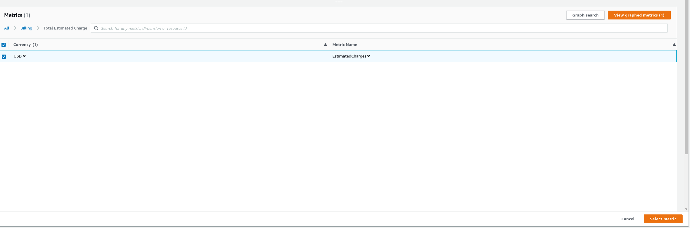

6. Leave the period set at 6 hours, use a static threshold and set it to be greater than a certain amount. Click Next when ready.

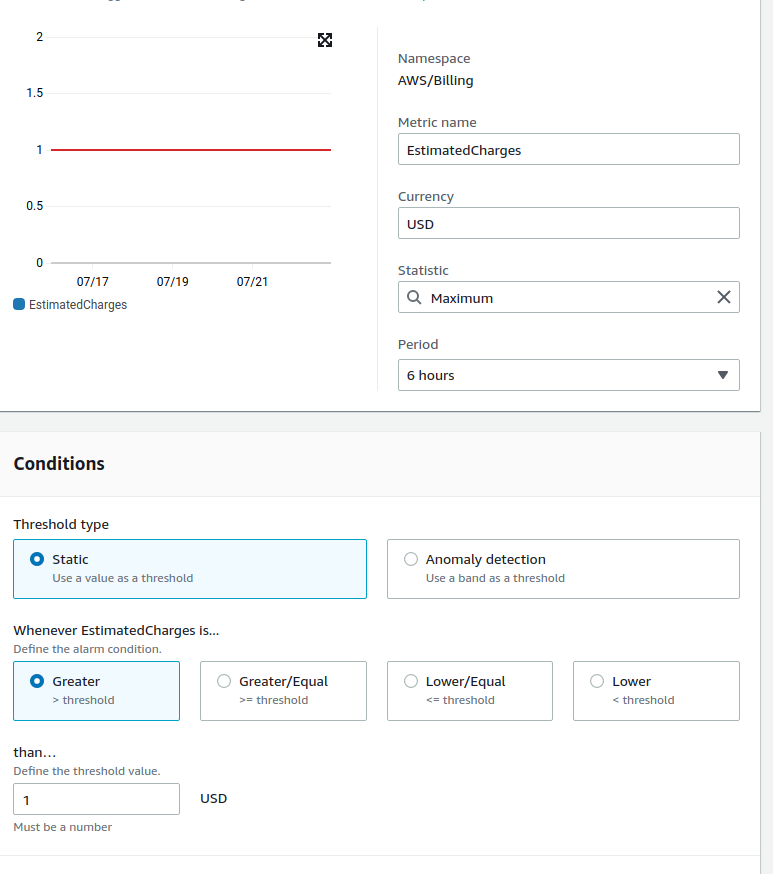

7. When configuring actions, send an email to `admin_email` assuming that's the title of your sns

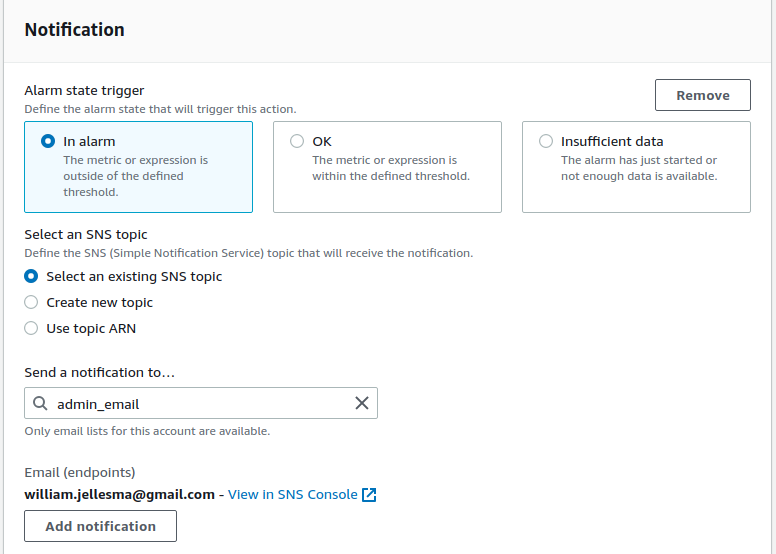

8. You'll be presented with a screen to review what you've created. You can continue to create alarm

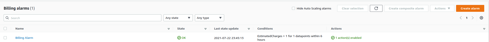

## IAM Policies

Policies can be used to give out different roles 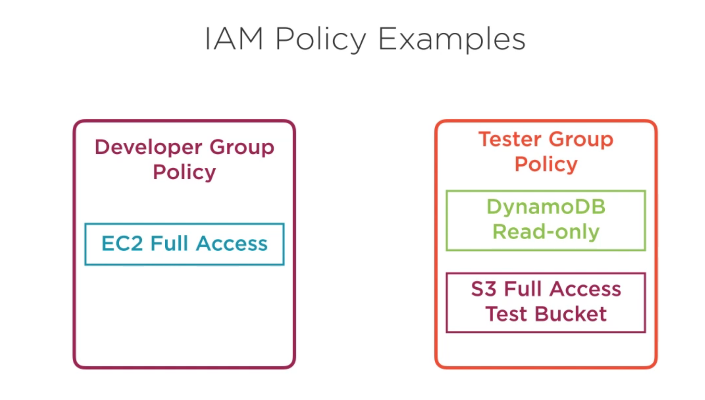

On the IAM Page, click the Policies tab and go to Administrator Access Policy. This is a **policy document**

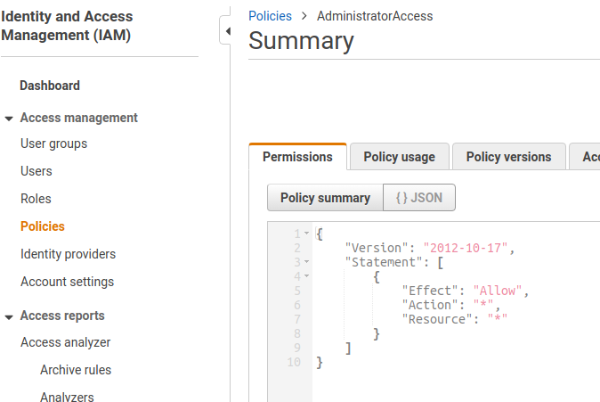

The ecs2fullaccesspolicy is a little more grandular 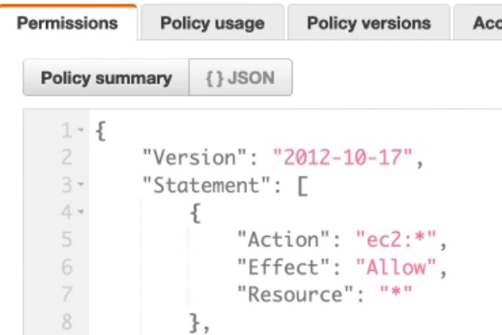

Here, the **Action** is what will be affected. The **Effect** will always either be allow or deny (implicit deny by default). The **resource** is the list of specific resources they're allowed in the action

## IAM Groups

IAM can deal with individual users while aws recommends using groups

AWS Recommends that we create a user using IAM and then delete the root access keys for heightened security. We can then type `aws configure` in our terminals and be prompted to enter the access and secret keys.

Create a new user group for our new user so that we can apply policies to groups. On iam, create a new user group called `admin` and give it the `AdministratorAccess` permission. 

On the account settings tab, you'll be able to set a password policy 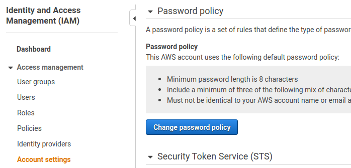

On the users list, you can now select the user and set a console password for them 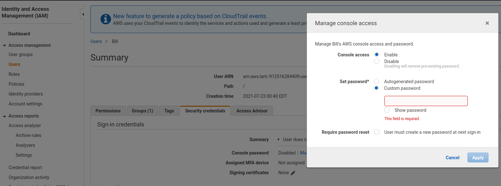

On the dashboard, you'll now see a URL that IAM users will use to login to 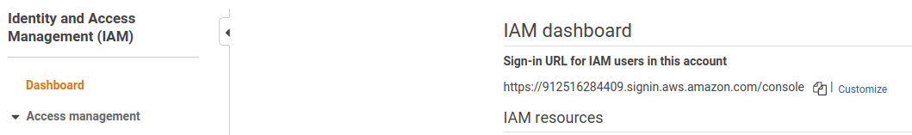
