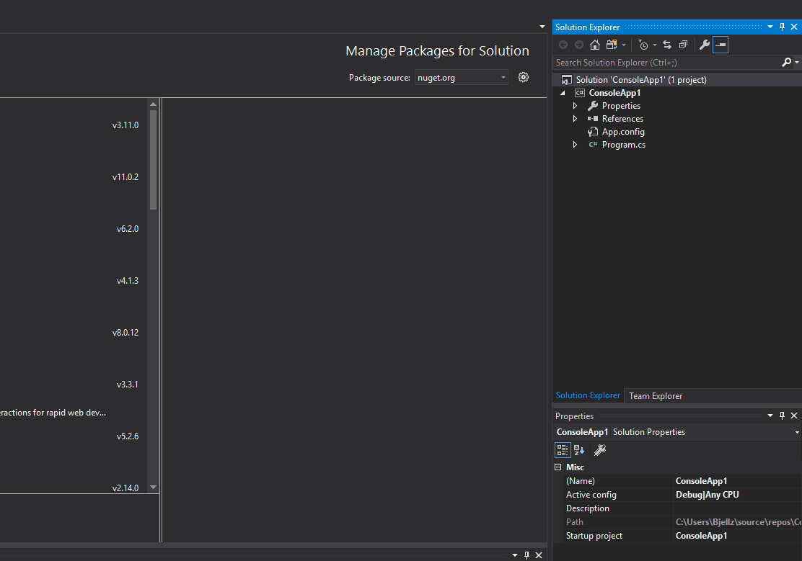

* assemblies are the EXEs or DLLs that result from scripts being compiled
  * a console application or windows application compile an EXE
  * a class library will compile a DLL
  * In Properties -> Application, you can change the output type
* Unit testing in C#
  * Adding a test to an existing solution

  

  * After you've built the test and are happy with it, you may run it like so

  

  * Assert is a class in C# and can be used like so:

  ```csharp
  using System;
  using Microsoft.VisualStudio.TestTools.UnitTesting;

  namespace UnitTestProject1
  {
      [TestClass]
      public class UnitTest1
      {
          [TestMethod]
          public void TestMethod1()
          {
              Assert.AreEqual(3, 4);
          }
      }
  }

  ```

  * In order to use the data from the project within the unit test, you'll need a  project reference. The following is how you would add the reference

  

  * Due to protection levels, you will also need the class being referenced to be public like so:

  ```csharp
  namespace ConsoleApp1
{
    public class Program
    {
        static void Main(string[] args)
        {
        }
    }
}
```
