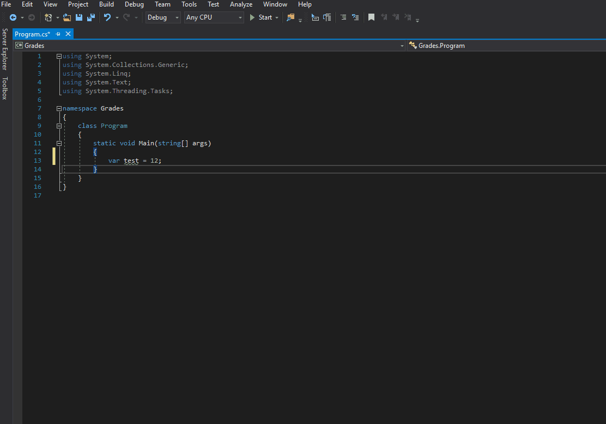

* Naming conventions dictate that program names (namespaces) should begin with a capital letter

```csharp
namespace Grades
{
    class GradeBook
    {
        static void AddGrade(float grade)
        {
        }
    }
}
```

The class is instantiated like below

```csharp
GradeBook book = new GradeBook();
```

* Convention dictates that every class in c# should have its own file
* Nameing conventions dictate that Classes and Methods should up camel cased starting with a capital letter.
* Naming conventions dictate that variable names should be camel cased starting with a small letter
* Create a list using the generic type of float

```csharp
List<float> grades;
```
* You can set breakpoints inside of c# so that you can see the value of the variable at that moment of execution



* keep in mind that variables point to an address where the data is stored so...

```csharp
var book2 = book;
```

will create another address so that both book2 and book are able to act on the same object

* access modifiers
  * public - variable is available outside of the class
  * private - variable is only available in that one class

So if you need to create global variables:

```csharp
public int test = 12;
```

* static methods are able to be used without first creating an object
  * `Console.WriteLine()` is an example of this because we do nott need to create an instance of console before we can use this
