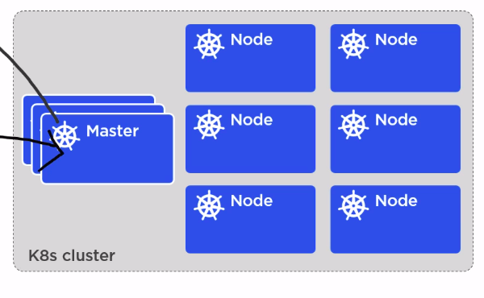
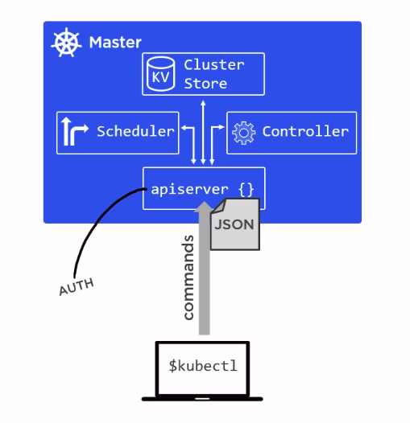
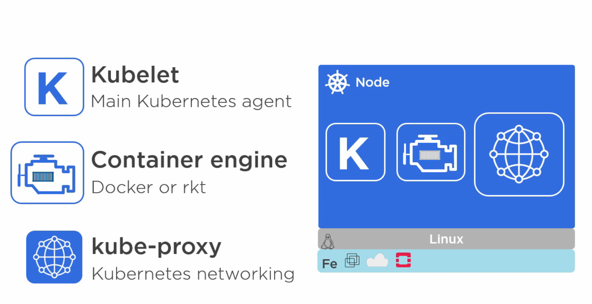
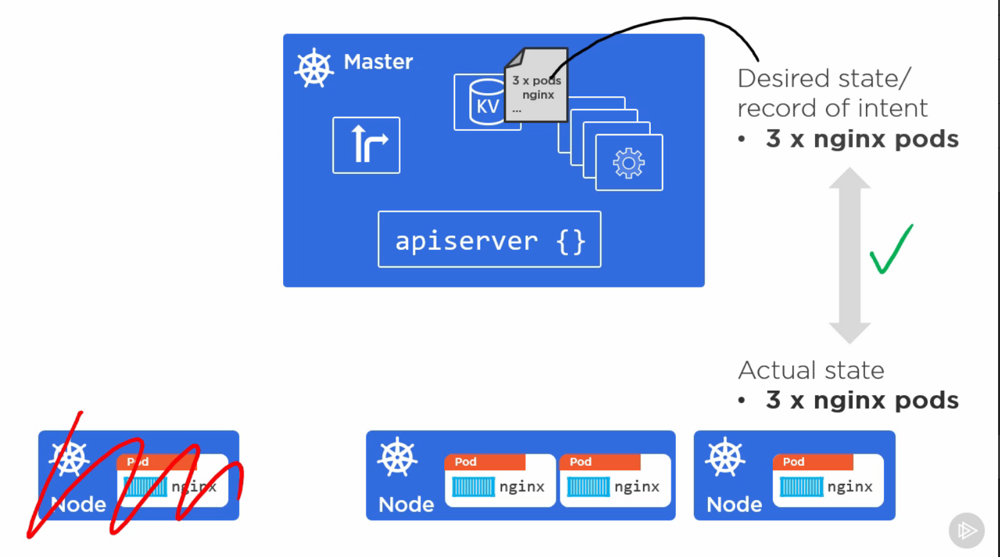
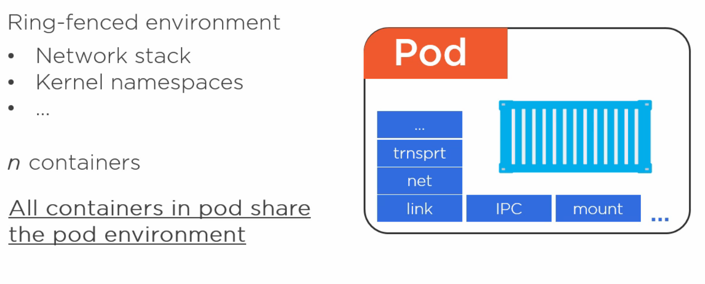
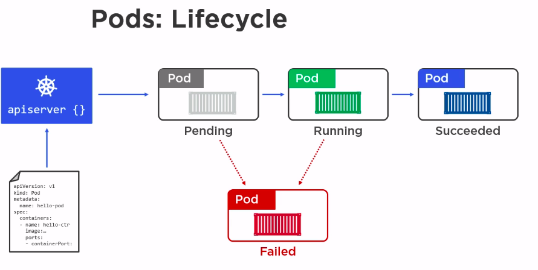
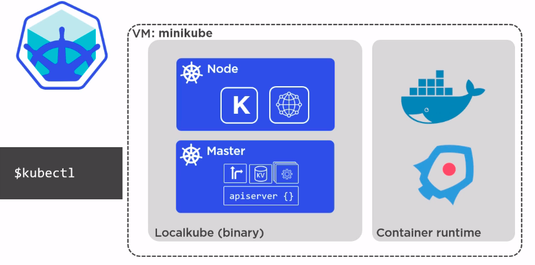

Kubernetes is an open source project by Google and is often shortened to **K8s** (the 8 stands for the 8 letters in between the k and s)

Kubernetes is like a data center OS where you give Kubernetes your app and it will run. Kubernetes will decide what it needs.

Kubernetes will organize all of the microservices (pods) into nodes which can be made up of multiple pods. These nodes are led by masters
as in the following picture:



Masters consist of four parts:

1. apiserver (brain) - commands are sent to the apiserver from the cli
2. Cluster Store (Memory) - the cluster store keeps track of the state of nodes
3. Scheduler - the scheduler will spin up new nodes when it's time
4. Controller - this sits in a loop to watch for changes in the cluster and handles them



Nodes consist of the following three pieces:

1. Kublet - Registers node and watches for assignments from the master's apiserver. They will report back to the master in the case of failure and they will initialize pods when needed. It exposes an endpoint on :10255 so that it can be inspected.
2. Container Engine - pulls images and starts/stops containers
3. kube-proxy - assigns IP addresses to all pods



Kubernetes masters must be fed a manifest file.

# Desired State

Kubernetes will make sure that the desired state is kept in tact even if we needs to put a dead pod onto another surviving pod. 
This is all in effort so that we don't have to interact with Kubernetes directly and it will do this automatically.



# Pods

A pod can run one or more containers. Normally, only one container is needed per pod but if the containers NEED to share a networking space, the pod can run more than one container. pods can't be spread across multiple nodes. If a pod dies, another one will be spun up, the pod will not be rezzed.

 

Each pod will have its own IP and the containers within that pod will run on different ports. The containers in that pod all share the same IP, namespace, etc. All pods are setup on one network and can communicate with one another. All containers within the pod need to come up in order for the pod to be `alive`. This is the idea of **atomic deployment**.



In order to create the pod, you need to write a pod manifest file to tell the apiserver how to make it.

```yml
apiVersion:	v1
kind:	Pod
metadata:
	name: hello-pod
	labels:
		zone: prod
		version: v1
spec:
	containers:
		name: hello-ctr
		image: nigelpoulton/pluralsight-docker-ci:latest
		ports:
			containerPort:	8080
```

create this pod now with 

```bash
kubectl create -f pod.yml
```

# Installing Kubernetes

There are many ways to install Kubernetes based on the type of installation that you want:

1. MiniKube - installation on a local PC
2. Google Kontainer Engine (GKE)
3. AWS Provider
4. Manual Install

## MiniKube

MiniKube is to Kubernetes as Docker for Windows is to Docker. It's a great way to try out the environment locally.



As you can see, minikube will setup a VM running a kubernetes cluster and you can communicate with it with kubectl. 

For linux users, we first want to install kubectl with:

```bash
sudo apt-get update && sudo apt-get install -y apt-transport-https
curl -s https://packages.cloud.google.com/apt/doc/apt-key.gpg | sudo apt-key add -
echo "deb https://apt.kubernetes.io/ kubernetes-xenial main" | sudo tee -a /etc/apt/sources.list.d/kubernetes.list
sudo apt-get update
sudo apt-get install -y kubectl
```

Install minikube by downloading a script with 

```bash
curl -Lo minikube https://storage.googleapis.com/minikube/releases/latest/minikube-linux-amd64 \
  && chmod +x minikube
```

Finally, add minikube to your executable path with

```bash
sudo cp minikube /usr/local/bin && rm minikube
```

Start a minikube server with

```bash
sudo minikube start
```

## Google Kontainer Engine (GKE)

GKE is built on top of the Google Compute Engine (GCE). GKE is more of a production grade environment whereas minikube is more for local dev

## Kubernetes Services

Pods are **ephermal**, they only exist for the lifetime of the app and then they're replaced. In contrast, the service never changes and always retain its IP, DNS, and Port
