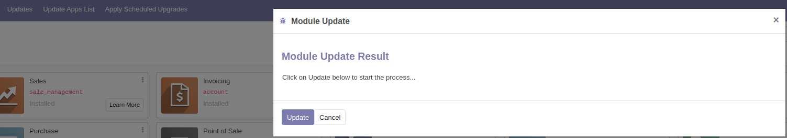

It's recommended to create any custom addons inside of a new directory so your custom addons don't get mixxed in.

We need three files at a minimum to create an odoo application:

`__init__.py` - This will import any file(s) that you create for your application.
`__openerp__.py` - This is a manifest file that will give the information of your application.

The last file is at least one file containing the logic of your application. This will be imported by `__init__.py`.

To actually run this custom addons folder, we'll use the `--addons-path` switch when we run our server. Using the customaddons folder above, we'll run `./odoo-bin --addons-path=customaddons,addons -u dietfacts -d dietfacts2` (make sure that we're still including the addons folder that odoo creates). In this command, `-u` is an update that we're setting to automatically update a specific module. `-d` is a database that we're specifying. In our example, we've created the dietfacts2 module

## Dietfacts

To create a module called dietfacts, the following will be the code for each file:

`__init__.py`
```py
from . import dietfacts
```

`__openerp__.py`
```py
{
    'name': "DietFacts",
    'version': "1.0",
    'author': 'Bill Jellesma',
    # Modules that our module will depend on
    'depends': ['sale'],
    'description': 'This is a test module',
    'installable': True
}
```

`dietfacts.py`
```py
from odoo import models, fields

# Inherit the models
class Dietfacts_product_template(models.Model):
    # class attributes
    _name = 'product.template'
    _inherit ='product.template'

    # Create a calories integer field
    calories = fields.Integer("Calories")
```

### Installing Dietfacts

After loading the custom addons, you'll need to update the app list also



Back in Odoo in your apps section, set your filter to include extras in order to see your new Odoo App


After installing this module, you'll notice that your new field will now show up in the product.template model


As described in the notes on framework, you're able to now add this field to a view as before. This is the recommend way to add fields to models.

## Creating a view with your application

Since we want to edit the list view to have calories appear, we'll need to go to edit list view on the products page to get the proper data.


Using this information, we can create an xml file in our application that'll use some of this information. 

`dietfacts_view.xml`
```xml
<?xml version="1.0" encoding="utf-8"?>
<openerp>
    <data>
        <record id="product_template_tree_view" model="ir.ui.view">
        <!-- inherit id will have odoo grant the id -->
        <!-- the ref will be taken from the external id that you find on the edit view page -->
            <field name="inherit_id" ref="product.product_template_tree_view"/>
            <!-- model is also found on the edit list view page -->
            <field name="model">product.template</field>
            <!-- arch is where the actual view data appears -->
            <field name="arch" type="xml">
            <!-- We're inheriting category id so that we can say that everything inside these tags should appear after -->
                <field name="categ_id" position="after">
                    <field name="calories"/>
                </field>
            </field>
        </record>
        <!--form view -->
        <record id="product_template_form_view" model="ir.ui.view">
        <!-- inherit id will have odoo grant the id -->
        <!-- the ref will be taken from the external id that you find on the edit view page -->
            <field name="inherit_id" ref="product.product_template_only_form_view"/>
            <!-- model is also found on the edit list view page -->
            <field name="model">product.template</field>
            <!-- arch is where the actual view data appears -->
            <field name="arch" type="xml">
            <!-- We're inheriting category id so that we can say that everything inside these tags should appear after -->
                <field name="list_price" position="after">
                <!-- It's important to note that these use the python variable name -->
                    <field name="calories"/>
                    <field name="serving_size"/>
                    <field name="last_updated"/>
                </field>
            </field>
        </record>
    </data>
</openerp>
```

We'll also need to update our dictionary in `__openerp__.py`

`__openerp__.py`
```py
{
    'name': "DietFacts",
    'version': "1.0",
    'author': 'Bill Jellesma',
    # Modules that our module will depend on
    'depends': ['sale'],
    # data will use any additional files
    'data': ['dietfacts_view.xml'],
    'description': 'This is a test module',
    'installable': True
}
```

## Creating a menu

Creating a menu is a similar process when doing this through an Odoo Application. We need to make sure to create a new record which has an ID of the menuitem we want to create. The following with create a menuitem for our calories

```xml
<!-- Creating a new menu for calories -->
        <record id="product_template_action_dietfacts" model= "ir.actions.act_window" >
            <field name="name" >Diet Items</field >
            <field name="type" >ir.actions.act_window</field>
            <field name="res_model" >product.template</field >
            <field name="view_mode" >tree,kanban,form</field >
            <field name="view_id" ref= "product_template_tree_view" />
            <field name="context" >{"search_default_filter_to_sell":1}</field>
            <field name="domain">[('calories','&lt;','100')]</field>
            <field name="help" type= "html">
                <p class="oe_view_nocontent_create" >
                    Click to define a new product.
                </p><p>
                    You must define a product for everything you sell, whether it's a physical product, a consumable or a service you offer to  customers.             
                </p><p>
                    The product form contains information to simplify the sale process: price, notes in the quotation, accounting data, procurement methods, etc.
                </p>
            </field>
        </record>

         <menuitem action= "product_template_action_dietfacts"
            id="menu_product_template_action_dietfacts"
             sequence= "2" />
```

Notice in the above menu code that we have 

```xml
<field name="domain">[('calories','&lt;','100')]</field>
```

This means that this menu should only populate with items under 100 calories.

Also notice that a default value of 50 calories is set with

```xml
<field name="context" >{
    "search_default_filter_to_sell":1, 
    "default_calories": 50
}</field>
```

context will set any default values.

# Tips

Even though it's relatively easy to add fields through the database, this takes unnecessary space in the database