- You can activate Odoo debug mode through settings -> activate developer mode
  _ [Odoo 14 Documentation](#https://www.odoo.com/documentation/14.0/applications/general.html#activate-the-developer-mode-debug-mode)
  _ You can now activate debug mode using the following screenshot
  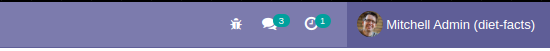
  - With debug mode, you're also able to hover over a field and see technical details
    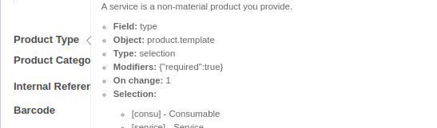
    - **Field** is the actual field name that you'll use when creating customization
    - The **Object** of product.template means that this and other objects are part of the product.template model
    - **Type** is the data type

* Database Structure is an option available under technical
  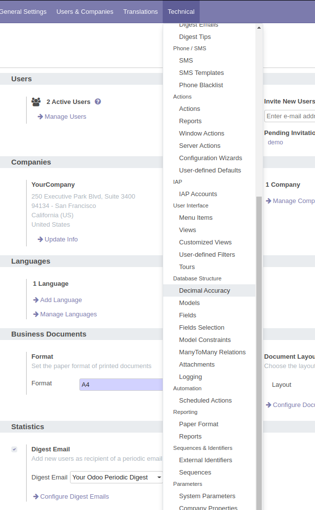 \* Looking at database structure, you're able to see `product.template` model which contains all of the associated object fields that we saw before
* Backup and Restore an Odoo database
    * Navigating to `/web/database/manager` brings you to a list of databases that are attached to your Odoo instance
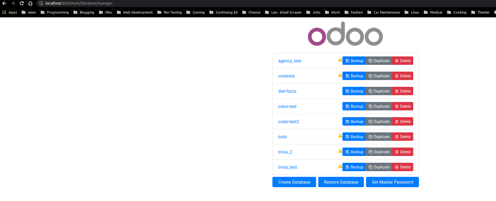
    * Performing a backup/restore is as easy as clicking the buttons on the manager
    * It's always a good idea to use your backup/restore and ensure proper testing of them before modifying the database
* Add to a model by navigating to Settings -> Technical -> Database Structure => Models and choosing the model that you want to modify. In our example, we'll choose `product.template`. Click the "Edit" button at the top of the page to edit the model. Scroll to the bottom of the page where you should see an option for "add a line"
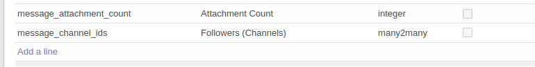
* Notice that the field name begins with "x_". This is how Odoo denotes that the field is custom so they'll preserve this field through updates
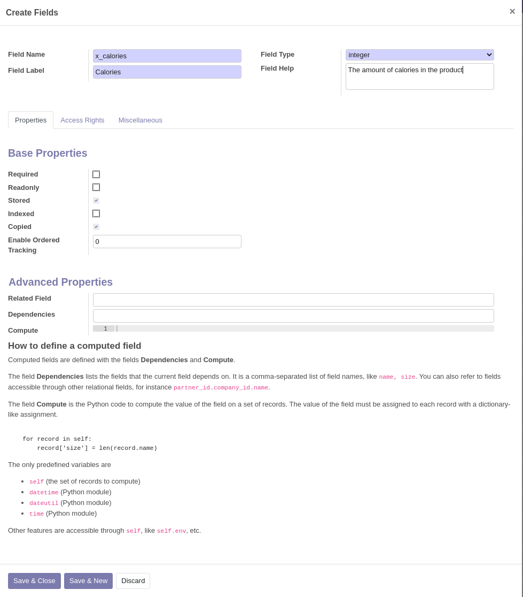
* Make sure to also click save on the model in order to properly save it to the database
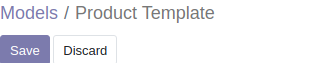
* Although this field is added to the model, it must still be added to any view that you'd like it to appear in

## Edit View

In debug mode, navigate to one of the forms that you want to edit.
Navigate to debug mode -> edit form view
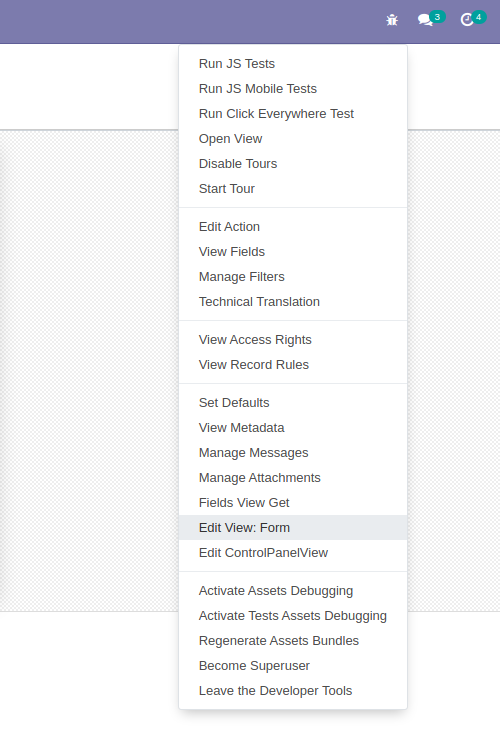
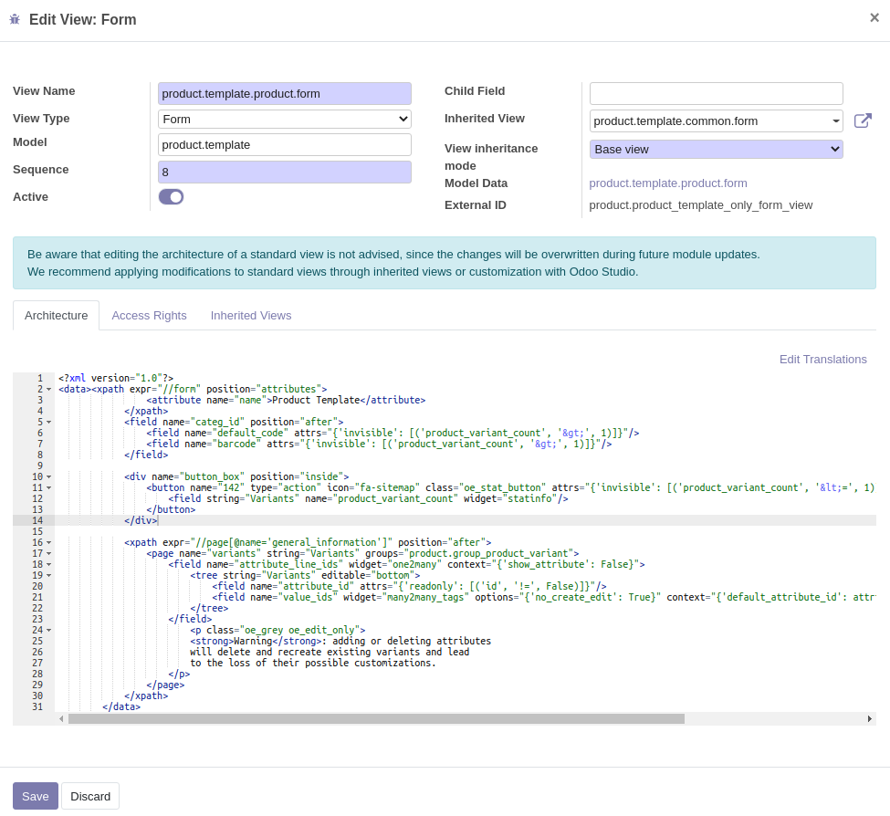
```xml
<field name="x_calories"/>
```
* When you edit the XML directly to add a field, Odoo will validate your xml to see if that field exists. If the field doesn't exist, you will see an error as below:
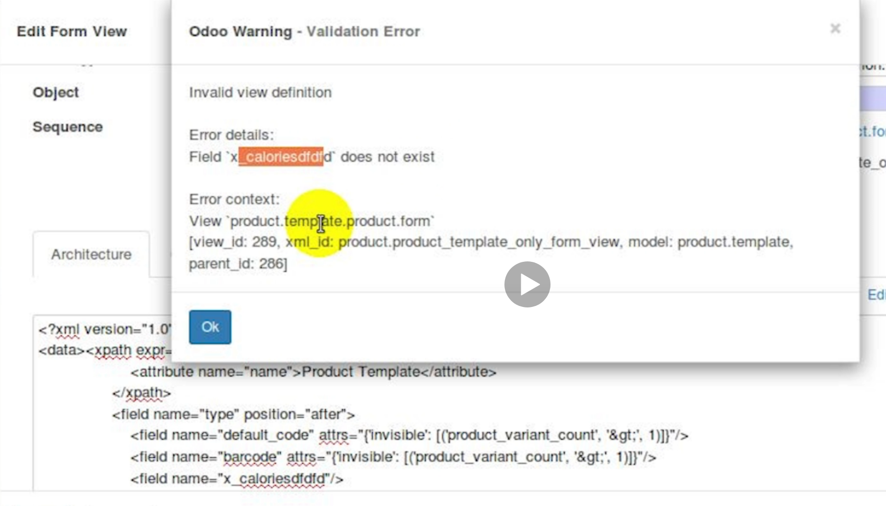
* In some views such as the list view, you can actually use the following xml to have a running total of an integer or float appear at the bottom

```xml
<field name="x_calories" sum="Total Calories"/>
```

* It's also important to notice that fields also have inheritance. Notice that some xml have attributes with `position`. This is accessing an xml tag from its parent.
```xml
<field name="categ_id" position="after">
    <field name="default_code" attrs="{'invisible': [('product_variant_count', '&gt;', 1)]}"/>
    <field name="barcode" attrs="{'invisible': [('product_variant_count', '&gt;', 1)]}"/>
    <field name="x_calories"/>
</field>
```

Every field inside of that parent field tag will appear after the categ_id field in the parent. For example, if we edited position to be before, the fields inside would appear before categ_id. This is Odoo's way of letting the child safetly access the parent views through child views.
```xml
<field name="categ_id" position="before">
    <field name="default_code" attrs="{'invisible': [('product_variant_count', '&gt;', 1)]}"/>
    <field name="barcode" attrs="{'invisible': [('product_variant_count', '&gt;', 1)]}"/>
    <field name="x_calories"/>
</field>
```

## Edit Action

You can edit the view that appears by default by navigating to "Edit Action" in the debug menu.

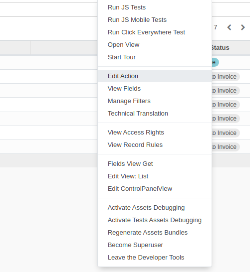

And selecting the view reference

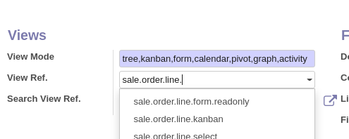

## Menus

You're able to see a listing of all view ids by going to settings -> technical -> user interface -> Views.

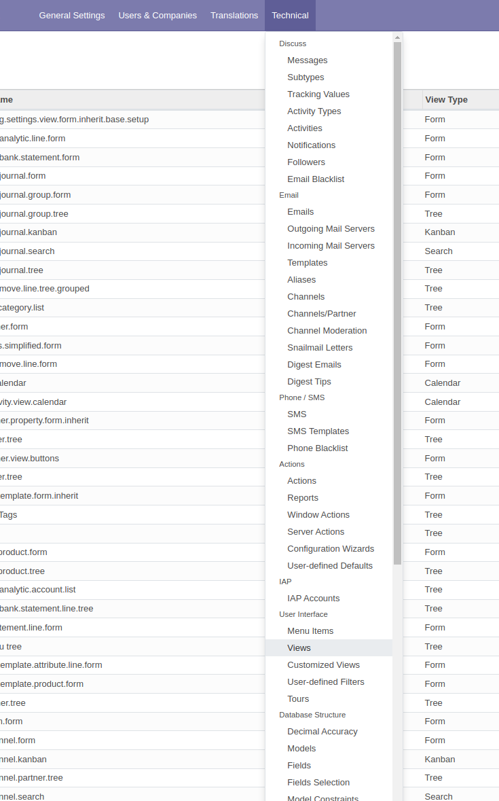

If you go to Technical -> Menu Items, you'll see the menus that correspond to the menu options that you have available.

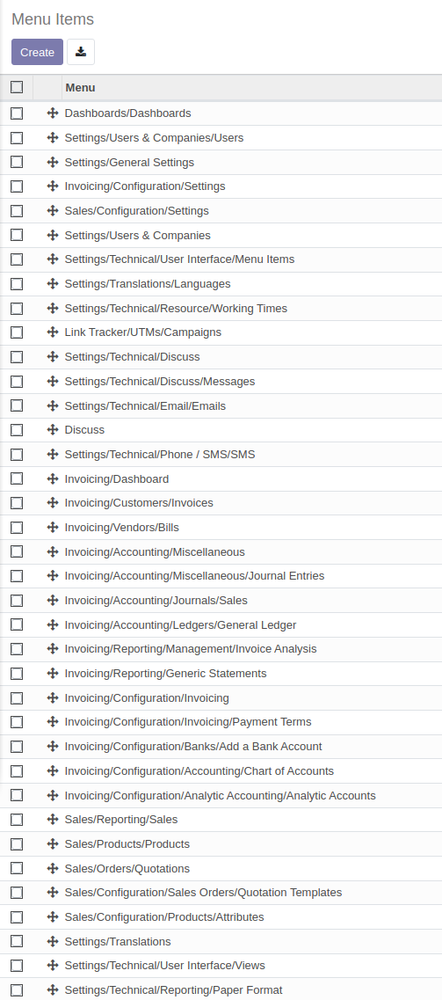

If we click on sales/products/products, for example, we'll see that we can also get to actions this way

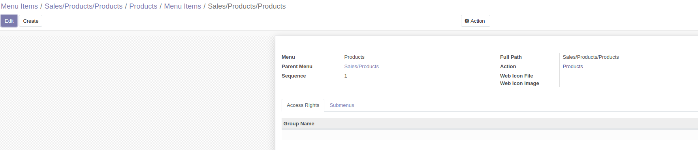

## Creating Filters

When viewing a list, you can edit the ControlPanelView or SearchView and include some XML for the custom filter that you'd like to make

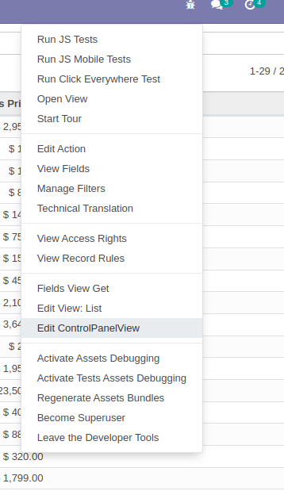

The below xml will create a filter that will only show items where the list price is less that $100

```xml
<filter string="Low Cost" name="filter_low_cost" domain="[('list_price','&lt;',100)]"/>
```

Notice that you can't use the less than symbol and must use the `&lt;` because the XML will see the symbol as a bracket for a tag. This is why Odoo will throw an error when attempting to validate.

Putting in this filter alone will create an or condition with anything else by default. So if two filters in the same group are selected, it will display the item if either of them are true. To make it into an AND condition, you must make the filter part of it's own group. To do this, insert a seperator tag before and after.

```xml
<seperator />
<filter string="Low Cost" name="filter_low_cost" domain="[('list_price','&lt;',100)]"/>
<seperator />
```

## Custom Menu

The easiest way to create a new menu is to duplicate another one. We would typically find a menu with the same parent menu as one that we want to create. Using the above example of a low cost filter is we might want to create a menu item that automatically brings up the low cost items.

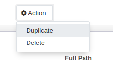

We can name the menu what we want and just increment the sequence number.

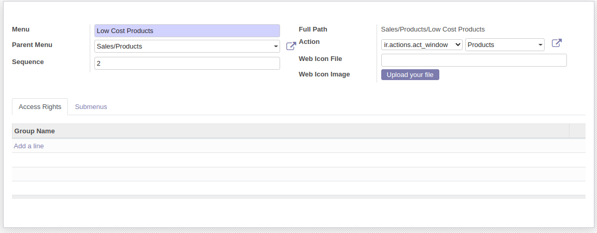

We can now refresh the browser and Odoo will now show us this menu where you specify. In our case, we duplicated the Sales/Products/Products menu so our new menu item appears as below.

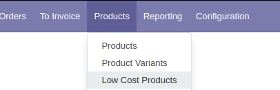

The items will still appear as default in this new menu option because we haven't editted the action. To do this, we noticed before that the action was set to Products, so we'll duplicate the products action. Specifically, we're looking for **Window Actions**.

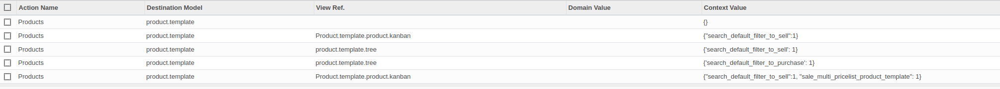

As you can see, we find five results. As we look through these results, we can see that one of them has view reference set as product.template.tree which is the one we want. So we'll duplicate this.

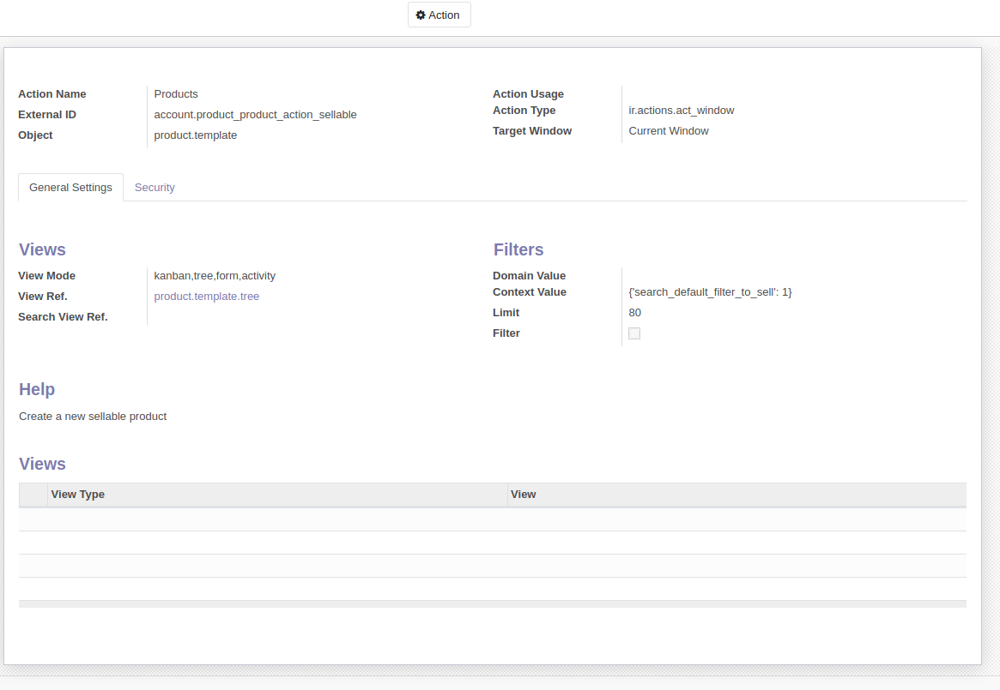

We'll duplicate this and set the `search_default_filter_to_sell` to the scheme `search_default_{name}` where `{name}` is the name attribute that we gave to the filter we created, `filter_low_cost` in our case.

Finally, go back to your custom menu and set the action to be the action that you just created.

Now, you can open your low cost items menu option to see a tree view of all of the low cost items.

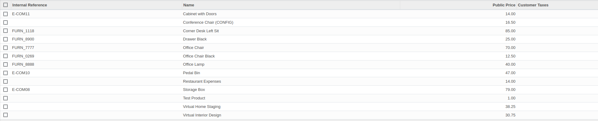