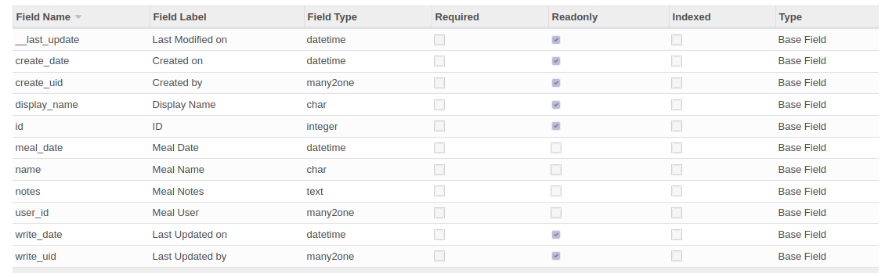
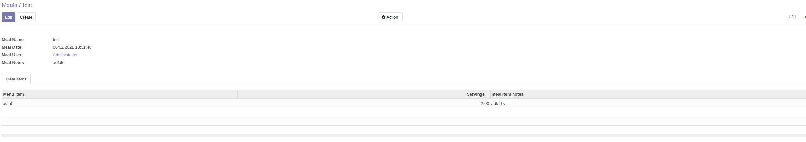
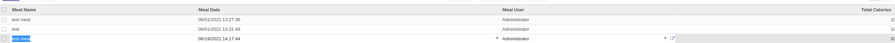

We'll extend Odoo to include a new models for `res.users.meal`

```py
class Dietfacts_res_users_meal(models.Model):
    _name = "res.users.meal"
    name = fields.Char("Meal Name")
    meal_date = fields.Datetime("Meal Date")
    # item_id = fields.One2many()
    # Many users but only one can eat the meal
    user_id = fields.Many2one('res.users', 'Meal User') 
    notes = fields.Text('Meal Notes')
```



Notice that Odoo has included several readonly fields such as `__last_update` and `create_uid`.

We will also include this time the minimum amount of xml code to generate a menu and force odoo to create a form for us

```xml
<!-- Creating a new menu for meals -->
        <record id="meal_action_dietfacts" model= "ir.actions.act_window" >
            <field name="name" >Meals</field >
            <field name="type" >ir.actions.act_window</field>
            <field name="res_model" >res.users.meal</field >
            <field name="view_mode" >tree,kanban,form</field>
            <field name="help" type="html">
                <p class="oe_view_nocontent_create">
                    Create a new meal
                </p>
            </field>
        </record>
        <!-- The parent attribute will make it so that this appears under diet items -->
        <menuitem action= "meal_action_dietfacts"
            id="menu_meal_action_dietfacts" parent="menu_product_template_action_dietfacts"
             sequence= "1" />
```

## Access Rights

Even though the menu is accessible in settings, it will only be available to the superuser. We must create access rights for it to be available to everyone.

To set access rights, we'll need to create a new directory in the root of our app called `security` and create a single file caled `ir.model.access.csv`

```csv
id,name,model_id:id,group_id:id,perm_read,perm_write,perm_create,perm_unlink
access_meals_dietfacts,access.meals_dietfacts,model_res_users_meal,,1,1,1,1

```

**NOTE**: Make sure to not include any spaces or double quotes.

Notice that we're leaving group id blank so that it applies to everyone.

We also need to add this access rights file to `__openerp__.py`

```py
{
    'name': "DietFacts",
    'version': "1.0",
    'author': 'Bill Jellesma',
    # Modules that our module will depend on
    'depends': ['sale'],
    # data will use any additional files
    'data': ['dietfacts_view.xml', 'security/ir.model.access.csv'],
    'description': 'This is a test module',
    'installable': True
}
```

## Form

When creating a form in xml, use the group tag so that labels appear properly

```xml
<record id="dietfacts_meal_form_view" model="ir.ui.view">
            <!-- model is also found on the edit list view page -->
            <field name="model">res.users.meal</field>
            <!-- arch is where the actual view data appears -->
            <!-- TODO: think it may be view mode-->
            <!-- <field name="view_mode">form</field> -->
            <field name="arch" type="xml">
                <form>
                    <group>
                        <field name="name" />
                        <field name="meal_date" />
                        <field name="user_id" />
                        <field name="notes" />
                    </group>
                </form>
            </field>
        </record>
```

## Notebook

```xml
<field name="arch" type="xml">
                <form>
                    <group>
                        <field name="name" />
                        <field name="meal_date" />
                        <field name="user_id" />
                        <field name="notes" />
                    </group>
                    <notebook>
                        <page name="mealitems" string="Meal Items">
                            <field name="item_ids" widget="one2many_list">
                                <tree string="Meal Items" editable="bottom">
                                    <field name="item_id" />
                                    <field name="servings" />
                                    <field name="notes" />
                                </tree>
                            </field>
                        </page>
                    </notebook>
                </form>
            </field>
```



## Related Fields

You can create related fields in the python model to get fields from another table. The following code snippit will show that we're getting calories from the product.template table

```py
class Dietfacts_res_users_mealitem(models.Model):
    _name = "res.users.mealitem"
    _description = "meal item"

    # tells meal item which meal it goes with
    meal_id = fields.Many2one('res.users.meal')
    item_id = fields.Many2one('product.template', 'Menu Item')
    servings = fields.Float('Servings')
    # related will look at the field that you've specified as the relation (item id is a many2one) and see that it links to product.template
    # the ".calories" will get the calories field from the product.template table
    calories = fields.Integer(related="item_id.calories", string="Calories Per Serving", store=True, readonly=True)
    notes = fields.Text('meal item notes')
```

Now, in the xml we can just call the field like any other

```xml
<field name="item_id" />
<field name="calories" />
<field name="servings" />
<field name="notes" />
```

## Functional Fields

Create a method in the model where you want a computed field

```py
class Dietfacts_res_users_meal(models.Model):
    _name = "res.users.meal"
    _description = "This is to enter the meals"
    name = fields.Char("Meal Name")
    meal_date = fields.Datetime("Meal Date")
    # meal_id provides how we know which meal this goes with
    item_ids = fields.One2many('res.users.mealitem', 'meal_id')
    # Many users but only one can eat the meal
    user_id = fields.Many2one('res.users', 'Meal User') 

    # method to loop through all meal items and sum total calories
    # any time an item_ids change, we need to recalc
    @api.depends('item_ids', 'item_ids.servings')
    def _calccalories(self):
        # var to hold number of calories
        current_calories = 0 
        for mealitem in self.item_ids:
            current_calories += mealitem.item_id.calories
        self.total_calories = current_calories

    # displaying the computed fields
    # calling the calccalories method
    total_calories = fields.Integer(string="Total Calories", store=True, compute="_calccalories")
    notes = fields.Text('Meal Notes')
```

## Editable Tree View

Odoo will allow you to edit items directly in the tree view by giving the tree tag an attribute of editable and setting it equal to bottom:

```xml
<!-- tree view -->
        <record id="dietfacts_meal_tree_view" model="ir.ui.view">
        <!-- inherit id will have odoo grant the id -->
        <!-- the ref will be taken from the external id that you find on the edit view page -->
            <!-- <field name="inherit_id" ref="dietfacts_meal_tree_view"/> -->
            <!-- model is also found on the edit list view page -->
            <field name="model">res.users.meal</field>
            <!-- arch is where the actual view data appears -->
            <field name="arch" type="xml">
                <tree editable="bottom">
                    <field name="name" />
                    <field name="meal_date" />
                    <field name="user_id" />
                    <field name="total_calories" />
                </tree>
            </field>
        </record>
```

