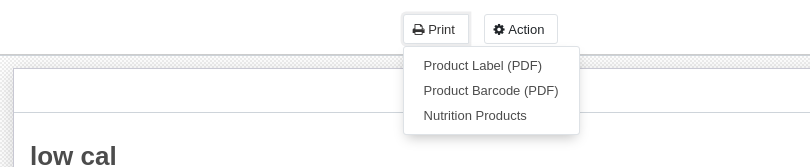

1. First define a report xml

```xml
<record id="dietfacts_product" model="ir.actions.report">
            <field name="name">Nutrition Products</field>
            <field name="model">product.template</field>
            <field name="report_type">qweb-pdf</field>
            <field name="report_name">dietfacts.report_dietitems</field>
            <field name="report_file">dietfacts.report_dietitems</field>
            <field name="binding_model_id" ref="model_product_template"/>
            <field name="binding_type">report</field>
        </record>
```

`model` is the name of the model that you want this report to grab data from

`report_file` will need to match the id of the template that you use later

`binding model id` will be the snake case similar to how you set up access controls

2. Define a simple template that will be used when you call the report. You can use html in here

```xml
<!-- template id must must match the report file below -->
        <template id="report_dietitems">
        <t t-call="web.html_container">
        <t t-call="web.internal_layout">
        <!-- t-foreach will loop through all objects and use o as the object name -->
        <t t-foreach ="docs" t-as ="o">
            <div class="page" >
                    <div class="oe_structure" />
                    <h1>Nutrition Report</h1>
                    <h2>Product Name: <span t-field="o.name"/></h2>
                    <p>Calories: <span t-field="o.calories"/></p>
                    <p>Nutrition Score: <span t-field="o.score"/></p>
                    
                    <h3>Nutrition Details</h3>
                    <t t-foreach="o.nutrient_ids" t-as="line">
                    <div class="row">
                    <div class="col-xs-6">
                    <span t-field="line.nutrient_id.name"/>
                    </div>
                    <div class="col-xs-2">
                        <span t-field="line.value"/>
                    </div>
                    <div class="col-xs-4">
                    <span t-field="line.nutrient_id.uom_id.name"/>
                    </div>
                    </div>
                    </t>
            </div>
            </t>
            </t>
        </t>
        </template>
```

Odoo allows us to use some logic like `t-if` and `t-foreach` to make powerful reporting. We can also use standard bootstrap classes to make our reports easier to read.

You should now be able to see a print button in your form with your custom template



3. download and install wkhtmltopdf via `sudo apt-get install wkhtmltopdf` or install the deb image from the website