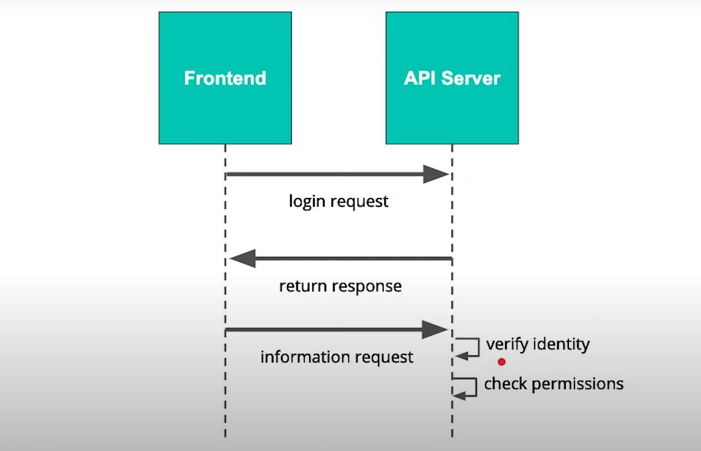
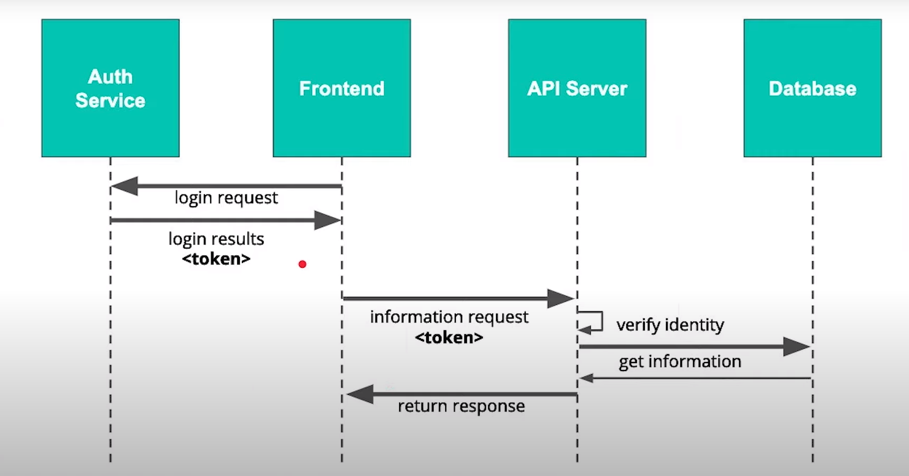

* Authenication = who are you?
* Authorization = what can that person access?

1. Create a login request from the frontend
2. The server will return a response (likely with an access token)
3. The frontend will make further information requests with that token
4. The server will check that token to verify identity (authenticate) and check permissions (authorize)


The following is a more complex model for authentication using a third party server/service



## SQLAlchemy recap

The following is a way to init an engine in sqlalchemy
```py
import os
from sqlalchemy import create_engine, Column, String, Integer

database_filename = "playground.db"
project_dir = os.path.dirname(os.path.abspath(''))
database_path = "sqlite:///{}".format(os.path.join(project_dir, database_filename))

engine = create_engine(database_path)
```

The following is a way to init a model
```py
from sqlalchemy.ext.declarative import declarative_base

Base = declarative_base()

class User(Base):
    __tablename__ = 'users'
    # Autoincrementing, unique primary key
    id = Column(Integer().with_variant(Integer, "sqlite"), primary_key=True)
    # String Title
    username = Column(String(80), unique=True)
    # the ingredients blob - this stores a lazy json blob
    # the required datatype is [{'color': string, 'name':string, 'parts':number}]
    password =  Column(String(180), nullable=False)
    
    def __repr__(self):
         return self.username +": "+self.password

User.metadata.create_all(engine)

User.__table__
```

Init a session
```py
from sqlalchemy.orm import sessionmaker
Session = sessionmaker(bind=engine)
Session.configure(bind=engine)
session = Session()
```

We can now access a user's password like so:

```py
password = session.query(User).filter_by(username='Abe').first()
```

## Decorators

The following is a more complex decorator that will take a parameter

```py
def add_greeting(greeting=''):
    def add_greeting_decorator(f):
        @wraps(f)
        def wrapper(*args, **kwargs):
            print(greeting)
            return f(*args, **kwargs)
        return wrapper
    return add_greeting_decorator
```

We can now use this decorator with the following function to add a greeting

```py
@add_greeting("what's up!")
def print_name(name):
    print(name)
```

Running
```py
print_name("kathy")
``` 

Will yield

```
what's up!
kathy
```

In a more complex example, we can also use our function definition to get information from our decorator:

```py
def add_greeting(greeting=''):
    def add_greeting_decorator(f):
        @wraps(f)
        def wrapper(*args, **kwargs):
            print(greeting)
            # Notice that we're adding a greeting parameter to the return for the inner function
            return f(greeting, *args, **kwargs)
        return wrapper
    return add_greeting_decorator
```

Now if we define our regular function as this

```py
@add_greeting("Yo!")
def print_name(greeting, name):
    print(greeting)
    print(name)
```

We can call the function as this

```py
print_name("Abe")
```

and receive this response

```
Yo!
Yo!
Abe
```