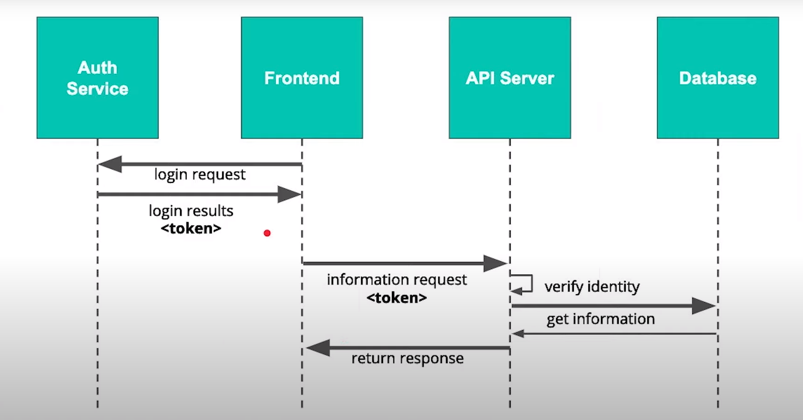

* Authenication = who are you?
* Authorization = what can that person access?

1. Create a login request from the frontend
2. The server will return a response (likely with an access token)
3. The frontend will make further information requests with that token
4. The server will check that token to verify identity (authenticate) and check permissions (authorize)

Below is a more basic implementation of the above security.

Larger scale apps will often use a third party server/service to generate authentication tokens

