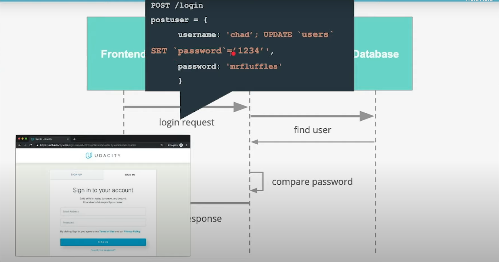
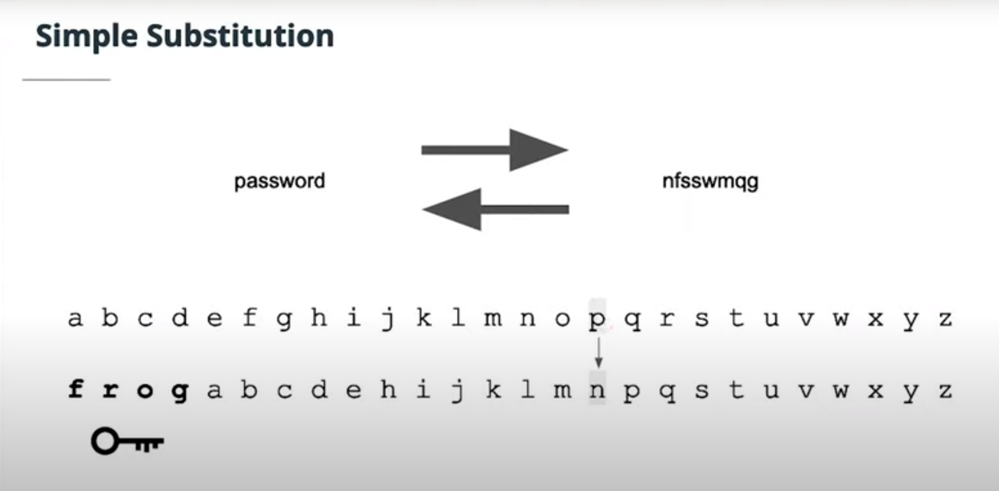
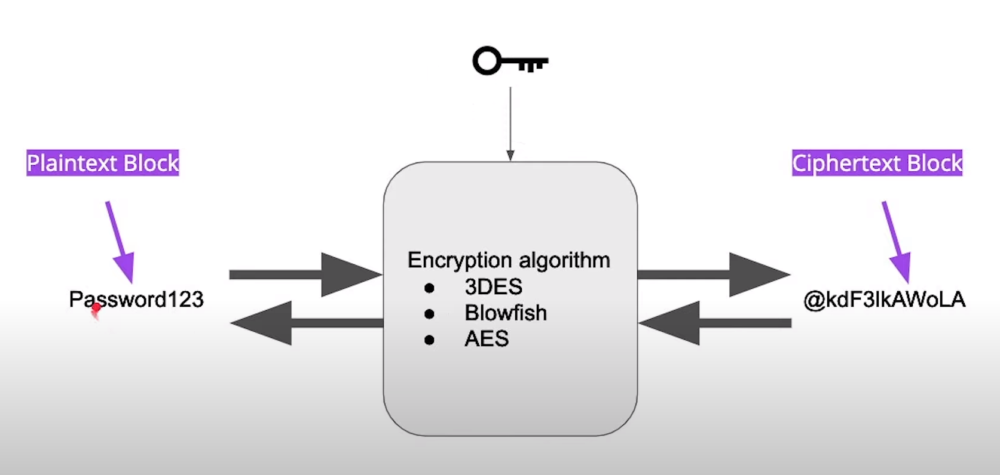
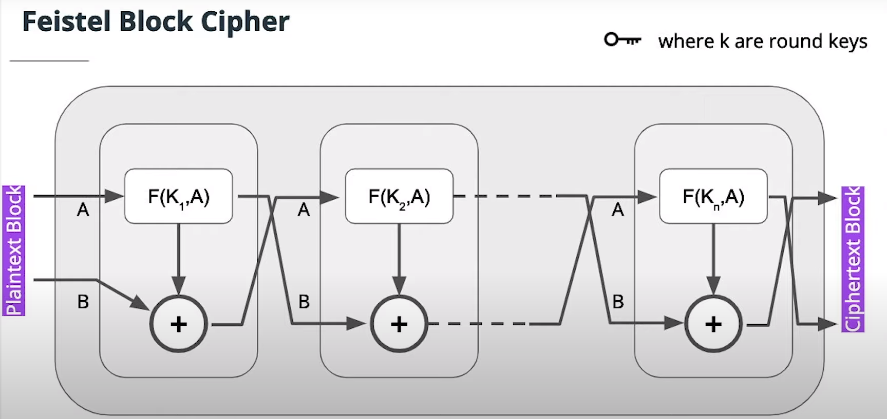
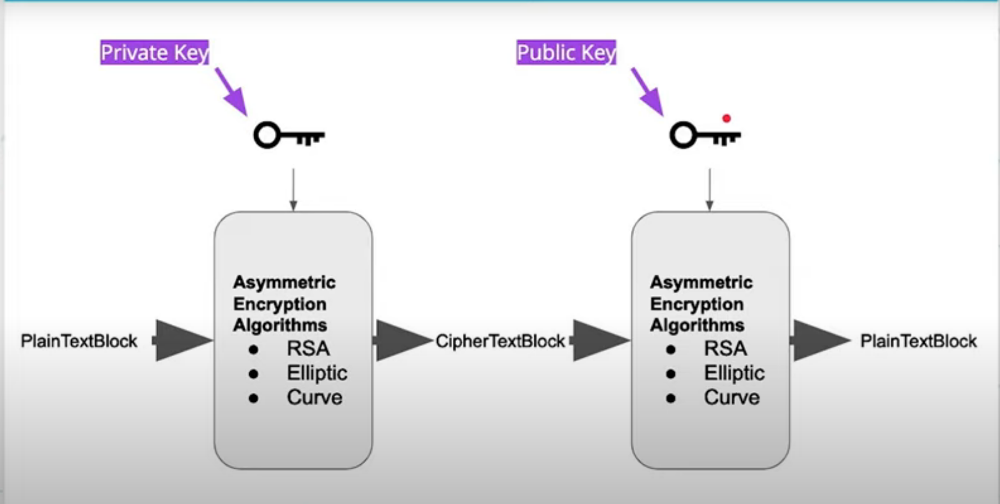
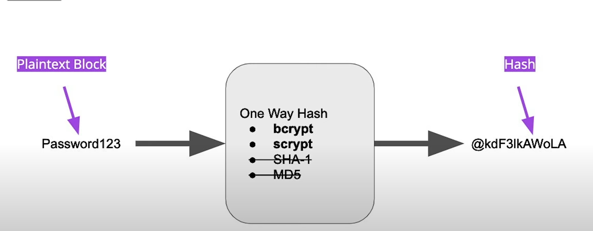
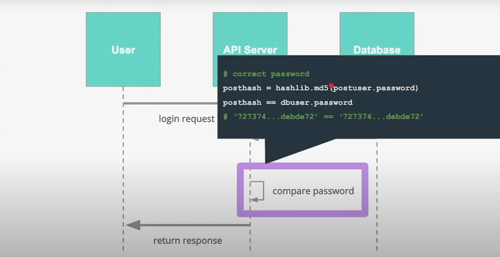
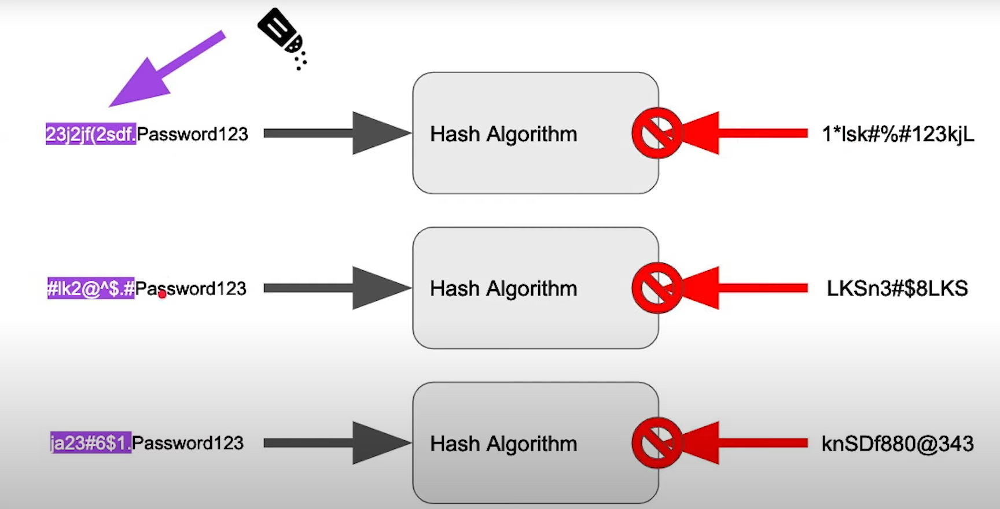

Storing Passwords as plain text in our database is bad for several reasons
* The password for the database could be bad and that could be a single point of failure
* There could be bad actors within the organization the will have access to the database
* If a SQL injection attack were to occur, these passwords could be vulnerable
* automated backups may not have the best security

Backend servers may not have the best security either
* developers may be logging user data in debug logs also in plain text
* additionally, developers may request user data from an ORM and forget to close the ORM later on which also opens us up to vulnerabily

In transit data may also be vulnerable
* If any plain text data transfers happen between frontend and backend or backend and database, this data will be vulnerable if the transmissions are not encrypted
* Hotel/airplane WIFI is notorious for not encrypting data in transit

Yet people still store plain text passwords in a database for a simple reason
* It's easy to do a string comparison

However, the correct way of rehashing a user's password to compare with the encrypted field in the database is not that difficult either.

## SQL injection



SQL Injection attacks are when field input is not properly sanitized and users can enter arbitrary sql code.

### Mitigation

* Always validate input
    * Make sure on the frontend that you're getting the data that you want
* Always sanitize input
    * Ensure that the backend also sanitizes input as the frontend can also be turned off by tech savvy users
    * also treat input as flat strings
    * escape any special characters
* Use an ORM where possible
* If you're enterring raw sql, use prepared statements
```sql
select * from users where username = ?;
```
where the actual username is filled in later

## Brute Force

This attack is continuously trying a username and password until we eventually succeed. Below is all the code that is necessary for this type of attack. All we would need is a for loop and a dictionary of strings and we'll be able to guess everything.

```py
# Notice that we need to use the str function rstrip to strip any newline characters
import requests
def try_password(password, print_all=False):
    # specify where to make the request
    url = 'http://127.0.0.1:5000/login'
    
    # define the payload for the post request
    payload = {'password': password}
    
    # make the request
    r = requests.post(url, json=payload)
    
    # print some results (http status code)
    if(print_all):
        print(payload['password'] + ":" + str(r.status_code))
    
    # determine if we've gained access 200 = success!
    if(r.status_code == 200):
        print("the password is: " + payload['password'])
        return True
    else:
        return False

with open('nist_10000.txt', newline='\n') as bad_passwords:
    for password in bad_passwords:
        if try_password(str. rstrip(password), True):
            print(f'success on pass: {password}')
            break;
```

The following is the server that this attack is initially run against

```py
from flask import Flask, request, abort
import hashlib

app = Flask(__name__)

# make a post request
# it should include a json body 
# with a password paramater as a string
@app.route('/login', methods=['POST'])
def headers():
    data = request.get_json()
    # invalid input format
    if('password' not in data):
        abort(422)
    elif(type(data['password']) is not str):
        abort(422)

    # check password
    # hash the password
    # > this is technically not plain text
    # > you'll learn about hashing soon
    # > we didn't want to make it easy for you to cheat ;)
    digest = hashlib.md5(data['password'].encode()).hexdigest()
    
    # compare the password to the message digest
    if(digest == '2f3a4fccca6406e35bcf33e92dd93135'):
        return "ACCESS GRANTED"
    else:
        abort(401)
```

### Mitigation

* Ratelimit
    * Only allow a certain amount of attempts in a certain amount of time
* Don't allow common passwords
    * Enforce a good password policy that wouldn't all easy to guess passwords
* Log for multiple attempts that look like this type of attack
    * Send an alert if something like this is discovered
* Enforcing CAPTCHAs
    * Presumably, only humans are able to do these so this would mitigate any attempt by robots
    * A modern implementation of a CAPTCHA is Google rating you on a scale on 1 to 10 based on your interactions with that page

Redoing the server code slightly, the following server code will introduce rate limiting

```py
from flask import Flask, request, abort
import datetime
import hashlib

app = Flask(__name__)

num_requests = 0
locking_time = None
locked = False

# make a post request
# it should include a json body 
# with a password paramater as a string
@app.route('/login', methods=['POST'])
def headers():
    global locked
    global num_requests
    global locking_time
    if locked:
        # check if 5 min have passed and open the account if it is
        if datetime.datetime.now() >= locking_time + datetime.timedelta(seconds=5):
            locked = False
            locked_time = None
            num_requests = 0 
        # if it hasn't been 5 minutes, abort with 422
        else:
            abort(422)
    if num_requests == 10:
        # if we reach the number of requests to lock
        # set account locked, record time, and abort
        print('locking future requests')
        locking_time = datetime.datetime.now()
        locked = True;
        abort(422)
    else:
        print(f'add one to requests')
        num_requests += 1
    data = request.get_json()
    # invalid input format
    if('password' not in data):
        abort(422)
    elif(type(data['password']) is not str):
        abort(422)

    # check password
    # hash the password
    # > this is technically not plain text
    # > you'll learn about hashing soon
    # > we didn't want to make it easy for you to cheat ;)
    digest = hashlib.md5(data['password'].encode()).hexdigest()
    
    # compare the password to the message digest
    if(digest == '2f3a4fccca6406e35bcf33e92dd93135'):
        return "ACCESS GRANTED"
    else:
        abort(401)
```

## Serialization

Only store the data needed for a certain task

## Logging

We should be logging the following data:
* Login attempts
    * Number of times
* Login sources
    * What IP they are coming from
* Requested Resources
    * What information are they trying to access


Keeping this type of data in log files helps us better be able to detect possible attacks

Conversly, we should not be logging the following information

* Personally identifiable information
    * When logging, we should log IDs and not user names
* Secrets
    * Passphrases for encryption
* Passwords

Developers will often use console logs and the like to debug their apps, make sure to remove this debug logic before it reaches production

# Encryption and hashing for better password protection

The benefit of encryption is that even if the table does get dumped, encryption will an extra layer of security so that the attacker would still need the key to decrypt the passwords

**Encryption** should be two way and should be able to be decoded by someone with sufficient credential. The most basic encryption algorithm is a **Simple Substitution** in which the alphabet is just shifted



This algorithm is extremely easy to crack given enough information so more sophisticated algorithms are needed

## Symtric Encryption


Modern Encryption has the following main parts
* Plaintext block
* Ciphertext Block
* Encryption algorithm
* Key



**Symmetric encryption** will use this idea of having one key that we keep secret to both encrypt and decrypt the data.

Most algorithms use what's known as the **Feistel Block Cipher** which takes a key along with a function and scrambles the results a sufficient number of times to produce a cipher block



Use of this cipher also means that losing the key means that we lose the ability to decrypt our data. Furthermore, this key should only be given to the people and systems that need them.

The following is an example of using the cryptography package of python to encrypt and decrypt

```py
from cryptography.fernet import Fernet

# The following codeblock will generate a key that will be attached to the class
key = Fernet.generate_key()
f = Fernet(key)

plaintext = b"encryption is very useful" # It's important to note that our plaintext must be a byte literal string
ciphertext = f.encrypt(plaintext) # Our cipher text was created using the encrypt function attached to the Fernet class that we instantiated with the key
decryptedtext = f.decrypt(ciphertext) # To get the plaintext back, we'll just use the decrypt function of the same class object
```

Symetric encryption still has the problem of transmitting data in plaintext, therefor asymetric encryption exists to help with that problem

## Asymetric encryption

This is more complicated that regular symetric encryption but is stronger. We will use a private key to encrypt data and a public key to decrypt data. The private key is meant to remain in our possession while the public key can be shared between services needing to use it. TLS/SSL part of HTTPS use asymetric encryption.



Asymetric encryption may sometimes be referred to as **public key encryption** due to the existence of a sharable public key.

## Hashing

**Hashing** is a method where no key is used as the algorithm only works one way. It's impossible (baring brute force) to reverse a hash to find the plaintext version. With this in mind, it's ideal to hash passwords as we're able to compare the hash of what the user entered with the hash that we have stored in the database. However, because hashes are not reversable, this may not be ideal for other types of data. This is why RSA is a popular asymetric encryption algorithm used by banks. Hashes may also be referred to as message digests.



Notice in the above image that SHA-1 and MD5 are crossed out. This is because they are weaker algorithms and should not be used.

Hashing guarantees that each produced message hash will be unique.

The following is a way that we can use hashing functions to compare passwords.



This way, our backend never has the plaintext password nor are we able to sniff the plaintext that the user has entered.

## Salts

One way to help guard against these rainbow table attacks is to use a process known as **salting** a password. Salting a password is concatenating a random string with our password so that even two users with the same passwords will have different hashes.



For a developper, this simply amounts to storing the salt in the database table as well so that when we're comparing the plaintext password with our hash later on, we know the salt to concatenate to the plaintext password. Good Salts need to cover the following issues
* The salts must be long enough to prevent a rainbow table from being feasible
* The salts must be random
    * `bcrypt.gensalt(14)` is sufficient enough to generate a salt alongside your password
* Use salt rounds
    * When a password is generated, we should use multiple salt rounds in order to keep scrambling the results. We'll store all of those salts in our database
* If a user needs to change their password, we need to generate a new salt as well
* No two salts should be the same
This is a cost factor for how many times a password and salt should be re-hashed. In other words if you choose 10 salt rounds, the calculation is performed 2^10 or 1024 times. Each attempt takes the hash from the previous round as an input. The more rounds performed, the more computation is required to compute the hash. This will not cause significant time for a single attempt (i.e. checking a password at login), but will introduce significant time when attempting to brute force or generate rainbow tables.

Generating a salt to be used alongside our password is not very difficult to do.
```py
import bcrypt
password=b"studyhard" # notice again that a byte literal is used
salt = bcrypt.gensalt(14)
hashed = bcrypt.hashpw(password, salt)
```

When it comes time to check the password that the user has entered, we simple use the `checkpw` function

```py
bcrypt.checkpw(password, hashed)
```

One additional method to add an extra layer of security is to feed our hashing algorithm a secret. Most modern hashing functions require a secret in our to make the hashing function more unique to your system.