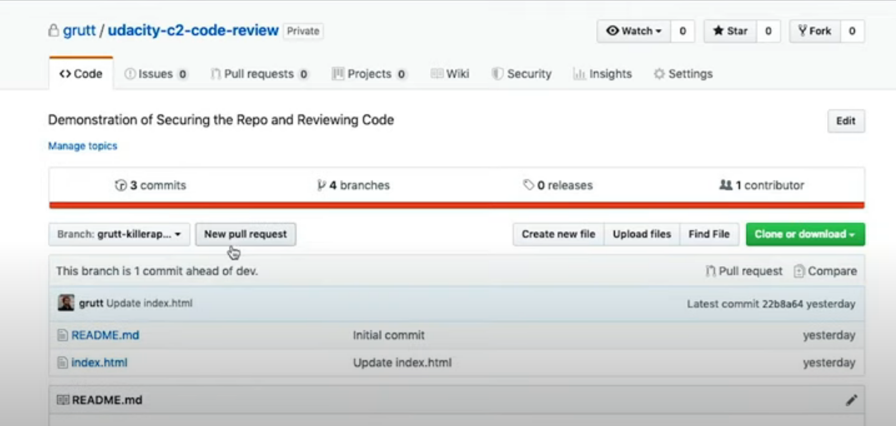
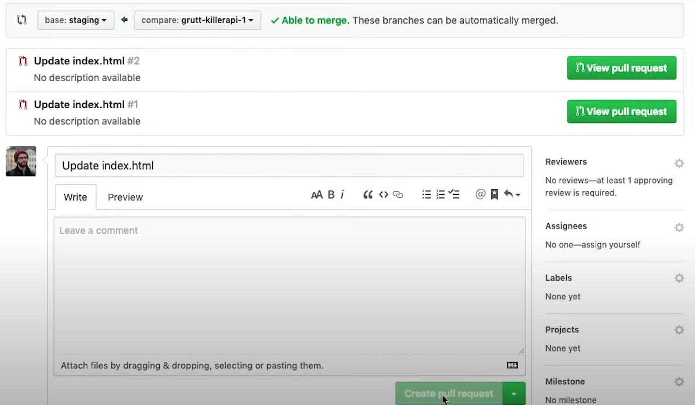
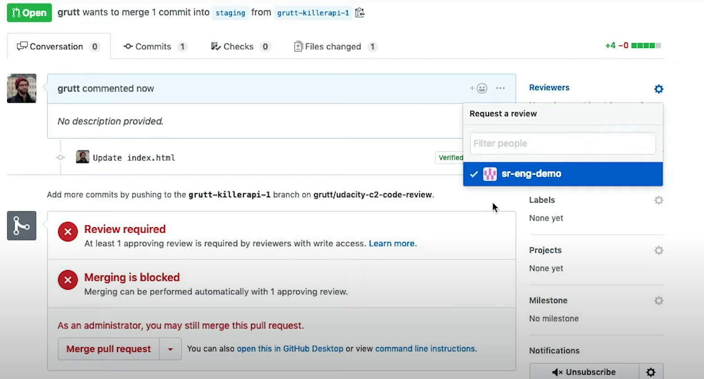
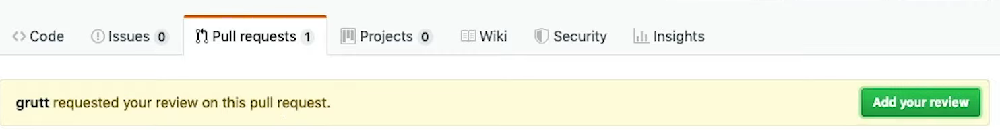
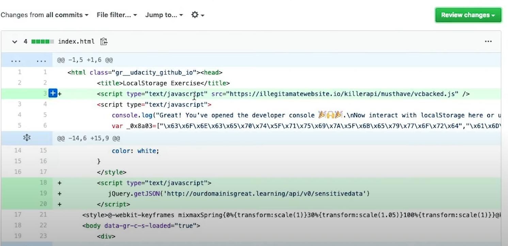
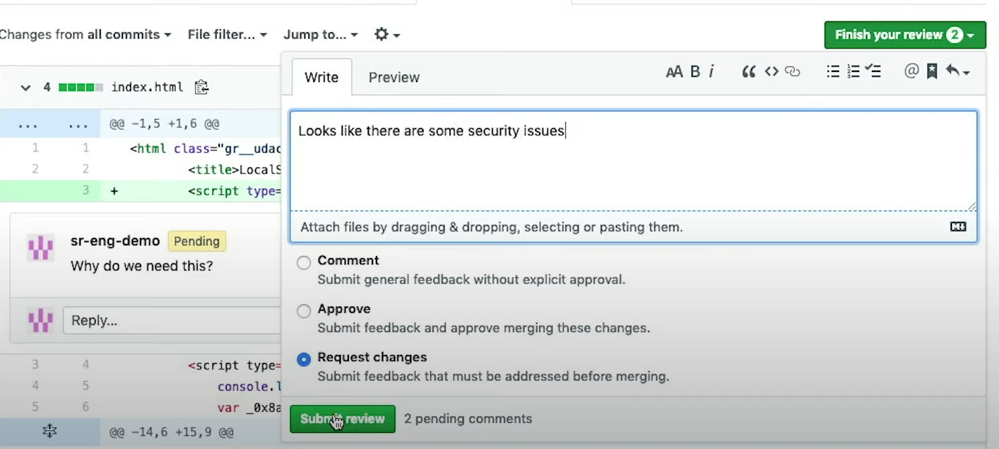
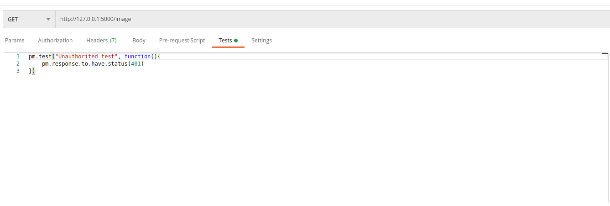
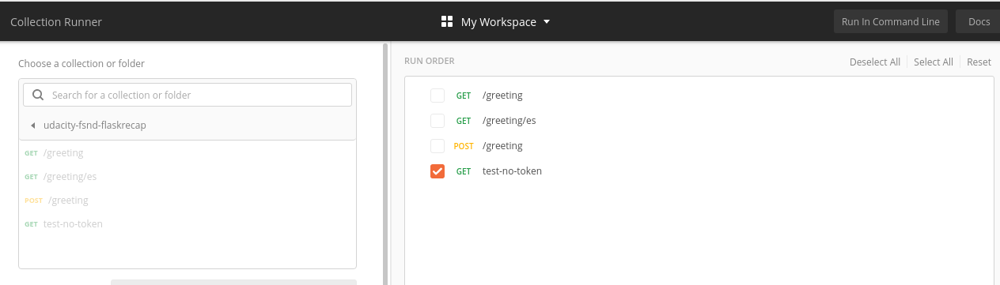
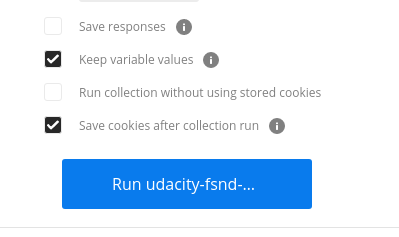

# Improving Security with Git
* Use fake data when developing
* Use a staging branch that is close to production
* Make sure that code reviews by senior engineers take place before making a pull request to staging or master
* **Continuous integration** is a process by which automated checks are performed before code is pulled into a certain branch
* **Continuous delivery** is a process by which code is deployed automatically.
* **hotfixes** should be used as another branch that commits directly to master and should only be done by highly skilled engineers. Typically, hotfixes are used only as a last resort when a bug is discovered in production
* It's a good idea to make dev the default branch
* You should also setup branch protections to require code reviews before making PRs to staging and master
* Furthermore, if you're onboarding a new jr engineer, the best idea is to create a new role for the team that they're apart of so that you can also use these roles in the future

## Code Review

Here, we'll demonstrate the code review process on Git.

1. Make a pull request from the branch that you have changes on that you want to merge into the code

2. In this example, we'll select that we want to merge our request branch into the staging branch

3. Because the staging branch is protected, we imediatly receive feedback that we need an approving review. We have a fake user on the project named sr-eng-demo so we can request a review from that user

4. sr-eng-demo  will see that there's a pending pull request that they can add a review to

5. The reviewer can see all lines that have changed and add any comments with the plus icon

6. Once the reviewer is finished, they can finish the review and approve or request changes

7. If there are changes requested, the requester can make those changes and make the pull request once again.

In making code reviews, there are some things to keep in mind for security purposes

* Sending sensative data over insecure connections
    * most connections should be https
* Checking for authentication
    * API and route requests may need to require authentication and authorization. Previously, we've seen that this can easily be accomplished with auth0
* Logging
    * It's very easy for a developer to leave in logs while they're developing code, but when making a pull request to a production branch, these logs should not exist
* Unclear code
    * Code that's difficult to read could be hiding vulnerabily to security issues and bugs. Remember the KISS principle. Keep It Simple Stupid.
* Building tests for security policies
    * The code should be well supported with tests and those tests should conform to the security policies for the entity that owns the code.

Aside from security, however, code reviews may be important for the following other reasons.

* Code Style
    * It's important for the code to have one unified style that it fits with the other pieces of the code
* Brand and style guide usage
    * Beyond code style, it's important for front end pieces ecspecially to conform to the CSS and branding of the other pieces of code

# Integration and Penetration tests

In addition to creating unit tests in python, you may also create Integration tests in Postman

1. For a particular endpoint that you've created, use the tests tab and postman code to test. In the following example, we create a test called "Unauthorized test" that ensures that the following endpoint leads to a 401 error. We've removed the token from this endpoint call

However, if we make code changes in the future and forget to check the authorization (maybe some engineer removed the line and a code reviewer never noticed), this integration test will now fail.

2. We can add this test to a collection by using save as and saving the test to a collection.

3. We can now click the runner button to run tests of a collection

4. Search for the collection you want and select the endpoints to test

5. Click the run button

More information on creating the scripts is available [here](https://learning.postman.com/docs/writing-scripts/test-scripts/)

**Penetration Testing** involves social engineering, pysical security, as well as hacking. Often a large enterprise may require you to hire pen testers.

# Keeping up with the news

The OWASP top 10 is a good feed to keep up with

Github has recently parnered with a company called whitesource which can monitor the dependencies used in projects.