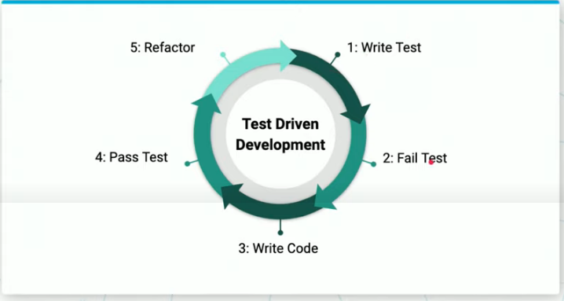

* Why test an API?
    * Verify behavior for all endpoints
    * Verify that errors are handled properly
    * Easy way to confirm continued functionality when updating the API
        * Finding and squashing bugs in development is less costly, less timely, and easier to fix than when it's in production
    * To confirm CRUD operations persist

* The order of operations for app development should be this
    1. Development
    2. Unit Testing 
    3. Quality Assurance
    4. Production

1. For testing, we import the following modules

```py
import unittest
import json
from flaskr import create_app # We can import the main create_app function
from models import setup_db # We need a function that sets up a database so that we can test CRUD
```

2. Next, we create a class for testing our resource. Our class must inherit the TestCase from unittest. Typically, we'll create a class for each resource that we may. For example, if our app has users and messages, we'll have a UsersTestCase class and a MessagesTestCase class.

```py
class ResourceTestCase(unittest.TestCase):
    """This class represents the resource test case"""
```

3. We'll need to setup two methods

* We'll use the `setup()` to create our flask app and make sure that we're connecting to our test database
    * setup is run before each test

* If any ports are still open, `teardown()` is the method you would use to ensure that those are closed
    * teardown is run after each test, regardless of outcome 

```py
def setUp(self):
        """Define test variables and initialize app."""
        self.app = create_app()
        self.client = self.app.test_client
        self.database_name = "test_db"
        self.database_path = "postgres://{}/{}".format('localhost:5432', self.database_name)
        setup_db(self.app, self.database_path)

        # binds the app to the current context
        with self.app.app_context():
            self.db = SQLAlchemy()
            self.db.init_app(self.app)
            # create all tables
            self.db.create_all()
    
def tearDown(self):
    """Executed after each test"""
    pass
```

I've found it useful to drop any created tables in this teardown function, this way you can always create the test database using the same indexes and values. For example, my teardown method would look like the following:

```py
def tearDown(self):
        """Drop Table after each test"""
        Book.drop_table()
```

Which calls a method on the Book class with the following definition:

```py
@classmethod
  def drop_table(cls):
    db.session.execute("DROP TABLE books")
    db.session.commit()
```

4. Finally, we'll create a class method that weill test the behavior. For this example, we want to test that making a get request to `/` will result in a 200 response code. These tests must begin with `test_`
```py
def test_given_behavior(self):
        """Test _____________ """
        res = self.client().get('/')

        self.assertEqual(res.status_code, 200)
```

5. Lastly, to run the tests using a testing client like nose2, we'll include these last two lines:

```py
if __name__ == "__main__":
    unittest.main()
```

You can execute the above test with `python test_file_name.py`

## Test Driven Development

**Test Driven Development** is a key paradigm in programming where we write the intended behavior in the tests before we write the code



In fact, if you're pair programming with a colleague, then one person will write the test while one person will implement the code.
This helps to keep the development cycles short and rapid.

### Different types of testing

A question that I decided to do a little bit of research on is the difference between different types of testing

**Unit Testing** - This type of test will test the functionality of one component of your application. These components will be tested with any interaction with other components.
**Integration Testing** - This type of test will test how these components will integrate to one another.
**End to end testing** - This type of test will test how an end user would interact with the full application

Reference: [https://www.softwaretestinghelp.com/the-difference-between-unit-integration-and-functional-testing/#:~:text=Unit%20testing%20means%20testing%20individual,combined%20together%20as%20a%20group.](https://www.softwaretestinghelp.com/the-difference-between-unit-integration-and-functional-testing/#:~:text=Unit%20testing%20means%20testing%20individual,combined%20together%20as%20a%20group.)