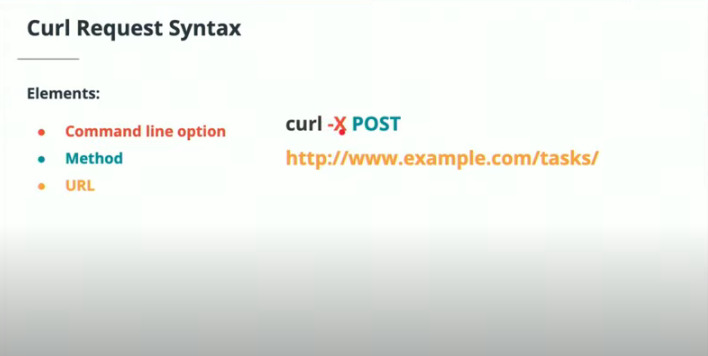

HTTP is **connectionless** meaning that when a client makes a request to a server and then the server subsequently returns a response to the client, the connection is closed so that the port, often 80 is doesn't remain open and will be available for other traffic

Here is an example of situation that is not connectionless
```
The client makes a request and opens a connection over port 3000 to the server. When they receive the response, that port doesn't close. When a new request is sent, it fails because the port is occupied.
```

HTTP is **stateless** meaning that the requests do not have dependencies
Headers, cookies, and caches create **sessions** that we can use to let the browser know who we are
**Media Independent** is an attribute of http that means that messages are standardized in text, html, or json and these do not depend on what device is being used to access the data

## HTTP elements

* Uniform Resource Identifier (URI)
    * URLs are a type of URI in that URIs are addresses to specific resources
    * APIs use URIs to be able to locate certain resources on a server
* Messages
    * Request is sent from the client to the server
    * Response is sent from the server to the client
* Status Codes
    * APIs will typically return a code in their response that reflects the status of the response
    * Examples
        * 404. The resource was not found
        * 500. A server error has occured

## HTTP requests


* Method is **http verb** that we use to make a request to a resource
* Path is where the request is going on the server. The address of the endpoint
* HTTP version is the version to use to communicate with the server
* Headers are additional information specifying other attributes like language, authentication, format of message, etc.
* Body is the actual content of the request
    * If using POST as the verb, for example, this might contain the form data

Optionally, we may be able to specify a host parameter with some requests so that all of our paths can be relative


### Request Methods

The following are the most common HTTP request methods. There are more methods, but these are the ones most likely to be used. These methods are indications of the operations performed by the server. Though you can define a method as POST that simply gives read only information, this would be incorrect to other developers using this API.

| Method | Description |
|---|---|
| Get | The most common HTTP verb. This simply retrieves data from a server. Think of this a READ in a CRUD operation |
| Post | Used to create a new resource. In terms of CRUD, this is the create |
| PUT | Put will update the entire resource. This is very similar to Patch but this will update the entire resource, even overwriting data that may not need to be update. In terms of CRUD, this is Update |
| Patch | Similar to Put, this will only partially update the resource with what's needed. Typically, this is safer than a PUT request because there's no change of overwriting anything unintended. This is also Update in the CRUD example |
| DELETE | This simply deletes a resource at a specified URI. This is the delete is CRUD |
| Options | This method is not used very frequently. This will send communication options sort of like additional headers |

**Special Note**: Options requests are automatically implemented with Flask

## HTTP Response


The response will look similar to the request with these new params

* Status code refers to the code for the status of the response sent from the server
    * For example, 404 and 500
* Status message is the actual message of the response sent
    * For 200, OK is usually sent as the message just to let the client know that the request succeeded
    * In a GET request, what's sent back from the server will be included in the body

### Status codes

* 1xx codes are information
    * These codes are rarely ever seen but are typically associated with the OPTIONS http method
* 2xx codes are success messages
* 3xx codes indicate that a redirection has occured as a result of the response
* 4xx codes indicate that an error has occured on the client side
    * for example, a 404 error indicates the client has requested a resource that no longer exists
* 5xx codes indicate that an error has occured on the server side
    * Maybe the server was coded incorrectly

Common codes

| Code | Message | Notes |
|---|---|---|
| 100 | Continue | Typically associated with OPTIONS http method and indicates that the server is ok to continue processing |
| 200 | OK | The server has successfully processed the request. Data is returned in the response body |
| 201 | Created | A resource has been successfully created. Because this involves creation of resources, this is typically associated with POST requests |
| 304 | Not Modified | Seen with PUT and Patch |
| 400 | Bad Request | The request was formatted incorrectly |
| 401 | Unauthorized | The request was formatted correctly but you are not authorized to make the request |
| 404 | Not found | Resource was not found on the server |
| 405 | Method Not Allowed | The HTTP method used by the client was not accepted by the server. The server may be configured to only accept GET on \dogs but a PUT was received. |
| 500 | Internal Server Error | The server has encountered an error and cannot process the request

## Basic app to test endpoints

For this app, we're going to create it slightly differently than last time just to show a different way to create apps

1. Create a project directory, api, and navigate into it
2. Create a virtual environment and install flask with `pipenv install flask`
3. Create a file `flaskr/__init__.py with the following code:

```py
from flask import Flask, jsonify

def create_app(test_config=None):
    app = Flask(__name__)

    return app
```

4. Export the following python variables:

```bash
# set the flaskr directory as the start point for our app
export FLASK_APP=flaskr  
# sets the app in development mode so that we can take advantage of features such as hot reload
export FLASK_ENV=development
```

**Special Note**: rather than exporting these variables each terminal session, you can define a `.flaskenv` file outside of the flaskr directory with the following syntax:

```bash
FLASK_APP=flaskr
FLASK_ENV=development
```

You will also need to install dotenv with `pipenv install python-dotenv`

5. Run the app (within the virtual environment) by using `pipenv run flask run`

One thing to note is that our app may have a different directory structure based on our setup


When your application becomes more advanced, you may also want to start using config classes so that you can more easily manage your variables. 

1. Create a config module outside of the flaskr directory

```py
import os
from dotenv import load_dotenv

basedir = os.path.abspath(os.path.dirname(__file__))
load_dotenv(os.path.join(basedir, '.env'))


class Config(object):
    SECRET_KEY = os.environ.get('SECRET_KEY') or 'you-will-never-guess'

class TestConfig(object):
    SECRET_KEY = os.environ.get('SECRET_KEY') or 'you-might-guess'
```

You can modify app to use a config class 

```py
from flask import Flask, jsonify
from config import Config, TestConfig

def create_app(config_class=Config):
    app = Flask(__name__)
    app.config.from_object(config_class)
    print(app.config['SECRET_KEY'])
    ...
```

Now if you switch config class to TestConfig, you'll see that you get a different response for the SECRET KEY var

# Using Curl

You can use curl to test out api endpoints



curl is installed by default on linux

Curl has a couple common commands that you should be familiar with


Curl may also return a very long string so it may useful to use some linux commands to look for what you want

```bash
curl -X GET https://pokeapi.co/api/v2/move/47 | json_pp | grep accuracy
```

`json_pp` will pretty print the json formatted text while `grep` will search for the specified term