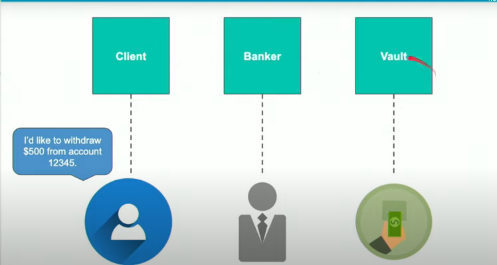
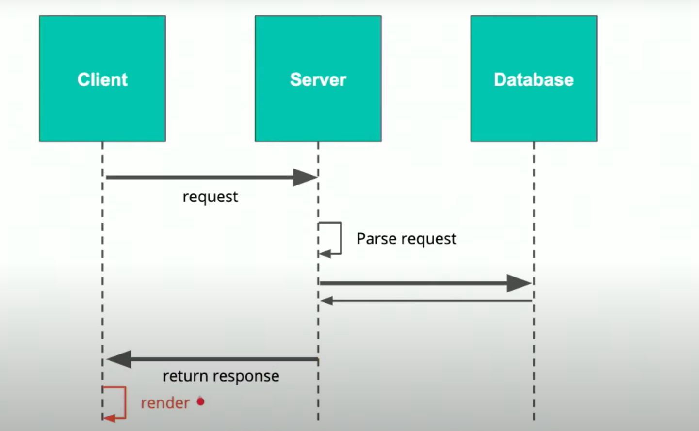

**API**s allow companies to share data in a secure way. It allows for

* Doesn't expose application implementation
* Controlled exposure of your application and your data
* Standardized way of accessing data

[Spotify](https://developer.spotify.com/documentation/web-api/) is an example of an API with very extensive documentation. It contains a link to a [reference page](https://developer.spotify.com/documentation/web-api/reference/) which has all of the endpoints listed. The API documentation has the following flow:

* Requests
    * This section lists all of the HTTP verbs and a definition of the effect that they have on certain resources
* Spotify URIs and IDs
    * This section will list the specific parameters that may be asked for by the endpoints
* Rate Limiting
    * This section will discuss how the application will only answer a certain amount of requests and suggests to use bulk endpoints such as getting several tracks to reduce the number of calls that need to be made
    * Specifically, Spotify will issue a 429 status code if you send too many requests and inform you to wait a certain amount of time before retrying
* Responses
    * all responses are received as JSON and follow a specific [model](https://developer.spotify.com/documentation/web-api/reference/object-model/)
* Timestamps
    * all timestamps are returned as a string with timezone information
* Pagination
    * Since some endpoints can be long responses, they'll have additional params to include how you can limit the response to just what you want

```bash
$ curl
https://api.spotify.com/v1/artists/1vCWHaC5f2uS3yhpwWbIA6/albums?album_type=SINGLE&offset=20&limit=10
```

* Conditional requests
    * How users may be able to cache responses by using HTTP headers
* Response Status Codes
    * What HTTP status codes refer to in their context
* Errors
    * How the api handles errors in responses
* Authentication
    * How the api will authenticate users using OAuth which they detail [here](https://developer.spotify.com/documentation/general/guides/authorization-guide/)

A good example of an api relation is a client withdrawing money from a bank. The client asks the banker to retreive money from the vault. The banker has several tasks: to get the money they want to withdraw, to get the account the money belongs to, to verify the identity of the user, etc. This is similar to a client trying to retreive data from a database. The banker is now an API on the server who needs to parse the request and authenticate the request.





## RESTful APIs

* REpresentational State Tranfer
* Introduced in a dissertation in 2000
* Uniform interface
    * responses must return data in a standarized way such as JSON or XML
* Stateless
    * Request B should not depend on request A so that B can be made as a standalone API request
* Client Server
    * All RESTful APIs should follow the client-server architecture
* Cacheable
    * Responses must be able to be cached. They shouldn't need to be cached and shouldn't break the stateless requirement (we get around this by creating cookies and others)