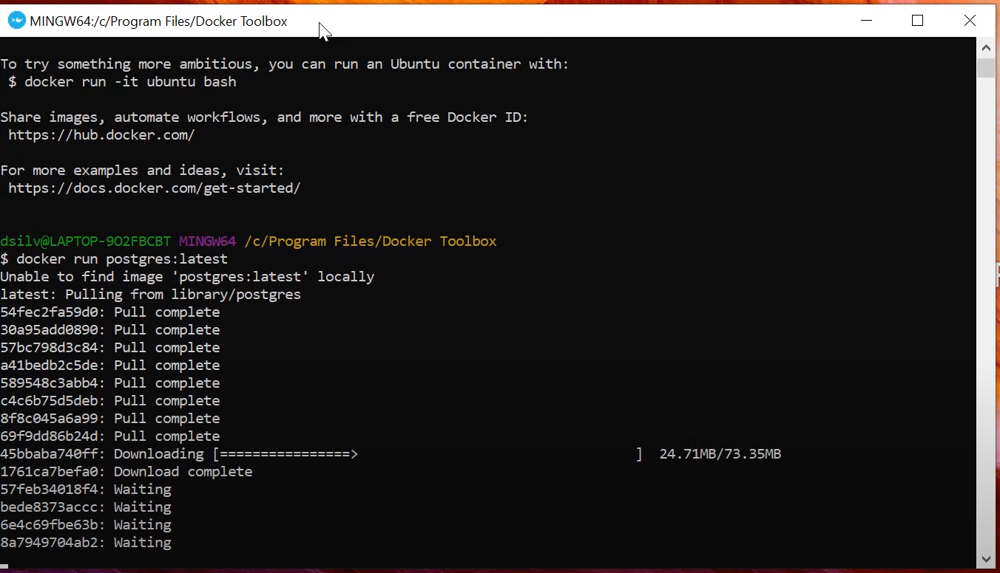
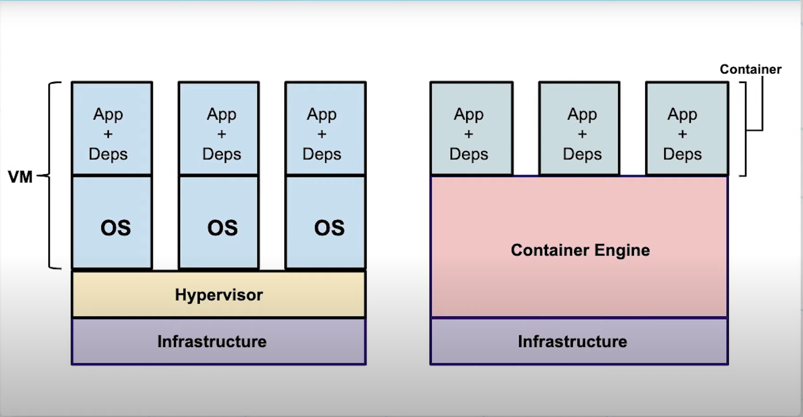
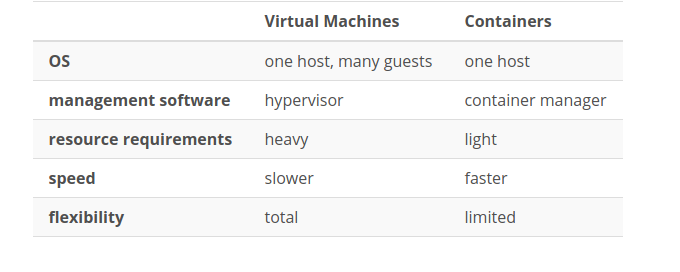

## The problem

Production and development environments may differ in dependencies and environmental variable. The solution for this is to bundle your application with your dependencies and environmental variables so that you can be confident that deployment from development/staging to production is a smooth transition. Two common methods are bundling your applications are to use **containers** and **virtual machines**. Virtual Machines has been around for a long time so that concept is not new as it's typically used by IT Admins to use applications apart from their host systems.

## Containers

Containers are more of a lightweight version of virtual machines and is typically used more by developers. The main advantages of containers are listed below:

* Application and Dependecies are bundled within the container allowing for a more smooth deployment and so that the differences between dev, staging, and production are minimized.
* The container shares a lifespan with the application so that when the app is finished with its execution, the container will also be stopped.
* Containers can be **horizontally scalable** meaning if an app needs more power, we can simply spin up more containers to have them run in parallel.
* Containers running on the same machine will share the same low level kernel.

 Containers isolate software from its environment and ensure that it works uniformly despite differences. **Docker** are the most common containers. **Docker Images** become **Docker Containers** only when the containers are run. If there are multiple Docker Containers, they run on the **Docker Engine**. Because containers run applications seperately from the host OS, they are also considered to be more secure.

## Docker

 Docker is both an open source project and company. Originally, they started only using Linux containers in 2013, but they're since partnered with Microsoft and began making Windows containers. However, Windows conainers are only able to be run on a Windows host OS.

Docker has installers for Windows (through the docker toolbox), Linux (through apt-get), and OSX 

 With docker installed, you can run any software of your choosing. If the docker image is unable to be found locally, the image will be pulled from **Dockerhub**.

 

### Docker Concepts

When working with Docker, there are some concepts to be aware of:


* Docker Engine is composed of the following three
    * Daemon - This is the low level daemon that handles the lifecycle of the container.
    * API - This is the middleware so that the client can interact with the daemon.
    * Client - This is what you interact with through the command line. These are the commands that you can issue to start/stop the containers.

* Docker Images - These are the templates that are used to start containers
* Docker Containers - These are runnable instances of images
* Docker Registry - These are the public or private locations where images are stored. One such public registry is **dockerhub**. You can also [create your own registry](https://docs.docker.com/registry/) since the registry is just a server side application to host images.
* Volume - Containers aren't meant to store persistent data so we can attach a volume to store persistent data

## Containers vs. Virtual Machines

Virtual Machines have their own copies of operation systems the all communicate on a **hypervisor**. This makes it possible to run a Windows Virtual Machine alongside a Linux Virtual Machine. This makes Virtual Machines more resource intensive so they're not very scalable. Conversely, Containers will all run on an engine that shares resource of the host machine. This engine is then able to partition resources as needed to different containers. Because containers don't have their own operating systems, you're unable to run, for instance, a Windows container and a linux container.

Because containers are lightweight and share a kernel, they're also **faster**.





## Dockerhub

We can download an image use `docker pull <image name>` where we can append the version with a colon

```bash
docker pull postgres:latest
```

## Running Docker

We can now run the image with `docker run`. This can be run simply as

```bash
docker run hello-world
```

or with more descriptive arguments as 

```bash
docker run --name psql -e POSTGRES_PASSWORD=password! -p 5435:5432 -d postgres:latest
```
where
**--name** is the name that you choose for the container
**-e** will set the environmental variables needed
**-p** sets a port for the host machine to connect to the container running on a certain port. In our case, port 5435 will run on our local machine and connect to port 5432 for the container.
**-d** will run the container in detach mode (as a background task)

We now have an instance of psql running on our machine and can run and connect psql as normal using 

If the command succeeds, you'll see a random id, which is the container id

```
96adfbe18f234cd6e22d89b062cb6af142540e9cdbf7ef3c8d9ee1790bdea93d
``` 

this is the container id which you can see using 

```
docker ps -a
```

```bash
psql -h 0.0.0.0 -p 5435 -U postgres
```

**Note** notice that we use port 5435, the same port number that we used to bind to.

We will be prompted for the same password that we set as the environmental variable.

To stop the container, use 

```bash
docker stop psql
```

To start the container again, we can use 

```bash
docker start psql
```

**Note** the docker run command was used the first time to run an image. Now, a container is already made so we'll use `docker start`

and to remove the container completely, we can use

```bash
docker rm psql
```

## Dockerfiles

The following is an example of a dockerfile:

```bash
FROM python:3.7.2-slim

COPY . /app
WORKDIR /app

RUN pip install --upgrade pip
RUN pip install flask


ENTRYPOINT [“python”, “app.py”]
```

* The from command will say what image should pulled to run this
    * This is referred to as the **source image**
    * By Default, the dockerfile will look in the following order
        * Local Docker Registry
        * Dockerhub

* The copy command will copy everything from the image's app folder to the container's app folder
* The run commands are the prerequisites that the user needs to run to support the image
* Entrypoint defines the name used to instantiate the image and run it
    * Entrypoint follows the form `ENTRYPOINT ["executable", "param1", "param2"]` or `ENTRYPOINT command param1 param2`

The `docker build` command will create an image from a dockerfile and `docker run` will use the image to create a container.

* When you have a dockerfile to build from, you'll use `docker build --tag <name> .` where name is whatever name you want to give the file and `.` just refers to building from the current directory.
* To run the container and then remove it after execution (useful for temporary builds), we'll use `docker run <name> -rm` where name refers to what you've previously tagged/named the container.

As another example, we'll create a flask app using pipenv

here's the dockerfile

```docker
FROM python:3.7.2-slim

COPY . /app
WORKDIR /app

RUN pip install pipenv
RUN pipenv install flask


ENTRYPOINT ["pipenv", "run", "python", "app.py"]
```

here's the python file

```py
from flask import Flask
APP = Flask(__name__)


@APP.route('/')
def hello_world():
    return 'Hello Bill from Flask!\n'


if __name__ == '__main__':
    APP.run(host='0.0.0.0', port=8080, debug=True)
```

Now we'll build the container with the following command:

```bash
docker build --tag hello_flask .
```

and finally run the container with 

```bash
docker run -p 80:8080 hello_flask
```

Notice that we're mapping port 80 on the host machine to port 8080 of the container. We can use a simple curl command to see the output

```bash
curl http://0.0.0.0/
```

