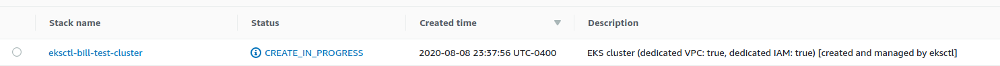
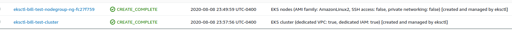
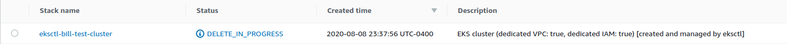
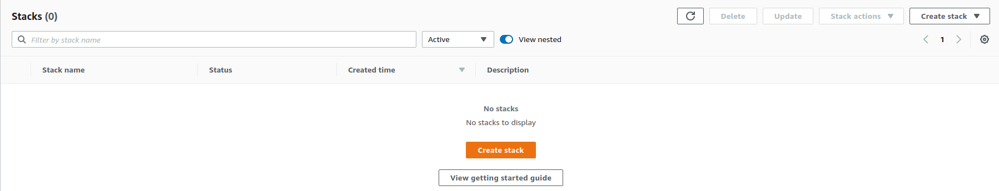
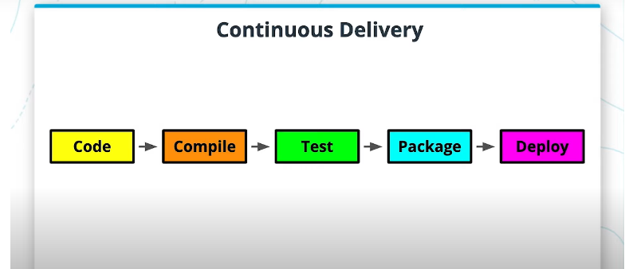
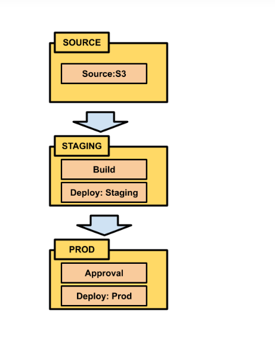
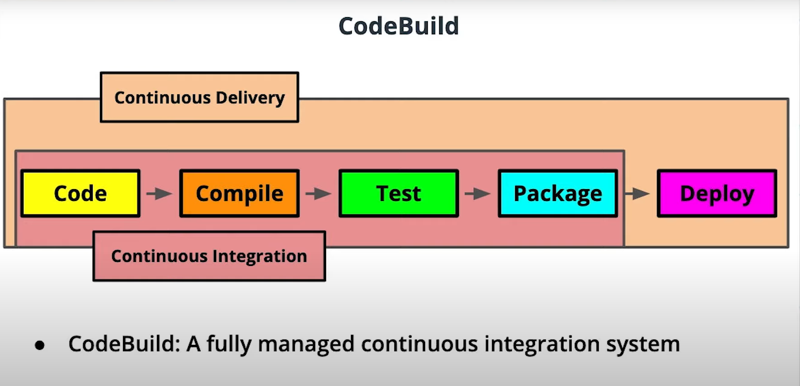

The normal method of scaling an app is to increase the resources of the machine that the app runs on, this approach is referred to as **vertical scaling** and can be costly and difficult to implement. With containers, we're able to take advantage of what's known as **horizontal scaling** where we spread the resource demand across multiple machines with resources.


## Kubernetes Concepts

* **Cluster** - A group of machines running Kubernetes
* **Master** - This is the part of the cluster that you'll communicate with. Parts of it include an api, scheduler, and management daemon
* **Notes** - The machines in a cluster are referred to as Nodes. These nodes can be virtual, pysical, or both
* **Pods** - These are the smallest units of Kubernetes. Pods are what are used to run your application. They consist of a container and its own unique IP. These are not designed to be persistent and can be brought up and down with scaling needs or if a pod/node crashes during runtime.


* Pods are ephemeral so a layer referred to as a **service** is abstracted to allow communication to the pods.
* a **volume** is used to have a persistent way to store data since using a container's writable layer is not recommended


## Amazon EKS

Manage EKS at https://us-east-2.console.aws.amazon.com/console/home?region=us-east-2#

Elastic Kubernetes Service (EKS) is a managed service by Amazon designed to maintain the Kubernetes cluster. Because EKS manages the cluster, we just need to worry about provisioning the nodes and services. EKS will not set up the cluster but it will manage it for you.
* Provides multiple availability zones so that if a cluster in one location goes down, another one is spun up automatically
* EKS provides a secure network for communication

Because Kubernetes is difficult to manage, EKS runs Kubernetes on AWS without you needing to install a Kubernetes control plane. Creating an EKS cluster is also a difficult process but is greatly simplified through a tool known as [eksctl](https://eksctl.io/). You can download and install eksctl through the [instructions found on their github](https://github.com/weaveworks/eksctl). EKSCTL is only used to help create EKS clusters and cannot be used to manage all of AWS. [kubectl](https://kubernetes.io/docs/tasks/tools/install-kubectl/) is a command line tool used for interacting with a kubernetes cluster. Many installations of docker will come with kubectl and you can check the version with `kubectl version`. If it's not installed, you can install kubectl [here](https://kubernetes.io/docs/tasks/tools/install-kubectl/). Similar to eksctl, kubectl can only be use to check the status of kubernetes pods and services of a kubernetes cluster and is unable to check s3 buckets or set up any cluster.

## Creating clusters

We can now use eksctl to setup clusters

1. `eksctl create cluster --name "<cluster_name>"` where `<cluster_name>` is an optional name for the cluster to easily track it.

Here eksctl can be used to create the cluster and all of the associated resources. This may take several minutes to deploy as a lot is happening in the background. We can check the status of the creation by going to [the cloudformation service in the aws console](https://us-east-2.console.aws.amazon.com/cloudformation/home?region=us-east-2#/stacks?filteringText=&filteringStatus=active&viewNested=true&hideStacks=false). It should appear as the following:



When the cluster and it's resources are created, you'll set this:



2. When it's finished, you can use `kubectl` to get the status of the nodes in the cluser with `kubectl get nodes`

**note** It's important to delete the eks cluster after you're finished or your bill will become expensive quickly for running all of those nodes. to do this, run `eksctl delete cluster <cluster_name>` where `<cluster_name> is the name that you previously gave your cluster. The following image of the cloudformation console will ensure that a delete is in progress:



Finally, you can confirm that the cluster is deleted from your cloud formation console with the follow image of an empty console:



## Continuous Delivery/Deployment with CodePipeline

**Continuous Delivery** is a process that seeks to make code design more efficient allowing for more frequent feedback and design iteration. **Continuous Deployment** is a type of continuous delivery where the code is deployed directly to production. Continuous Delivery seeks to automate the following areas of the software development lifecycle:

* Code Compilation
* Testing
* Packaging
* Deploy to staging area



AWS offers a service known as **codepipelines** that acts as a continuous delivery system by dividing pipelines into **stages** and then those stages can contain one or more **actions** where an action is a single process such as building the code. Actions can designate the following:

* Define a source code repo
* Define how to run tests
* Define how to deploy code to different environments
* Define a build process
* Define an approval process

The following is an example pipeline:



In the above pipeline, we are doing the following:

* Stage 1
    * Define our source code repo. In this case we're defining an s3 bucket.
* Stage 2: Staging
    * Building the code
    * Deploying the code to staging
* Stage 3: Production
    * Create an approval process where the product needs to be approved by someone
    * Deploy to production once that process has been approved

Pipelines can be created either by using the CodePipelines console on aws or by using the awscli. The pipeline will watch that code repo for changes where that change will trigger an action.

**Continuous Integration** is a continuous delivery process without any deployment of code. The motivation behind continuous integration is that developers are motivated to check in code to repos where automated builds/tests take place.



**Codebuild** is a service offered by AWS that will automate the process of continuous integration. CodeBuild is able to be added to the process of CodePipeline as an action to a stage. CodeBuild is designed to build, test, and create deployable packages. These deployable packages are often referred to as **artifacts**. CodeBuild can be used to detect changes on repos in S3, CodeCommit, or Github. A buildspec file will need to be included in the project in order to deploy using codebuild. A **buildspec** file is written using YAML syntax and is name buildspec.yml. An example of this file is shown below. As you can see, the yml file is divided into three sections with commands. These commands are familiar as running docker. A **pre-build** is typically used to prepare for a build such as installing npm dependencies or signing into any services. **build** is the phase that you might use during a build such as packaging images. **install** is the phase during installation of the codebuild and it is is recommended to install anything such as a testing framework. More information on the phases are found on [https://docs.aws.amazon.com/codebuild/latest/userguide/build-spec-ref.html#build-spec-ref-syntax](https://docs.aws.amazon.com/codebuild/latest/userguide/build-spec-ref.html#build-spec-ref-syntax)

```yml
version: 0.2

phases:
  install:
    commands:
      - nohup /usr/local/bin/dockerd --host=unix:///var/run/docker.sock --host=tcp://127.0.0.1:2375 --storage-driver=overlay2&
      - timeout 15 sh -c "until docker info; do echo .; sleep 1; done"
  pre_build:
    commands:
      - docker build -t helloworld .
  build:
    commands:
      - docker images
      - docker run helloworld echo "Hello, World!" 
```

In the above codebuild, we 

* Bring up the docker daemon and wait 15 seconds in the install phase
* Build the docker image of the file of the current directory during the prebuild phase
* Run the docker container in the build phase

Some benefits of continuous integration are that

* More frequent checkins will make it easier to find and fix bugs earlier in the process

