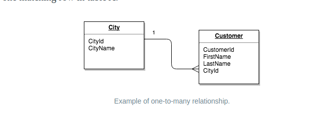

The CRUD models maps to the following:

|| SQL Statement | SQLAlchemy Code
|---|---|---|
| Create | Insert | `db.session.add(user)` |
| Read | Select |  `User.query.all()` |
| Update | Update | `user.foo = 'new value'` |
| Delete | Delete | `db.session.delete(user)` |

# MVC (Model View Controller)

## Model
Manage data and business logic of application. For example, I usually refactor my database representations under a `models` folder. 

Changes to the database schema would fall under the category of editing the models of our application

In SQLAlchemy, `Todo.query.all()` would be seen as code that accomplishes this because it references data from a database.

## View

Handles display and representation logic. This would commonly be what a user sees. In flask applications, these can commonly be as the templates.

In SQLAlchemy, `<h1>My Todo App</h1>` would be seen as code that accomplishes this because it is HTML

## Controller

Allows models and views to communicate with one another. This can be referred to as **control logic**. In flask applications, these are the routes. Our route is telling us what to display to the user as well as what data from the model to interact with.

In SQLAlchemy, `render_template('index.html', data=data)` would be seen as code that accomplishes this because it tells the app what to display to the user as well as what data from the model to use.

## Summary


The MVC design paradigm is a useful method for thinking about how to architect our application as well as locate which part of the application the bug is affecting.

For example, if we wanted to add to our application to allow for user input, we might use the following logic


# Getting user data in Flask

Sending data as a request to a server is typically done by creating a form in html

```html
<form action="action_page.php" method="post">
  <div class="imgcontainer">
    
  </div>

  <div class="container">
    <label for="uname"><b>Username</b></label>
    <input type="text" placeholder="Enter Username" name="uname" required>

    <label for="psw"><b>Password</b></label>
    <input type="password" placeholder="Enter Password" name="psw" required>

    <button type="submit">Login</button>
    <label>
      <input type="checkbox" checked="checked" name="remember"> Remember me
    </label>
  </div>

  <div class="container" style="background-color:#f1f1f1">
    <button type="button" class="cancelbtn">Cancel</button>
    <span class="psw">Forgot <a href="#">password?</a></span>
  </div>
</form>
```

The `action` attribute describes where the data is to be sent while the `method` attibute describes how the data is to be sent. We reference the data on our server by using the `name` attribute on `input` elements.

HTML forms are only able to send GET and POST requests by themselves. We'll need to use AJAX to use other HTTP verbs.

## Synchronous HTTP Requests

**Synchronous** requests are where the user sends data to a server and waits for a response to refresh the page. In these requests, the server will dictate how the data is to be handled. These are generally noticed in practice when there is a page refresh that occurs as a result of the request.

There are three commonly used ways of getting user data in a flask app.

* request.args
    * This is sending the data as **query parameters** so that the url looks like this: `/foo?field=value&field2=value2`
    * The data is attached as a dictionary to `request.args` and we retreive the data as `request.args.get(field)`
    * The upside is that this is a quick and easy way to get user input to a server
    * The downside is that this is not the most secure way if you are sending usernames and passwords
    * Another downside is that if you have a lot of data, this is not very efficient.
* `request.form`
    * accomplished by sending **POST data** from an application
    * The data comes in to our server as a dictionary on `request.form` and we retrieve it in Flask with code similar to `request.form.get('username')`
* Setting the data type of the request to `application/json`
    * This is a more modern technique of getting user data
    * The data from the request is attached to `request.data`. We must use the json library and retrieve the data of a request as 
    ```py
    import json
    data = json.loads(request.data)
    ```

## Asynchronous HTTP Requests

**Asynchronous** Requests are where the users send data and when a response is received, the data is given to the client to update the web page. This all happens without any refresh of the page occurring. These requests require the client to dictate how to use the data. This is a more popular approach when designing apps that require real time data.

Implementation of Asynchronous requests are usually done through a javascript library such as **axios** or **jquery**. There are different different ways that these requests are handled under the hood.

### XMLHttpRequest (XHR)

This is an older implementation but is still used with jquery. The following is a snippet of code to use this without a library

```js
// Create XHR object
var xhttp = new XMLHttpRequest();
// Retrieve data from DOM
description = document.getElementById("description").value;
// Open a connection with the data
xhttp.open("GET", "/todos/create?description=" + description);
// Send the data
xhttp.send();
```

After making the request, you would use code similar to the following to process the results of the request

```js
xhttp.onreadystatechange = function() { 
    // readyState = 4 just indicated that the server was ready
    if (this.readyState === 4 && this.status === 200) { 
      // on successful response
      console.log(xhttp.responseText);
    }
};
```

### Fetch Object

This is a more modern (ES2015) way to implement AJAX request. The following is an example of a fetch request:
```js
fetch('/my/request', {
  method: 'POST',
  body: JSON.stringify({
    'description': 'some description here'
  }),
  headers: {
    'Content-Type': 'application/json'
  }
});
```

Notice that we're adding header `'Content-Type': 'application/json'`. This tells the server that we can accept json and will parse it server side. In Flask, this parsing can be accomplished server side like so:

```py
    import json
    data = json.loads(request.data)
```
Fetch is supported natively in javascript

# Database Sessions

If a commit to the database fails, we will want to rollback the session to avoid any potential implicit commits done by the database on closing the connection. Remember that it is good practice to close the connection at the end of every session used in a controller so that we may return the connection back to the connection pool.

For example, when creating an object in our TODO list database, we may want error handling similar to the following code:

```py
try:
    new_task = Todo(description=task_description)
    db.session.add(new_task)
    db.session.commit()
except:
    db.session.rollback()
    print(sys.exc_info)
finally:
    db.session.close()
```

# Updating data

We can update some data in a database using the following code as a template

```py
user = User.query.get(some_id)
user.name = 'Some new name'
db.session.add(task)
db.session.commit()
```

Since we're updating, keep in mind that our HTTP verb should be PUT

```js
fetch(`/todo/${task_id}/setcomplete`, {
            method: 'PUT',
            body: JSON.stringify({
                'completionStatus': completionStatus
            }),
            headers: {
                'Content-Type': 'application/json'
            }
        })
```

# Deleting Data

We can delete data in a database using the following code as a template

```py
todo = Todo.query.get(todo_id)
db.session.delete(todo)
db.session.commit()
```

Similarly, we can perform more of a bulk delete operation

```py
Todo.query.filter_by(id=todo_id).delete()
db.session.commit()
```

Since we're deleting, keep in mind that our HTTP verb should be delete

```js
fetch(`/todo/${todo_id}/delete`, {
            method: 'DELETE'
        })
```

# Modeling relationships

We want relationships between models that a relationship affecting on model will affect another. Examples are 

* Deleting a user's account should also remove all photos, documents, etc associated with that user
* Deleting a discussion thread should also delete all comments

The following is just a review of the relationship between drivers and vehicles


If we want to get the make, model, and years of all vehicles owned by anyone with the name Sarah, for example, we might use the following sql code:

```sql
SELECT make, model, year FROM vehicles
  JOIN drivers
  ON vehicles.driver_id = drivers.id
  WHERE drivers.name = 'Sarah'
```

[GeeksForGeeks](https://www.geeksforgeeks.org/sql-join-set-1-inner-left-right-and-full-joins/) has a great reference for the differences between different types of joins. Consider the following table for the next few bullet points,


In summary,

* An **inner join** with gather data only if the row exists for both tables

```sql
SELECT StudentCourse.COURSE_ID, Student.NAME, Student.AGE FROM Student
INNER JOIN StudentCourse
ON Student.ROLL_NO = StudentCourse.ROLL_NO;
```

will yield


As you can see, Dnanraj, rohit, and niraj do not appear in the joined table because roll numbers 6,7,and 8 don't appear in the `StudentCourses` table

* A **left join** will gather data joining the left table even if the records are null for the left table

```sql
SELECT Student.NAME,StudentCourse.COURSE_ID 
FROM Student
LEFT JOIN StudentCourse 
ON StudentCourse.ROLL_NO = Student.ROLL_NO;
```


This will join the missing three records but labels course id as null because nothing exists in the `StudentCourses` table

**Note**: There is a similar right join but that is not used as much. For clarity, here is the SQL of the right join

```sql
SELECT Student.NAME,StudentCourse.COURSE_ID 
FROM Student
RIGHT JOIN StudentCourse 
ON StudentCourse.ROLL_NO = Student.ROLL_NO;
```


This join will grab all course ids from the `StudentCourses` table but joins nulls for the names because roll ids 9, 10, and 11 have no students associated with them in the `students` table

* A **full join** will gather all records for each table reguardless of if they are null

You can think of a full join as both a left and right join


## Declaring relationships in SQLAlchemy

We declare relationships by using the `db.relationship` object to declare a relationship


`db.relationships()` should be setup on the parents model whereas the foreign key constraints that we'll see below should be setup on the child models.

Joins are expensive operations. Noticeable delays generally occur when the user has to wait more than 150ms. Since these joins can add heavily to these load times, it's important to be using them when necessary. When thinking about these load times, SQLAlchemy generally has two methods for loading:

**Lazy Loading** will load the data only as needed

Pro - There's no initial wait time for the component since it's only loaded when it's need
Con - a join is performed everytime that there's a request for this asset

**Eager Loading** will load the data at once on the initial load for the asset

Pro - Since the data has been loaded up front, subsequent calls only read existing data which has more of a performance benefit
Con - This asset is loaded up front which adds to the cost

In Summary, Lazy Loading is a good option if it's data that you don't need to load a lot while eager loading is good if it's an asset that you'll be querying for a lot

The default method for loading joined assets in SQLAlchemy is lazy loading.

SQLAlchemy provides a number of other attributes that you can set on `db.relationship` which you can find [here](https://docs.sqlalchemy.org/en/13/orm/relationship_api.html#sqlalchemy.orm.relationship). Of particular interest is the `cascade` parameter which tells SQLAlchemy how to handle an action that action that occurs on the particular object. The default cascade is "save-update, merge". `save-update` indicates that when an object is placed into a Session via Session.add(), all objects associate with it via `relationship()` should also be added to that same Session. Of particular interest is `delete` indicating that when a parent object is marked for deletion, its related child objects should also be marked for deletion. For Example, assume the following class:

```py
class User(Base):
    # ...

    addresses = relationship("Address", cascade="save-update, merge, delete")
```

If we have a user object and the two related Address objects

```py
>>> user1 = sess.query(User).filter_by(id=1).first()
>>> address1, address2 = user1.addresses
```

If we mark user1 for deletion, after the flush operation, address1 and address2 will also be deleted:

```py
>>> sess.delete(user1)
>>> sess.commit()
```

## Constraints

`db.relationships()` does not set up a foreign key constraint on its own. **Foreign Key** constraints should be set on the child model and match the primary key and data type of the Parent Model.

```py
class SomParent(db.Model):
  ___tablename__ = 'some_parents__'
  id = db.Column(db.Integer, primary_key=True)
  ...

class SomeChild(db.Model):
  id = db.Column(db.Integer, primary_key=True)
  name = db.Column(db.String(50), nullable=False)
  some_parent_id=db.Column(db.Integer, db.ForeignKey('some_parents.id'), nullable=False)
```

However, using the knowledge of `db.relationships()` that we have above, we should refine our models above to create a relationship to create a join with children whenever we reference a parent

```py
class SomParent(db.Model):
  ___tablename__ = 'some_parents'
  id = db.Column(db.Integer, primary_key=True)
  children = db.relationship('SomeChild', backref = 'some_parents', lazy=True)
  ...

class SomeChild(db.Model):
  id = db.Column(db.Integer, primary_key=True)
  name = db.Column(db.String(50), nullable=False)
  some_parent_id=db.Column(db.Integer, db.ForeignKey('some_parents.id'), nullable=False)
```

There are 3 types of relationships to be aware of in [Database Design](https://database.guide/the-3-types-of-relationships-in-database-design/)

### One-to-One


These relationships are not as common as the table is really just an extension and, because of the nature of the relationship, could have just been stored in the original table.

__Other Examples__
* An account has one user
* A passport belongs to one person

### One-to-Many



This is the most common as each customer can only be assigned to one city but one city can also have multiple customers.

__Other Examples__
* A class has many students
* A teacher has many students

### Many-to-Many


This will utilize a link table (or junction/association table). This link table will contain the primary keys to both tables. The advantage of this is that we can easily create multiple links without needing large data types.

__Other Examples__
* A school teaches many subjects and a subject is taught in many schools
  * Here we would use a link table such as the following
  * We should also have a primary key constraint that is a composite key on both the subject_id and school_id
    * This way, we ensure that we don't insert any duplicate records

| Field | Note |
|---|---|
| subject_id | Foreign Key to subject
| schoool_id | Foreign Key to school |

The Following is some sql code that you might use to setup the relationship

```sql
CREATE TABLE school_subject(
  subject_id REFERENCES subjects(id)
  school_id REFERENCES schools(id)
  PRIMARY_KEY (subject_id,school_id)
)
```

Here is how we might create this in flask-sqlalchemy:

```py
subject_schools = db.Table(
  'subject_schools',
  db.Column('subject_id', db.Integer, db.ForeignKey('subject.id'), primary_key=True),
  db.Column('school_id', db.Integer, db.ForeignKey('school.id'), primary_key=True)
  )

class Subject(db.Model):
  __tablename__ = 'subject'
  id = db.Column(db.Integer, primary_key=True)
  name = db.Column(db.String(50), nullable=False)
  schools = db.relationship('School', secondary=subject_schools, backref=db.backref('subject', lazy = True))

class School(db.Model):
  __tablename__ = 'school'
  id = db.Column(db.Integer, primary_key=True)
  accreditation = db.Column(db.String(50), nullable=False)
```

**Tip**: db.relationship uses the capitalized SQLAlchemy table rather than the lowercase table name

We can now use the following on the python cli

```py
>>> from app import db, School, Subject
>>> db.create_all()
>>> subject = Subject(name='Math')
>>> school = School(accreditation='BS Degree')
>>> subject2 = Subject(name='Physics')
>>> school2 = School(accreditation='BA Degree')
>>> subject.schools = [school, school2]
>>> db.session.add(subject)
>>> db.session.commit()
```

And we'll see the following generated postgres tables

```
school_subject=# select * from subject;
 id | name 
----+------
  1 | Math
(1 row)

school_subject=# select * from school;
 id | accreditation 
----+---------------
  1 | BS Degree
  2 | BA Degree
(2 rows)

school_subject=# select * from subject_schools;
 subject_id | school_id 
------------+-----------
          1 |         1
          1 |         2
(2 rows)
```

As you can see:
1. Both subject_id and school_id are listed as primary keys which make them a composite key
2. When we set a relationship on subject, we use `subject_schools` as a secondary meaning that it's a linked table
3. We've defined the linked table using `db.Table`

## Steps for creating one-to-many relationship for todolist app

1. Create `db.relationship` on parent table

```py
class TodoList(db.Model):
    __tablename__ = 'todo_lists'
    id = db.Column(db.Integer, primary_key=True)
    ...
    todos = db.relationship('Todo', backref='list', lazy=True)
```

2. Create `db.ForeignKey` on child table

```py
class Todo(db.Model):
    id = db.Column(db.Integer, primary_key=True)
    ...
    list_id = db.Column(db.Integer, db.ForeignKey('todolists.id'), nullable=True)
```

Notice that we're setting nullable on the foreign key to True so that when we run a migration script, we'll be able to set our existing data to a "holding list"

3. Create the migration script using `flask db migrate`

4. Update the database using `flask db upgrade`

5. Join our existing todo items to a "holding list"

Assuming the name of the holding list to be 'Uncategoized', enter the following sql commands into the command line of your database

```sql
>>> insert into todolists (name) values ('Uncategorized');
>>> Update todo set list_id =(select id from todolists where name = 'Uncategorized') where list_id is null;
```

6. Now that we've updated our existing items to a holding list, we can now update the nullability constraint to false

```py
class Todo(db.Model):
    id = db.Column(db.Integer, primary_key=True)
    ...
```

7. Create another migration script

8. Upgrade the database with the migration script

As you can see above, it's a good idea to use migrations no matter how big or small the data schema change is. These migrations typically adhear to maintenance windows

### Example using relationship

Using our todolist code, we'll now do the following from the python CLI:

```py
>>> from app import db
>>> from models.todo import Todo
>>> from models.todolist import Todolist
>>> list = Todolist(name='Urgent')
>>> todo = Todo(description='important')
>>> todo.list = list
>>> db.session.add(list)
>>> db.session.commit()
```

As you can see, because of the relationship specified between todo and todolist, we're able to add the `todo.list` property to `list` and then we only neeed to add list to `db.session()`