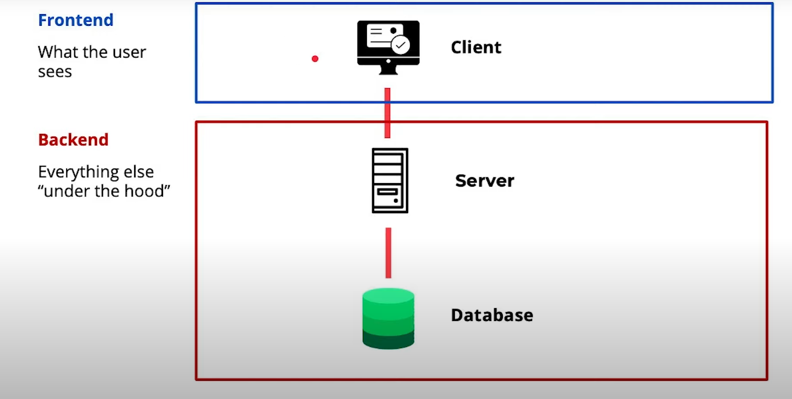
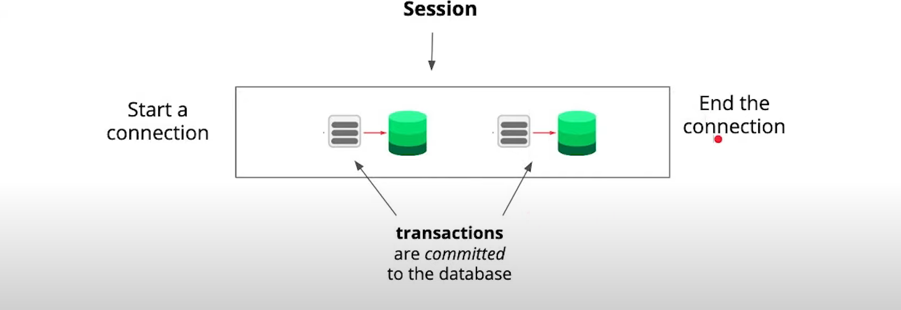
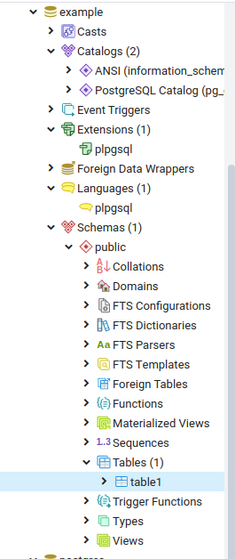

**DBAPI** - method of interacting with a webserver framework such as python, nodejs, ruby on rails, etc.

**DBMS** - software that allows you to interact with a database (access or modify data) such as PostgreSQL

Databases have a concept called **Concurrency Control** that allows multiple database actions to occur at once.

Examples of popular**relational** databases are **PostgreSQL**, **SQL Server**, and **SQLite**

**Nonrelation (NOSQL)** database are a larger family of databases that use different schemas such as **MongoDB** which use documents and **neo4j** which uses a series of graphs to store data.

In **relational databases**, all data is stored in tables and comes with a set of rules (**constraint**) for enforcing **data integrity**

If you have more than 1 column identifying the uniqueness of a table, the set of primary key columns is known as a **composite key**.

**Foreign keys** will map the primary key from one table to another table.

Every relational database system (Postgres, SQL Server, MySQL, etc.) has its own *flavor* (**dialect**) of SQL that it implements because none of them are 100% compliant with the SQL standard.

**Inner Joins** - returns rows of data only if they exist between all joined tables

**Outer Joins** - return every row that exists in the left and right joined table while rendering NULL values on rows who foreign key does not match a record in the other table. LEFT and RIGHT JOINS will return null for the other table.

A **Hash Table** is just a data structure for quickly looking things up. A **Hashing function** take a key and returns an index. A python dictionary is an example of a hash table. The advantage of a hash table is that it is O(1) if we know the key and O(n) worst case

A **database server** will treat the **web server** as a client.

The following image is the typical picture of the **client-server** model with relation to the web and also emphasizes the differences between **front-end** and **back-end**.



The client and server use a common language (called a **communication protocol**) to talk over.

**Ports** allow multiple types of traffic being received at the same time on a given device, to be tracked and routed to where they need to go. The default port for Postgres and the port that most databases use is **port 5432**

Because TCP/IP is a connection based protocol, we need to open a connection and close a connection. It's important to monitor open connections as more open connections lead to more performance bottlenecks. The advantage of this connection based approach is that deliveries over the network are **error checked** and will be resent or **retransmitted** if there is an error. Postgres uses TCP/IP to be interacted with.

Below is a good outline of a **database session**. 



In a session, many **transactions** can occur where data will be commited (update, insert, or delete). A SELECT statement or Alter Table statement would not be included in a transaction as one is a read operation and the other changes the data structure. A transaction can be thought of as an **atomic** (all succeed or all fail) unit of work for the database to perform as a whole. A transaction can have one of more of these update, insert, or delete statements. The advantage of bundling statements together is that they will either all succeed or all fail and can be cleared using **rollback**. Databases adhear to an acronym called **ACID**.

A - Atomicity - The entire transaction takes place at once or doesn't happen at all
C - Consistency - The database must be consistent before and after the transaction. A transaction should not change the state of the entire database.
I - Isolation - Multiple Transactions occur independently without interface. One transaction can't use the data in another transaction until that change is commited
D - Durability - The changes of a successful transaction occurs even if the system failure occurs. Once a transaction has occured, the change is permanent even in the face of system failure.

a **DBAPI** provides a standard interface for one programming language (like Python) to talk to a relational database server.

## SQL Commands to know

| Manipulating | Querying | Structuring | Joins | Grouping | Aggregate |
|---|---|---|---|---|---|
| Insert | Select | Create Table | (Inner) Join | Group By | Sum |
| Update |   | Alter Table | Left Join |    | Count |
| Delete |   | Drop Table | Right Join |    |    |
|   |   | Add Column |   |   |   |
|   |   | Drop Column |   |   |   |

## SQL Practice

### Manipulating data

**Schema (PostgreSQL v9.6)**
```sql
    create table drivers (
      id serial primary key,
      first_name varchar,
      last_name varchar
    );
    
    create table vehicles (
      id serial primary key,
      make varchar,
      model varchar,
      driver_id integer references drivers(id)
    );
    
    INSERT INTO drivers (first_name, last_name) VALUES ('Bill', 'Jellesma'),('Bob', 'Smith'),('John', 'Smith');
    INSERT INTO vehicles (make, model, driver_id) VALUES ('Chevy', 'Malibu', 1),('Ford', 'Station Wagon',2),('Chevy','Silverado',3);
    
    --Update name of first driver
    UPDATE drivers SET first_name = 'William' WHERE id = 1;
    
    --Delete all vehicles from driver id 2
    DELETE from vehicles where driver_id = 2;
    
    --Driver id 1 gets a new vehicle
    INSERT INTO vehicles (make, model, driver_id) VALUES ('Chevy', 'Camero', 1)
    
```
---

**Query #1**

    SELECT * from drivers ORDER by id desc;

| id  | first_name | last_name |
| --- | ---------- | --------- |
| 3   | John       | Smith     |
| 2   | Bob        | Smith     |
| 1   | William    | Jellesma  |

---
**Query #2**

    SELECT * from vehicles order by id desc LIMIT 3 ;

| id  | make  | model     | driver_id |
| --- | ----- | --------- | --------- |
| 4   | Chevy | Camero    | 1         |
| 3   | Chevy | Silverado | 3         |
| 1   | Chevy | Malibu    | 1         |

---

## Structuring Data

**Schema (PostgreSQL v9.6)**
```sql
    create table drivers (
      id serial primary key,
      first_name varchar,
      last_name varchar
    );
    
    create table vehicles (
      id serial primary key,
      make varchar,
      model varchar,
      driver_id integer references drivers(id)
    );
    
    INSERT INTO drivers (first_name, last_name) VALUES ('Bill', 'Jellesma'),('Bob', 'Smith'),('John', 'Smith');
        INSERT INTO vehicles (make, model, driver_id) VALUES ('Chevy', 'Malibu', 1),('Ford', 'Station Wagon',2),('Chevy','Silverado',3);
    
    -- Add vehicle color column
    ALTER TABLE vehicles
    ADD COLUMN color varchar;
    
    --Update vehicles to add colors
    UPDATE vehicles SET color = 'blue' WHERE id = 1;
    UPDATE vehicles SET color = 'green' WHERE id = 2;
    UPDATE vehicles SET color = 'black' WHERE id = 3;
    
    --add email and address to drivers table
    ALTER TABLE drivers
    ADD COLUMN email varchar,
    ADD COLUMN address varchar;
```
---

**Query #1**

    SELECT * from drivers ORDER by id desc;

| id  | first_name | last_name | email | address |
| --- | ---------- | --------- | ----- | ------- |
| 3   | John       | Smith     |       |         |
| 2   | Bob        | Smith     |       |         |
| 1   | Bill       | Jellesma  |       |         |

---
**Query #2**

    SELECT * from vehicles order by id desc LIMIT 3 ;

| id  | make  | model         | driver_id | color |
| --- | ----- | ------------- | --------- | ----- |
| 3   | Chevy | Silverado     | 3         | black |
| 2   | Ford  | Station Wagon | 2         | green |
| 1   | Chevy | Malibu        | 1         | blue  |

---

## Joins and Group Bys

**Schema (PostgreSQL v9.6)**
```sql
    create table drivers (
          id serial primary key,
          first_name varchar,
          last_name varchar
        );
        
        create table vehicles (
          id serial primary key,
          make varchar,
          model varchar,
          driver_id integer references drivers(id)
        );
        
    INSERT INTO drivers (first_name, last_name) VALUES ('Bill', 'Jellesma'),('Sarah', 'Smith'),('John', 'Smith');
    INSERT INTO vehicles (make, model, driver_id) VALUES ('Chevy', 'Malibu', 1),('Ford', 'Station Wagon',2),('Chevy','Silverado',3),('Chevy','Camero',1),('Tesla','Model S', 2),('Ford', 'Explorer',3);
```
---

**Query #1**

    SELECT drivers.first_name, drivers.last_name, vehicles.make, vehicles.model 
    FROM vehicles
    INNER JOIN drivers
    ON drivers.id = vehicles.driver_id
    where drivers.id = 3;

| first_name | last_name | make  | model     |
| ---------- | --------- | ----- | --------- |
| John       | Smith     | Chevy | Silverado |
| John       | Smith     | Ford  | Explorer  |

---
**Query #2**

    SELECT drivers.first_name, drivers.last_name, vehicles.make, vehicles.model 
    FROM vehicles
    INNER JOIN drivers
    ON drivers.id = vehicles.driver_id
    where drivers.first_name = 'Sarah';

| first_name | last_name | make  | model         |
| ---------- | --------- | ----- | ------------- |
| Sarah      | Smith     | Ford  | Station Wagon |
| Sarah      | Smith     | Tesla | Model S       |

---
**Query #3**

    SELECT drivers.first_name, drivers.last_name, COUNT(vehicles.driver_id) 
    FROM vehicles
    INNER JOIN drivers
    ON drivers.id = vehicles.driver_id
    GROUP BY drivers.first_name, drivers.last_name;

| first_name | last_name | count |
| ---------- | --------- | ----- |
| Sarah      | Smith     | 2     |
| Bill       | Jellesma  | 2     |
| John       | Smith     | 2     |

---
**Query #4**

    SELECT vehicles.make, COUNT(drivers.id)
    FROM vehicles
    INNER JOIN drivers
    ON drivers.id = vehicles.driver_id
    WHERE vehicles.make = 'Chevy'
    GROUP BY vehicles.make;

| make  | count |
| ----- | ----- |
| Chevy | 3     |

---

### Query to remind user of vehicle registration

**Schema (PostgreSQL v9.6)**
```sql
    create table drivers (
          id serial primary key,
          first_name varchar,
          last_name varchar
        );
        
        create table vehicles (
          id serial primary key,
          make varchar,
          model varchar,
          driver_id integer references drivers(id)
        );
        
    INSERT INTO drivers (first_name, last_name) VALUES ('Bill', 'Jellesma'),('Sarah', 'Smith'),('John', 'Smith');
    INSERT INTO vehicles (make, model, driver_id) VALUES ('Chevy', 'Malibu', 1),('Ford', 'Station Wagon',2),('Chevy','Silverado',3),('Chevy','Camero',1),('Tesla','Model S', 2),('Ford', 'Explorer',3);
    
    --Update vehicles table to show date of registration information
    ALTER TABLE vehicles
    ADD COLUMN registration_date TIMESTAMPTZ;
    UPDATE vehicles SET registration_date = '2019-06-12 00:00' WHERE id=1;
    UPDATE vehicles SET registration_date = '2020-02-01 00:00' WHERE id=2;
    UPDATE vehicles SET registration_date = '2020-05-01 00:00' WHERE id=3;
    UPDATE vehicles SET registration_date = '2019-12-22 00:00' WHERE id=4;
    UPDATE vehicles SET registration_date = '2020-01-04 00:00' WHERE id=5;
    UPDATE vehicles SET registration_date = '2020-03-22 00:00' WHERE id=6;
```
---

**Query #1**
```sql
    SELECT 
    FORMAT('%1$s %2$s', drivers.first_name, drivers.last_name) full_name,
    FORMAT('%1$s %2$s', vehicles.make, vehicles.model) vehicle,
    to_char(registration_date, 'Month DD, YYYY') date_of_registration,
    to_char(registration_date+interval '12 month', 'Month DD, YYYY') registration_due
    FROM vehicles
    INNER JOIN drivers
    ON drivers.id = vehicles.driver_id
    WHERE registration_date < NOW() - interval '11 month';
```
| full_name     | vehicle      | date_of_registration | registration_due   |
| ------------- | ------------ | -------------------- | ------------------ |
| Bill Jellesma | Chevy Malibu | June      12, 2019   | June      12, 2020 |

---

Keep in mind the execution plan on queries to identify bottlenecks. To see the full execution plan for a postgres statement, modify the above SELECT query with an EXPLAIN predessessor. We can also use ANALYZE to get the exact execution time.

```sql
EXPLAIN ANALYZE
SELECT 
FORMAT('%1$s %2$s', drivers.first_name, drivers.last_name) full_name,
FORMAT('%1$s %2$s', vehicles.make, vehicles.model) vehicle,
to_char(registration_date, 'Month DD, YYYY') date_of_registration,
to_char(registration_date+interval '12 month', 'Month DD, YYYY') registration_due
FROM vehicles
INNER JOIN drivers
ON drivers.id = vehicles.driver_id
WHERE registration_date < NOW() - interval '11 month';
```

```
Hash Join (cost=29.12..58.81 rows=250 width=128) (actual time=0.139..0.141 rows=1 loops=1)
Hash Cond: (vehicles.driver_id = drivers.id)
-> Seq Scan on vehicles (cost=0.00..23.12 rows=250 width=76) (actual time=0.008..0.010 rows=1 loops=1)
Filter: (registration_date < (now() - '11 mons'::interval))
Rows Removed by Filter: 5
-> Hash (cost=18.50..18.50 rows=850 width=68) (actual time=0.014..0.014 rows=3 loops=1)
Buckets: 1024 Batches: 1 Memory Usage: 9kB
-> Seq Scan on drivers (cost=0.00..18.50 rows=850 width=68) (actual time=0.002..0.002 rows=3 loops=1)
Planning time: 0.354 ms
Execution time: 0.199 ms
```

As you can see, hash joins are the most expensive of these operations as every row of one table is being joined to every row of another joined table.

We can speed these operations up by creating an **index**. Indexes help when we query data but should be avoided when we're modifying data. Make an index query before the select query and notice that our lookup is now faster.

```sql
CREATE INDEX idx_vehicle_id ON vehicles(id);
Explain ANALYZE
SELECT 
FORMAT('%1$s %2$s', drivers.first_name, drivers.last_name) full_name,
FORMAT('%1$s %2$s', vehicles.make, vehicles.model) vehicle,
to_char(registration_date, 'Month DD, YYYY') date_of_registration,
to_char(registration_date+interval '12 month', 'Month DD, YYYY') registration_due
FROM vehicles
INNER JOIN drivers
ON drivers.id = vehicles.driver_id
WHERE registration_date < NOW() - interval '11 month';

```

```
Nested Loop (cost=0.15..17.48 rows=2 width=128) (actual time=0.059..0.062 rows=1 loops=1)
-> Seq Scan on vehicles (cost=0.00..1.10 rows=2 width=76) (actual time=0.005..0.007 rows=1 loops=1)
Filter: (registration_date < (now() - '11 mons'::interval))
Rows Removed by Filter: 5
-> Index Scan using drivers_pkey on drivers (cost=0.15..8.17 rows=1 width=68) (actual time=0.002..0.002 rows=1 loops=1)
Index Cond: (id = vehicles.driver_id)
Planning time: 0.269 ms
Execution time: 0.095 ms
```

## Postgresql commands to know

To enter the interactive terminal app, **psql**: 

```bash
psql
```

To log in to the postgres account

```bash
sudo -u postgres -i
```

To create a new database

```bash
createdb <database_name>
```

To drop a database

```bash
dropdb <database_name>
```

### psql commands

To list the databases, use `\l`

We can connect to a different database than we are currently connected to with `\c <database_name>`

To quit out of psql, use `\q`

To list tables, use `\dt`

To view the table in a table, use `\d <table_name>`

To view a full list of available commands, use `\?`

If you're on the right path for the user, when you enter `psql`, you'll be able to use `\i <file_name>.sql` to use commands in a sql file

Within psql, we can also start typing regular sql commands that we've learned above such as 

```sql
SELECT * FROM table1
```

## Other Postgres clients

psql is a great command line tool but you may prefer to use a GUI client. The following are recommended clients that may make it easier to interact with postgres.

[PGAdmin](https://www.pgadmin.org/) is a popular open source tool for every operating system. This is similar to SSMS for SQL Server management except to view tables, you'll want to view schemas for that database. 



[PopSQL](https://popsql.com/) is a tool for OSX that can be used for several different relational databases including Postgres.

## Recap

Psycopg2 is a low level library as it allows you to interact directly with the database using SQL. Next, we'll be using **SQLAlchemy**.