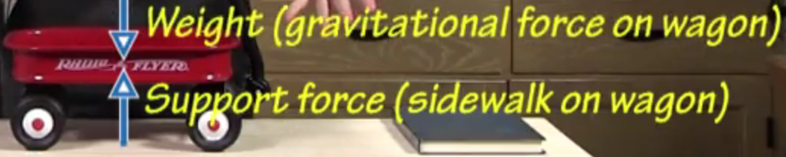
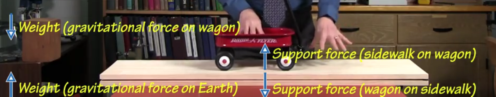
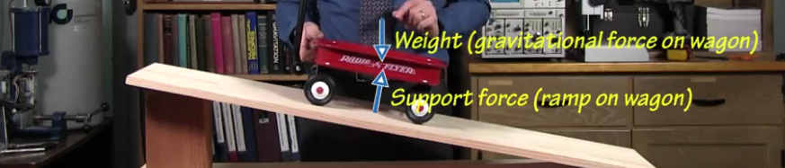
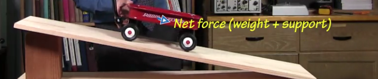
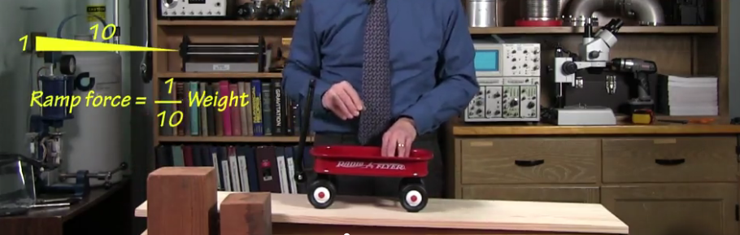
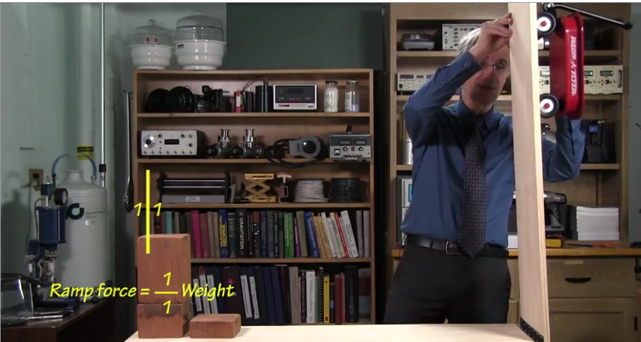

# Why doesn't a wagon fall through a sidewalk?

The sidewalk pushes up on the wagon to prevent the two objects from occupying the same space at the same time. The sidewalk exerts 
a support force on the wagon. A **Support Force** is a force acting to prevent two surfaces from occupying the same spadce at the 
same time and exerted pperpendicular to those surfaces.

In summary, the support force of the sidewalk acts upward to cancel out the downward weight of the wagon. Keep in mind that the direction 
of the support force is upward because it is **perpendicular** to the force causing that reaction. Support Forces bring up **Newton's 
Third Law of Motion** - For every force that one object exerts on a second object, there is an equal but oppositely directed force that 
the second object exerts on the first object

Because of Newton's third law, there must be an even number of forces.

# Why does the sidewalk perfectly support the wagon's weight?

The wagon and sidewalk "negociate" until the sidewalk perfectly supports the wagon's weight. By negociate, we mean to say that the object bouces (slightly or largely depending on the cusion of the object). If we were to drop a waterbottle on a scale, the scale would actually take a little time to register the amount of force (support force) that it has to exert to keep that object from falling through the scale. That support force may also be greater than the weight of the waterbottle if the waterbottle is dropped onto the scale from higher up. Although the support force of the scale and the weight of the waterbottle are equal and opposite forces, they act on a different object and don't cancel each other.
The slight bounce that occurs from the waterbottle is the resulting acceleration that is leftover after the supporting force is able to support the weight of the waterbottle.

It's an important concept that the forces never cancel because they are always acting on different objects. Take the below example of Lou accelerating the wagon.

# How does a wagon move as you let it roll freely on a ramp?

When the wagon is moving uphill, its acceleration vector is always in the downhill direction. The physical reason that the acceleration is always in the downhill direction because of the negociation between the wagon's weight and the support force exerted by the ramp in response to the weight. Recall that **support forces are always perpendicular to the surfaces that exert them**. This means that the support force is upward and to the right. 

So when you add the weight vector, which is pointing straight down, and the support force, which is pointing upward and to the right, you get that the net force is point the wagon to the right and slightly down. This special net force can be referred to as the **Ramp Force**. 

The ramp force that acts on the object can be definined as the object's weight multiplied by the height of the ramp divided by the length of the ramp. In the following image, the height of the ramp is 10cm and the length of the ramp is 1m:

This makes sense with evidence that we've seen because if we make the ramp completely vertical, the ramp's height is equal to its weight, canceling the fraction in the ramp force so we're left with a net force equal to the weight of the object.

If you were to hold the object with a force that's equal to the ramp force, the object becomes inertial and moves according to Newton's first law of motion.

# Why is it more exhausting to lift a wagon up than to lower it down?

You transfer energy to the wagon as you lift it and you receive energy from the wagon as you lower it. **Energy** is a conserved physical quantity, meaning you can't create it or destroy it, you can only transfer it from object to object. **Work** is the transfer of energy. We can think of energy as money in that money is only transfered among people and doing work can be thought of as spending money. The work that you exert on an object can be defined at the Force that you exert on the object multiplied by the distance the object travels as the result of that force, 

We are doing work on an object when a force that we exert causes the object to move in the direction of our force. When we lift an object up, we are doing work by transfering energy from us to the wagon. Keep in mind that when we lift the object, it is moving in the direction of our force so we are doing work directly on the object. However, when we hold the object motionless in midair, we are not doing any work on the object because the object is not moving in the direction of our force. We're still losing energy because our chemical energy, in the form of calories, is being transferred to thermal energy.

When you lower the object down, you do **negative work** on the object. You gain energy and the object loses energy; the exact opposite of what was happening when you were lifting the object. Putting these together, when you lift the object, you lose energy whil the object gains energy; when you lower the object, the object loses energy and you gain energy. This is an example of the **Conservation of Energy**, how the transaction of energy always balences. Energy types can also change in quantity but total energy must always be the same.

Energy comes in two priciple forms, kinetic and potential. **Kinetic Energy** is the energy associated with the motion of an object. **Potential Energy** is energy stored in forces. Objects at rest have a lot of potential energy associated with them still. If you lift an object above the Earth, you invest energy in the object in the form of **Gravitational Potential Energy** (Gravitational Potential Energy = weight of object multipled by altitude or ) (Since work is just weight multiplied by distance, gravitational potential energy uses the object's altitude). When you pack down a spring, you give the object **elastic potential energy**. If you pull magnetics apart, you transfer **magnetic potential energy** to the object and when the magnets stick together again, they leap at each other and release kinetic energy. 

Since work is weight multiplied by distance, the unit would `newton*meter` which can be called **joule**

# Why is it easier to pull a wagon uphill on a ramp than to lift it up a ladder?

The ramp allows you to lift the wagon with a smaller force exerted over a long distance while you do more work lifting the wagon up the ladder because you are transferring more gravitational potential energy.

When you're moving an object up a ramp, you only to exert enough force to cancel out the acceleration force

# When does an object on a ramp have the most energy?

Generally, when the object has the most gravitational potential energy, it has the most overall energy.

