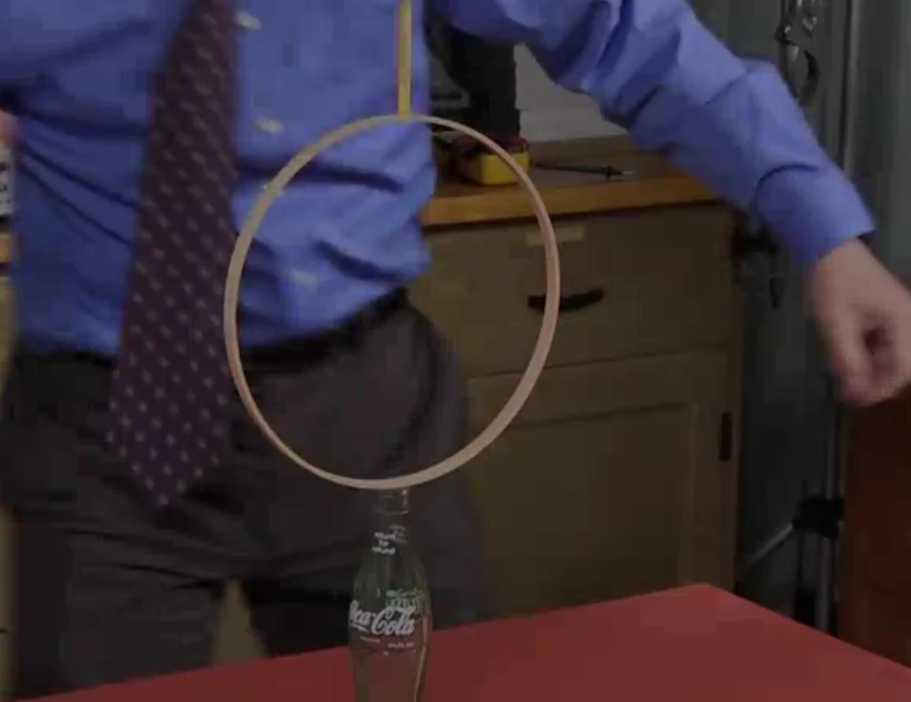
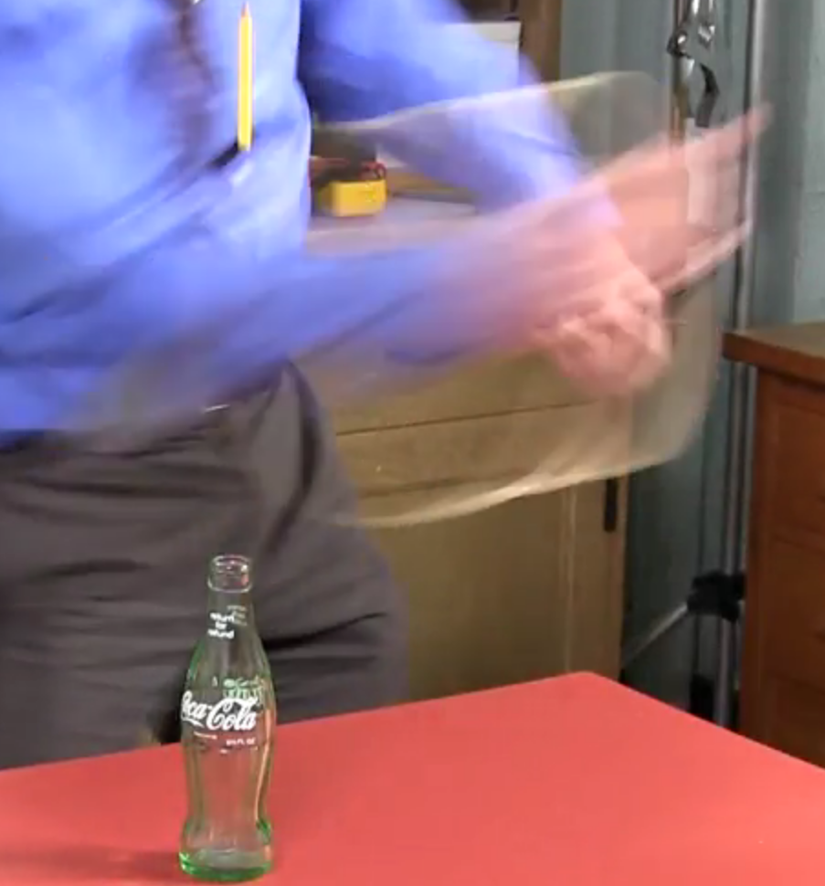
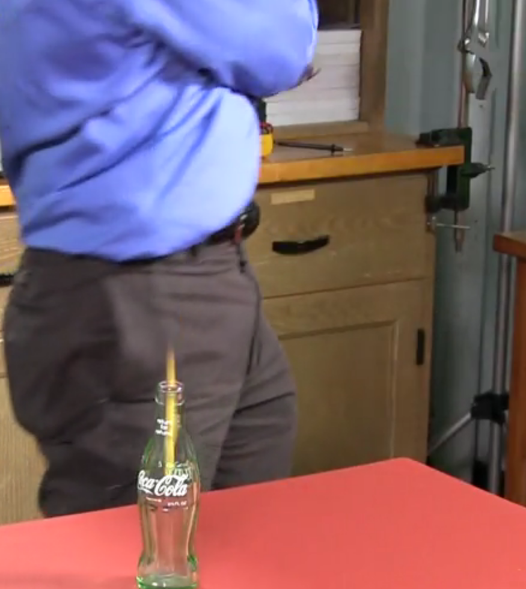

**Inertia** - An object at rest tends to stay at rest and an object in motion tends to stay in motion.

Until a force is exerted on an object's inertia, the object tends to stay the way it is.

In our example, the skater will continue to move in the same direction unless friction can slow them down. 
The skater can also remain stationary unless someone pushes them.

# Why does a stationary skater tend to remain stationary?

The short answer is that the skater has an inertia stating that an object at rest tends to stay at rest.

Another example of this is with the classic trick of pulling the table cloth from underneath dishes very quickly.
The idea behind this is that the objects are at rest and, if you pull the table cloth very quickly, minimal force will impact
the objects.

Yet another example is that an object being held in midair will remain in midair until gravity takes effect. In this case, gravity is only acting in the downward direction

*Notice how the force acting in the horizonal directions are so fast and minimal, the pencil falls straight into the empty bottle*

# Why does a moving skater tend to continue moving?

This answer is also inertia as an object in motion tends to stay in motion.

Skaters are mostly inertial, that is they moving in a straight line with zero force acting on them. They are said to be obeying **Newton's first law of motion**

# How can we describe the motion of a coasting skater?

A coasting skater moves at a constant **velocity** - a **vector** quantity consisting of a magnitude of speed and a direction. A **scalar** quantity is a quantity consisting of only a magnitude, like temperature. 

A **force** is a push or a pull and is another vector quantity. The SI unit for force is the newton (N). A more familiar unit for force in the US is the pound (lb).

We can now give a formal definition of **Newton's First Law of Motion** - An object that is free of external forces moves at a constant velocity. Returning to the example of the skater, a skater that is experience zero outside NET force moves at a constant velocity. This is never the case because of forces such as wind resistence and friction. We say net force because it is possible for forces in opposite directions to cancel one another. For example, if one person pushed a skater to the left and another person pushed that skater towards the right equally hard, the two forces would cancel, the skater would experience no net force. The skater would be inertial and move according to Newton's First Law of Motion.

# How does a skater start, stop, or turn?

A force acts on the akater and causes the skater to accelerate. **Acceleration** is the rate at which an object's velocity is changing with time. **Deceleration** is acceleration in the opposite direction and is what allows you to slow down and, eventually, stop. If you accelerate in another direction other than forward or opposite, you'll turn.

You only need 1 reference point to describe position, 2 reference points to describe velocity (position at time 0 and position at time 1), and 3 reference points to describe acceleration (position at time 0, position at time 1, and position at time 2). With three reference points for acceleration, you can see how the velocity vector changes between each reference point (velocity between 0 and 1 and velocity between 1 and 2).

When you push towards the left, you will accelerate towards the right 

**Mass** is the measure of an object's inertia. This means that what you weigh is your inertia but also anything that you're carrying at the time is part of your inertia. Mass is actually inversely proportional to acceleration meaning if you push equally hard on several objects, its acceleration will be 1/Mass. This leads us to a formal definition for **Newton's second law of motion** - 

# Why does a skater need ice or wheels in order to skate?
