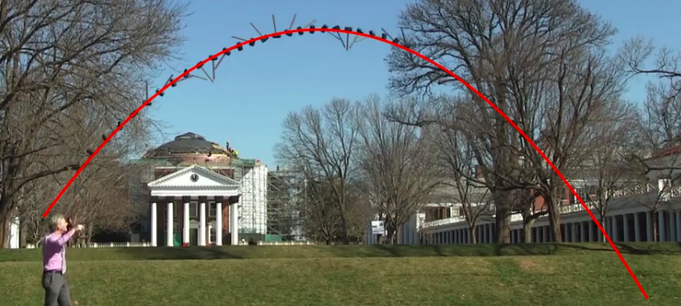
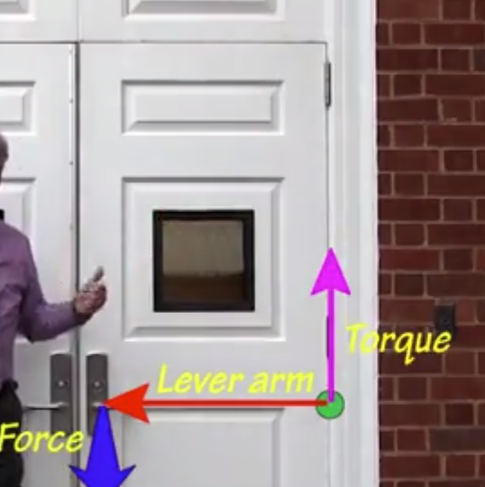
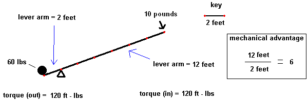
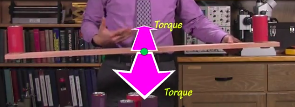
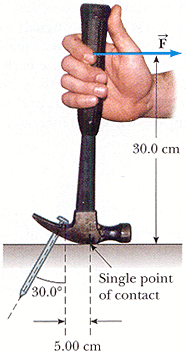

Seesaws are all about rotational motion.
 
 # How does a balanced seesaw move?
 
 A balanced seesaw rotates steadily about a fixed axis. a balanced seesaw exhibits **rotational inertia**, if a rotating object is kept rotating, it will 
 continue to rotate at that constant rate. This leads us to our first draft for **Newton's First Law of Rotational Motion** - A rigid object that is not 
 wobbling and that is free of external torques rotates at constant angular velocity.
 
 **Angular Position**- An object's orientation
 
 Physicists and Mathematicians use the **right hand rule** to decide which direction is up and down when rotating. You rotate with your hand 
 and whatever direction the thumb of your right hand is pointing when you finish the rotation is the direction of your rotation.
 
 **Angular Velocity**- The rate at which an object's angular position is changing with time.
 
 A **torque** is an upset to an object's rotational inertia. A twist is a torque
 
 The Earth is an example of an object that follows Newton's first law of rotational motion because it experiences practically no external torque.
 
 A balanced seesaw is not necessarily motionless as it experiences rotational inertia. 
 
 When a seesaw on a playground hits the ground, the ground acts as a torque and upsets the rotational inertia of the seesaw.
 
 # Why does a seesaw need a pivot?
 
 A pivot prevents the seesaw from undergoing translational motion while leaving it free to undergo rotational motion. An object with rotational motion will rotate about its **center of mass**, the object's natural pivot. For example, in the following image, the hammer rotates around the mallet while it is in free fall because the mallet is its center of mass.
 
 
 
 In the case of a falling ball, its center of mass is its geometric center so it appears to not rotate as it's falling. 
 
 **Center of Rotation** - the point about which all physical quantities of rotational motion are defined. The center of rotation and center of mass for a seesaw are its pivot.
 
 # Why does a lone seesaw rider plummet to the ground?
 
 The lone rider produces a torque on the seesaw that causes it to overcome rotational inertia and undergo rapid angular acceleration. The weight of the rider is a force that, acting in conjunction with the lever arm of the seesaw, produces a torque on the seesaw.
 
 What's interesting is you can increase the rotational inertia of an object by adding objects of the same size and thus a torque of the same mass wouldn't be able to overcome rotational inertia as quickly.
 
 
 
 **Moment of Inertia** - The measure of an object's rotational inertia - its resistence to undergoing angular acceleration.
 
 This definition allows us to define **Newton's Second Law of Rotational Motion** - angular acceleration is equal to the net torque acting on the object divided by the moment of inertia, 
 
 An object's rotational acceleration is proportal to the net torque acting on the object.
 
 In order to produce a torque on an object, you need to exert a force at a right angle to the lever arm of an object. The **Lever arm** is a vector that extends outward from a **center of rotation**, the point around which an object will rotate, towards the causation of the torque. Notice how the resulting torque is always upwardly perpendicular to the lever arm. The resulting torque is also governed by the right hand rule.
 
 
 
 The amount of force that we need to produce the torque is larger the shorter the lever arm. Therefore, if we're pushing or pulling on the door closer to the center of rotation, it will require more force. Therefore, the torque is equal to the lever arm multiplied by the force, 
 
 
 
 A common household example of this is using a wrench on a stuck bolt. The wrench increases the lever arm vector and therefore, your force can produce a larger torque.
 
 # Why do the riders' weights and positions affect the seesaw's motion?
 
 They affect the net torque on the seesaw and cause angular acceleration to occur. When the riders sit on opposite sides of the seesaw, they produce opposite torques that produce zero or near zero net torque and therefore zero or near zero angular acceleration. If one rider does produce a bigger torque than the other (they have more weight), they'll just move closer to the pivot.
 
 
 
 When zero net torque is produced on an object, we say that the object in **balanced**
 
 An object's **center of gravity** is the effective location of the object's weight. Near the Earth's surface, often an object's centers of gravity is the same location as the object's center of mass. Because center of gravity has to do with an object's weight, a force, and center of mass has to do with an object's mass, a constant quantity, these concepts are fundamentally different. In space, center of gravity has near no effect because there is near no gravity. The center of gravity on a balanced seesaw is located straight above the object's center of rotation so that it produces zero net torque and leaves the object rotationally inertial.
 
What makes a seesaw fun is that the riders can adjust the torque on the seesaw by pushing against the ground with their feet. They can also lean forwards or backwards to adjust the length of the lever arm and therefore the angular accelerations.
 
 # Why do the riders' distances from the pivot affect the seesaw's responsiveness?
 
 The farther the riders' masses are from the pivot, the greater the seesaw's moment of inertial (rotational mass) and the slower its angular acceleration. The moment of inertia is dependant on its distance from the pivot; that is, the farther away the mass is from an axis of rotation, the higher an object's moment of itertia (rotational mass) is. This is why a dancer will spin faster if the pull their arms inward; because by pulling your arms inward, your mass is now closer to the center and you have less moment of inertia and, therefore, you find it easier to move.
 
 ## Suppose you and a child half your height lean out over the edge of a swimming pool at the same angle. If you both let go at the same time, who will hit the water first?

Your center of mass is farther from the center of rotation (your feet in this case) and your mass is higher than the child, therefore your net torque is higher. In accordance with Newton's Second Law of Rotation, you angular acceleration is roughly half that of the child.

 # How do the seesaw's riders affect one another? 
 
 The riders exchange energy as the seesaw moves back and forth. As one rider descends on the seesaw, the are doing work on the seesaw and losing gravitational potential energy. In contrast the rider accending on the seesaw gains gravitational potential energy.
 
 **Newton's Third Law of Rotation** - For every torque that one object exerts on a second object, there is an equal but oppositely directed torque that the second object exerts on the first object.
 
 Using a claw hammer, you exert a smaller force with a bigger distance on the hammer (which acts as a lever), while the hammer produces a small distance with a larger force on the nail.
 
 
 
 # Quiz
 
 A toy top is a disk-shaped object with a sharp point and a thin stem projecting from its bottom and top, respectively. When you twist the stem hard, the top begins to spin rapidly. When you then set the top's point on the ground and let go of it, it continues to spin about a vertical axis for a very long time. What keeps the top spinning?

Correct 
Answer: The top has rotational inertia.

Explanation: The top continues to spin because it is approximately free of external torques and the net torque on it is essentially zero. It moves according to Newton's first law of rotational motion, turning at constant angular velocity.

2. Question 2
To start a motionless toy top spinning, you twist it. What determines the direction in which the top spins?

Correct 
Answer: The torque you exert on the toy top has a direction and the top undergoes angular acceleration in the direction of the torque you exert on it.

Explanation: The torque you exert on the top is what causes it to begin spinning. In accordance to Newton's second law of rotational motion, the top undergoes angular acceleration that is proportional to the torque you exert on it and in the same direction as that torque. Your choice of torques thus determines the direction in which the top spins.

3. Question 3
You are traveling through deep space in a large spaceship and everything in the ship is weightless. The ship is experiencing zero net force and it coasts forward. However, in preparation for docking at a space station, the ship is rotating slowly. You notice that one location in the coasting ship moves at constant velocity, even as the rest of the ship rotates about that location. What is this special location in the ship?

Correct 
Answer: The ship's center of mass.

Explanation: This question focuses on the ship's inertial behavior and therefore on its center of mass. The ship's center of mass is the effective location of the ship's total mass. The ship's motion can be separated into two parts: the translational motion of its center of mass and its rotation about its center of mass. Because the net force on the ship is zero, the ship's center of mass travels at constant velocity. At the same time, the ship can rotate about that center of mass. Actually, if the ship isn't wobbling, then it rotates about an axis that passes through the center of mass, but there are other locations along that rotation axis that also travel at constant velocity. However, if the ship's captain changes the ship's rotational axis (something that can be accomplished using rocket engines), the new rotational axis will still pass through the ship's center of mass. That behavior makes the center of mass unique—it's the only location in the ship that always travels at constant velocity when the net force on the ship is zero.

4. Question 4
A tall luxury hotel has a rotating restaurant at its top. The disk-shaped floor of the restaurant rotates slowly about the center of the restaurant and completes one full rotation every 30 minutes. When the restaurant opens each day, the manager turns on the motors that make the restaurant spin, but it takes several minutes for the restaurant to begin spinning at its full angular velocity. Why doesn't the restaurant reach full speed immediately?

Correct 
Answer: The restaurant's angular acceleration is proportional to the net torque exerted on it. The motors produce a net torque on the restaurant and it immediately undergoes angular acceleration. But it takes time for the angular-accelerating restaurant to reach its full angular velocity.

Explanation: A net torque causes angular acceleration, not angular velocity. In this case, the net torque on the restaurant causes the restaurant's angular acceleration. Opposing that angular acceleration is the restaurant's enormous rotational mass—the measure of its rotational inertia. Although the motors produce a large net torque on the restaurant, the restaurant's rotational mass is so huge that the restaurant's angular acceleration is still small. Since angular acceleration is the rate at which angular velocity is changing with time, the restaurant's angular velocity changes gradually with time. It takes a few minutes, but the restaurant's angular velocity eventually reaches its full operating value.

5. Question 5
A modern bicycle has two pedals mounted on a rotating device known as a crank. Pushing down on one pedal with your foot produces a torque on the crank, about its pivot, except in which situation(s)?

Correct 
Answer: When the pedal is vertically above or below the pivot, your force on the pedal is directed along the lever arm from the pivot to your force. A force that is parallel to the lever arm produces zero torque.

Explanation: If you are able to exert a force on the pedal and that force has a component perpendicular to the lever arm from the pivot to the pedal, you will produce a torque on the crank. There are two orientations of the crank in which those requirements are not met. When the pedal is vertically above or below the pivot, the lever arm from the pivot to the pedal is vertical and a force exerted vertically down on that pedal has zero component perpendicular to the vertical lever arm. This observation that you can't produce a torque on the crank when the pedals are aligned vertically explains why it's so difficult to start riding a bicycle when its pedals are arrange that way.

6. Question 6
Arm-wrestling is a simple game that two people can play. The players sit across from one another at a table, place their right elbows together on the tabletop and clasp their right hands together. When the competition starts, each person tries to twist the pair of arms counterclockwise from that person's perspective until those arms touch the table. It's a rotational problem, with the elbows acting as the pivot and the two players trying to rotate the pair of arms in opposite directions. Suppose you are arm-wrestling with a friend and you are winning. Compare the torque you are exerting on your friend to the torque that your friend is exerting on you.

Correct 
Answer: Those two torques are equal in amount but opposite in direction.

Explanation: The torques that you and your friend exert on one another form a Newton's third law pair. The torque you exert on your friend and the torque your friend exerts on you must be equal in amount but opposite in direction, no matter what is happening in the game. The fact that you are winning is irrelevant.

7. Question 7
You are arm-wrestling another friend and find that you are almost perfectly matched. Your pair of arms is vertical and motionless, even though you are both trying hard to win. To begin winning, you want that pair of arms to rotate counterclockwise from your perspective. What must you do to make that happen?

The counterclockwise torque you exert on the pair of arms must be greater in amount than the clockwise torque your friend is exerting on that pair.

8. Question 8
You are making pizza and are spinning a ball of pizza dough in midair to make a larger and larger disk. As the diameter of the disk increases, you find it more difficult to change the disk's angular velocity. Why?

Correct 
Answer: The disk's rotational mass increases with its diameter, although its mass remains unchanged.

Explanation: The dough's mass doesn't depend on its shape, but its rotational mass does. The larger the disk's diameter, the farther the dough's mass is from its center of rotation—which, for a disk in midair, is its center of mass. Moving the disk's mass outward from its center of rotational increases that disk's rotational mass and makes it less responsive to torques. As the disk's rotational mass increases, the disk undergoes a smaller angular acceleration in response to the same net torque.

9. Question 9
Your car has a flat tire and you are using an automobile jack to lift the corner of the car so that you can change the tire. The jack involves a lever and you lift the corner of the car upward by pushing the handle of the lever downward. You notice that as the handle moves downward 10 inches, the corner of the car moves upward only 0.5 inches. Assuming that the jack is not wasting any energy, compare the downward force you exert on the jack handle to the upward force that the jack exerts on the car.

The jack's upward force on the car is 20 times as large as your downward force on the jack handle.

Correct 
Answer: The jack's upward force on the car is 20 times as large as your downward force on the jack handle.

Explanation: The work you do on the jack's handle is the same as the work the jack does on the car. Since work is force times distance in the direction of that force, the product of your downward force on the jack's handle times the distance the jack's handle moves downward must be equal to the product of the jack's upward force on the car times the distance the car moves upward. Because the jack's handle moves 20 times as far as the car moves, the jack's upward force on the car must be 20 times as large as the force you exert on the jack's handle.

10. Question 10
Tower cranes are frequently seen in cities, where they are used to construct tall buildings. In a tower crane, a huge metal beam sits atop a vertical metal tower. The beam extends outward from the tower in two directions and it pivots about the top of the tower. A lifting cable hangs from one end of the beam and heavy weights hang from the other end of the beam. Since the lifting cable end of the beam is the only end that seems to do anything, what useful purpose does the weight-end of the beam serve?

Correct 
Answer: The weight-end of the beam ensures that the beam is approximately balanced about its pivot and experiences approximately zero torque due to gravity.

Explanation: To be safe and to avoid tipping in unwanted ways, the tower crane must balance its beam about the pivot at the top of its tower. If the beam is seriously unbalanced, meaning that it is experiencing a large gravitational torque about that pivot, it may undergo angular acceleration and thereby start to tip over. The tower itself can exert torques on the beam and compensate for a modest imbalance in the beam. But having the beam extend only in one direction from the pivot and lifting heavy objects from the end of that beam would result in large gravitational torques on the beam about its pivot. To balance the beam and avoid those large gravitational torques, the tower crane extends the beam in both directions and places enough weight near the second end to compensate for weight lifted by the cable near the first end. Gravitational forces acting at the two ends of the beam produce opposing torques that sum to approximately zero and leave the beam nearly free of gravitational torque about the pivot.
