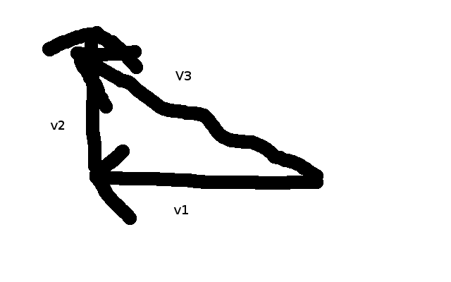

Consider an object moving north on a wooden plank moving west. The object is moving north WRT the plank, the plank is moving west WRT the ground beneath it therefore the object is moving northwest WRT the floor, we can deduce this my drawing a diagram.

