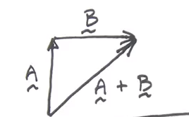
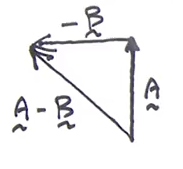
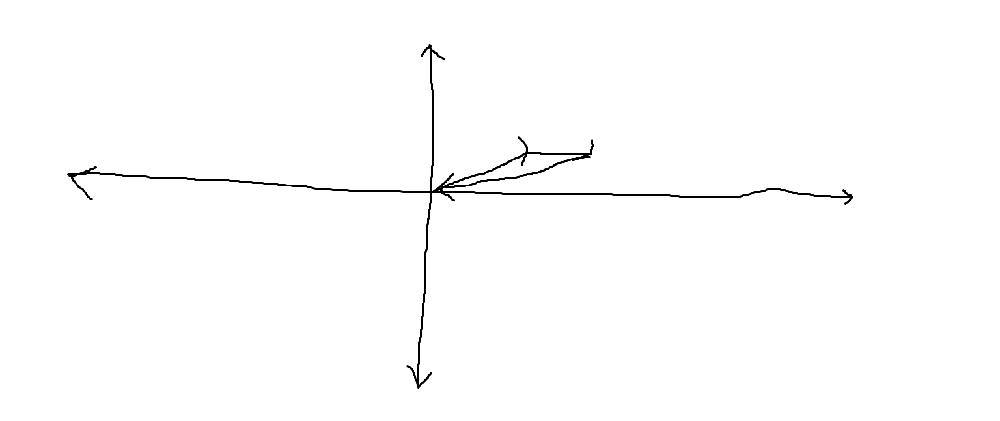
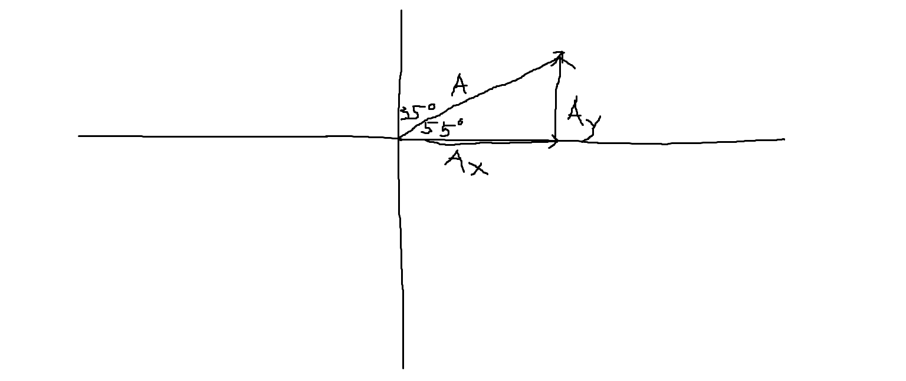

Vectors must have both a magnitude and direction whereas a scalar has only a magnitude. Velocity is a vector quantity because it has both a magnitude and direction. Speed is a scalar because it has only a magnitude. An object's Velocity could be 5km or -5km depending on the direction that it's traveling whereas that object's speed is 5km in either direction.

* Displacement is a vector because we must talk about displacing an object in a certain direction. For example, 30cm east or 30cm south.
* Unit vectors have a magnitude of 1
* Adding scalars is just like adding of two numbers that we're familiar with because we only have magnitudes to deal with. For example, 3+4=7
## Vector Arithmetic

Adding vectors involves using geometry

In the image above, we see that we can use the pythagorean theorum to find

Along this idea, to subtract vectors, we can instead say that we are adding the negative of one of the vectors

## Practice Questions

If vector A is 2km west and vector B is 1 km south, what is A - B?

To find the angle, we must draw the vectors

In order to find the angle, we will use tangent function

In order to find the magnitude

So A - B is 2.2km at 27 degrees

**Draw vector A as the sum of two vectors**

As you can see, 

**A vector, A, has magnitude 2.2 and it's direction is 35 degrees. Calculate the Components in each direction.**

We can check ourselves because

