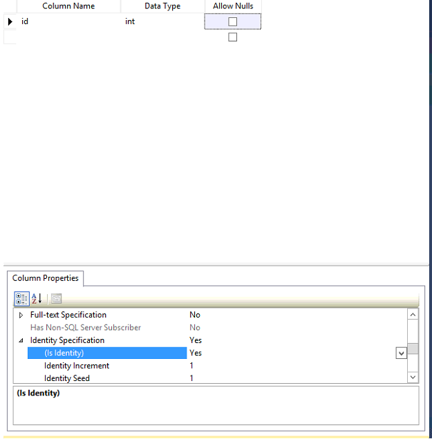
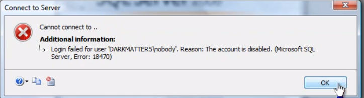

* SQL server uses a dialect of SQL called TSQL
* SQL server 2012 is out of mainstream support already which is why the documentation isn’t available online
* SQL server provides a powershell extension when it’s installed
 * sqlps
 * Here you can see that everything has a directory like structure
 * This gives you the capability for a lot more scripting
* SSMS
 * In order for a column to be autoincrementing, you must make it an identity column


 * Convention dictates that tables should be first letter capital plurals
 * Valid TSQL should have a semicolon at the end of a statement
   * This isn't required
 * You can parse statements so that you don’t actually execute it, that way you know if its syntax is correct


* TSQL
 * Create a sample table like so:
```sql
 create table stuff
   (
     id int identity,
     name varchar(50)
   );
```
*Remember that identity is the keyword used by TSQL for autoincrementing*

 * TODO: Look more into CTEs (Common Table Expressions)
   * They seem to be similar to subqueries
 * Aggregate Functions
   * Group By can be used in conjunction with count to give you the number of columns that have the same value like the following example:
```sql
 Select zipcode, COUNT(*) as Count from Stores
 GROUP BY zipcode
```
     * You will use the keyword `Having` as a where statement to filter results when using `GROUP BY`
```sql
Select zipcode, COUNT(*) as Count from Stores
GROUP BY zipcode
HAVING Count > 5
```
 * Ranking Functions
  * `TOP` is an example of this and can be much faster than retreiving every single row
   * It may be useful to use this with conditional logic in order to delete a table in chunks so as to minimize table locks
   ```sql
   deleteMore:
   delete TOP(100000) from [big table]
     if @@rowcount != 0
     goto deleteMore;
   ```
  * Partitioning functions are a way to group items by a part of their name

For example, if we have the following table:

| First Header  | Weight |
| ------------- | ------------- |
| X4-gear  | Content Cell  |
| X9-gear  | Content Cell  |
| AY3-arbor  | Content Cell  |
| X6-gear  | Content Cell  |

We can use the following query:

```sql
select name,
rank() over (partition by right(name, len(name) - charindex('-', name)) order by weight)
from [mechanical parts]
```

*NOTE: Weight is really irrelevant*

To get the following result set:

| First Header  | Weight |
| ------------- | ------------- |
| X4-gear  | Content Cell  |
| X6-gear  | Content Cell  |
| X6-gear  | Content Cell  |
| AY3-arbor  | Content Cell  |


* SSAS (SQL Server Analysis Service)
 * Framework for allowing us to create reports
 * Uses a special language called MDX
* SSIS (SQL Server Integration Services)
 * Package for designing how we want to move data from databases
* SSRS (SQL Server Reporting Services)
 * can output to a variety of sources like excel or html
* SQL Profiler
 * allows you to trace SQL Statements
* Tuning Advisor
 * Allows you to tune your database for better performance
* Hierarchy IDs are a way in TSQL to give nodes in a table a Hierarchy
 * For example, in an employees table, you could have a big boss, managers, supervisors, and workers
 * By giving a Hierarchy ID to records in a table, you are able to introduce functions that tell you who is a decendant and who is the direct report
* Query Plans
 * SQL Server optimizes queries by using query plans
 * Plan cache is transient so it is clear every time sql is restarted
* Recursive queries will call from their own queries
* Create a sql login

```sql
create login jim with password = 'password';
```

* create windows auth user (you don't need to know their password because windows does)

```sql
create login domain/jim from windows;
```

* find all users associated with server

```sql
select * from sys.server_principals
```

* You can disable a login so that a user cannot login to the server

```sql
alter login [domain/jim] disable
```



* See all of the effective permissions of a user

```sql
select * from sys.fn_my_permissions(null, 'server')
```

* see the permissions that a user has on a certain database

```sql
select * from sys.fn_my_permissions('database_name', 'database')
```

**null parameter says that we want to view all permissions
'server' parameter says that we want the permissions of the server**

* grant user permission

```sql
/* control server is a permission that is almost all permissions */
grant control server to [domain\jim]
```

```sql
/* grant the select permission on the numbers table */
grant select on object::numbers to [domain\jim]
```
```sql
create role pilots
```

```sql
sp_addrolemember 'pilots' [domain\jim]
```

* grant users a permission on a certain schema

```sql
grant select on schema.db to [domain\jim]
```

```sql
/*this grant will grant to a rold */
grant select on object::numbers to pilots
```

* schemas are another way to provide security in a database
  * dbo is the default schema
  * each schema can have their own owner

```sql
select * from sys.schemas
```

* stored procedure to tell all of the default server roles

```sql
sp_helpsrvrole
```

* view the permissions

```sql
sp_srvrolepermission 'sysadmin'
sp_srvrolepermission 'dbcreator'
```

* To see your own permissions, login as the user that you want to view permissions on and use the following query

```sql
select * from sys.fn_my_permissions(null, 'server')
```
