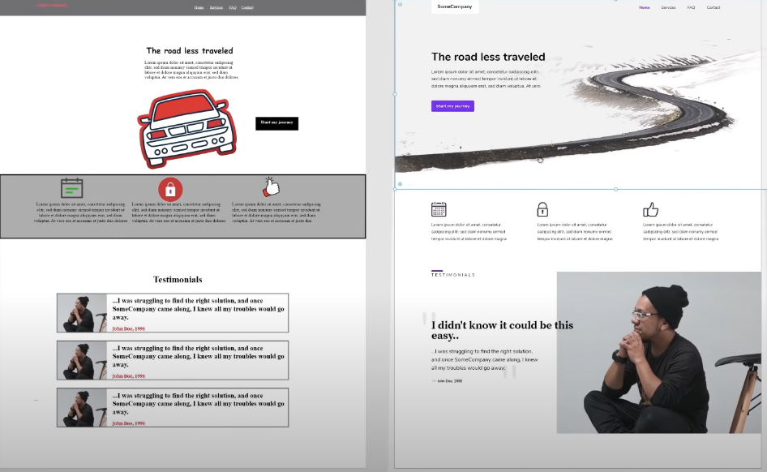

When going through a design, there are 5 fundamentals that you must think about with every section. Design tends to have fundamental rules but it has a lot of room for subjectivity as well

* color contrast
    * Chrome dev tools has a built in tool that you can use to find the color contrast scores of your web page. [https://webdesign.tutsplus.com/articles/how-to-use-the-contrast-checker-in-chrome-devtools--cms-31504](https://webdesign.tutsplus.com/articles/how-to-use-the-contrast-checker-in-chrome-devtools--cms-31504). These scores come from research into accessibility and can help you to find a good color.
* white space
    * Make sure to align elements in line with their other elements of the page
    * Make sure to also align elements on the same column with each other
* scale
    * don't make the logo so big that the user's eye is drawn to that rather than the content
* visual hierarchy
    * headlines that you want the user to read and pay attention to should be bigger than their content. The reader's eye is naturally drawn towards the larger elements on the page which is why we don't want the logo to be so big that it distracts the user
* typography
    * don't mix type faces too much
    * stay away from comic sans
* Consistency
    * When using icons, make them come from the same icon set so that they have similar borders, similar sizes, etc.
    * Make sure that there is a consistent amount of whitespace between elements, as well as on the margins.
    * Consistency gives a very clean and professional look

Header

* The logo should not be bigger than the content that you want the user to pay attention to
* Navigation
    * using underlines for links is kindof outdates and not really needed
    * You should always denote to the user what page that they're currently on

Hero Section (Main Content)

* Generally the main content is called the hero section
* A standard convention is that the ad copy or call to action should be aligned on the left column with an illustration taking up the remainder of the space
* illustrations
    * An excellent resource for find freely available professional photographs is [https://unsplash.com/](https://unsplash.com/)